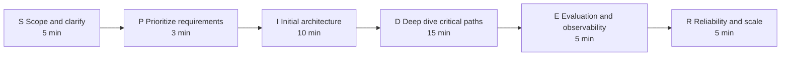
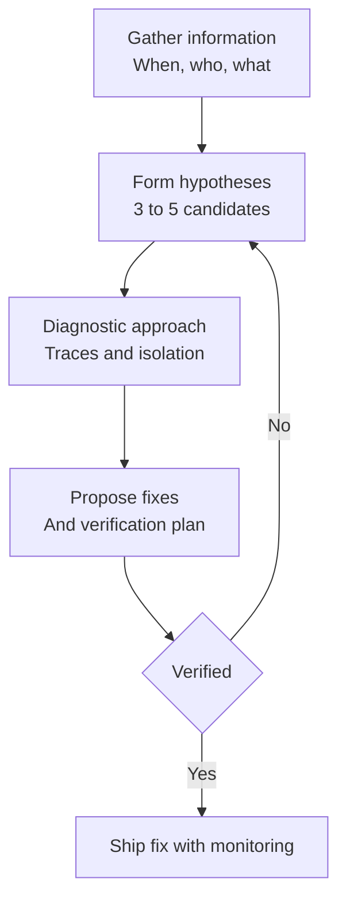

# AI 系統設計面試的回答框架

五個用於 AI 系統設計面試的結構化框架：設計題用 SPIDER、概念題用 ETA、權衡分析、除錯，以及行為題用 STAR-L。

出色的面試回答都遵循一致的結構。本章針對不同題型提供框架，並附上範例與反面案例。請將這些框架與[題庫](01-question-bank.md)中的實作範例搭配使用，並透過[白板練習](04-whiteboard-exercises.md)反覆演練。

## 目錄

- [系統設計框架（SPIDER）](#system-design-framework-spider)
- [概念解釋框架（ETA）](#concept-explanation-framework-eta)
- [權衡分析框架](#tradeoff-analysis-framework)
- [除錯與排障框架](#debugging-and-troubleshooting-framework)
- [行為題框架（STAR-L）](#behavioral-questions-framework-star-l)
- [處理不熟悉的主題](#handling-unknown-topics)
- [常見錯誤與避免方法](#common-mistakes-and-how-to-avoid-them)

---

## 系統設計框架（SPIDER）

任何牽涉到 AI 元件的系統設計題都可使用此框架。以下是完整流程，並附上每個階段的大致時間預算：



### S - 界定範圍並釐清需求（Scope and Clarify）

**目的：** 縮小問題空間，並展現你在動手前會先思考。

**要問的問題：**
- 規模有多大？（使用者、請求數、資料量）
- 延遲要求是什麼？
- 必須達到什麼樣的準確度或品質門檻？
- 是否有合規或安全方面的要求？
- 現有的基礎設施是什麼？
- 預算限制是什麼？

**範例：**
```
Interviewer: Design a customer support chatbot.

You: Before I dive in, I want to clarify a few things:
- What volume are we expecting? Thousands or millions of conversations per day?
- Is this customer-facing or internal support?
- What languages need to be supported?
- Do we need to integrate with existing ticketing systems?
- What is our accuracy target for resolved vs escalated?
```

**反面模式：** 在尚未理解需求的情況下，直接跳進架構設計。

---

### P - 排定需求優先順序（Prioritize Requirements）

**目的：** 找出最重要的事項，並朝著它來設計。

**建立優先順序矩陣：**

| 需求 | 優先順序 | 影響 |
|-------------|----------|-------------|
| 低延遲 | 高 | 可能限制模型大小 |
| 高準確度 | 高 | 需要良好的 retrieval 與 eval |
| 成本效益 | 中 | 透過 caching 最佳化 |
| 多語言 | 中 | 影響 embedding 的選擇 |

**明確說出你的優先順序：**
```
"Given these requirements, I will prioritize latency and accuracy. 
Cost optimization will be a second-order concern once we have the basic system working."
```

---

### I - 初始架構（Initial Architecture）

**目的：** 在深入細節之前，先畫出高階系統。

**AI 系統的標準元件：**
```
┌──────────┐     ┌──────────┐     ┌──────────┐     ┌──────────┐
│  Client  │────▶│  API GW  │────▶│ AI Layer │────▶│  LLM(s)  │
└──────────┘     └──────────┘     └──────────┘     └──────────┘
                                        │
                                        ▼
                                  ┌──────────┐
                                  │ Data/RAG │
                                  └──────────┘
```

**簡要說明每個元件：**
- 它做什麼
- 為什麼需要它
- 有哪些替代方案

---

### D - 深入剖析關鍵路徑（Deep Dive into Critical Paths）

**目的：** 在最重要的部分展現深度。

**根據以下幾點選擇 2-3 個領域深入剖析：**
- 面試官似乎最感興趣的部分
- 這個系統中新穎或複雜之處
- 最大風險所在之處

**深入剖析範例：**
- RAG pipeline：chunking、embedding、retrieval、reranking
- Agent loop：工具選擇、錯誤處理、終止條件
- 資料 pipeline：ingestion、處理、建立索引
- 安全性：隔離、權限、稽核

**表明你的意圖：**
```
"I will now go deeper on the RAG pipeline since retrieval quality is critical to this system."
```

---

### E - 評估與可觀測性（Evaluation and Observability）

**目的：** 展現你會思考正式環境的維運。

**涵蓋內容：**
1. **指標（Metrics）：** 你要衡量什麼？
2. **評估（Evaluation）：** 你怎麼知道它能運作？
3. **監控（Monitoring）：** 你如何偵測問題？
4. **告警（Alerting）：** 什麼時候要呼叫人員介入？

**AI 系統的標準指標：**
- 延遲（p50、p95、p99）
- Token 用量／成本
- 品質分數（離線，以及線上抽樣）
- 依類型區分的錯誤率
- Cache 命中率

---

### R - 可靠性與規模（Reliability and Scale）

**目的：** 處理失效模式與成長。

**要討論的失效模式：**
- LLM 供應商中斷
- 流量限制（rate limiting）
- 不良的模型輸出
- 資料 pipeline 失敗
- Cache 失效

**擴展性考量：**
- 瓶頸在哪裡？
- 哪些是水平擴展，哪些是垂直擴展？
- 哪些成本會隨用量而增加？

---

## 概念解釋框架（ETA）

用於像是「解釋 RAG」或「什麼是 speculative decoding？」這類概念性問題。

### E - 簡單解釋（Explain Simply）

從一句任何人都能理解的定義開始。

**KV Cache 的範例：**
```
"KV cache stores intermediate computations during LLM generation so we 
do not have to redo work for previous tokens when generating each new token."
```

---

### T - 技術細節（Technical Details）

依面試官的程度，補上適當的技術深度。

**KV Cache 的範例：**
```
"Specifically, for each layer in the transformer, we cache the Key and 
Value tensors for all positions. On each new token, we only compute K 
and V for the new position and concatenate with the cache. 

The memory scales as: 2 × layers × heads × head_dim × sequence_length × batch_size

For a 70B model with 8K context, that is roughly 10GB per request."
```

---

### A - 應用與權衡（Applications and Tradeoffs）

連結到實務用途，並討論其中的權衡。

**KV Cache 的範例：**
```
"This is critical for production serving. Without it, generation would be 
quadratic in sequence length.

The tradeoff is memory usage. This is why techniques like PagedAttention 
and Grouped Query Attention exist: to reduce KV cache memory while 
preserving the benefits.

Context caching features from OpenAI and Anthropic are essentially 
server-side KV cache persistence for shared prefixes."
```

---

## 權衡分析框架

當被要求比較選項或為某個決策辯護時，使用此結構。

### 步驟 1：清楚陳述各個選項

```
"For embedding models, we have three main options:
1. OpenAI text-embedding-3-large: Highest quality, API cost
2. Cohere embed-v3: Good quality, better pricing
3. Self-hosted BGE: Full control, operational overhead"
```

### 步驟 2：定義評估標準

挑選對這個特定決策而言重要的標準：

| 標準 | 權重 | 理由 |
|----------|--------|-----------|
| 品質 | 高 | 搜尋準確度是關鍵功能 |
| 規模化下的成本 | 高 | 每月 100M 個 embeddings |
| 延遲 | 中 | 批次建立索引，非即時 |
| 維運負擔 | 中 | 小型團隊 |

### 步驟 3：分析每個選項

建立比較矩陣：

| 選項 | 品質 | 成本 | 延遲 | 維運 | 分數 |
|--------|---------|------|---------|-----|-------|
| OpenAI | ★★★★★ | ★★ | ★★★★ | ★★★★★ | 4.2 |
| Cohere | ★★★★ | ★★★★ | ★★★★ | ★★★★★ | 4.2 |
| BGE | ★★★★ | ★★★★★ | ★★★ | ★★ | 3.6 |

### 步驟 4：提出建議並說明理由

```
"I would recommend Cohere for this use case because:
1. Quality is close to OpenAI based on MTEB scores
2. Better pricing at our volume (100M embeddings/month)
3. No operational overhead vs self-hosting
4. We can switch to self-hosted later if costs become prohibitive

The risk is vendor dependency, which we mitigate by 
abstracting the embedding interface."
```

---

## 除錯與排障框架

當被問到「你會如何除錯 X？」或「系統正在做 Y，你要怎麼修？」時。以下是 4 步驟的診斷流程：



### 步驟 1：蒐集資訊

```
"First, I would ask:
- When did this start? What changed?
- Is it all requests or a subset?
- What does the error look like exactly?
- Are there patterns (time of day, user segment, query type)?"
```

### 步驟 2：形成假設

```
"Based on the symptoms, my top hypotheses are:
1. Retrieval quality degraded (recent data changes?)
2. Model output quality dropped (prompt changed? different model?)
3. Context length exceeded (longer documents?)
4. Rate limiting causing timeouts"
```

### 步驟 3：描述診斷方法

```
"To isolate the cause:
1. Check traces for failing requests to see where they diverge
2. Compare retrieval results to a known-good baseline
3. Check model version and prompt version in deployment
4. Review metrics for any correlated changes"
```

### 步驟 4：提出修正方案與驗證

```
"If it is retrieval quality, I would:
1. Re-index with verified chunking
2. Validate on test set before deploying
3. Roll out gradually with A/B comparison
4. Set up alerts on retrieval quality metrics to catch future issues"
```

---

## 行為題框架（STAR-L）

針對 AI 職位的行為題，使用 STAR-L（STAR + Learnings）。

### S - 情境（Situation）

簡要交代背景。

```
"We had just launched our RAG-powered search feature and were getting 
complaints about incorrect answers for technical queries."
```

### T - 任務（Task）

你的具體職責是什麼？

```
"As the tech lead, I needed to diagnose the issue and ship a fix quickly 
while maintaining user trust."
```

### A - 行動（Action）

「你」做了什麼？用「我」而不是「我們」。

```
"I first instrumented detailed tracing to understand where failures occurred.
I found that our chunking strategy was splitting code blocks mid-function.
I designed a code-aware chunking approach that preserved semantic units.
I also added a confidence score display so users could calibrate trust."
```

### R - 結果（Result）

盡可能量化。

```
"Answer quality on technical queries improved from 65% to 89% in our 
evaluation suite. User complaints dropped 70% within two weeks."
```

### L - 學到的經驗（Learnings）

你會有什麼不同的做法？

```
"I learned that chunking strategies need to be content-aware from the start.
Now I always test chunking with the actual document distribution before 
launching. I also build evaluation suites earlier in the process."
```

---

## 處理不熟悉的主題

不知道每件事是可以接受的。請以專業的方式處理不熟悉的部分。

### 如果你完全不知道

```
"I am not familiar with [X]. Based on the name, I would guess it is related 
to [Y]. Can you tell me more about what it does, and I can discuss how 
I would approach the problem it solves?"
```

### 如果你只懂一部分

```
"I have read about [X] but have not used it in production. My understanding 
is that it [description]. In practice, I would need to read the documentation 
and likely prototype before making architectural decisions."
```

### 如果你懂概念但不懂細節

```
"I understand the general approach of [X] - [brief explanation]. I do not 
have the specific parameters or benchmarks memorized, but I know where to 
find them and what questions to ask when evaluating it."
```

---

## 常見錯誤與避免方法

### 錯誤 1：直接跳到解決方案

**錯誤：**
```
Interviewer: "How would you design a document Q&A system?"
You: "I would use LangChain with Pinecone and GPT-4."
```

**正確：**
```
"Before defining the solution, I want to understand the requirements.
What types of documents? What volume? What accuracy is needed?"
```

---

### 錯誤 2：忽略成本

**錯誤：**
```
"I would always use GPT-4 for the best quality."
```

**正確：**
```
"Model selection depends on the quality bar and volume. For high-volume, 
lower-stakes queries, I might use GPT-4o-mini or Claude Haiku and reserve 
GPT-4 or Claude Sonnet for complex cases. At 1M queries/day, this could 
save $50K/month without meaningful quality loss."
```

---

### 錯誤 3：不討論失效模式

**錯誤：**
```
"The system retrieves documents, sends them to the LLM, and returns the answer."
```

**正確：**
```
"The happy path is straightforward. But let me discuss failure modes:
- What if retrieval returns no relevant documents?
- What if the LLM hallucinates despite good context?  
- What if the provider is rate-limited or down?

For each, we need detection and fallback strategies."
```

---

### 錯誤 4：過度複雜化

**錯誤：**
```
"We need a separate service for chunking, another for embedding, 
a message queue between them, a stream processor for real-time, 
three different vector databases for redundancy..."
```

**正確：**
```
"Let me start with the simplest architecture that could work, 
then add complexity only where justified by requirements.

For this scale, a single service with async processing might be sufficient.
If we need higher throughput, we can add message queues at that point."
```

---

### 錯誤 5：不主動徵求回饋

**錯誤：**
```
*Talks for 10 minutes without checking in*
```

**正確：**
```
"I have covered the high-level architecture. Would you like me to dive 
deeper into any specific component, or should I move on to evaluation?"
```

---

## 快速參考：強答案的信號

| 信號 | 範例 |
|--------|---------|
| 提出釐清性問題 | "What is the latency requirement?" |
| 使用具體數字 | "This adds ~50ms latency" |
| 討論權衡 | "We gain X but lose Y" |
| 提到失效模式 | "If this fails, we need to..." |
| 引用實際系統 | "Similar to how Notion does..." |
| 承認不確定性 | "I would need to benchmark this" |
| 主動與面試官確認 | "Should I go deeper here?" |
| 連結到自身經驗 | "In my experience with X..." |

---

## 應避免的反面模式

| 反面模式 | 較佳做法 |
|--------------|-----------------|
| 堆砌流行術語 | 解釋你的意思 |
| 提及名詞卻沒有深度 | 只提你能夠討論的東西 |
| 只說「看情況」卻不闡述 | 解釋它取決於什麼 |
| 絕對化的陳述 | 在適當時使用保留性的措辭 |
| 否定有效的選項 | 承認其中的權衡 |
| 不知道何時該收尾 | 觀察面試官的提示 |

---

## 重點整理

- 框架是鷹架，不是腳本；面試官能分辨候選人是在背誦還是在思考，因此要把結構內化，然後讓它變得自然口語。
- SPIDER 適用於任何 45 分鐘的系統設計關卡；即使面試官打斷你，你也已經涵蓋了訊號最強的幾個階段。
- 「看情況」唯有在後面接著「它取決於 X、Y、Z，以及每一項各會如何改變答案」時才行得通；否則聽起來就只是在打太極。
- 深入剖析時務必以一句關於可觀測性、一句關於失效模式的話作結；這是 senior 與 staff 等級答案之間最大的差距。
- 沒有量化結果（STAR-L 中的 R）的行為題答案會被評為流於軼事；即使是近似值，也要帶上數字。

---

*另請參閱：[題庫](01-question-bank.md) | [常見陷阱](03-common-pitfalls.md) | [白板練習](04-whiteboard-exercises.md)*
