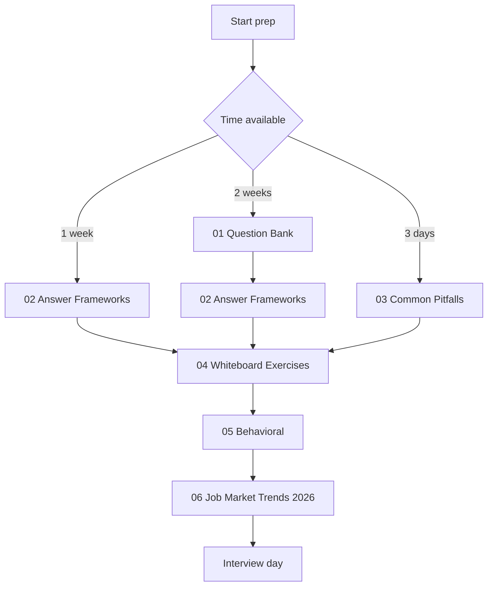
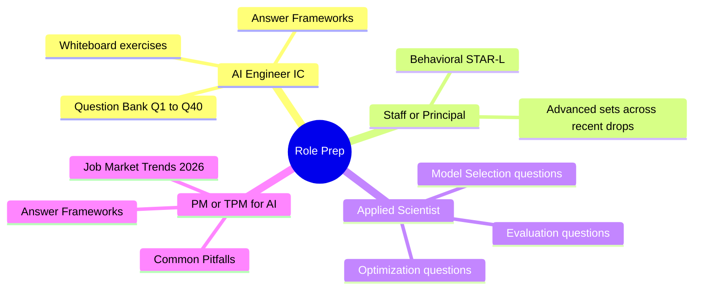

# AI 系統設計面試準備

針對資深與 staff 等級 AI 工程師職位的面試準備：110+ 道系統設計題目、答題框架、常見陷阱、白板演練，以及 2026 年招募趨勢。

本資料夾中的六個檔案設計上應依序閱讀。每一個都建立在前一個之上：題目教你掌握知識面、框架教你如何組織答案、陷阱教你什麼會搞砸 offer、演練讓你反覆練習實際流程、行為面試涵蓋 staff 等級的訊號，而就業市場趨勢則涵蓋當前的招募樣貌。

## 依序閱讀

## 依職位量身打造的準備路徑

## 本資料夾中的檔案

| 檔案 | 用途 |
|------|---------|
| [01-question-bank.md](01-question-bank.md) | 110+ 道依主題分組的真實面試題目，附有範例答案與追問（涵蓋至 2026 年 5 月）。 |
| [02-answer-frameworks.md](02-answer-frameworks.md) | 五種結構化答題框架：用於設計題的 SPIDER、用於概念題的 ETA、權衡分析、除錯，以及用於行為面試的 STAR-L。 |
| [03-common-pitfalls.md](03-common-pitfalls.md) | 會搞砸 staff 等級 offer 的模式：在權衡上含糊其辭、缺乏 observability、忽略 failure mode。 |
| [04-whiteboard-exercises.md](04-whiteboard-exercises.md) | 附有完整解題過程的系統設計演練。最貼近真實面試流程的模擬。 |
| [05-behavioral-for-ai-roles.md](05-behavioral-for-ai-roles.md) | 針對 AI 特定情境的行為面試準備：model deprecation、production hallucination、eval 文化。 |
| [06-job-market-trends-2026.md](06-job-market-trends-2026.md) | 職位分類、薪酬區間、面試流程模式，以及新興職稱（FDE、AI Eval Engineer、AI Reliability Engineer、MCP Engineer）。 |
| [07-faq.md](07-faq.md) | 針對關於 AI engineering、RAG、agent、模型、eval、inference、記憶體與安全性最常被問到的問題，提供簡短直接的答案。適合快速查閱，也適合該領域的新手。 |

## 配套資源

- [Role Transition Guide](../TRANSITION_GUIDE.md)，適合從後端、前端、QA、PM 或 EM 轉入 AI 領域的人準備。
- [Recommended Courses](../COURSES.md)，適合在面試準備之前打好基礎學習。
- [Glossary](../GLOSSARY.md)，適合在準備過程中快速查閱術語定義。
- [Case Studies](../16-case-studies/)，提供可直接對應到白板題目的 production 架構。

## 重點整理

- 這六個檔案設計上應依序閱讀；若直接跳到題目而沒有吸收答題框架，答案會缺乏結構。
- 白板演練（檔案 04）是最貼近真實面試的模擬；在任何面試流程之前至少做三題。
- 行為面試準備（檔案 05）是 staff 候選人與資深候選人之間的分水嶺；千萬別跳過。
- 2026 年 5 月的就業市場章節（檔案 06）是一道護城河：了解招募樣貌的候選人能問出更好的問題，並量身打造自己的故事。
- 每月重新檢視本資料夾；隨著招募趨勢變化，會持續新增題目批次。
