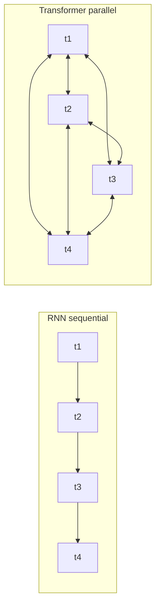
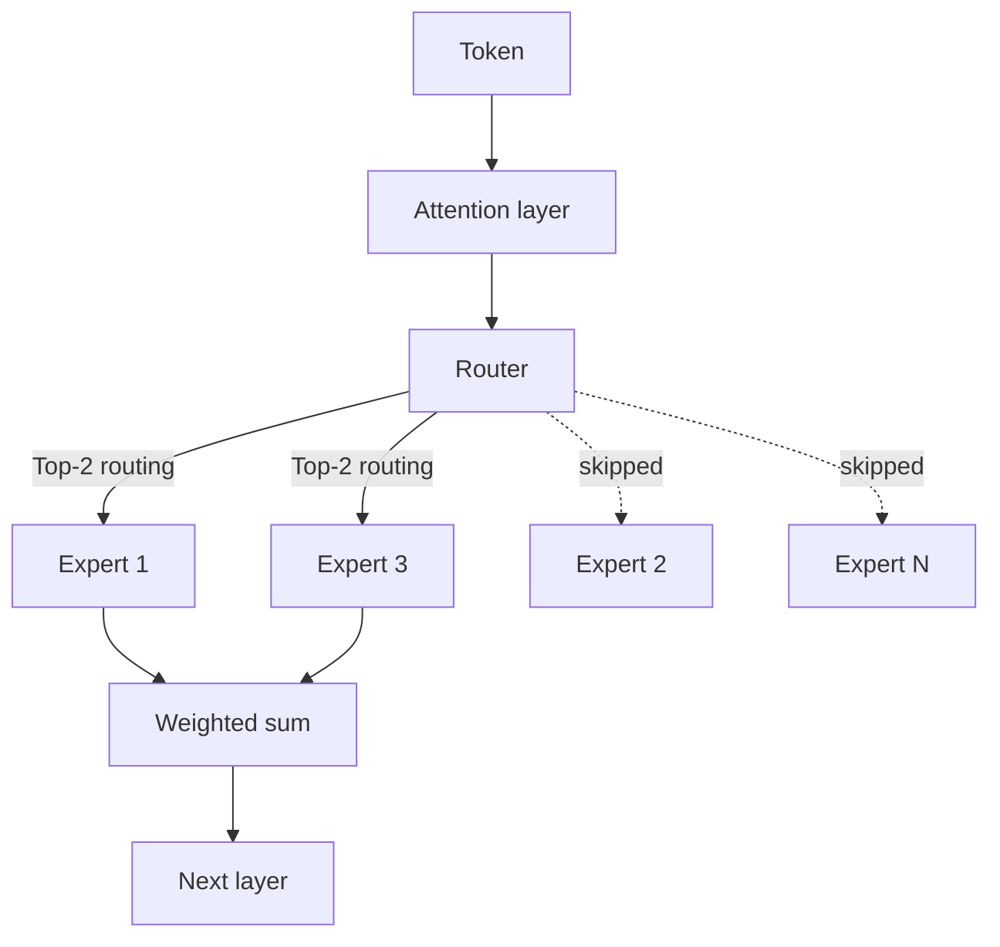

# LLM 內部原理

現代 LLM 的架構核心：transformer、MoE、attention 數學、RoPE、GQA、KV cache，以及驅動 2026 年模型設計的 inference-optimal 擴展轉向。

本章涵蓋大型語言模型背後的核心概念。理解這些內部原理，對於針對 AI 系統做出有依據的架構決策至關重要。關於這些架構選擇的實務影響，請參閱 [Inference Optimization](../04-inference-optimization/)（KV cache、PagedAttention）、[Model Taxonomy](../02-model-landscape/01-model-taxonomy.md)（生產環境中的 MoE 模型），以及 [Glossary](../GLOSSARY.md) 中對 MoE、RoPE、ALiBi、GQA、MLA 的定義。

## 目錄

- [Transformer 革命](#the-transformer-revolution)
- [架構變體](#architecture-variants)
- [Mixture of Experts (MoE)](#mixture-of-experts-moe)
- [Scaling Laws：Training 最佳化 vs. Inference 最佳化](#scaling-laws-training-vs-inference-optimal)
- [原生多模態](#native-multimodality)
- [Self-Attention 機制](#self-attention-mechanism)
- [Multi-Head Attention](#multi-head-attention)
- [位置編碼](#position-encodings)
- [Feed-Forward Networks](#feed-forward-networks)
- [Layer Normalization](#layer-normalization)
- [整合所有元件](#putting-it-all-together)
- [必須牢記的關鍵數字](#key-numbers-to-know)
- [面試問題](#interview-questions)
- [參考資料](#references)

---

## The Transformer Revolution

2017 年以前，序列建模仰賴循環式架構（RNN、LSTM），以序列方式逐一處理 token。這帶來兩個問題：

1. **訓練速度慢**：序列式處理無法平行化
2. **長距離依賴難以建立**：資訊必須流經許多隱藏狀態

Transformer 架構在《Attention Is All You Need》（Vaswani et al., 2017）中提出，以 self-attention 取代循環機制，同時解決了這兩個問題。

**給分散式系統工程師的心智模型：**
可以把循環機制想成一條單執行緒的請求管線，每一步都依賴前一步。Self-attention 則像一張全連接圖，每個節點都能平行地查詢其他所有節點。



---

## Architecture Variants

根據使用原始 Transformer 的哪些部分，衍生出三種主要變體：

| 架構 | Attention 類型 | 範例 | 最適合 |
|--------------|---------------|----------|----------|
| Encoder-only | Bidirectional | BERT、RoBERTa | 分類、NER、embeddings |
| Decoder-only | Causal（從左到右） | GPT-4、Claude、Llama | 文字生成、聊天 |
| Encoder-Decoder | Cross-attention | T5、BART | 翻譯、摘要 |

### Decoder-Only（當今多數 LLM）

```
┌─────────────────────────────────────────────────────┐
│                 Decoder Block (×N)                  │
│  ┌───────────────────────────────────────────────┐  │
│  │           Masked Self-Attention               │  │
│  │   (Each token attends only to previous)       │  │
│  └───────────────────────────────────────────────┘  │
│                         │                           │
│                    Add & Norm                       │
│                         │                           │
│  ┌───────────────────────────────────────────────┐  │
│  │              Feed-Forward Network             │  │
│  └───────────────────────────────────────────────┘  │
│                         │                           │
│                    Add & Norm                       │
└─────────────────────────────────────────────────────┘
                          │
                          ▼
                   Output Probabilities
```

**為何 decoder-only 佔據主導地位：**
- 架構最簡單
- 預訓練目標（next token prediction）與生成任務一致
- 隨運算量擴展良好

### Encoder-Only（BERT 風格）

採用 bidirectional attention，每個 token 都能看到其他所有 token。無法以自回歸方式生成文字，但在理解類任務上表現出色。

**實務相關性：**
- 微調用於分類（意圖偵測、情感分析）
- 作為 embedding 模型的骨幹
- 針對特定任務更小、更快

### Encoder-Decoder（Encoder 的回歸）

雖然 decoder-only 多年來佔據主導地位，但針對特定的**推理（reasoning）**與**驗證（verification）**任務，已出現部分回歸到 encoder-decoder 架構的趨勢（例如 o-series 與 Claude 推理模型內部的 internal verifiers）。

---

## Mixture of Experts (MoE)

**前沿模型中最重大的架構轉變（GPT-5.5、Claude Opus 4.7、Gemini 3.1 Pro、DeepSeek V4、Llama 4 Maverick、Mixtral）。**

MoE 以多個「experts」加上一個「router」取代密集的 Feed-Forward Network (FFN)，由 router 選擇由哪些 experts 來處理某個 token。

```
┌─────────────────────────────────────────────────────┐
│                 MoE Layer (Decoder)                 │
│  ┌───────────────────────────────────────────────┐  │
│  │               Attention Layer                 │  │
│  └───────────────────────────────────────────────┘  │
│                         │                           │
│                 ┌───────▼───────┐                   │
│                 │     Router    │                   │
│                 └─┬───┬───┬───┬─┘                   │
│          ┌────────┘   │   │   └────────┐            │
│          ▼            ▼   ▼            ▼            │
│   ┌──────────┐ ┌──────────┐ ┌──────────┐ ┌──────────┐│
│   │ Expert 1 │ │ Expert 2 │ │ Expert 3 │ │ Expert N ││
│   └────┬─────┘ └────┬─────┘ └────┬─────┘ └────┬─────┘│
│        └────────────┴───┬───┴────────────┘        │
└─────────────────────────▼───────────────────────────┘
```

### 系統設計中關於 MoE 的關鍵細節：
1. **Total vs. Active Parameters**：一個 1.6T 參數的 MoE 模型（如 DeepSeek V4 Pro）每個 token 可能只用到 49B 參數。Llama 4 Maverick 是在 128 個 experts 上 17B active。Kimi K2.6 是 1T total / 32B active。
    - **記憶體限制**：你必須儲存全部 1.2T 參數（高 VRAM）。
    - **運算限制**：你只需為 100B 參數的 FLOPs 付出代價（延遲更低）。
2. **Routing Collapse**：如果 router 只挑選一個 expert，其他 experts 就學不到東西。現代模型使用 **load balancing loss** 與 **auxiliary losses** 來確保所有 experts 都被利用。
3. **DeepSeek-V3 的改良**：引入 **Multi-head Latent Attention (MLA)** 與 **Auxiliary-loss-free load balancing**，成為 MoE 效率的事實標準。DeepSeek V4（2026 年 4 月）將這兩種技術延伸到 1M-token 的 context window。

每個 token 的 routing 決策，以流程圖呈現：



---

## Scaling Laws: Training vs. Inference Optimal

原始的 Chinchilla 定律（2022）著重於 **Training-Optimal**：在給定訓練預算下找出最佳的模型大小。

如今業界已轉向 **Inference-Optimal** 擴展：
- **Over-training**：以大量資料（15T+ tokens）訓練較小的模型（例如 Llama 3 8B），遠遠超過 Chinchilla 點。
- **為什麼？**：在數百萬使用者上進行 inference 的成本，遠遠超過一次性的訓練成本。一個訓練時間長 10 倍的 7B 模型，比一個訓練到 Chinchilla 點的 70B 模型更便宜地提供服務。

---

## Native Multimodality

較舊的模型使用 **Vision Adapters**（將凍結的 CLIP 風格 vision encoder 連接到 LLM）。前沿模型（GPT-5.2、Gemini 3）則是 **Native Multimodal**。

- **Shared Vocabulary**：視覺 token 與文字 token 存在於同一個 latent space。
- **Uniform Transformer**：同一批 blocks 同時處理像素與文字。
- **好處**：相較於以 adapter 為基礎的方法，在空間推理與「world model」理解上表現遠遠更好。

---

## Self-Attention Mechanism

Self-attention 是核心創新。它讓每個 token 能「attend to」（從中蒐集資訊）序列中所有其他 token。

### 直覺

考慮這句話：「The animal didn't cross the street because it was too tired.」

「it」指的是什麼？要理解就必須將「it」連結到「animal」。Self-attention 透過計算所有 token 配對之間的相關性分數，學習出這些連結。

### 數學

對於含 n 個 token、維度為 d 的輸入序列 X：

```
Q = XW_Q   (Query: What am I looking for?)
K = XW_K   (Key: What do I contain?)
V = XW_V   (Value: What do I contribute?)

Attention(Q, K, V) = softmax(QK^T / √d_k) × V
```

**逐步說明：**
1. **QK^T**：點積衡量 queries 與 keys 之間的相似度（n × n 矩陣）
2. **/ √d_k**：縮放以避免大維度時 softmax 飽和
3. **softmax**：轉換為機率（每一列總和為 1）
4. **× V**：根據 attention weights 對 values 做加權總和

### 為何要除以 √d_k 進行縮放？

**面試最愛**：這個問題經常被問到，因為它能展現對數值穩定性的理解。

若不做縮放，當維度 d 增加時，點積會按比例增大。較大的點積會把 softmax 推入飽和區，導致梯度消失。

```python
# Without scaling (problematic for large d)
d = 512
q = np.random.randn(d)
k = np.random.randn(d)
dot = np.dot(q, k)  # Expected magnitude: ~√d ≈ 22.6

# With scaling
scaled_dot = dot / np.sqrt(d)  # Expected magnitude: ~1
```

### Attention 複雜度

| 運算 | 時間複雜度 | 空間複雜度 |
|-----------|-----------------|------------------|
| QK^T 計算 | O(n²d) | O(n²) |
| Softmax | O(n²) | O(n²) |
| 與 V 的加權總和 | O(n²d) | O(nd) |

O(n²) 複雜度限制了 context 長度。一個 100K 的 context window 意味著每一層需進行 100 億次 attention 計算。

---

## Multi-Head Attention

現代 transformer 不採用單一 attention，而是使用多個「heads」，平行地關注不同面向。

```
┌─────────────────────────────────────────────────────────────┐
│                    Multi-Head Attention                      │
│                                                              │
│   ┌─────────┐  ┌─────────┐  ┌─────────┐       ┌─────────┐   │
│   │ Head 1  │  │ Head 2  │  │ Head 3  │  ...  │ Head h  │   │
│   │ d_k=64  │  │ d_k=64  │  │ d_k=64  │       │ d_k=64  │   │
│   └────┬────┘  └────┬────┘  └────┬────┘       └────┬────┘   │
│        │            │            │                  │        │
│        └────────────┴────────────┴──────────────────┘        │
│                              │                               │
│                         Concatenate                          │
│                              │                               │
│                         W_O (project)                        │
└─────────────────────────────────────────────────────────────┘
```

**為何要使用多個 heads？**
- 不同的 heads 學習不同的模式（語法、語意、共指）
- 類似於 ensemble 方法：多重視角提升穩健性
- 讓各 heads 之間能平行處理

**典型配置：**
- GPT-3 175B：96 heads × 128 維度 = 12,288 總維度
- Llama 2 70B：64 heads × 128 維度 = 8,192 總維度

### Grouped Query Attention (GQA)

**對生產系統至關重要**：標準的 multi-head attention 需要在 KV cache 中為每個 head 分別儲存 K 與 V。GQA 讓多組 heads 共用 K 與 V。

| Attention 類型 | 每個 Query 對應 K,V | KV Cache 縮減 | 範例 |
|----------------|---------------|-------------------|----------|
| Multi-Head (MHA) | 1:1 | 基準 | GPT-3 |
| Grouped-Query (GQA) | 典型 8:1 | ~8x | Llama 2、Mistral |
| Multi-Query (MQA) | All:1 | ~n_heads × | PaLM、Falcon |

**實務影響：**
以 Llama 2 70B 在 8K context 下為例：
- MHA KV cache：每個請求約 10 GB
- GQA KV cache：每個請求約 1.3 GB

這直接影響 batch size，進而影響 throughput。

---

## Position Encodings

Self-attention 具有置換不變性（permutation-invariant）。若沒有位置資訊，「dog bites man」與「man bites dog」會是相同的。位置編碼會注入序列順序。

### Sinusoidal（原始 Transformer）

使用不同頻率的 sine 與 cosine 函數：

```
PE(pos, 2i) = sin(pos / 10000^(2i/d))
PE(pos, 2i+1) = cos(pos / 10000^(2i/d))
```

**特性：**
- 確定性，沒有可學習的參數
- 理論上可外推到更長的序列
- 實務上，外推效果不佳

### Learned Absolute

為每個位置學習一個獨立的 embedding：

```python
position_embeddings = nn.Embedding(max_length, d_model)
```

**特性：**
- 簡單且有效
- 無法外推超過訓練長度
- 多數早期模型採用（GPT-2、BERT）

### Rotary Position Embedding (RoPE)

透過旋轉 query 與 key 向量來編碼位置：

```
RoPE(x, pos) = x × cos(pos × θ) + rotate(x) × sin(pos × θ)
```

**特性：**
- 相對性：Attention 取決於 (pos_q - pos_k)
- 外推效果優於 absolute
- 用於：Llama、Mistral、PaLM

### ALiBi (Attention with Linear Biases)

直接在 attention 分數上加入與位置相關的 bias：

```
Attention = softmax(QK^T / √d_k - m × distance)
```

其中 m 是與 head 相關的斜率，distance 為 |pos_q - pos_k|。

**特性：**
- 不需修改 embeddings
- 外推效果極佳
- 用於：BLOOM、MPT

### 位置編碼比較

| 方法 | 外推能力 | 運算開銷 | 現代使用情形 |
|--------|---------------|------------------|--------------|
| Sinusoidal | 差 | 無 | 罕見 |
| Learned | 無 | 極小 | 已淘汰 |
| RoPE | 良好 | ~5% | 多數 LLM |
| ALiBi | 極佳 | ~2% | 部分 LLM |

---

## Feed-Forward Networks

每個 transformer layer 都有一個 feed-forward network (FFN)，對每個位置獨立處理：

```python
def feed_forward(x):
    hidden = activation(x @ W1 + b1)  # Expand: d → 4d
    output = hidden @ W2 + b2         # Contract: 4d → d
    return output
```

**關鍵特性：**
- Position-wise：對每個位置套用相同的權重
- 擴展比率：通常為 4x（例如 4096 → 16384 → 4096）
- 參數所在之處：FFN 約佔一層參數的 2/3

### Activation Functions

| Activation | 公式 | 特性 | 使用情形 |
|------------|---------|------------|-------|
| ReLU | max(0, x) | 簡單、稀疏 | 最初 |
| GELU | x × Φ(x) | 平滑，BERT 使用 | GPT-2、BERT |
| SwiGLU | Swish(xW) × xV | 業界最佳 | Llama、PaLM |

SwiGLU 加入了 gating 機制，以 FFN 中約多 50% 的參數為代價提升效能。

### GLU 變體

```python
# Standard FFN
hidden = gelu(x @ W1)
output = hidden @ W2

# SwiGLU FFN
gate = silu(x @ W_gate)
hidden = x @ W_up
output = (gate * hidden) @ W_down
```

---

## Layer Normalization

Layer normalization 透過正規化 activations 來穩定訓練：

```python
def layer_norm(x, gamma, beta):
    mean = x.mean(dim=-1, keepdim=True)
    var = x.var(dim=-1, keepdim=True)
    normalized = (x - mean) / sqrt(var + eps)
    return gamma * normalized + beta
```

### Pre-LN vs Post-LN

**Post-LN（原始 Transformer）：**
```
x = x + Attention(LayerNorm(x))  # Wrong - this is Pre-LN
x = LayerNorm(x + Attention(x))  # Post-LN: normalize after residual
```

**Pre-LN（現代 LLM）：**
```
x = x + Attention(LayerNorm(x))  # Pre-LN: normalize before sublayer
```

| 變體 | 訓練穩定性 | 最終效能 | 使用情形 |
|---------|-------------------|-------------------|-------|
| Post-LN | 較難 | 略好 | 早期論文 |
| Pre-LN | 容易許多 | 良好 | 多數現代 LLM |

Pre-LN 已成為標準，因為它讓深層模型無需謹慎的 learning rate 調校即可訓練。

### RMSNorm

跳過 mean centering 的簡化版本：

```python
def rms_norm(x, gamma):
    rms = sqrt(mean(x^2) + eps)
    return gamma * (x / rms)
```

比 LayerNorm 快約 10-15%，效能相近。用於 Llama、Mistral。

---

## Putting It All Together

一個完整的 transformer layer：

```python
class TransformerLayer:
    def __init__(self, d_model, n_heads, d_ff):
        self.attn_norm = RMSNorm(d_model)
        self.attn = MultiHeadAttention(d_model, n_heads)
        self.ff_norm = RMSNorm(d_model)
        self.ff = SwiGLU_FFN(d_model, d_ff)
    
    def forward(self, x, mask=None):
        # Pre-norm attention with residual
        h = x + self.attn(self.attn_norm(x), mask)
        # Pre-norm FFN with residual
        out = h + self.ff(self.ff_norm(h))
        return out
```

**完整模型：**
```
Token IDs → Embedding → [Transformer Layer × N] → Output Norm → LM Head → Logits
```

---

## Key Numbers to Know

### 模型大小

| 模型 | 參數量 | Layers | Heads | 維度 | FFN Dim |
|-------|------------|--------|-------|-----------|---------|
| GPT-3 | 175B | 96 | 96 | 12,288 | 49,152 |
| Llama 2 70B | 70B | 80 | 64 | 8,192 | 28,672 |
| Llama 2 7B | 7B | 32 | 32 | 4,096 | 11,008 |
| Mistral 7B | 7B | 32 | 32 | 4,096 | 14,336 |

### 記憶體需求

```
Model weights (FP16) ≈ 2 bytes × parameters
- 70B model: ~140 GB
- 7B model: ~14 GB

KV Cache per token (FP16):
= 2 × layers × heads × head_dim × 2 bytes
- Llama 70B: 2 × 80 × 64 × 128 × 2 = 2.6 MB per token
- At 8K context: 21 GB per request
```

### 運算需求

```
FLOPs per token forward pass ≈ 2 × parameters
- 70B model: ~140 TFLOPs per token
- Generate 100 tokens: 14 PFLOPs

H100 at 990 TFLOPS (FP16):
- Single token: 140ms theoretical (actual: ~20-50ms with batching)
```

---

## Key Takeaways

- 從 RNN 轉向 Transformer 關鍵在於平行化，而不只是品質；這正是 GPU scaling laws 隨之而來的原因。
- MoE 將 total parameters（記憶體成本）與 active parameters（運算成本）分離：一個 1.2T 的 MoE 模型可以用 100B dense 模型的延遲提供服務。
- 在生產環境中，inference-optimal 擴展勝過 Chinchilla：過度訓練小模型，因為在模型的生命週期中 inference 成本主導著訓練成本。
- GQA 是當前模型中影響最大的單一 KV-cache 最佳化；在討論服務成本之前，先弄懂 N:G 比率。
- 搭配 RMSNorm 的 Pre-LN 是現代的預設選擇；如果你在面試答案中看到 Post-LN，代表該候選人引用的是 2018 年的論文。

---

## Interview Questions

### Q：解釋為何 transformer attention 是 O(n²)，以及有哪些替代方案。

**優秀答案：**
Attention 會計算所有 token 之間的成對相似度。對於序列長度 n：
- QK^T 為 [n, d] × [d, n] = 每個 head n² 次乘法
- 儲存 attention weights：n² 個 float

替代方案：
- Sparse attention（Longformer）：以 local + global 模式達到 O(n)
- Linear attention（Performer）：使用 random feature 近似達到 O(n)
- Flash Attention：運算仍是 O(n²)，但透過 kernel fusion 達到 O(n) 記憶體
- State-space models（Mamba）：完全線性的 O(n)

取捨：要完整建立長距離依賴就需要 n²，但大多數任務並不需要所有的成對互動。

### Q：什麼是 KV cache，為何它對服務很重要？

**優秀答案：**
在自回歸生成過程中，我們一次生成一個 token。若不做快取，每一步都得為先前所有 token 重新計算 K 與 V。

KV cache 儲存先前位置的 K 與 V。在每個新 token 上：
1. 只為新位置計算 Q、K、V
2. 將新的 K、V 串接到已快取的 K、V
3. 以完整的 K、V 計算 attention

這把 K 與 V 計算的每 token 複雜度從 O(n) 降到 O(1)。

**代價：**記憶體隨序列長度線性成長。以 Llama 70B 在 8K context 下為例，KV cache 為每個請求約 21 GB。這限制了 batch size，並需要 PagedAttention 之類的技術。

### Q：為何現代 LLM 使用 Pre-LN 而非 Post-LN？

**優秀答案：**
Pre-LN 將正規化放在每個 sublayer 之前，而非之後。這為梯度經過 residual connections 創造了更直接的路徑。

採用 Post-LN 時，梯度必須通過正規化，這可能在訓練初期造成不穩定。Post-LN 需要 learning rate warmup 與謹慎的初始化。

Pre-LN 讓我們能在不需特殊初始化的情況下訓練非常深的模型（100+ layers）。代價是最終效能略低，但實務上，訓練穩定性是值得的。

### Q：MHA、MQA 與 GQA 之間的差異是什麼？

**優秀答案：**
三者都是 multi-head attention 的變體，差別在於 K 與 V heads 的共用方式：

- **MHA (Multi-Head Attention)**：每個 query head 都有自己的 K 與 V head。N:N 比率。
- **MQA (Multi-Query Attention)**：所有 query heads 共用單一 K 與 V head。N:1 比率。
- **GQA (Grouped-Query Attention)**：成組的 query heads 共用 K 與 V heads。N:G 比率（典型 G=8）。

對 KV cache 的記憶體影響：
- MHA：完整大小
- MQA：1/N 大小（但品質會下降）
- GQA：1/G 大小（最佳取捨）

Llama 2 70B 使用 GQA，以 8 個 KV heads 對應 64 個 query heads，將 KV cache 縮減 8 倍，品質損失極小。

---

## References

- Vaswani et al. "Attention Is All You Need" (2017)
- Su et al. "RoFormer: Enhanced Transformer with Rotary Position Embedding" (2021)
- Press et al. "Train Short, Test Long: Attention with Linear Biases" (ALiBi, 2022)
- Shazeer "GLU Variants Improve Transformer" (2020)
- Ainslie et al. "GQA: Training Generalized Multi-Query Transformer Models" (2023)
- [Illustrated Transformer](https://jalammar.github.io/illustrated-transformer/)
- [The Annotated Transformer](https://nlp.seas.harvard.edu/2018/04/03/attention.html)

---

*下一篇：[Tokenization 深入解析](02-tokenization-deep-dive.md)*
