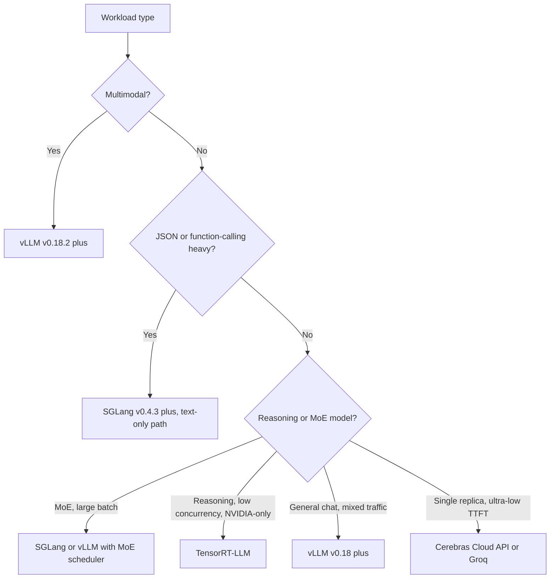

# 服務基礎設施

大規模部署 LLM 需要一個健全的基礎設施層，用以處理負載平衡、模型平行化以及多租戶隔離。重點已經從「服務單一模型」轉移到「協調一整支推論機隊」。

## 目錄

- [推論閘道（Inference Gateway）](#inference-gateway)
- [模型平行化（張量 vs. 管線）](#parallelism)
- [多 GPU 協調](#multi-gpu)
- [串流與長連線](#streaming)
- [2026 年 5 月推論引擎全景](#may-2026-inference-engine-landscape)
- [面試問題](#interview-questions)
- [參考資料](#references)

---

## 推論閘道

閘道是你的 AI 工作負載的「交通管制中心」。

| 元件 | 職責 |
|-----------|---------------------------|
| **驗證與速率限制** | 以 token 為基礎的配額以及租戶隔離。 |
| **模型路由器** | 將請求導向特定的模型版本（Canary／A-B）。 |
| **情境追蹤器** | 確保使用者的 prompt cache 被送往同一個 GPU 節點（黏著式工作階段 / Sticky sessions）。 |
| **輸出過濾器** | 對串流回應進行即時安全與 PII 清除。 |

---

## 模型平行化

對於無法塞進單一 GPU 的模型（例如 Llama 4 405B 需要約 800GB VRAM），我們必須將其切分。

### 1. 張量平行化（Tensor Parallelism，TP）
將單一層／張量切分到多個 GPU 上。
- **延遲**：低（最快）。
- **通訊**：高（需要 NVLink）。
- **標準做法**：用於單一節點（8x GPU）內 90% 的生產服務。

### 2. 管線平行化（Pipeline Parallelism，PP）
切分不同的層（例如第 1-40 層在 GPU 1，第 41-80 層在 GPU 2）。
- **延遲**：高（微批次處理的額外開銷）。
- **效率**：使用率較低（氣泡時間 / Bubble time）。
- **標準做法**：僅用於跨越多個節點的超大型模型。

---

## 多 GPU 協調

Kubernetes operator（如 **Kube-Ray** 或 **Gloo**）在生產環境中管理「GPU 池（GPU Pools）」。

- **異質叢集**：在同一個叢集中混用 H100（用於前沿模型）與 L4（用於小型模型）。
- **自動擴展**：以 **KV Cache 使用率** 而非 CPU 或標準記憶體使用量作為擴展依據。
- **冷啟動**：使用 **未量化的基礎映像（Un-quantized Base Images）**，並從高速的 Lustre／掛載點載入權重，將啟動時間從數分鐘縮短至 15-20 秒。

---

## 串流與長連線

LLM 幾乎一律透過 **Server-Sent Events（SSE）** 或 **WebSockets** 來提供服務。

**基礎設施挑戰**：標準負載平衡器（第 4 層）難以應付長連線的 AI 連線。
- **解法**：使用能理解「序列結束（End of Sequence）」token 的 **第 7 層負載平衡器**（Envoy／Istio），它們能在使用者各回合「之間」重新平衡流量，而不只是在連線層級重新平衡。

---

## 2026 年 5 月推論引擎全景

到了 2026 年 5 月，引擎的選擇已不再是「哪一個最快」的問題。每個領先的引擎都已贏得某個特定的工作負載類別，正確的答案是「依工作負載選引擎」，而非單一通吃的自家引擎。下方的地圖是團隊實際採用的務實版本。

### vLLM v0.18+：預設的開源引擎

[vLLM](https://docs.vllm.ai/) 在 2026 年第一季達到 **v0.18**，並一路發布到 5 月的小版本。其中落地的重點：

- **Blackwell Ultra（B300）支援** 已併入主線，包括 FP4 與動態稀疏性（[vLLM v0.18 發行說明](https://github.com/vllm-project/vllm/releases)）。
- **PagedAttention v3** 具備 NUMA-aware 配置；在多 socket 主機上帶來顯著的尾端延遲改善。
- **分離式 prefill／decode（Disaggregated prefill / decode）** 隱藏在設定旗標之後，主要用於超長情境的工作負載。
- 針對 Llama 4 Maverick、DeepSeek V4 Pro、Mixtral 8x22B 的 **MoE 排程器**，具備 expert-residency-aware 批次處理。

**重要安全提醒**：vLLM 修補了一個高嚴重性的 **多模態 RCE**（[2026 年 2 月發布的 GHSA](https://github.com/vllm-project/vllm/security/advisories)），該漏洞影響 v0.18.2 之前版本的多模態前處理器。**所有多模態 vLLM 部署都必須執行 v0.18.2 或更新的版本。** 修補只是一行的 patch，但這個 CVE 是真實存在且可透過精心製作的影像輸入加以利用的。請升級。

當工作負載是「在連續批次處理下的 Llama／Mistral／Qwen／DeepSeek」時，vLLM 仍是預設的開源引擎。它不見得永遠最快，但它最容易維運、測試最完善，也最有可能在新漏洞出現的同一週就收到修補。

### SGLang v0.4.3+：吞吐量領先者，但有重要的注意事項

[SGLang](https://github.com/sgl-project/sglang) v0.4.3（2026 年 4 月）在數種工作負載上是吞吐量的領先者：

- 在已發布的基準測試中，於結構化輸出／函式呼叫工作負載上 **比 vLLM 高出約 29% 的吞吐量**（[SGLang 部落格，2026 年 4 月](https://lmsys.org/blog/2024-12-04-sglang-v0-4/)）。這項優勢來自 **非同步受限解碼（async constrained decoding）**，其中約束編譯與 LLM 前向傳遞平行執行。
- 同類最佳的 **RadixAttention** 前綴快取重用，適用於聊天工作負載。
- 一流的 **MoE 服務**，具備 expert-routing-aware 批次處理。

**截至 2026 年 5 月的關鍵安全注意事項**：SGLang 在多模態與分離式 prefill 程式碼路徑中有 **尚未修補的 RCE**（[SGLang 安全公告，2026 年 3 月](https://github.com/sgl-project/sglang/security/advisories)）。純文字路徑是安全的，也是每個公開基準測試所使用的路徑。在修補落地之前，多模態路徑應被視為 **尚未達到生產就緒**。數個大型部署已經將其多模態流量從 SGLang 移回 vLLM v0.18.2，並將 SGLang 保留給純文字的函式呼叫工作負載。

2026 年 5 月正確的姿態是：在吞吐量優勢有意義的 **純文字函式呼叫與結構化輸出工作負載** 上使用 SGLang；在 CVE 修補之前，不要將 SGLang 用於 **多模態或分離式 prefill 的生產流量**。

### TensorRT-LLM：NVIDIA 上的吞吐量巔峰，伴隨維運成本

[TensorRT-LLM](https://github.com/NVIDIA/TensorRT-LLM) 在純 NVIDIA 硬體上仍是吞吐量的領先者：

- 在 H200、B200 與 B300 上，針對手動調校的模型擁有 **最高的每秒每美元 token 數（tokens/sec/$）峰值**。
- 與用於服務的 **NVIDIA Triton** 以及用於受管部署的 **NVIDIA NIM** 緊密整合。
- 針對 **Blackwell Ultra 上的 FP4／FP8** 的自訂 kernel，往往比開源引擎領先數個月。

代價在於維運：

- 每個新模型都需要一次 **engine build**（一個耗時數小時、且與特定模型和 GPU 綁定的編譯步驟）。
- 必須鎖定特定的 TensorRT 與 CUDA 版本；升級通常很痛苦。
- **僅限 NVIDIA**。若不進行徹底的重新平台化，便無法脫離 CUDA。

這個決策是二元的：如果你已承諾未來兩年都採用 NVIDIA，並且有一兩個旗艦模型需要榨出每一分每秒的 token，那麼 TensorRT-LLM 划算。如果你需要引擎彈性、供應商獨立性，或快速的模型迭代，那麼 vLLM 或 SGLang 更為合適。

### MoE-Aware 服務（Llama 4 Maverick、DeepSeek V4 Pro）

MoE 模型打破了「服務成本會隨批次大小平滑擴展」這個假設。對於 2026 年 5 月的 MoE 服務引擎而言，重要的特性包括：

- **Expert weight residency（專家權重駐留）**：一個擁有 4000 億參數、每個 token 僅啟用 170 億參數的 MoE，會浪費大部分 VRAM 來讓未使用的專家保持熱狀態。引擎必須能感知 expert-to-token 路由，並選擇釘住熱門專家或串流冷門專家。
- **Expert routing latency（專家路由延遲）**：路由器的決策 **每個 token** 都會發生，並增加可量測的成本。引擎現在會跨批次維度對路由決策進行批次處理。
- **非單調的批次處理曲線**：若將請求加入批次會迫使一組較冷的專家被啟用，則新增請求反而可能 **降低** 吞吐量。最佳批次大小取決於批次中 **路由模式的分布**，而非僅僅是批次數量。
- **Pipeline-aware 排程**：最佳引擎會將新請求排入那些與飛行中批次共享專家啟用狀態的批次。

| 引擎 | Llama 4 Maverick（2026 年 5 月） | DeepSeek V4 Pro（2026 年 5 月） |
|--------|-----------------------------|-----------------------------|
| vLLM v0.18+ | 穩定，MoE 排程器已併入主線 | 穩定 |
| SGLang v0.4.3+ | 穩定，批次 >32 時為吞吐量領先者 | 穩定 |
| TensorRT-LLM | 穩定，低並行度時為吞吐量領先者 | 穩定 |

面試可用的洞見：**MoE 服務已不再是「換上更大權重的 vLLM」。** 它是一個不同的排程問題，而各引擎都在過去 12 個月內開發出專屬的 MoE 路徑。

### 決策框架：依工作負載選引擎

針對團隊實際部署的工作負載，更明確的對應如下：

| 工作負載 | 引擎選擇（2026 年 5 月） | 原因 |
|----------|---------------------------|-----|
| 公開聊天機器人（混合流量，必須能快速修補） | **vLLM v0.18.2+** | 最容易維運，安全更新節奏最佳 |
| JSON 函式呼叫後端 | **SGLang v0.4.3+**（純文字路徑） | 在結構化輸出上約 29% 的吞吐量優勢 |
| 單模型、延遲關鍵（一個模型、一個團隊） | 在 B300 上的 **TensorRT-LLM** | NVIDIA 吞吐量巔峰，在單一模型上值得付出維運成本 |
| 多模態（輸入影像、音訊、影片） | **vLLM v0.18.2+** | SGLang 多模態尚未修補 |
| 推理模型（長 CoT、低並行度） | **TensorRT-LLM** 或搭配分離式 prefill 的 **vLLM** | 受 decode 限制，受益於自訂 kernel |
| MoE 模型（Llama 4 Maverick、DeepSeek V4 Pro） | 搭配 MoE 排程器的 **vLLM v0.18+** 或 **SGLang v0.4.3+** | 兩者現在都具備一流的 MoE 路徑 |
| 單一副本、TTFT 低於 50ms | **Cerebras Cloud API** 或 **Groq LPU** | GPU 在 70B+ 模型上無法達到此水準 |

### 2026 年 5 月的維運姿態

- **永遠保持在已修補的版本上。** 推論引擎現在的 CVE 節奏已與網頁伺服器相當。多模態 RCE 並非紙上談兵。
- **在第二個引擎上跑 canary。** 生產流量跑在 vLLM 上，1-5% 的 canary 跑在 SGLang 或 TensorRT-LLM 上，並在品質或延遲出現分歧時告警。這能捕捉到引擎特定的 bug，並提供更快的遷移路徑。
- **把引擎視為部署清單的一部分。** 一個模型不是「Llama 4 Maverick」；它是「在 vLLM v0.18.3 上、採用此批次設定、跑在此硬體上的 Llama 4 Maverick」。四者全部鎖定。
- **關注安全公告的訊息來源**，而不只是發行說明：[vLLM 公告](https://github.com/vllm-project/vllm/security/advisories)、[SGLang 公告](https://github.com/sgl-project/sglang/security/advisories)、[TensorRT-LLM CVE 清單](https://nvd.nist.gov/vuln/search/results?form_type=Basic&search_type=all&query=tensorrt-llm)。

---

## 面試問題

### Q：在低延遲服務中，為什麼張量平行化比管線平行化更受青睞？

**有力的回答：**
張量平行化（TP）會將單一層的矩陣乘法同時分散到多個 GPU 上執行。這意味著該層的延遲會被 GPU 數量所除而縮減。相對地，管線平行化（PP）會依序處理不同的層。當 GPU 2 正在處理第 40-80 層時，GPU 1 處於閒置狀態，除非你有一條由多個請求構成的深層管線（批次處理）。對於單一使用者的請求，PP 會把所有 GPU 的延遲相加，而 TP 則把延遲分攤到所有 GPU 上。

### Q：在多租戶 LLM 叢集中，你如何處理「吵鬧的鄰居（Noisy Neighbors）」？

**有力的回答：**
我們透過 **分層的迭代層級排程（Tiered Iteration-Level Scheduling）** 來處理吵鬧的鄰居。每個租戶被分配到總 GPU 週期的一個「份額」。在連續批次處理的迴圈中，排程器會確保單一租戶不會佔據 100% 的 KV cache 槽位。如果租戶 A 正在淹沒系統，排程器會優先處理租戶 B 與 C 的「Prefill」步驟，或在每個週期只處理租戶 A 的部分 decode 迭代。這在閘道端透過 token-bucket 速率限制來強制執行，並在服務引擎端透過特定的排程策略來強制執行。

---

## 參考資料
- Narayanan et al. "Efficient Large-Scale Language Model Training on GPU Clusters Using Pipedream" (2019/2021)
- NVIDIA. "Megatron-LM: Training Multi-Billion Parameter Models on GPU Clusters" (2021)

---

*下一篇：[成本最佳化實戰手冊](07-cost-optimization-playbook.md)*
