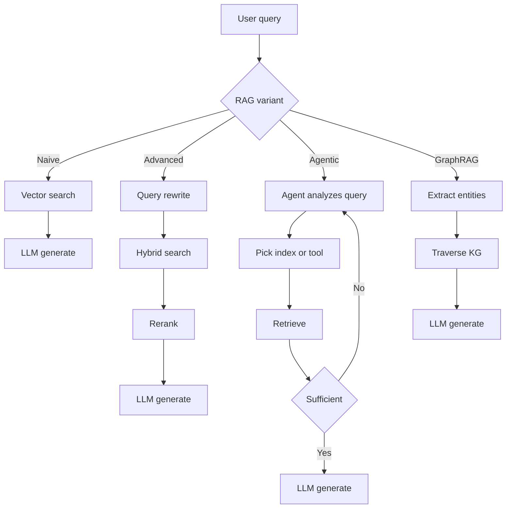
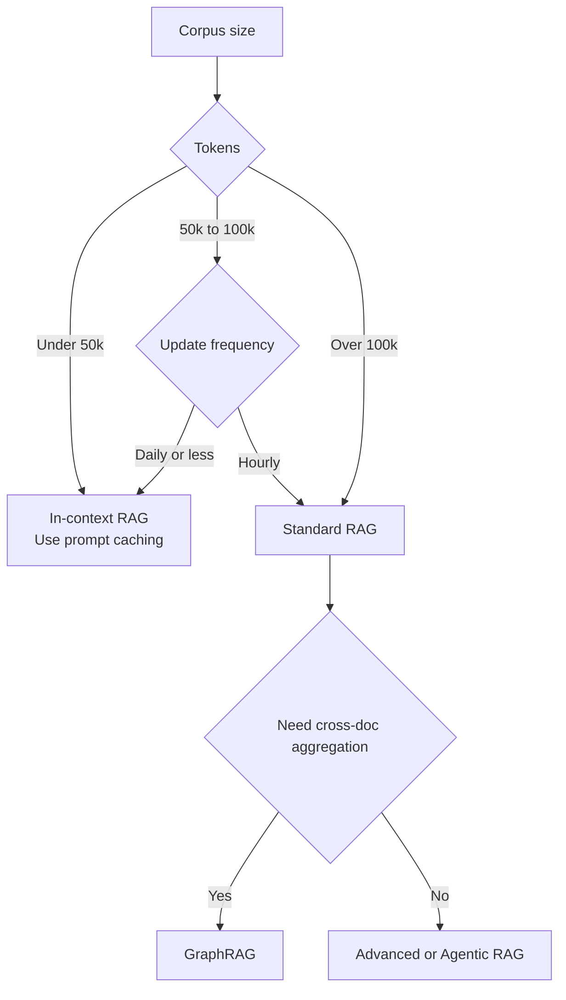

# RAG 基礎

RAG 如何從單純的向量搜尋演進到 agentic 與基於圖（graph-based）的檢索。何時該選擇 RAG 而非長上下文，以及導致生產環境失敗的三個檢索缺口。

Retrieval-Augmented Generation（RAG，檢索增強生成）是一種架構模式，藉由為 LLM 提供外部、可驗證的上下文，來為其回應建立事實依據（grounding）。它已從「單純的向量搜尋」演進為一條多階段的推理流程：hybrid 檢索、reranking、contextual chunking 以及 agentic 迴圈，如今都是生產環境的基本門檻。更深入的內容請見 [Chunking 策略](02-chunking-strategies.md)、[向量資料庫](04-vector-databases.md)、[Reranking](06-reranking-strategies.md)、[Contextual Retrieval](10-contextual-retrieval.md)、[ColBERT Late Interaction](11-late-interaction-colbert.md) 以及 [GraphRAG 的重新框架](07-graph-rag.md)。

## 目錄

- [核心哲學：Grounding vs. Training](#philosophy)
- [RAG 分類法](#taxonomy)
- [RAG vs. 2M 上下文（混合時代）](#rag-vs-long-context)
- [檢索品質缺口](#quality-gap)
- [面試問題](#interview-questions)
- [參考資料](#references)

---

## 核心哲學：Grounding vs. Training

| 面向 | Fine-Tuning | RAG |
|--------|-------------|-----|
| **知識型態** | 內化（權重中） | 外化（上下文中） |
| **更新週期** | 高成本（重新訓練） | 零成本（更新 DB） |
| **可歸因性** | 無（黑箱） | 明確（引用來源） |
| **隱私** | 難以「遺忘」 | 容易過濾／刪除 |

**經驗法則**：Fine-tuning 用於**形式**（風格、語氣、語法）；RAG 用於**事實**（知識、資料、事實依據）。

---

## RAG 分類法

生產環境的 RAG 系統可依其「Agentic 深度」分類：

### 1. Naive RAG（先檢索再生成）
- **流程**：使用者查詢 -> 向量搜尋 -> Top-K -> LLM。
- **狀態**：因「檢索缺口」與低精確度，已不適用於生產環境。

### 2. Advanced RAG（多階段）
- **流程**：查詢轉換 -> Hybrid 搜尋 -> Reranking -> LLM。
- **關鍵細節**：使用 **RRF（Reciprocal Rank Fusion，倒數排名融合）** 來結合關鍵字與語意結果。

### 3. Agentic RAG（基於迴圈）
- **流程**：Agent 分析查詢 -> 決定要搜尋哪些工具／索引 -> 評估結果 -> 若資訊缺漏則重新檢索。
- **技術**：Self-RAG、Corrective RAG（CRAG）。

### 4. GraphRAG（結構化上下文）
- **流程**：擷取實體／關係 -> 建立知識圖譜（Knowledge Graph）-> 遍歷圖來尋找「彼此連結的知識」。
- **優勢**：解決「彙整型問題」（例如：「總結 50 份文件中的所有法律風險」）。

依 agentic 深度區分的四種變體：

---

## RAG vs. 2M 上下文（「混合時代」）

隨著 Gemini 1.5 Pro（2M+）與 Claude Sonnet 4.6（1M+）這類上下文視窗的出現，RAG 正在改變。

- **In-Context RAG（ICR）**：對於小於 50k token 的資料集，我們略過向量 DB，把所有內容都放進 prompt 中。
- **Prompt Caching**：透過將「背景知識」快取在 GPU 上，使 Long-Context RAG 便宜 90%。

**架構決策**：
- 若你的語料庫大於 100k token 且為動態：使用 **Standard RAG**。
- 若你的語料庫小於 100k token：使用 **In-Context RAG**。

在 standard RAG 與 in-context RAG 之間做選擇的決策樹：

---

## 檢索品質缺口

「檢索缺口」是造成 RAG 失敗的第一大原因。
- **缺口 1：語意不符（Semantic Mismatch）**：查詢說的是「fast cars」，DB 裡存的是「Porsche 911」。由 **Embedding Rerankers** 解決。
- **缺口 2：缺漏上下文（Missing Context）**：相關資訊確實存在於 DB 中，但 Retriever 漏掉了它。由 **Hybrid Search** 解決。
- **缺口 3：迷失在中間（Lost-in-the-Middle）**：資訊就在 prompt 裡，但 LLM 沒注意到。由 **Context Compression** 解決。

---

## 面試問題

### Q：既然前沿模型已搭載 1M-2M token 的上下文，為什麼你還會使用 RAG？

**強力回答：**
理由分為三個層次：
1. **成本與延遲**：即使有 prompt caching，為每個新的使用者查詢重新讀取 2M token，仍然遠比檢索 5 個相關 chunk（約 2k token）昂貴許多，且 TTFT（Time to First Token，首個 token 時間）更高。
2. **新鮮度**：RAG 能存取即時 API（股價、新聞），這些資料無法被靜態地嵌入到上下文視窗中。
3. **規模**：企業資料集（SharePoint、TB 級日誌）甚至超過 2M token。RAG 扮演「過濾器」的角色，找出*應當*進入這個高價值上下文視窗的那 0.01% 相關資料。

### Q：什麼是「Agentic RAG」？它與「Advanced RAG」有何不同？

**強力回答：**
Advanced RAG 是一條**確定性流程**（線性：Rewrite -> Search -> Rerank）。Agentic RAG 則是一個**隨機性迴圈**。在 Agentic RAG 中，模型被賦予工具來決定*如何*檢索。舉例來說，如果 agent 發現檢索到的文件不相關，它可以改為決定「搜尋 Google」或「查詢 SQL 資料庫」。它本質上是在檢索前後加入一個「推理步驟」，以確保上下文足以回答該 prompt。

---

## 重點摘要

- Naive RAG（向量搜尋 + top-K + LLM）已不適用於生產環境；應將 Advanced RAG（hybrid + RRF + rerank）作為新的基準線推出。
- 長上下文視窗並未殺死 RAG：成本、延遲、新鮮度與語料庫規模，都會在即使有 2M 上下文時把你推回檢索。
- 依語料庫大小選擇：小於 50k token 採用 in-context 搭配 prompt caching；大於 100k 採用 standard RAG；彙整型問題採用 GraphRAG。
- 大多數 RAG 失敗是檢索失敗，而非生成失敗；在調整 prompt 之前，先診斷三個缺口（語意、缺漏上下文、迷失在中間）。
- Agentic RAG vs. Advanced RAG 是隨機性迴圈與確定性流程之間的選擇；只有當查詢模式太過多樣、無法用固定流程處理時，才採用 agentic。

---

## 參考資料
- Gao et al. "Retrieval-Augmented Generation for LLMs: A Survey" (2024 update)
- Microsoft. "From RAG to GraphRAG" (2024)
- Google. "Long-context LLMs as Retrievers" (2025)
- [Anthropic. "Introducing Contextual Retrieval" (Sep 2024)](https://www.anthropic.com/news/contextual-retrieval)

---

*下一篇：[Chunking 策略](02-chunking-strategies.md)*
