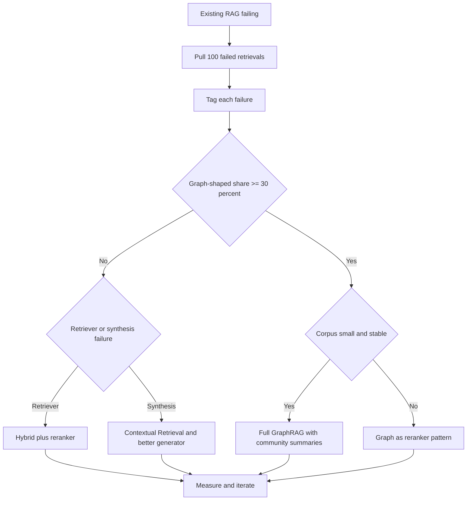
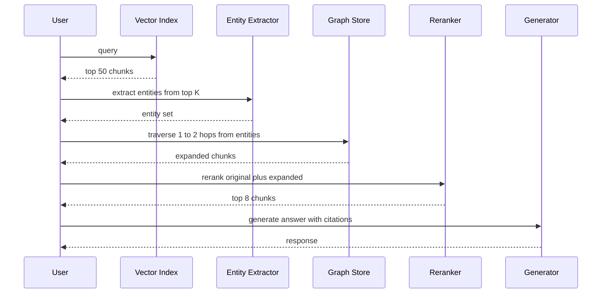

# GraphRAG

GraphRAG 是 **知識圖譜（Knowledge Graphs, KG）** 與 **Retrieval-Augmented Generation** 的結合。向量 RAG 擅長「找到某個特定的 chunk」，而 GraphRAG 的設計目標則是針對整個資料集進行 **全域推理（Global Reasoning）**。

## 目錄

- [GraphRAG 真正勝出的時機（以及不適用的時機）](#when-graphrag-actually-wins-and-when-it-doesnt)
- [Graph as Reranker 模式（2026 年 5 月）](#graph-as-reranker-pattern-may-2026)
- [向量 RAG 的限制](#limitations)
- [GraphRAG 架構（Extract-Build-Query）](#architecture)
- [社群摘要（Microsoft 模式）](#communities)
- [實體關係檢索](#retrieval)
- [何時使用 GraphRAG](#when)
- [面試問題](#interview-questions)
- [參考資料](#references)

---

## GraphRAG 真正勝出的時機（以及不適用的時機）

GraphRAG 是針對圖形結構問題（graph-shaped questions）的專用工具，並不是用來預設取代向量 RAG 的升級方案。對於大約 80% 的生產級檢索工作負載而言，採用混合式 BM25 加上 dense retriever、再接一個 cross-encoder reranker 的做法，建置成本更低、營運成本更低，且在答案品質上具有競爭力。只有在問題確實需要向量相似度無法還原的多跳遍歷（multi-hop traversal）時，才值得建置圖譜。

這個決策應該由資料驅動，而非出於美感考量。從你現有的 RAG 系統中抽出 100 筆失敗的檢索結果，將每筆失敗歸入三類其中之一，然後讓分佈來做決定：

1. **詞彙或切塊失敗（Lexical or chunking failures）**：答案其實就在語料庫中，但 retriever 沒有把它撈出來。修正 retriever（更好的 embeddings、混合式評分、更大的 top-k、加上 reranker，或採用 Contextual Retrieval）。
2. **綜整失敗（Synthesis failures）**：retriever 撈出了正確的 chunk，但 generator 把它們組合得很差。修正 prompt、reranker 或模型。
3. **圖形結構失敗（Graph-shaped failures）**：答案需要跨越多份彼此沒有共同表面文字的文件，沿著一連串關係去追溯。這就是 GraphRAG 所屬的類別。

如果第三類佔失敗的比例低於 30%，就不要建置圖譜。建置與維護成本不會回本。如果是 30% 或更高，那麼 GraphRAG（或下文會介紹的 graph-as-reranker 混合做法）就是下一步正確的投資。

### GraphRAG 是正確工具的工作負載

這些案例共通的模式都一樣：問題需要連結那些不會共同出現在任何單一 chunk 中的實體，而且這些關係本身帶有表面 embeddings 無法捕捉的語意重量。

- **藥物探索與生醫研究**：跨越基因、蛋白質、化合物與疾病去追溯路徑。以 UMLS 為基礎的變體（例如 GraLC-RAG）就是針對這個領域調校的。
- **金融詐騙集團**：在彼此從未提及對方的文件之間，串連帳戶、裝置、地點與交易。
- **法律判例鏈**：跨越多個司法管轄層級去追蹤案例的引用，而每個案例只引用其直接的上層判例。
- **企業組織圖與政策歸屬**：像是「在地區 Y 中，誰能核准政策 X 的例外」這類問題，需要遍歷匯報關係與政策歸屬的邊。
- **儲存庫規模的程式碼智能（Code intelligence）**：呼叫圖（call graphs）、型別階層與相依關係本質上就是圖形結構的；對原始碼 chunk 做向量相似度搜尋，會失去那些讓答案得以被找到的結構。

### 決策流程

### 維護的長尾成本

GraphRAG 隱藏的成本不是抽取，而是維護。語料庫會漂移：新文件不斷進來、實體會改名、關係會被重寫。一月建好的圖譜，到了四月就會出現實質性的錯誤。請規劃每季一次的重新整理（refresh），針對變動過的文件重新執行抽取，並在差異之間調和實體身份的一致性。請事先把這次重整的 LLM 成本與工程時間編入預算，否則就乾脆不要建置圖譜。略過這個步驟的團隊，最後會得到一個檢索起來信心十足卻錯誤百出的圖譜，這比完全沒有圖譜還糟。

---

## Graph as Reranker 模式（2026 年 5 月）

2026 年生產環境中的主流模式並不是完整的 GraphRAG，而是 graph-as-reranker，它能以建置成本的一小部分換得大部分的多跳效益。其核心直覺是：你不需要在整個語料庫上建立圖譜索引；你需要的是一個涵蓋 top-k 向量結果中所出現實體的圖譜，並且只擴展到剛好足以找到相連證據的程度。

流程如下：

1. 向量檢索針對使用者查詢撈出 top-50 的 chunk，使用你既有的任何混合式評分方式。
2. 一個實體抽取器（一個小型的 fine-tuned 模型，或一次結構化輸出的 LLM 呼叫）從這 50 個 chunk 中拉出命名實體。
3. 從這些實體出發進行一到兩跳深度的圖譜遍歷，回傳相連的實體以及它們出現的 chunk。
4. 擴展後的候選集合（原本的 50 個加上經圖譜擴展的 chunk）送進 cross-encoder reranker。
5. reranker 排序後的 top-k chunk 餵給 generator。

你只建置查詢所觸及的那一小片圖譜，而且是惰性（lazily）建置，而非全域圖譜索引。建置成本因此下降一個數量級。維護長尾也會縮小，因為你不會重新索引那些未被觸碰的區域。從實證上看，團隊回報能以大約 20% 的前期成本，換得完整 GraphRAG 70-80% 的品質提升。

### 模式流程

### 近期變體（2024 至 2026）

以下簡短巡覽幾個值得認識的變體：

- **HippoRAG 與 HippoRAG 2**（Princeton，2024 與 2025）：把檢索視為在記憶圖譜上的 Personalized PageRank 問題，在多跳基準測試上有強勁表現，且索引成本低於 Microsoft GraphRAG。
- **LightRAG**（HKU，2024）：以實體為中心的檢索，搭配更簡單的索引管線；在全域性問題上犧牲了部分召回率，以換取大幅更快的建置與更新。
- **GraLC-RAG**（2026 年 3 月）：圖譜感知的 late chunking，搭配 UMLS grounding，用於生醫應用場景，在多跳生醫 QA 上有亮眼的已發表成果。
- **Microsoft GraphRAG 索引管線 v2**（2025）：原始的社群摘要做法，重新架構以支援增量更新並顯著降低抽取成本；如果你真的需要全域摘要而非局部多跳，這就是該採用的方案。

這四個變體的整體走向都一樣：減少單體式索引、增加增量與惰性的圖譜建置，並更清楚地區分「全域摘要」工作負載（Microsoft 式社群在此仍然勝出）與「局部多跳」工作負載（HippoRAG 式遍歷在此更便宜且具競爭力）。

**來源：**
- [Microsoft GraphRAG](https://microsoft.github.io/graphrag)
- [HippoRAG: Neurobiologically Inspired Long-Term Memory](https://arxiv.org/abs/2405.14831)
- [Edge et al., From Local to Global: A GraphRAG Approach](https://arxiv.org/abs/2404.16130)
- [Graph-aware late chunking (arXiv 2603.22633)](https://arxiv.org/html/2603.22633v1)
- [Anthropic Contextual Retrieval (Sep 2024)](https://www.anthropic.com/news/contextual-retrieval)

---

## 向量 RAG 的限制

向量 RAG 是在空間中的「點」上運作。它在面對以下這類問題時會失敗：
- *「在全部 500 份員工評論中，主要的主題有哪些？」*
- *「列出 Project Alpha 與 Q3 預算刪減之間的所有關聯。」*

**問題所在**：向量搜尋找的是「相似的文字」，但它無法理解「相連的實體」。

---

## GraphRAG 架構

現代的 GraphRAG 管線由三個階段組成：

1. **抽取（Extraction, VLB）**：由 LLM 掃描文本，並抽取出 **實體（Entities）**（人物、專案、日期）與 **關係（Relationships）**（例如「人物 A *參與* 專案 B」）。
2. **圖譜建構（Graph Construction）**：實體以節點儲存、關係以邊儲存於圖資料庫（Neo4j、Memgraph）中。
3. **查詢（Querying）**：
   - **局部搜尋（Local Search）**：找到某個節點及其鄰居。
   - **全域搜尋（Global Search）**：使用 **社群摘要（Community Summaries）** 來回答高層次的問題。

---

## 社群摘要

這項技術由 Microsoft 推廣普及，做法包含：
1. 使用圖演算法（例如 Leiden）辨識出相關節點的群集（Communities）。
2. 為 *每一個* 社群生成一段自然語言摘要。
3. 在查詢時，搜尋這些 **摘要** 而非原始的 chunk。

**致勝關鍵**：這讓模型能在不必讀取 1M token 的情況下回答「全局視野（Big Picture）」的問題。

---

## 實體關係檢索

生產級技術堆疊使用 **混合式圖譜-向量搜尋（Hybrid Graph-Vector Search）**。
- **Dense Pass**：透過 embeddings 找到最相似的節點。
- **Graph Pass**：遍歷這些節點的邊，找出相關的「佐證」資訊——這些資訊在語意上可能與查詢並不相似，但在邏輯上是相連的。

---

## 何時使用 GraphRAG

| 特性 | 向量 RAG | GraphRAG |
|---------|------------|----------|
| **資料類型** | 非結構化文本 | 高度相連的資料 |
| **查詢類型**| 「找出 X」 | 「解釋 X 與 Y 之間的關係」 |
| **規模** | Petabytes | 數百萬個實體 |
| **成本** | 低 | 高（抽取成本昂貴） |

**2025 年建議**：在 **內部知識庫**（Wiki、程式碼庫、法律儲存庫）中使用 GraphRAG，因為在這些場景下，文件之間的關聯與內容本身一樣重要。

---

## 面試問題

### 問：為什麼「抽取」階段是 GraphRAG 的瓶頸？

**有力的回答：**
知識圖譜抽取極度耗費 token。要建置高品質的圖譜，你必須用一個「Frontier」等級的模型來處理每一份文件，以確保不會遺漏細微的實體關聯。對於一個 10,000 頁的資料集而言，這在 LLM API 呼叫上可能花費數千美元。標準的緩解做法是在初次處理時採用 **SLM-based Extraction（小型語言模型）**，並把巨型模型保留給重疊實體之間的「衝突解決（conflict resolution）」。Microsoft 的 LazyGraphRAG 更進一步，把社群摘要的成本延後到查詢時才產生。

### 問：GraphRAG 如何解決彙總型問題的「上下文視窗」限制？

**有力的回答：**
對於彙總型問題（例如「總結這 1,000 份文件的情緒傾向」），標準的 RAG 系統必須把 1,000 個 chunk 餵進上下文視窗，這要不是不可能，就是貴到難以負擔。GraphRAG 透過 **預先摘要（Pre-Summarization）** 來解決這個問題。它會階層式地摘要圖譜中的資訊群集（Communities）。當使用者提出全域性問題時，系統只需檢索高層次的社群摘要——這些摘要既精簡又資訊豐富——讓模型得以透過一個濃縮的視角「看見」整個資料集。

---

## 參考資料
- Edge et al. "From Local to Global: A GraphRAG Approach" (Microsoft Research, 2024)
- Neo4j. "Generative AI and Graph Databases" (2025)
- WhyHow AI. "Deterministic RAG with Knowledge Graphs" (2024)

---

*下一篇：[Agentic RAG](08-agentic-rag.md)*
