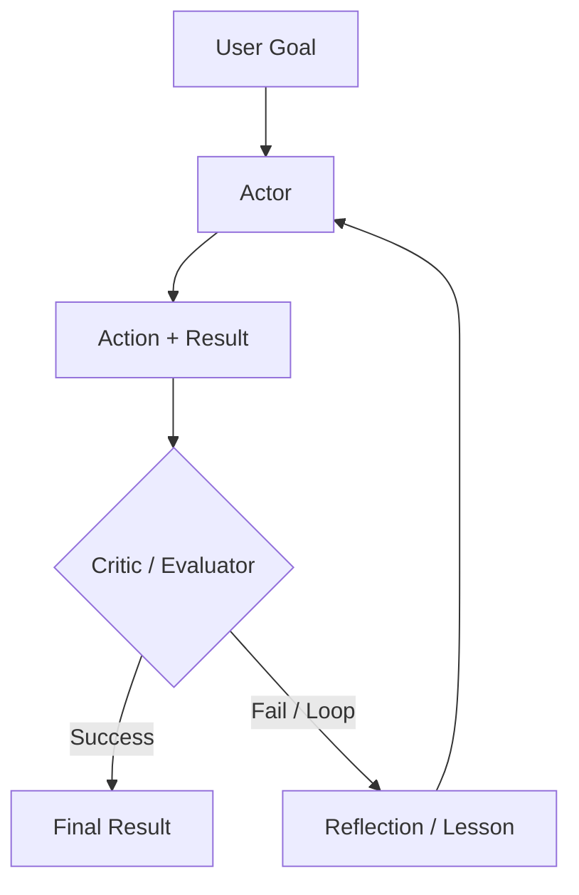

# 推理迴圈：ReAct 與其進階形式

推理迴圈定義了 agent 的控制流程。雖然 **ReAct** 是 2023 年的基準做法，但現今的系統會在 reasoning-native 模型之上，採用更精緻的模式，例如 **Plan-and-Solve**、**Self-Reflexion** 以及 **Inference-Time Scaling**。

## 目錄

- [迴圈的演進](#evolution)
- [ReAct：經典模式](#react)
- [Self-Reflexion 迴圈](#reflexion)
- [Plan-and-Solve（Soto）](#plan-and-solve)
- [流程工程（LangGraph 模式）](#flow-engineering)
- [面試問題](#interview-questions)
- [參考資料](#references)

---

## 迴圈的演進

| 年代 | 模式 | 核心理念 |
|-----|---------|-----------------|
| **2023** | ReAct | 交錯進行思考與行動。 |
| **2024** | Reflexion | 評估錯誤並重新嘗試。 |
| **今日** | System 2 迴圈 | 使用隱藏的 CoT 來處理穩健的多步驟邏輯。 |

---

## ReAct：Reasoning + Acting

90% 的 agent 都採用的基本迴圈：
1. **Thought（思考）**：「我需要找出 X。」
2. **Action（行動）**：`search_engine("X")`
3. **Observation（觀察）**：「X 位於 Y。」
4. **Repeat（重複）**。

**評析**：ReAct 很脆弱。如果搜尋回傳「沒有結果」，一個天真的 ReAct agent 往往會再次嘗試相同的搜尋。現代的迴圈會注入 **「負面約束（Negative Constraints）」**（例如：「不要再嘗試我們已經看過的搜尋結果」）。

---

## Self-Reflexion 迴圈

Reflexion 在迴圈中加入了一個 **「Critic（評論者）」** 步驟。

**好處**：透過把這些「Reflections（反思）」儲存在短期記憶中，agent 會在當前 session 期間建立一張關於「什麼行不通」的「心智地圖（Mental Map）」。

---

## Plan-and-Solve

agent 不是一次只決定一個步驟（貪婪法），而是先建立一份 **靜態計畫（Static Plan）**，然後再加以執行。

1. **Planner（規劃器）**：「我會先做 A，再做 B，然後做 C。」
2. **Executor（執行器）**：實際執行這些步驟。
3. **Re-planner（重新規劃器）**：如果步驟 B 失敗，就觸發完整的重新規劃，而不是做局部修補。

**為什麼？**：規劃能減少「隨機性錯誤（Stochastic Errors）」。藉由鎖定一條路徑，模型比較不會被充滿雜訊的工具結果分散注意力。

---

## 流程工程（LangGraph）

現代的 agentic 系統已經從「聊天介面」轉向 **「狀態機（State Machines）」**。

- **循環圖（Cyclic Graphs）**：我們不採用線性序列，而是定義一張圖，讓模型可以多次迴圈回到某個「Cleaning（清理）」節點或「Validation（驗證）」節點。
- **微型 Agent（Micro-Agents）**：圖中的每個節點都是一個專門化的「Prompt」或「Tool」。

**關鍵細節**：「Agent」不再只是 LLM；agent 是那個 **圖執行引擎（Graph Execution Engine）**。

---

## 面試問題

### Q：你會在什麼情況下使用「推理迴圈」（ReAct），又在什麼情況下使用「Plan-and-Solve」架構？

**有力的回答：**
對於環境不可預測的 **探索性（Exploratory）** 任務（例如：瀏覽一個你還不清楚 URL 結構的新網站），我會選擇 **ReAct**。agent 需要對每一個觀察結果做出反應。對於 **可預測** 但複雜的工作流程（例如：從 5 個已知的 API 產生一份財務報告），我會選擇 **Plan-and-Solve**。規劃能避免模型「漫無目的地遊走（meandering）」，並讓那些彼此不相依的步驟能更好地平行化。

### Q：什麼是「Inference-Time Scaling」？它與 Agentic 迴圈有什麼關係？

**有力的回答：**
Inference-Time Scaling（常與 OpenAI 的 o1 連結在一起）指的是在 *回應生成期間* 投入更多運算資源，而不只是在訓練期間。在 agentic 的情境中，這代表模型不會只輸出第一個看起來合理的 action。它會使用一棵 **搜尋樹（Search Tree）**（例如 Monte Carlo Tree Search），在內部模擬不同的 action 路徑，然後才選定那個最可能成功的路徑。這能減少所需的「真實世界（Real World）」工具呼叫次數，節省外部 API 成本並降低失敗率。

---

## 參考資料
- Yao et al. "ReAct: Synergizing Reasoning and Acting" (2022/2025 update)
- Shinn et al. "Reflexion: Language Agents with Iterative Homeostatic Learning" (2024)
- Wang et al. "Plan-and-Solve Prompting" (2023)

---

*下一篇：[Tool Use and the Model Context Protocol (MCP)](03-tool-use-and-mcp.md)*
