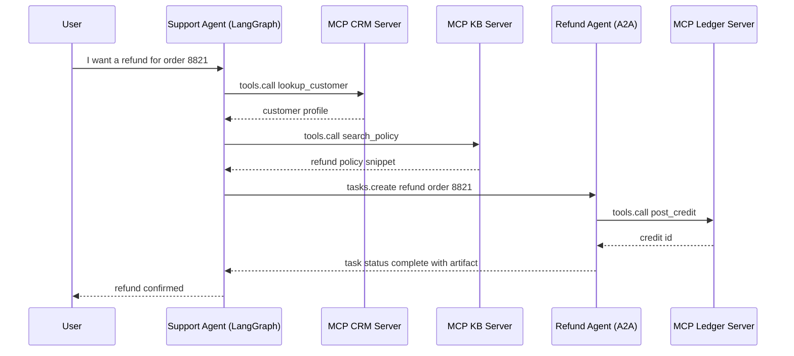
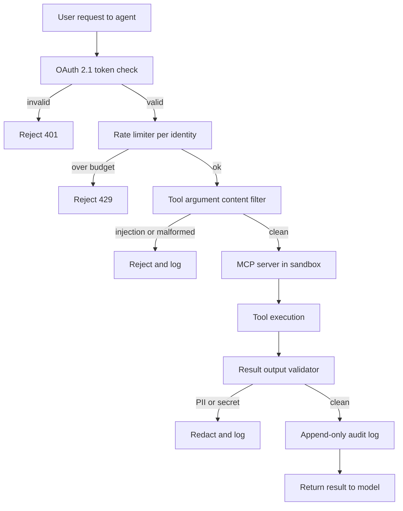

# Tool Use 與 MCP

工具是 agent 的「雙手」。業界已標準化採用 **Model Context Protocol (MCP)**，它以統一、local-first 的通訊層取代了零碎的自訂工具定義。MCP 已快速成熟：Streamable HTTP 傳輸、OAuth 2.1 授權，以及原生的 computer-use 工具皆在 MCP 2.0（於 2026 年 3 月批准）中落地。與此同時，**Agent-to-Agent (A2A)** 及其他互通協定也相繼出現，為 MCP 的工具存取層補上 agent 協調能力。

## 目錄

- [工具使用機制](#mechanism)
- [Model Context Protocol (MCP)](#mcp)
- [MCP 2.0：Streamable HTTP 與授權](#mcp-updates)
- [MCP 路線圖與生態系](#mcp-roadmap)
- [Agent-to-Agent Protocol (A2A)](#a2a)
- [協定全貌：MCP + A2A + ACP](#protocol-landscape)
- [Computer-Use 工具（Anthropic）](#computer-use)
- [定義高精確度的工具](#precision)
- [MCP vs. OpenAI Function Calling](#mcp-vs-openai)
- [Context7：即時文件 MCP](#context7)
- [串流工具呼叫](#streaming)
- [面試題](#interview-questions)
- [參考資料](#references)

---

## 工具使用機制

工具使用發生在一個 3 步驟的循環中：
1. **Schema 呈現**：將工具的 JSON schema 提供給模型。
2. **意圖與抽取**：模型輸出一個「Call」（例如 `{"tool": "get_weather", "args": {"city": "Tokyo"}}`）。
3. **執行與情境化**：系統執行該函式，並將結果回饋至 prompt 中。

**細微之處**：正式環境的技術堆疊已不再將工具定義「硬編碼」進 system prompt。它們改用**動態 Manifest（Dynamic Manifests）**，依據使用者的意圖只擷取必要的工具。

---

## Model Context Protocol (MCP)

MCP 由 Anthropic 開發（於 2024 年 11 月發布），如今已成為橫跨 Anthropic、OpenAI、Google、Microsoft 與 AWS 的通用工具整合標準，讓模型能與資料和工具互動，無論它們存在於何處。其治理權已於 2025 年 12 月移交予 Linux Foundation 旗下的 Agentic AI Foundation。

- **MCP Client**：AI 應用程式（例如你的 agent 程式碼）。
- **MCP Server**：一個獨立的處理程序，對外暴露 Tools（函式）、Resources（資料）與 Prompts（範本）。
- **通訊**：透過 stdio 或 HTTP 使用 JSON-RPC。

### 為何要用 MCP？
- **安全性**：工具在自己的處理程序中執行，而非在模型邏輯中。
- **可攜性**：「Postgres 工具」只需撰寫一次，即可在 Claude、GPT 或 Llama 上使用。
- **可探索性**：標準化的 `list_tools` 與 `get_resource` 指令。

---

## 定義高精確度的工具

一個正式環境品質的工具必須包含：

1. **嚴格的型別驗證**：使用 Pydantic 或 Zod，在模型看到呼叫之前就強制套用 schema。
2. **詳盡的 Docstring**：描述*何時不該*使用該工具。
3. **信心門檻**：要求模型針對工具呼叫輸出一個 `confidence` 分數。

```python
# MCP Server Example (Conceptual)
@server.tool()
class ExecuteSQL(PydanticModel):
    """Executes a Read-Only SQL query. DO NOT use for DROP/DELETE."""
    query: str = Field(..., description="The SELECT query to run.")

    async def run(self):
        # Implementation here...
        pass
```

---

## MCP vs. OpenAI Function Calling

| 功能 | OpenAI 原生 | MCP |
|---------|---------------|-----|
| **耦合度** | 高（OpenAI 專屬） | 低（與供應商無關） |
| **傳輸** | API body 內的 JSON | JSON-RPC（本地／遠端） |
| **資料存取**| 無原生資料「Resource」 | 原生支援 `Resources` |
| **最適合** | 原型開發 | 企業級編排 |

---

## 串流工具呼叫

前沿模型支援**部分工具推測（Partial Tool Speculation）**。
系統不再等待完整的 JSON 生成完畢，而是一旦在串流中看見工具名稱與關鍵 ID，就開始「預先擷取」工具結果。這可將感知延遲降低 **400-800ms**。

---

## MCP 2.0：Streamable HTTP 與授權

MCP 2.0 規格（於 2026 年 3 月批准）引入了兩項重大變更：

### 1. Streamable HTTP 傳輸
先前的 MCP 使用 `stdio` 或搭配 SSE 的基本 HTTP。MCP 2.0 加入了 **Streamable HTTP**——一條長存的單一 HTTP 連線，可處理雙向串流：

```
[MCP Client] ←── Streamable HTTP POST /mcp ──→ [MCP Server]
                  (with SSE response stream)
```

- 讓 MCP server 能以雲端微服務形式部署（而不僅是本地處理程序）
- 允許在單一連線上進行多個同時的工具呼叫
- 向後相容 stdio 傳輸

### 2. OAuth 2.1 授權
遠端 MCP server 現在可要求適當的授權：

```json
{
  "type": "oauth2",
  "grant_type": "client_credentials",
  "scopes": ["tools:read", "resources:documents"]
}
```

這讓企業級 MCP server 能針對每個租戶實施細粒度的存取控制。

---

## MCP 路線圖與生態系

截至 2026 年 5 月，已存在超過 2,300 個公開的 MCP server，且主要 AI 工具（Claude、Cursor、Windsurf）皆原生支援。MCP 已從開發者工具跨入消費性硬體（例如 Elgato Stream Deck 7.4 於 2026 年 3 月隨附 MCP 支援上市）。Microsoft 已將 MCP 採用為 Windows AI Foundry 與 Microsoft 365 Copilot 的主要整合標準。

MCP 路線圖聚焦於四大支柱：

1. **傳輸可擴展性**：演進 Streamable HTTP 以支援橫跨多個水平擴展 server 實例的無狀態運作，並在負載平衡器與 proxy 後方維持正確行為。**MCP Server Cards** 提供一個 `.well-known` URL，用於結構化的 server 中繼資料探索。
2. **Agent 通訊**：在 MCP 既有的工具層之上實現 agent-to-agent 模式。
3. **企業級驗證（2026 年 Q2）**：為瀏覽器型 agent 提供搭配 PKCE 的 OAuth 2.1，並整合企業身分供應商的 SAML/OIDC，解鎖受監管產業的部署。
4. **MCP Registry（2026 年 Q4）**：一個經策劃、已驗證的 server 目錄，附帶安全稽核、使用統計與 SLA 承諾。

**治理**：MCP Governance Working Group 推出了 Contributor Ladder 與委派模型，讓特定領域的 working group 能在不經完整核心維護者審查的情況下接受 SEP（Specification Enhancement Proposals）。

> *已於 2026 年 5 月驗證。來源：modelcontextprotocol.io/development/roadmap*

---

## Agent-to-Agent Protocol (A2A)

Google 於 2025 年 4 月推出 **Agent2Agent (A2A)** 協定，以解決 MCP 未處理的問題：**來自不同供應商的 agent** 如何彼此通訊（而不僅是與工具通訊）？

### A2A 解決了什麼

MCP 定義了 agent 如何連接到**工具與資料**。A2A 則定義了**編排 agent 如何將任務委派給來自不同供應商或框架的專家 agent**，即便它們不共享記憶體、工具或情境。

### 技術基礎

- 建立於 **HTTP、SSE 與 JSON-RPC** 之上（與 MCP 相同的基礎，便於整合）
- 支援企業級驗證，與 OpenAPI 的驗證機制對等
- **Agent Cards**：描述某個 agent 之能力、技能與端點的 JSON 中繼資料文件——類似 MCP Server Cards，但是針對 agent。

### A2A 任務生命週期

```
[Client Agent] ── POST /tasks ──→ [Remote Agent]
                                     │
                  ← SSE stream ──────┘  (status updates, artifacts)
                                     │
                  ← Task Complete ───┘  (final result)
```

A2A 任務支援搭配串流狀態更新的長時間運作操作，使其適用於跨越數分鐘或數小時的企業工作流程。

### 業界採用

- 由 50 多家技術夥伴支持，包括 Atlassian、Salesforce、SAP、LangChain 與 PayPal
- 於 2025 年 6 月捐贈給 **Linux Foundation**，成為開放治理專案
- **0.3 版**（截至 2026 年 5 月的最新版）新增了 gRPC 支援、簽署式安全卡（signed security cards），以及擴充的 Python SDK 支援
- NIST 於 2026 年 2 月啟動「AI Agent Standards Initiative」，部分是回應 A2A/MCP 的發展動能

> *已於 2026 年 5 月驗證。來源：developers.googleblog.com, a2a-protocol.org*

---

## 協定全貌：MCP + A2A + ACP

在正式環境的企業系統中，多個協定會同時運作於不同層級：

| 協定 | 層級 | 用途 | 治理單位 |
|----------|-------|---------|-------------|
| **MCP** | Agent 對工具 | 通用工具與資料存取 | Anthropic（開放規格） |
| **A2A** | Agent 對 Agent | 跨供應商 agent 委派 | Linux Foundation |
| **ACP** | Agent 通訊 | 輕量非同步 agent 訊息傳遞（REST） | IBM / Linux Foundation |

### 它們如何相輔相成

```
┌──────────────────────────────────────────┐
│            Enterprise System             │
│                                          │
│  ┌─────────┐  A2A   ┌─────────┐         │
│  │ Agent A  │◄──────►│ Agent B │         │
│  │(Vendor X)│        │(Vendor Y)│        │
│  └────┬─────┘        └────┬─────┘        │
│       │ MCP                │ MCP          │
│  ┌────▼─────┐        ┌────▼─────┐        │
│  │ DB Tool  │        │ API Tool │        │
│  │ Server   │        │ Server   │        │
│  └──────────┘        └──────────┘        │
└──────────────────────────────────────────┘
```

**關鍵洞見**：MCP 與 A2A 是互補而非競爭的關係。MCP 處理 agent 對工具的連線；A2A 處理 agent 對 agent 的協調。正式環境的系統會兩者並用。

**ACP 備註**：源自 IBM 的 Agent Communication Protocol (ACP) 團隊已於 2025 年 9 月與 Google 的 A2A 團隊合併工作，共同開發統一的 agent 通訊標準。新專案應以 A2A 作為主要的 agent-to-agent 協定。

---

## A2A v1.0 GA 與 2026 年 5 月的 MCP 正式環境實況

A2A v1.0 於 Google Cloud Next 2026（4 月）達到正式上市（GA），並獲得 150 多個組織的公開承諾，包括 AWS、Microsoft、Salesforce、SAP、ServiceNow、Workday 與 IBM。該專案已移交至 Linux Foundation 旗下的 Agentic AI Foundation，現由其與合併後的 ACP 工作一同治理 A2A。一個小版本更新（v1.2）新增了加密簽署的 Agent Cards：這些卡是綁定至 agent 營運方公鑰的簽署式 JWS 文件，因此 client agent 在發出任務前，能驗證位於 `https://refunds.acme.com/.well-known/agent.json` 的遠端 agent 確實屬於 ACME。原生的 A2A client/server 支援已隨 Google ADK 1.0、LangGraph、CrewAI、LlamaIndex、Semantic Kernel 與 AutoGen 一同推出。

### 組合模式：支援 Agent 委派退款

一個 LangGraph 客服 agent 擁有對話狀態與一組 MCP 工具（CRM、工單搜尋、知識庫）。當使用者要求退款時，該工作屬於另一個團隊的財務退款 agent，它位於某個 A2A 端點之後，並實施自己的政策、稽核日誌與 SOX 控制。客服 agent 不會直接呼叫退款資料庫；它發出一個 A2A 任務，交由財務 agent 決定。



客服 agent 從不會看到帳本。退款 agent 透過自己的 MCP server 擁有帳本存取權，並實施一套不同的政策。A2A 任務是非同步的：客服 agent 可在退款處理期間以等候訊息將控制權交還給使用者，並在 artifact 抵達時重新接上。

### MCP 2026 路線圖重點

MCP 在 2026 年餘下時間的路線圖聚焦於兩個領域。**傳輸可擴展性**鎖定多實例與負載平衡的部署：Streamable HTTP 將獲得 session 續傳（session resumption）與 sticky-session 提示，讓 MCP server 能以水平擴展的 Kubernetes Deployment 形式運作，而不會中斷長存的工具 session。**企業託管的授權**將正式確立 OAuth Resource Server 的姿態：MCP server 現被歸類為 RFC 8707 下的 Resource Server，這意味著 token 會以受眾（audience）綁定至特定的 server URI，無法跨 server 重放使用。

### MCP 正式環境強化（2026 年 5 月後）

2026 年 5 月浮現了一類存在於 MCP STDIO 傳輸的弱點：STDIO MCP server 隱含地假設處理程序邊界即是信任邊界，但來自上游模型的精心構造工具引數，可能誘騙一個編寫不良的 STDIO server，以主機使用者的權限呼叫主機指令。架構性的修正分為兩步：

1. **盡可能將 STDIO MCP server 遷移至搭配 TLS 的 HTTP 傳輸**。HTTP 傳輸會強制建立明確的信任邊界（網路），並啟用 STDIO 無法提供的 OAuth 2.1 Resource Server 強制執行。
2. **對於無法遷移的 STDIO server**，將每個 server 執行於專屬容器中，不掛載主機檔案系統、無對外網路、有嚴格的 CPU 與記憶體預算，並使用唯讀映像。將容器視為信任邊界；遭入侵時的影響範圍即為該容器。

**正式環境 MCP 的縱深防禦檢查清單：**

- 所有遠端 MCP server 皆運行於搭配 PKCE 與受眾綁定 token（RFC 8707）的 OAuth 2.1 之後。
- STDIO server 運行於容器內，設定 `network: none`、唯讀的 root 檔案系統、無主機 volume 掛載，並有 `nproc` 與 `memory` 上限。
- 每一次工具呼叫都會記錄使用者身分、綁定的 token 受眾、工具名稱、引數雜湊與結果雜湊。日誌送往一個僅可附加（append-only）的儲存。
- 每個 MCP server 前方都有一個依使用者身分劃分範圍的速率限制器。對具寫入能力的工具，其突發預算相當緊縮。
- 工具引數在抵達 server 前須通過內容過濾器：對字串欄位進行模式式的 prompt-injection 偵測、對結構化欄位進行 schema 驗證、對不需要 shell metacharacter 的工具一律拒絕含有此類字元的輸入。
- 工具結果在回饋給模型前須通過輸出驗證器：PII 偵測、機密偵測、大小上限、針對已知外洩標記的內容過濾。
- 危險的工具（檔案寫入、shell 執行、對外 HTTP）須經過人工核可步驟或簽署式能力 token，而非倚賴模型自行安全地呼叫。

套用所有防禦層的請求流程：



這條管線刻意採取保守設計。每一層都能拒絕；唯有通過全部五道關卡的結果才能抵達模型。

**本節來源：**
- [Google Cloud A2A v1.0 GA at Cloud Next 2026](https://cloud.google.com/blog/products/ai-machine-learning/agent2agent-protocol-is-getting-an-upgrade)
- [MCP 2026 Roadmap (The New Stack)](https://thenewstack.io/model-context-protocol-roadmap-2026/)
- [RFC 8707: Resource Indicators for OAuth 2.0](https://www.rfc-editor.org/rfc/rfc8707)
- [Adversa AI: Top MCP Security Resources May 2026](https://adversa.ai/blog/top-mcp-security-resources-may-2026/)
- [Anthropic Constitutional Classifiers](https://www.anthropic.com/research/constitutional-classifiers)

---

## Computer-Use 工具（Anthropic）

Claude 3.5+ 引入了原生的 **computer-use** 工具——模型能直接控制桌面或網頁瀏覽器。這些工具可透過 Anthropic API 取得：

| 工具 | 能力 | 備註 |
|------|------------|-------|
| `bash` | 執行 shell 指令 | 跨多輪維持的持續性 session |
| `text_editor` | 讀取／寫入／編輯檔案 | 支援 view、create、str_replace 指令 |
| `computer` | 滑鼠、鍵盤、螢幕截圖 | 完整的桌面 GUI 控制 |

```python
import anthropic

client = anthropic.Anthropic()

response = client.beta.messages.create(
    model="claude-3-7-sonnet-20250219",
    max_tokens=4096,
    tools=[
        {"type": "bash_20250124", "name": "bash"},
        {"type": "text_editor_20250124", "name": "str_replace_based_edit_tool"},
        {"type": "computer_20251022", "name": "computer",
         "display_width_px": 1280, "display_height_px": 800}
    ],
    messages=[{"role": "user", "content": "Open Firefox, go to GitHub, and clone my repo."}],
    betas=["computer-use-2024-10-22", "interleaved-thinking-2025-05-14"]
)
```

**computer-use 的正式環境安全規則：**
1. 永遠在沙箱化的 VM 中執行（Docker + VNC，或 E2B cloud）
2. 在執行破壞性動作前，以螢幕截圖驗證關鍵狀態
3. 對不可逆的動作（刪除檔案、提交表單）採用 HITL（Human-in-the-Loop）
4. 設定 `ANTHROPIC_MAX_COMPUTER_TOKENS` 以限制失控的迴圈

---

## Context7：即時文件 MCP

2026 年最實用的 MCP server 之一是 **Context7**——它解決了編碼 agent 的「過時訓練資料」問題：

```
# Without Context7:
Agent: "I'll use langchain's `create_openai_tools_agent` function..."
(This function was deprecated 6 months ago)

# With Context7 MCP:
Agent → MCP: list_resources("langchain")
MCP → Agent: Returns current v0.3.x docs
Agent: "I'll use the new `create_react_agent` interface..."
```

**在 Claude Desktop / Claude Code 中設定：**
```json
{
  "mcpServers": {
    "context7": {
      "command": "npx",
      "args": ["-y", "@upstash/context7-mcp"]
    }
  }
}
```

Claude 會在撰寫使用該函式庫的程式碼之前，自動呼叫 `resolve-library-id` 與 `get-library-docs`。

---

## 面試題

### Q：MCP 如何解決「工具過多」問題（Schema Overload）？

**有力的回答：**
在 2023 年，給模型 50 個工具會使效能下降，因為 prompt 變得太長。MCP 透過**動態資源探索（Dynamic Resource Discovery）**解決此問題。agent 不會將 50 個工具 schema 全部載入 prompt，而是向 MCP server 送出一個 `list_resources` 呼叫。接著只「附加」與當前 `Resource` 情境相關的特定工具。如此一來，prompt 保持精簡，且 context window 能聚焦於推理，而非解析未使用的 schema。

### Q：為何使用 MCP server 將「工具邏輯」與「Agent 應用程式」分離很重要？

**有力的回答：**
關注點分離。如果工具邏輯（例如一個 Python 爬蟲）存在於獨立的 MCP server 中，我就能獨立於 LLM 編排器去擴展爬蟲基礎設施。更重要的是，它提供了一個**安全沙箱（Security Sandbox）**。如果模型嘗試透過工具引數進行注入攻擊，它只會影響到 MCP server 處理程序，而該處理程序可被容器化，且對核心 agent 狀態完全沒有網路存取權。

### Q：MCP 與 A2A 如何在正式環境的多 agent 系統中協同運作？

**有力的回答：**
它們處理**不同的通訊層**。MCP 是 agent 對工具的協定——它讓任何 agent 都能透過 MCP server 標準化地存取資料庫、API 與檔案。A2A 是 agent 對 agent 的協定——它讓一個編排 agent（來自供應商 X）能在不共享記憶體或情境的情況下，將任務委派給專家 agent（來自供應商 Y）。在正式環境中，我會在每一個工具連線使用 MCP，並在需要跨供應商 agent 協調時使用 A2A。舉例來說，一個建立於 LangGraph 之上的採購編排器使用 MCP 來查詢庫存資料庫，接著使用 A2A 將合規檢查委派給另一個團隊代管的專門 agent。關鍵的設計原則是：在 agent 自身的工具堆疊內使用 MCP，跨越組織或供應商邊界時使用 A2A。

---

## 參考資料
- Anthropic. "The Model Context Protocol Specification" (2025)
- Google. "Agent2Agent Protocol Specification v0.3" (2026)
- Linux Foundation. "Agent2Agent Protocol Project" (2025)
- NIST. "AI Agent Standards Initiative" (Feb 2026)
- JSON-RPC 2.0 Specification.
- Pydantic v3.0 Documentation.

---

*下一篇：[多 Agent 編排](04-multi-agent-orchestration.md)*
