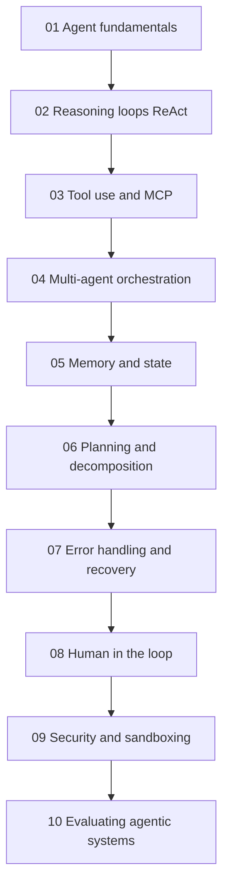
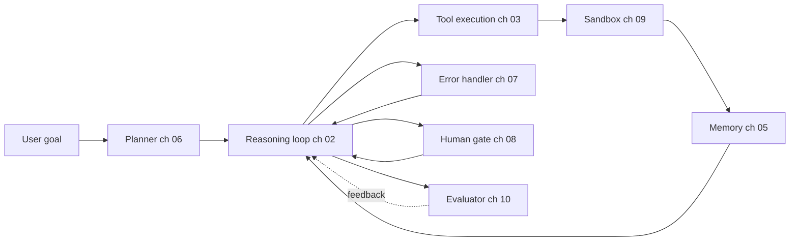

# Agentic Systems

於 2026 年打造生產級 AI agent：reasoning loop、MCP 工具使用、multi-agent 編排、記憶、規劃、錯誤復原、human-in-the-loop 以及評估。

Agent 並非單一技術。它是 reasoning loop、工具層、記憶、planner、錯誤處理器與評估器的組合。本資料夾中的 10 個章節深入探討每一層，並依序編排，使較前面的章節建立起後續章節所使用的詞彙。

## 章節順序

## 參考架構

每個章節的概念對應到已部署 agent 的某一個元件。下圖顯示各章節的內容在生產系統中所處的位置：

## 本資料夾中的檔案

| 檔案 | 內容涵蓋 |
|------|----------------|
| [01-agent-fundamentals.md](01-agent-fundamentals.md) | 是什麼讓一個系統成為「agent」；agent 與 workflow 的區別；何時該選擇哪一種。 |
| [02-reasoning-loops-react-and-beyond.md](02-reasoning-loops-react-and-beyond.md) | ReAct、Plan-and-Execute、Reflexion、Tree-of-Thought；loop 設計模式。 |
| [03-tool-use-and-mcp.md](03-tool-use-and-mcp.md) | Function calling、Model Context Protocol (MCP)、A2A v1.0、MCP 生產環境強化。 |
| [04-multi-agent-orchestration.md](04-multi-agent-orchestration.md) | multi-agent 何時有幫助、何時反而有害；orchestration 與 choreography。 |
| [05-agent-memory-and-state.md](05-agent-memory-and-state.md) | L1-L4 記憶階層（Working、Episodic、Semantic、Procedural）及其取捨。 |
| [06-planning-and-decomposition.md](06-planning-and-decomposition.md) | 任務分解、計畫修訂、long-horizon 規劃。 |
| [07-error-handling-and-recovery.md](07-error-handling-and-recovery.md) | 工具失敗、retry、loop guard、「第 100 次 tool call」問題。 |
| [08-human-in-the-loop-patterns.md](08-human-in-the-loop-patterns.md) | 確認 gate、升級處理、受監督的自主性。 |
| [09-agentic-security-and-sandboxing.md](09-agentic-security-and-sandboxing.md) | 程式碼執行 sandbox、capability gating、agent 中的 prompt injection。 |
| [10-evaluating-agentic-systems.md](10-evaluating-agentic-systems.md) | Trajectory eval、Agent-as-judge、Process Reward Model、agent benchmark。 |

## 配套章節

- [Tool Use and Computer Agents](../17-tool-use-and-computer-agents/) 以 OpenClaw、Computer Use 以及 tool-agent 領域全貌延伸本節內容。
- [LangGraph Orchestration](../09-frameworks-and-tools/02-langgraph-orchestration.md) 是實作本節各種模式時最常見的框架。
- [Agentic RAG](../06-retrieval-systems/08-agentic-rag.md) 是 agent 與檢索的交集。
- [Reliability and Safety](../13-reliability-and-safety/) 將 agent 安全延伸至第 09 章 sandboxing 之外。

## 重點摘要

- Agent 並非單一技術；它是 reasoning loop、工具層、記憶、planner 與評估器的組合。請先閱讀第 01 章。
- MCP 是 2026 年標準的工具互通協定；除非你有充分理由，否則不要自行打造客製化的工具協定。
- Multi-agent 編排（第 04 章）被過度套用；對多數使用情境而言，搭配良好工具的 single-agent 勝過 multi-agent。
- 記憶（第 05 章）與錯誤復原（第 07 章）是大多數生產級 agent 臭蟲的所在；請在這些地方投入評估心力。
- Human-in-the-loop（第 08 章）並非後備方案；請刻意為高風險行動設計 gate。
