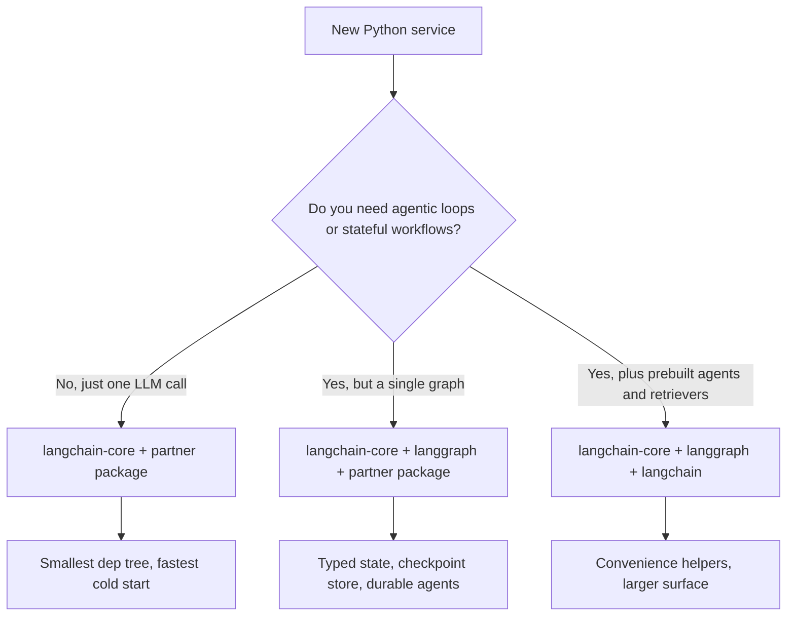

# LangChain 深入解析

LangChain 已經不再只是一個「prompting 函式庫」。它已成熟為一套用於打造正式生產級 LLM 應用的**模組化生態系（Modular Ecosystem）**。LangGraph（已於 2025 年底升級至 v1.0，並成為所有 LangChain agent 的預設 runtime）負責處理具狀態的編排（stateful orchestration）。**LCEL（LangChain Expression Language）**則仍是建構可組合 chain 最快速的方式。

## 目錄

- [LangChain 技術堆疊](#stack)
- [LCEL：以管線（Pipes）進行程式設計](#lcel)
- [標準抽象層（Core）](#core)
- [管理複雜度（Community 與 Partner 套件之比較）](#complexity)
- [LangChain 模組化推進](#langchain-modularity-push)
- [面試問題](#interview-questions)
- [參考資料](#references)

---

## LangChain 技術堆疊

此生態系現在分為三個明確的層級：
1. **LangChain Core**：針對 Prompts、Output Parsers 與 Runnables 的最小化抽象。（極低的相依套件負擔）。
2. **LangChain Community/Partner**：針對 500+ 種資料庫、模型與工具的整合。
3. **LangGraph**：具狀態的編排層（將於下一章介紹）。

---

## LCEL：以管線（Pipes）進行程式設計

LangChain Expression Language（LCEL）使用 `|` 運算子來建立一個執行用的**有向無環圖（Directed Acyclic Graph, DAG）**。

```python
# Standard RAG chain
chain = (
    {"context": retriever, "question": RunnablePassthrough()}
    | prompt
    | model.with_structured_output(Schema) 
)
```

**為什麼要用 LCEL？**
- **預設非同步（Async by Default）**：每一條 chain 都支援 `.ainvoke()` 與 `.astream()`。
- **平行化（Parallelism）**：多個分支會自動平行執行。
- **可觀測性（Observability）**：自動與 **LangSmith** 整合，提供完整 trace 的視覺化。

---

## 標準抽象層

### 1. Runnables
LangChain 中所有東西的「基底類別（Base Class）」。Runnables 為 `.invoke`、`.batch` 與 `.stream` 提供統一的介面。

### 2. Tools 與 Tool-Calling
LangChain 對 **MCP（Model Context Protocol）**提供第一級（first-class）的支援。
- 你可以將任何 MCP server 轉換成 LangChain 的 `BaseTool`。

### 3. Output Parsers
早期系統使用 regex，而現代程式碼則使用 `.with_structured_output()`，它會運用模型原生的 JSON 能力（OpenAI 的 `.json_mode` 或 Anthropic 的 `tools`）。

---

## 管理複雜度

> [!TIP]
> **生產環境最佳實務**：在關鍵路徑（critical paths）中避免使用 `langchain-community`。改用 **Partner 套件**（例如 `langchain-openai`、`langchain-pinecone`）以減少相依地獄（dependency hell）並提升穩定性。

---

## LangChain 模組化推進

到了 2026 年 5 月，此生態系已完成它從單體式（monolithic）的 `langchain` import 遷移至具備乾淨相依邊界的分層結構的漫長過程。這樣的拆分是為了讓團隊能夠精準挑選自己所需的範圍（surface area），而不必把 500+ 種整合一併拖進來。

### 已實際發行的套件分層

| 套件 | 用途 | 直接相依套件 |
|---------|---------|---------------------|
| `langchain-core` | Runnables、prompts、output parsers、tool 抽象 | Pydantic、`tenacity`，幾乎沒有其他東西 |
| `langchain` | 純 Python 的參考 chains、retrievers、agents | `langchain-core` |
| `langgraph` | 具狀態的圖編排、checkpointing、time-travel | `langchain-core` |
| `langchain-openai`、`langchain-anthropic`、`langchain-google-vertexai` 等 | 供應商 partner 套件 | `langchain-core` + 該供應商的 SDK |
| `langchain-community` | 整合的長尾（long tail）（仍保留可用，但已不再建議用於生產路徑） | 很多 |
| `langchain-classic` | 舊版 v0 chains，為遷移而保留 | `langchain-core` |

根據 v1 發行訊息，`langchain-core` 是唯一隨附穩定範圍（stable surface）並提供向後相容保證的套件（[LangChain blog, Building with LangChain 1.0](https://blog.langchain.com/langchain-1-0/)）。

### 跨驗證函式庫的標準 JSON Schema

對應用程式碼而言最重大的單一變更：`with_structured_output()`、`bind_tools()` 與 `@tool` 現在都接受任何相容於 [JSON Schema](https://json-schema.org/) 的物件。這包含：

- **Pydantic v2**（歷史上的預設選項）
- **[Zod 4](https://zod.dev/v4)**：透過 `zod-to-json-schema`，由 JavaScript / TypeScript 版 LangChain 使用
- **[Valibot](https://valibot.dev/)**（函數式、可進行 tree-shaking 的 TS 驗證）
- **[ArkType](https://arktype.io/)**（將 TypeScript 型別作為 runtime schema）
- Python 中的純 dict / TypedDict
- 手寫的 JSON Schema 文件

這些內容記載於 [LangChain v1 結構化輸出指南](https://docs.langchain.com/oss/python/langchain/structured-output) 以及 [JS 結構化輸出指南](https://js.langchain.com/docs/how_to/structured_output)。實際效果是：框架的選擇不再決定驗證器（validator）的選擇，而那些已在 HTTP 層標準化採用 Valibot 或 ArkType 的團隊，可以將那些 schema 重複用於 LangChain 的 tool 定義。

```python
# Python: TypedDict tool schema, no Pydantic in the path
from typing import TypedDict, Annotated
from langchain_anthropic import ChatAnthropic

class CreateInvoice(TypedDict):
    """Create an invoice for a customer."""
    customer_id: Annotated[str, ..., "Stripe customer id"]
    amount_cents: Annotated[int, ..., "Amount in cents, > 0"]

llm = ChatAnthropic(model="claude-opus-4-7")
structured = llm.with_structured_output(CreateInvoice)
```

```typescript
// TypeScript: Valibot schema reused for both HTTP and tool calling
import * as v from "valibot";
import { ChatAnthropic } from "@langchain/anthropic";
import { toJsonSchema } from "@valibot/to-json-schema";

const CreateInvoice = v.object({
  customer_id: v.pipe(v.string(), v.description("Stripe customer id")),
  amount_cents: v.pipe(v.number(), v.minValue(1)),
});

const llm = new ChatAnthropic({ model: "claude-opus-4-7" });
const structured = llm.withStructuredOutput(toJsonSchema(CreateInvoice));
```

### 何時只用 `langchain-core`，何時用完整的 LangChain



2026 年 5 月的建議立場：

- **函式庫 / SDK 程式碼**：只相依於 `langchain-core`。可重用建構區塊（vector stores、chunkers、自訂 tools）的提供者，絕不應將 `langchain` 或 partner 套件作為直接相依拉進來。[LangChain 整合指南](https://docs.langchain.com/oss/python/integrations/providers) 將此描述為對 `langchain-community` 貢獻者的硬性規則。
- **應用服務**：`langchain-core` + 你實際呼叫的 partner 套件 + 若你有多步驟工作流程則加上 `langgraph`。除非你明確使用內建的 retriever 或舊版 chain，否則略過 `langchain`（指的是這個套件，而非這個品牌）。
- **Notebooks 與原型**：為了方便，使用 `langchain` 沒問題。

版本鎖定（version pin）很重要。`langchain-core >= 1.0` 是新程式碼受支援的下限；0.3.x 系列仍會收到關鍵性修補，但依據 [LangChain v1 發行公告](https://blog.langchain.com/langchain-1-0/)，將於 2026 年第三季（Q3 2026）達到 EOL。

### 既有程式碼的遷移注意事項

- `LLMChain`、`RetrievalQA`、`ConversationalRetrievalChain` 與 `AgentExecutor` 位於 `langchain-classic` 中且已凍結（frozen）。替代方案是 LCEL 管線，或更常見地，改用 `langgraph` 圖（[LangChain 遷移指南](https://python.langchain.com/docs/versions/v0_3/)）。
- Tool 裝飾器（decorators）要從 `langchain_core.tools` 匯入，而非 `langchain.tools`。
- 相依於 Pydantic v1 的 output parsers 必須進行移植。`langchain-core` v1.0 已移除 v1 的相容墊片（shim）（[release notes](https://github.com/langchain-ai/langchain/releases/tag/langchain-core%3D%3D1.0.0)）。

---

## 面試問題

### Q：相較於傳統的 Python「Chains」（一連串的函式呼叫），LCEL 的主要優點是什麼？

**有力的回答：**
LCEL 提供**自動串流與平行化（Automatic Streaming and Parallelization）**。在傳統的 Python chain 中，我必須為平行步驟手動處理 `asyncio.gather`，並為串流撰寫自訂的 generators。LCEL 的 `Runnable` 架構會在底層處理好這一切。如果我定義一個 `RunnableParallel` 區塊，LangChain 會同時執行它們。更重要的是，LCEL 透過 `RunnableBranch` 提供**動態路由（Dynamic Routing）**，讓你能夠在不使用深層巢狀 if/else 陳述式的情況下，輕鬆建立複雜邏輯。

### Q：LangChain 常被批評「過於臃腫（too bloated）」。你如何用它架構出精簡的生產系統？

**有力的回答：**
關鍵在於**只匯入 Core**。我使用 `langchain-core` 來取得抽象層，並使用特定的 **Partner 套件**（例如 `langchain-anthropic`）來取得模型。我會避免使用 `langchain-community` 以及那些實質上已被棄用的舊版 `Chain` 類別（例如 `LLMChain` 或 `RetrievalQA`）。我使用 **Runnable** 基本元件來建構我的邏輯，這能讓相依樹保持精簡，並讓執行路徑保持透明。

---

## 參考資料
- LangChain. "The LangChain Expression Language Specification" (2025)
- Anthropic. "Partner Integration Guide for LangChain" (2025)
- Harrison Chase. "The Future of AI Orchestration" (2024 podcast/post)

---

*下一篇：[LangGraph 編排](02-langgraph-orchestration.md)*
