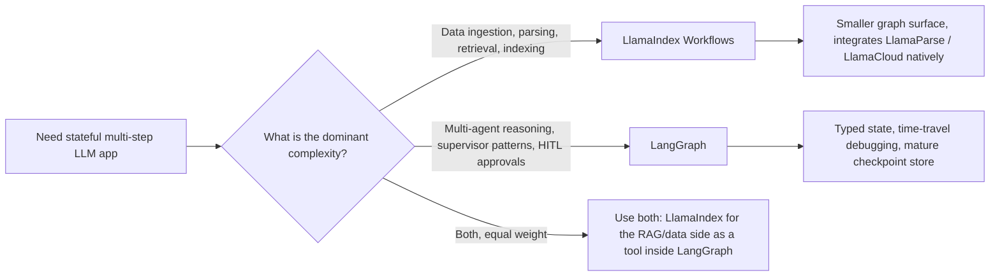

# LlamaIndex

LangChain 著重於「Orchestration（編排）」，而 **LlamaIndex** 則是 **Data-Centric AI（以資料為中心的 AI）** 的大師。它已從一個 RAG 函式庫，演進為一套支援 **Workflows** 與 **Agentic Data Manipulation（代理式資料操作）** 的框架。

## 目錄

- [資料框架哲學](#philosophy)
- [LlamaIndex Workflows](#workflows)
- [進階索引：超越向量搜尋](#indexing)
- [LlamaCloud 與託管式 Ingestion](#llamacloud)
- [Agents as Tools（將代理當作工具）](#agents-as-tools)
- [LlamaIndex Workflows：事件驅動的應用框架](#llamaindex-workflows-event-driven-application-framework)
- [面試題](#interview-questions)
- [參考資料](#references)

---

## 資料框架哲學

LlamaIndex 建立在一個信念之上：**資料比模型更重要**。
- **The Node（節點）**：每一塊資料都是一個「Node」，帶有豐富的 metadata（關聯、摘要，以及父子層級連結）。
- **The Retriever（檢索器）**：LlamaIndex 提供了最多元的一組 retriever（Summary、Knowledge Graph、Tree 與 Keyword）。

---

## LlamaIndex Workflows

在 2024 年末，LlamaIndex 推出了 **Workflows**，作為它對 LangGraph 的回應。
- **Event-Driven Architecture（事件驅動架構）**：各節點透過發出 `Events` 來溝通。
- **Concurrency（並行）**：Workflows 原生支援 async，在大規模平行資料處理上的表現優於線性的 chain。

```python
# Conceptual Workflow
class RAGWorkflow(Workflow):
    @step
    async def ingest(self, ev: StartEvent) -> RetrievalEvent:
        # Custom logic...
        return RetrievalEvent(results=nodes)
```

---

## 進階索引

1. **Property Graphs**：將向量 chunk 連結到圖節點，以供 RAG 使用。
2. **Context-Aware Splitters（情境感知切分器）**：依照「Meaning（語意）」而非「Token count（token 數量）」來分組文字（運用較小型的 LLM 來找出最佳的斷點）。
3. **Dynamic Pathing（動態路徑）**：由 retriever 根據問題的複雜度，決定要查詢*哪一個*索引。

---

## LlamaCloud 與託管式 Ingestion

針對企業規模的需求，LlamaIndex 聚焦於 **LlamaCloud**。
- **Managed Ingestion（託管式 Ingestion）**：以服務的形式處理 PDF parsing、OCR 與表格擷取。
- **Parsing as a Model（將解析視為模型）**：運用 Vision-LLM（Gemini 3.1 Pro、Claude Opus 4.7、GPT-5.5）來「理解」版面配置，而非使用以規則為基礎的 parser。

---

## Agents as Tools（將代理當作工具）

LlamaIndex 將代理視為 **high-level retrievers（高階檢索器）**。
- 你可以將一個複雜的 LlamaIndex query engine「wrap（包裝）」成一個工具，再交給 LangGraph 代理使用。
- **好處**：代理能取得「Smart Data Access（智慧資料存取）」，而無須了解 vector DB 或 Graph schema 的技術細節。

---

## LlamaIndex Workflows：事件驅動的應用框架

2024 年的訴求是「Workflows 就是我們的 LangGraph」。如今的訴求則有所不同：Workflows 是一套通用、事件驅動的框架，適用於任何 AI 應用，而 RAG 只是其中一種可能的用途。`llama-index-core` 的 1.x 版本系列將 Workflows 作為主要的應用層介面，而 index / retriever 類別則移到了圍繞它的整合套件中（[LlamaIndex workflows docs](https://developers.llamaindex.ai/python/framework/understanding/workflows/)）。

### 架構上有哪些改變

| 面向 | Workflows 之前的 LlamaIndex | 以 Workflows 為先的 LlamaIndex |
|-----------|--------------------------|-----------------------------------|
| 主要抽象 | Query engine、chat engine | 帶有 `@step` 方法的 `Workflow` 類別 |
| 控制流程 | 線性；巢狀的 query engine | 各 step 消耗 / 發出帶型別的 `Event` 子類別 |
| 狀態 | 隱含於 engine 實例中 | 明確的 `Context`，帶有可序列化的狀態 |
| 並行 | 透過 async query engine 協作式進行 | 一等公民：發出多個事件、fan out、join |
| 持久化 | 無 | Context 可被 `pickle`，或以 JSON 儲存以供 resume |
| 串流 | 以 engine 為單位 | 從任一 step 呼叫 `ctx.write_event_to_stream()` |
| Human-in-the-loop | 手動 | `InputRequiredEvent` / `HumanResponseEvent` 模式 |

### 事件驅動的心智模型

```python
from llama_index.core.workflow import (
    Workflow, step, Event, StartEvent, StopEvent, Context
)

class RetrievedEvent(Event):
    nodes: list

class JudgedEvent(Event):
    nodes: list
    keep: bool

class GraphRAG(Workflow):
    @step
    async def plan(self, ctx: Context, ev: StartEvent) -> RetrievedEvent:
        await ctx.set("query", ev.query)
        nodes = await self.retriever.aretrieve(ev.query)
        return RetrievedEvent(nodes=nodes)

    @step
    async def judge(self, ctx: Context, ev: RetrievedEvent) -> JudgedEvent:
        keep = await self.relevance_judge(ev.nodes, await ctx.get("query"))
        return JudgedEvent(nodes=ev.nodes, keep=keep)

    @step
    async def answer(self, ctx: Context, ev: JudgedEvent) -> StopEvent:
        if not ev.keep:
            return StopEvent(result="No good evidence found.")
        return StopEvent(result=await self.llm.acomplete(...))
```

這套設計帶來兩個特性：

1. 引擎純粹依據 **event type（事件型別）** 進行 dispatch，因此要新增一個分支，就是新增一個 `Event` 子類別以及一個消耗它的 step。沒有需要修改的中央 router。
2. **並行是由資料驅動的**：一個發出三個 `RetrievedEvent` 的 step,會自動 fan out 三個下游的 `judge` 呼叫,而 join 的 step 則以 `ctx.collect_events` 將它們收集起來。

### Workflows 對比 LangGraph



| 面向 | LlamaIndex Workflows (1.x) | LangGraph (1.x) |
|-----------|----------------------------|-----------------|
| 控制流程基本單元 | Event dispatch（事件 dispatch） | 圖的節點與邊，外加一個帶型別的 reducer 狀態 |
| 狀態模型 | 自由格式的 `Context`（類似 dict） | 帶有 reducer 的 Pydantic / TypedDict 狀態 |
| Resume / time travel | 可 pickle 的 context、基本的 resume | 一等公民的 checkpoint，可從任一節點分支（[LangGraph persistence docs](https://docs.langchain.com/oss/python/langgraph/persistence)） |
| 原生整合 | LlamaParse、LlamaCloud、所有 LlamaHub loader | LangSmith eval、所有 LangChain 整合 |
| 最適合的複雜度 | 資料導向：parse、embed、retrieve、refine | 邏輯導向：plan、act、reflect、delegate |
| 多代理輔助工具 | `AgentWorkflow`、function-calling 代理（[LlamaIndex AgentWorkflow](https://developers.llamaindex.ai/python/framework/understanding/agent/multi_agent/)） | `create_supervisor`、`create_react_agent`、swarm 模式 |
| 串流 UI | `ctx.write_event_to_stream` + AG-UI protocol | `astream_events` v2、AG-UI protocol |

何時你應該選擇 LlamaIndex Workflows 而非 LangGraph：

- 困難之處在於 **data ingestion（資料匯入）**，而非推理。LlamaCloud、LlamaParse 以及 property-graph 堆疊全都是原生的，而非透過 adapter 橋接（[LlamaCloud overview](https://www.llamaindex.ai/llamacloud)）。
- 你想要 **document-driven parallelism（文件驅動的平行處理）**：解析 1000 份 PDF,為每個 chunk fan out 一個 embedding step,再 join 成一次索引更新。
- 你正在 **TypeScript** 生態系中以 `llama-index-ts` 進行開發，並希望取得與 Python core 對等的功能。

何時 LangGraph 勝出：

- 困難之處在於 **agent control loop（代理控制迴圈）** 本身：眾多代理、supervisor 模式、durable interrupt、replay。
- 你需要開箱即用的 **time-travel debugging（時光回溯除錯）**。LlamaIndex 的 resume 適合用於 crash recovery（當機復原），但無法像 LangGraph 的 checkpoint 那樣，從任意歷史狀態進行分支。
- 你已經在使用 LangSmith eval 堆疊,並希望取得 trace 層級的整合而無須橋接。

### 真實世界中的定位

許多資深架構同時運行兩者：以 LlamaIndex Workflows 作為資料層（ingestion、indexing、hybrid retrieval、reranking）並包裝成一個工具，再以 LangGraph 作為其上的代理控制層。這正是 [AIMultiple framework comparison](https://research.aimultiple.com/agentic-ai-frameworks/) 與 LlamaIndex 自家的 [hybrid integration cookbook](https://developers.llamaindex.ai/python/framework/understanding/workflows/) 所點出的模式。

如果你為一個全新的 greenfield 應用只能挑一個，問題便簡化為：**你的團隊會花更多時間在資料管線（data plumbing），還是在代理編排（agent orchestration）上?** 答案就決定了該採用哪個框架。

---

## 面試題

### Q：LangChain 與 LlamaIndex 如今都有「Graph/Workflow」功能。你會如何選擇？

**優秀答案：**
對於 **Data-Intensive（資料密集型）** 任務，也就是主要複雜度落在 ingestion、multimodal parsing 與複雜檢索的情境,我會選擇 **LlamaIndex Workflows**。它的事件驅動架構在大規模平行資料處理上效能更佳。對於 **Logic-Intensive（邏輯密集型）** 的多代理系統,也就是複雜度落在「Reasoning（推理）」與「Human-in-the-loop」邏輯的情境,我會選擇 **LangGraph**。在許多資深架構中,我們會 **兩者並用**:以 LlamaIndex 作為 RAG 引擎,並以 LangGraph 作為整體的代理式 supervisor。

### Q：LlamaIndex 中的「Property Graph」是什麼，為什麼它優於基本的 Vector RAG？

**優秀答案：**
Property Graph 結合了向量的 **Semantic flexibility（語意彈性）** 與資料庫的 **Structural precision（結構精準度）**。在基本的 RAG 中,你或許能找到一個關於「Project Alpha」的 chunk,但你不會知道是誰擁有它。在 Property Graph 中,該向量 chunk 是一個節點,連結到一個 `User` 節點與一個 `Timeline` 節點。這便能做到 **Global Reasoning（全域推理）**（例如「找出 Tom 在上個月撰寫、關於 Project Alpha 的所有文件」）。基本的 RAG 很可能會漏掉許多相關節點,因為它們並未包含確切的關鍵字「Alpha」。

---

## 參考資料
- LlamaIndex. "The Workflows Framework: Event-Driven Agents" (2025)
- Jerry Liu. "Data-Centric AI in the LLM Era" (2024/2025)
- LlamaHub. "The Repository of 1000+ Data Loaders" (2025)

---

*下一篇：[DSPy：為語言模型編程](05-dspy.md)*
