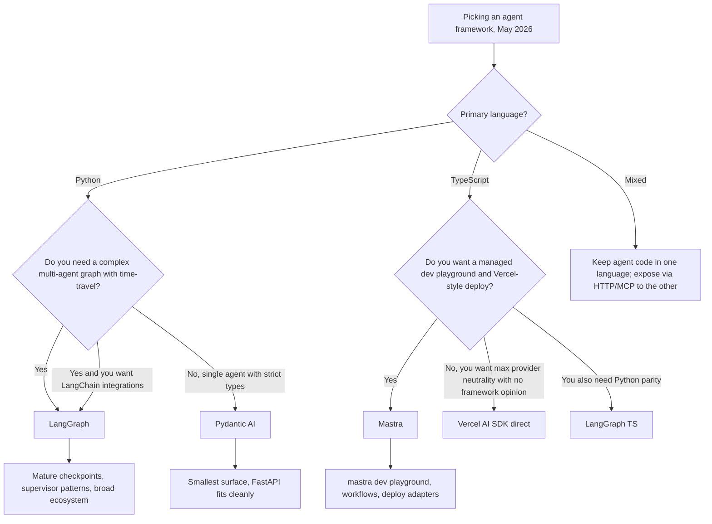

# Pydantic AI 與 Mastra：型別化的 Agent 框架（2026）

到了 2026 年 5 月，關於 agent 框架的論戰已不再是「LangGraph 還是 LlamaIndex」。如今有兩個較新的進場者，在那些重視型別安全更勝於功能廣度的團隊中佔據了可觀的正式環境市佔率：Python 世界裡的 **Pydantic AI**，以及 TypeScript 世界裡的 **Mastra**。兩者都揚棄了舊框架所接受的「字串進、字串出」介面，並且都押注於：一個完全型別化的 agent，會比一個聰明卻無型別的 agent 更容易測試、評估與營運。

## 目錄

- [這些框架是什麼](#what-these-frameworks-are)
- [Pydantic AI：Python 中的型別化 Agent](#pydantic-ai-typed-agents-in-python)
- [Mastra：TypeScript 優先的 Agent](#mastra-typescript-first-agents)
- [與 LangGraph 的比較](#comparison-with-langgraph)
- [如何選擇框架](#choosing-a-framework)
- [正式環境參考案例](#production-references)
- [面試問題](#interview-questions)
- [參考資料](#references)

---

## 這些框架是什麼

Pydantic AI 與 Mastra 都源自於對框架綁定與無型別 prompt 拼接的不滿。它們聚焦於同一組理念：

- agent 迴圈是**由程式碼定義**，而非由 YAML / JSON 圖定義。
- 工具呼叫、結構化輸出，以及 human-in-the-loop 檢查點，全都在**函式簽章層級型別化**。
- provider 可移植性是硬性要求：只要改一行就能把 Anthropic 換成 OpenAI、換成 Google。
- evals、tracing 與部署都是一等公民，而非事後外掛。

兩者的差異主要在於技術堆疊的形狀:一個鎖定的是已經用 Pydantic 做 HTTP 驗證的 Python 服務;另一個鎖定的則是想要 Vercel 風格開發體驗的 Next.js / Node 團隊。

---

## Pydantic AI：Python 中的型別化 Agent

### 現況

[Pydantic AI](https://ai.pydantic.dev/) 在 2025 年 9 月推出了 v1.0，於 2026 年 4 月把 1.x 系列穩定在 **v1.85.1**，並在 **2026 年 5 月 21 日進入 v2.0 beta 週期**（[PyPI 發行歷史](https://pypi.org/project/pydantic-ai/#history)）。這套函式庫是由打造 Pydantic 本身的同一個團隊所開發,他們同時也經營 [Pydantic Logfire](https://pydantic.dev/logfire)。它以 MIT 授權開放原始碼。

主要介面範圍：

- `Agent` 類別,以一個輸出型別與一份型別化工具清單作為參數。
- 針對 Anthropic、OpenAI、Google、Mistral、Groq、Cohere、Ollama,以及任何 OpenAI 相容端點的 provider 轉接器。
- 原生 OpenTelemetry tracing,可匯出至 Logfire 或任何 OTLP collector。
- `pydantic_evals`,用於宣告式 eval 套件,搭配 LLM-judge 與程式碼評分的 scorer。
- 一個 `Graph` API,在單純的 `Agent` 迴圈不夠用時,可用來建立明確的狀態機。

### 團隊為何選它

```python
from pydantic import BaseModel, Field
from pydantic_ai import Agent, RunContext

class RefundDecision(BaseModel):
    approved: bool
    amount_cents: int = Field(ge=0)
    reason: str

agent = Agent(
    "anthropic:claude-opus-4-7",
    output_type=RefundDecision,
    system_prompt="You are a refund analyst. Approve only if policy allows.",
)

@agent.tool
async def lookup_order(ctx: RunContext, order_id: str) -> dict:
    """Look up an order by id."""
    return await ctx.deps.orders.get(order_id)

result = await agent.run("Refund order 1234", deps=DepContainer(orders=db))
assert isinstance(result.output, RefundDecision)
```

有三項特性讓這在正式環境中極具吸引力：

1. **回傳型別會被強制要求。** `result.output` 不是 `RefundDecision`,就是這次呼叫直接失敗。不會出現悄無聲息的字串漂移。
2. **工具是函式,而非 dict。** schema 是在註冊時從 Python 簽章與 docstring 產生的,因此你無法意外地讓「面向 LLM 的 schema」與「實作」彼此漂移。
3. **依賴注入是明確的。** `ctx.deps` 是一個型別化容器,這讓 agent 用 mock 做單元測試變得輕而易舉。

[Pydantic AI evals 文件](https://ai.pydantic.dev/evals/)描述了一種典型迴圈:用於正式環境 schema 的同一個 Pydantic model,同時被當作 LLM 的輸出型別,以及 eval scorer 的 `expected_output`。

### 什麼時候 Pydantic AI 是正確選擇

- 服務是 **Python**,且已經用 Pydantic 做 HTTP 驗證(FastAPI 是最典型的例子)。
- 你想要從頭到尾的**嚴格 schema**:HTTP 邊界、LLM 工具呼叫、LLM 輸出、資料庫列。
- 你想要 **provider 可移植性**,而不必自己撰寫轉接層。
- 你樂於把 agent 迴圈寫成命令式的 Python,而非寫成圖定義。

### 什麼時候不是

- 你想要一個用於多 agent 協調、帶有 supervisor 模式的**宣告式圖**。`Graph` API 雖然存在,但比 LangGraph 更陽春。
- 你想要具備「從任一節點分支」語意的**時光回溯除錯**。
- 你需要 LangChain 整合生態系的廣度(vector store、document loader 等)。

---

## Mastra：TypeScript 優先的 Agent

### 現況

[Mastra](https://mastra.ai/) 由打造 Gatsby 的團隊創立(YC W25 結業),於 2025 年 10 月宣布由 Lightspeed 領投的 **1,300 萬美元種子輪**（[TechCrunch 報導](https://techcrunch.com/2025/10/16/mastra-typescript-agent-framework-seed/)）,並於 **2026 年 1 月推出 v1.0**。到了 2026 年 5 月,其 GitHub 儲存庫已突破 **22.3K 顆星**,每週 npm 下載數達 **30 萬次以上**（[mastra-ai/mastra](https://github.com/mastra-ai/mastra)）。Mastra 以 Elastic License v2 開放原始碼。

主要介面範圍：

- `Agent`、`Workflow` 與 `Tool` 原語,全都以 TypeScript 定義並具備完整型別推斷。
- 內建的**本地端開發伺服器**(`mastra dev`),附帶 playground UI、eval runner 與 trace viewer。
- 與 Vercel 的 **AI SDK** 緊密整合,用於串流、多步驟工具呼叫與 provider 切換。
- 開箱即用的 memory 與 RAG,搭配 `libsql` / `pgvector` 轉接器。
- 一行指令即可部署至 **Mastra Cloud**、Vercel、Cloudflare Workers,或一台 Node 伺服器。

### 團隊為何選它

```typescript
import { Agent } from "@mastra/core/agent";
import { createTool } from "@mastra/core/tools";
import { anthropic } from "@ai-sdk/anthropic";
import { z } from "zod";

const lookupOrder = createTool({
  id: "lookup-order",
  description: "Look up an order by id",
  inputSchema: z.object({ orderId: z.string() }),
  outputSchema: z.object({ status: z.string(), totalCents: z.number() }),
  execute: async ({ context }) => ordersDb.get(context.orderId),
});

export const refundAgent = new Agent({
  name: "refund-agent",
  model: anthropic("claude-opus-4-7"),
  instructions: "You are a refund analyst. Approve only if policy allows.",
  tools: { lookupOrder },
});
```

有三項特性讓這極具吸引力：

1. **從頭到尾推斷出的型別。** 那些 Zod schema 驅動了工具的執行期驗證、面向 LLM 的 JSON Schema,以及 `execute` 內部 `context` 的 TypeScript 型別。單一事實來源。
2. **`mastra dev` 是殺手級功能。** 它會啟動一個本地端 UI,讓你能呼叫任何 agent、重播任何 trace、執行任何 eval,並檢視任何工具的輸入/輸出,完全不必撰寫前端。
3. **一等公民等級的 workflow。** `createWorkflow` 定義出一張由步驟構成的型別化圖(每個步驟是一個 Mastra 工具或 agent),帶有分支、suspend / resume,以及 human-in-the-loop,全都經過型別檢查。

[Generative.inc 的 Mastra 指南](https://generative.inc/blog/mastra-typescript-agent-framework)逐步說明了:當技術堆疊的其餘部分已經是 TypeScript 時,團隊如何用 Mastra 完全取代 Python 協調層。

### 什麼時候 Mastra 是正確選擇

- 團隊是 **TypeScript 優先**,而應用程式的其餘部分是 Next.js / Node / Bun / Cloudflare Workers。
- 你想要 **Vercel 風格的開發體驗**:單一 CLI、本地端 playground、有主見的部署方式。
- 串流 UI 很重要,而你想倚賴 AI SDK 的 `useChat` 與 `streamText` 原語。
- 你想要預設就接上人工核准步驟的 **suspend / resume workflow**。

### 什麼時候不是

- 你需要一個**龐大的預建 agent 庫**或社群整合。相較於 LangChain,這個生態系還很小。
- 你的團隊與大多數 AI 工具都在 **Python**。透過 HTTP 層把 TS 橋接到 Python 服務雖然可行,卻會增加延遲。
- 你需要**學術風格**的自訂 inference 行為(自訂 decoding 等)。請留在 Python。

---

## 與 LangGraph 的比較

| 面向 | Pydantic AI v1.85 | Mastra（2026 年 5 月） | LangGraph 1.x |
|-----------|-------------------|---------------------|----------------|
| 語言 | Python | TypeScript | Python 與 TypeScript |
| 授權 | MIT | Elastic License v2 | MIT |
| 主要單元 | 帶有 `output_type` 的型別化 `Agent` | 型別化的 `Agent` 與 `Workflow` | 以型別化狀態為基礎的節點圖 |
| Schema 來源 | Pydantic v2 | Zod | JSON Schema（Pydantic、Zod、Valibot、ArkType） |
| Provider 中立性 | 內建轉接器 | 透過 Vercel AI SDK | 透過 LangChain partner packages |
| 多 agent | 手動或 `Graph` API | `Workflow` + agent-as-tool | `create_supervisor`、swarm、自訂圖 |
| 狀態持久化 | 手動或 `pydantic_graph` checkpoint | Workflow 快照 + 儲存轉接器 | 一等公民等級的 checkpoint 儲存（Postgres、Redis、SQLite、記憶體內） |
| 時光回溯除錯 | 否 | 在本地端 playground 重播 | 是,可從任一 checkpoint 分支 |
| Eval 框架 | `pydantic_evals` | Mastra evals（內建） | LangSmith 或外部工具 |
| Tracing | OTLP / Logfire | OTLP / Mastra Cloud | LangSmith 或 OTLP |
| 耦合 | 與 LangChain 無耦合 | 與 LangChain 無耦合 | 與 LangChain 生態系緊密耦合 |
| 生態系規模 | 小但持續成長 | 小但持續成長 | 大（LangChain 整合） |



---

## 如何選擇框架

三個決策驅動因素,依權重排序：

1. **既有服務的語言。** Python 服務選 Pydantic AI 與 LangGraph(Python)。TypeScript 服務選 Mastra 與 LangGraph TS。跨越語言邊界幾乎總是比選對陣營更糟的取捨。
2. **複雜度的形狀。** 如果 agent 本質上是「LLM + 幾個工具 + 嚴格輸出型別」,那麼 Pydantic AI 或 Mastra 就足夠了,而且營運成本更低。如果你有許多彼此協作、帶有分支、重試與核准的 agent,那麼 LangGraph 的圖 + checkpoint 模型會勝出。
3. **生態系耦合。** LangGraph 為你換來 LangChain 整合、LangSmith eval,以及那整套介面。Pydantic AI 與 Mastra 為你換來更乾淨的型別保證與更快的冷路徑,但你得自己接上各種整合。

一條有用的經驗法則:如果頁面上最長的東西是工具清單,選 Pydantic AI 或 Mastra。如果頁面上最長的東西是狀態機,選 LangGraph。

---

## 正式環境參考案例

以下是截至 2026 年 5 月,各框架被認真使用的公開參考案例：

- **Pydantic AI**
  - [Pydantic Logfire 儀表板](https://pydantic.dev/logfire)本身就用 Pydantic AI 來實作其內部分流 agent。
  - [Sourcegraph Cody](https://sourcegraph.com/cody) 團隊曾[撰文談及如何使用 Pydantic AI](https://ai.pydantic.dev/),在其伺服器端工作流程中打造型別化的 code-action agent。
  - 許多 FastAPI 取向的公司都採用了它,因為同一個 Pydantic model 同時服務於 HTTP 邊界與 LLM 輸出型別。
- **Mastra**
  - [Stripe](https://stripe.com/) 的開發者體驗原型（[mastra.ai](https://mastra.ai/)）。
  - [Resend](https://resend.com/)、[Liveblocks](https://liveblocks.io/) 與 [Vercel](https://vercel.com/) 的展示應用。
  - 種子輪公告（[TechCrunch](https://techcrunch.com/2025/10/16/mastra-typescript-agent-framework-seed/)）列出了金融科技與開發者工具領域的正式環境使用者。
- **LangGraph**（供參考）
  - [LinkedIn 的 SQL Bot](https://www.linkedin.com/blog/engineering/ai/practical-text-to-sql-for-data-analytics)、[Uber 的程式輔助工具](https://www.uber.com/en-IN/blog/genie-uber-genai-on-call-copilot/)、[Klarna](https://www.klarna.com/)、[Elastic](https://www.elastic.co/) AI Assistant、[Replit](https://replit.com/),以及 [LangChain 客戶頁面](https://www.langchain.com/built-with-langgraph)上的數十個其他案例。

---

## 面試問題

### Q：對於一個 Python 服務,你什麼時候會選 Pydantic AI 而非 LangGraph？

**強力解答：**
當 agent 本質上是一個帶有型別化輸出與幾個工具的 LLM,且服務的其餘部分已經是 Pydantic 形狀(FastAPI、SQLModel 等)時,我會選 Pydantic AI。其好處在於:同一個 Pydantic model 定義了 HTTP 回應、LLM 輸出,以及 eval scorer 的預期形狀,因此不會有 schema 漂移。當我需要一張真正的多 agent 圖,帶有以 checkpoint 為基礎的時光回溯、supervisor 模式,或是 LangChain 整合生態系時,LangGraph 那較重的介面就值得了。我會問的決定性問題是:設計中最複雜的部分,究竟是工具清單還是狀態機。是工具清單,選 Pydantic AI;是狀態機,選 LangGraph。

### Q：Mastra 是 Vercel AI SDK 的替代品嗎？

**強力解答：**
不是。Mastra 是建構在 Vercel AI SDK 之上,用於實際的 provider 呼叫與串流。Mastra 額外加上的是 **agent 抽象**、**workflow 引擎**、**memory**、**RAG**、**evals**,以及 **`mastra dev` playground**。如果你只是需要在 Next.js 應用中以串流與工具呼叫的方式呼叫 LLM,那麼單用 AI SDK 就綽綽有餘。如果你想要一個帶有 workflow、suspend / resume、memory 與本地端 playground 的型別化 agent,那麼 Mastra 就是替你加上這些、又不逼你自己動手寫的那一層。

### Q：「型別化 agent 框架」在正式環境中究竟為你換來了什麼？

**強力解答：**
三件事。第一,**更少不良輸入會漏進來**。面向 LLM 的 schema 是從同一份 Pydantic / Zod 定義衍生而來,而那份定義也驗證執行期 payload,因此若 LLM 幻覺出某個欄位,parse 步驟會在任何下游程式碼執行之前就把它擋下。第二,**乾淨的單元測試**。一個型別化工具不過就是一個帶有 Pydantic / Zod 邊界的函式,所以我可以在迴圈中完全沒有 LLM 的情況下測試它。第三,**理解 schema 的 evals**。eval 框架可以逐欄位地比較兩個型別化物件,而非比對字串差異,這能抓出細微的回歸問題,例如某個欄位變成可選,或某個 enum 多了一個新值。

---

## 參考資料

- Pydantic AI v1.85 發行說明：https://github.com/pydantic/pydantic-ai/releases
- Pydantic AI 文件：https://ai.pydantic.dev/
- Pydantic AI evals：https://ai.pydantic.dev/evals/
- Mastra 儲存庫：https://github.com/mastra-ai/mastra
- Mastra 文件：https://mastra.ai/
- TechCrunch,〈Mastra raises $13M seed for TypeScript agent framework〉（2025 年 10 月）：https://techcrunch.com/2025/10/16/mastra-typescript-agent-framework-seed/
- Generative.inc Mastra 指南：https://generative.inc/blog/mastra-typescript-agent-framework
- LangGraph 1.x 文件：https://docs.langchain.com/oss/python/langgraph/
- LangChain「Built with LangGraph」客戶清單：https://www.langchain.com/built-with-langgraph
- Vercel AI SDK：https://ai-sdk.dev/
- AIMultiple,〈Agentic AI frameworks compared〉（2026）：https://research.aimultiple.com/agentic-ai-frameworks/

---

*下一篇:請參閱[框架選擇指南](08-framework-selection-guide.md),了解跨框架的選擇準則。*
