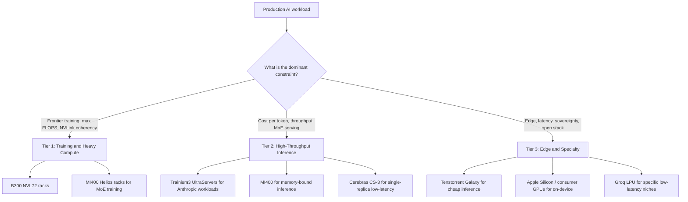

# LLM 基礎設施

打造正式生產環境的 LLM 系統，需要理解各種部署選項、擴展模式以及維運相關考量。本章涵蓋基礎設施層。

## 目錄

- [部署選項](#deployment-options)
- [服務架構](#serving-architecture)
- [擴展模式](#scaling-patterns)
- [成本管理](#cost-management)
- [監控與告警](#monitoring-and-alerting)
- [災難復原](#disaster-recovery)
- [2026 年 5 月 AI 加速器全景](#may-2026-ai-accelerator-landscape)
- [面試問題](#interview-questions)
- [參考資料](#references)

---

## 部署選項

### API 對比自架（Self-Hosted）

| 因素 | API 供應商 | 自架 |
|--------|---------------|-------------|
| 建置時間 | 數分鐘 | 數天到數週 |
| 維運負擔 | 無 | 可觀 |
| 低流量下的成本 | 較低 | 較高（固定成本） |
| 高流量下的成本 | 較高 | 較低（規模經濟） |
| 延遲控制 | 有限 | 完全控制 |
| 資料隱私 | 資料離開你的基礎設施 | 資料留在本地 |
| 模型選擇 | 供應商的模型 | 任何開源模型 |
| 客製化 | 透過 API 進行 fine-tuning | 完全控制 |

### 何時使用 API 供應商

```python
# Decision framework
def should_use_api(requirements: dict) -> bool:
    # Strong signals for API
    if requirements["time_to_market"] == "urgent":
        return True
    if requirements["query_volume"] < 100_000_per_month:
        return True
    if requirements["team_ml_expertise"] == "low":
        return True
    
    # Strong signals for self-hosted
    if requirements["data_residency"] == "strict":
        return False
    if requirements["latency_p99_ms"] < 100:
        return False
    if requirements["query_volume"] > 10_000_000_per_month:
        return False
    
    # Default to API for simplicity
    return True
```

### 自架選項

| 選項 | 複雜度 | 效能 | 使用情境 |
|--------|------------|-------------|----------|
| vLLM | 中等 | 極佳 | 生產環境服務 |
| TGI (HuggingFace) | 中等 | 非常好 | HuggingFace 生態系 |
| TensorRT-LLM | 高 | 最佳（NVIDIA） | 追求最高效能 |
| Ollama | 低 | 良好 | 開發、小規模 |
| llama.cpp | 低 | 良好 | CPU 推論、邊緣裝置 |

---

## 服務架構

### 單一模型服務

```
┌─────────────┐     ┌─────────────┐     ┌─────────────┐
│   Client    │────▶│   Gateway   │────▶│  LLM Server │
└─────────────┘     └─────────────┘     └─────────────┘
                           │
                           ▼
                    ┌─────────────┐
                    │    Cache    │
                    └─────────────┘
```

### 多模型服務

```
                    ┌─────────────────────────────── │
                    │         Load Balancer          │
                    └───────────────┬────────────────┘
                                    │
            ┌───────────────────────┼───────────────────────┐
            │                       │                       │
            ▼                       ▼                       ▼
    ┌───────────────┐       ┌───────────────┐       ┌───────────────┐
    │  GPT-4 Pool   │       │  Claude Pool  │       │ Llama 70B Pool│
    │  (API calls)  │       │  (API calls)  │       │ (self-hosted) │
    └───────────────┘       └───────────────┘       └───────────────┘
```

### 模型路由器模式（Model Router Pattern）

```python
class ModelRouter:
    def __init__(self):
        self.models = {
            "simple": GPT4oMini(),
            "complex": Claude35Sonnet(),
            "code": Claude35Sonnet(),
            "long_context": Gemini15Pro(),
            "vision": GPT4o()
        }
        self.classifier = QueryClassifier()
    
    async def route(self, request: Request) -> Response:
        # Classify request type
        request_type = self.classifier.classify(request)
        
        # Route to appropriate model
        model = self.models[request_type]
        
        # Execute with fallback
        try:
            return await model.generate(request)
        except RateLimitError:
            return await self.fallback(request, request_type)
    
    async def fallback(self, request: Request, original_type: str) -> Response:
        # Define fallback order
        fallbacks = {
            "simple": ["complex", "long_context"],
            "complex": ["simple"],
            "code": ["complex"]
        }
        
        for fallback_type in fallbacks.get(original_type, []):
            try:
                return await self.models[fallback_type].generate(request)
            except Exception:
                continue
        
        raise ServiceUnavailableError("All models unavailable")
```

---

## 擴展模式

### 水平擴展（Horizontal Scaling）

```python
# Kubernetes HPA config for LLM service
hpa_config = """
apiVersion: autoscaling/v2
kind: HorizontalPodAutoscaler
metadata:
  name: llm-service-hpa
spec:
  scaleTargetRef:
    apiVersion: apps/v1
    kind: Deployment
    name: llm-service
  minReplicas: 2
  maxReplicas: 20
  metrics:
  - type: Resource
    resource:
      name: cpu
      target:
        type: Utilization
        averageUtilization: 70
  - type: Pods
    pods:
      metric:
        name: requests_per_second
      target:
        type: AverageValue
        averageValue: 100
"""
```

### 自架環境的 GPU 擴展

| 規模 | GPU | 建議配置 |
|-------|------|-----------------|
| 開發/測試 | 1 | 單張 A10G 或 L4 |
| 小型生產 | 2-4 | 2 張 A100 搭配 tensor parallel |
| 中型生產 | 4-8 | 4 張 H100 搭配 tensor parallel |
| 大型生產 | 8+ | 多節點搭配 pipeline parallel |

### 佇列式架構（Queue-Based Architecture）

適用於高吞吐的非同步工作負載：

```
┌─────────────┐     ┌─────────────┐     ┌─────────────┐
│  Producers  │────▶│    Queue    │────▶│  Consumers  │
└─────────────┘     │  (Redis/    │     │  (LLM       │
                    │   SQS)      │     │   Workers)  │
                    └─────────────┘     └─────────────┘
                                               │
                                               ▼
                                        ┌─────────────┐
                                        │  Results    │
                                        │  Store      │
                                        └─────────────┘
```

```python
class AsyncLLMProcessor:
    def __init__(self):
        self.queue = RedisQueue("llm_requests")
        self.results = RedisResults("llm_results")
    
    async def submit(self, request: Request) -> str:
        request_id = generate_id()
        await self.queue.enqueue({
            "id": request_id,
            "request": request.to_dict()
        })
        return request_id
    
    async def get_result(self, request_id: str, timeout: int = 300) -> Response:
        return await self.results.wait_for(request_id, timeout)
    
    # Worker process
    async def worker_loop(self):
        while True:
            job = await self.queue.dequeue()
            try:
                result = await self.llm.generate(job["request"])
                await self.results.store(job["id"], result)
            except Exception as e:
                await self.results.store_error(job["id"], str(e))
```

---

## 成本管理

### 成本追蹤

```python
class CostTracker:
    # Pricing as of December 2025 (verify current rates)
    PRICING = {
        "gpt-4o": {"input": 2.50, "output": 10.00},  # per 1M tokens
        "gpt-4o-mini": {"input": 0.15, "output": 0.60},
        "claude-3.5-sonnet": {"input": 3.00, "output": 15.00},
        "claude-3.5-haiku": {"input": 0.25, "output": 1.25},
    }
    
    def calculate_cost(
        self,
        model: str,
        input_tokens: int,
        output_tokens: int
    ) -> float:
        pricing = self.PRICING[model]
        input_cost = (input_tokens / 1_000_000) * pricing["input"]
        output_cost = (output_tokens / 1_000_000) * pricing["output"]
        return input_cost + output_cost
    
    def track(self, request_id: str, model: str, tokens: dict):
        cost = self.calculate_cost(
            model,
            tokens["input"],
            tokens["output"]
        )
        
        self.metrics.record(
            "llm_cost",
            cost,
            tags={"model": model, "request_id": request_id}
        )
        
        return cost
```

### 成本最佳化策略

| 策略 | 節省 | 實作方式 |
|----------|---------|----------------|
| 模型路由 | 50-80% | 將簡單查詢導向便宜的模型 |
| 快取 | 30-70% | 快取頻繁出現的查詢 |
| Prompt 最佳化 | 10-30% | 更短的 prompt、結構化輸出 |
| Batch API | 50% | 對非同步工作使用 batch 端點 |
| 自架 | 視情況而定 | 在規模化時可能更便宜 |

### 預算告警

```python
class BudgetManager:
    def __init__(self, daily_budget: float, alert_threshold: float = 0.8):
        self.daily_budget = daily_budget
        self.alert_threshold = alert_threshold
    
    async def check_and_alert(self):
        today_cost = await self.get_today_cost()
        utilization = today_cost / self.daily_budget
        
        if utilization >= 1.0:
            await self.alert("CRITICAL: Daily budget exceeded", today_cost)
            # Consider enabling cost controls
            await self.enable_rate_limiting()
        elif utilization >= self.alert_threshold:
            await self.alert("WARNING: Approaching daily budget", today_cost)
    
    async def enable_rate_limiting(self):
        # Reduce throughput to stay within budget
        self.rate_limiter.set_rate(
            requests_per_minute=self.calculate_safe_rate()
        )
```

---

## 監控與告警

### 關鍵指標

```python
LLM_METRICS = {
    # Latency
    "ttft_seconds": "Time to first token",
    "total_latency_seconds": "Total request time",
    
    # Throughput
    "requests_per_second": "Request rate",
    "tokens_per_second": "Token generation rate",
    
    # Resources
    "gpu_utilization": "GPU compute usage",
    "gpu_memory_utilization": "GPU memory usage",
    "kv_cache_utilization": "KV cache usage",
    
    # Quality (sampled)
    "quality_score": "LLM-as-judge score",
    "faithfulness_score": "RAG faithfulness",
    
    # Errors
    "error_rate": "Failed requests percentage",
    "rate_limit_hits": "Rate limit rejections",
    
    # Cost
    "cost_per_request": "Average cost per request",
    "daily_cost": "Total daily spend"
}
```

### 告警設定

```yaml
alerts:
  - name: high_error_rate
    condition: error_rate > 0.05
    for: 5m
    severity: critical
    
  - name: high_latency
    condition: p99_latency > 10s
    for: 5m
    severity: warning
    
  - name: cost_spike
    condition: hourly_cost > 2 * avg_hourly_cost
    for: 1h
    severity: warning
    
  - name: quality_degradation
    condition: avg_quality_score < 3.5
    for: 30m
    severity: warning
    
  - name: gpu_memory_pressure
    condition: gpu_memory_utilization > 0.95
    for: 5m
    severity: warning
```

---

## 災難復原

### 多供應商容錯切換（Multi-Provider Failover）

```python
class MultiProviderClient:
    def __init__(self):
        self.providers = [
            OpenAIClient(),
            AnthropicClient(),
            GoogleClient()
        ]
        self.primary = 0
    
    async def generate(self, request: Request) -> Response:
        # Try primary provider first
        try:
            return await self.providers[self.primary].generate(request)
        except (RateLimitError, ServiceError) as e:
            return await self.failover(request, e)
    
    async def failover(self, request: Request, original_error: Exception) -> Response:
        for i, provider in enumerate(self.providers):
            if i == self.primary:
                continue
            try:
                response = await provider.generate(request)
                # Log failover for monitoring
                self.log_failover(self.primary, i, original_error)
                return response
            except Exception:
                continue
        
        raise AllProvidersUnavailable("All LLM providers failed")
```

### 優雅降級（Graceful Degradation）

```python
class GracefulDegradation:
    def __init__(self):
        self.cache = ResponseCache()
        self.fallback_responses = FallbackResponses()
    
    async def handle_outage(self, request: Request) -> Response:
        # Level 1: Try cache
        cached = await self.cache.get_similar(request.query)
        if cached and cached.similarity > 0.9:
            return Response(
                content=cached.response,
                metadata={"source": "cache", "degraded": True}
            )
        
        # Level 2: Try fallback responses
        fallback = self.fallback_responses.get(request.intent)
        if fallback:
            return Response(
                content=fallback,
                metadata={"source": "fallback", "degraded": True}
            )
        
        # Level 3: Graceful error
        return Response(
            content="I am currently experiencing issues. Please try again later or contact support.",
            metadata={"source": "error", "degraded": True}
        )
```

---

## 2026 年 5 月 AI 加速器全景

在 AI 大規模建置的過程中，硬體版圖在 2026 年 1 月到 5 月之間的變動速度，比過去任何時刻都更快。各項產能宣告加總起來達到**超過一兆美元的承諾雲端支出**，而供應鏈也不再是單一供應商。本節是一位資深架構師在 2026 年 5 月進行產能規劃對話時，應該隨身帶著的快照。

### NVIDIA Blackwell Ultra (B300 / GB300 NVL72)

旗艦產品是 **B300**（「Blackwell Ultra」），自 2026 年 1 月起已量產出貨（[NVIDIA newsroom announcement](https://nvidianews.nvidia.com/news/nvidia-blackwell-ultra-ai-factory-platform-paves-way-for-age-of-ai-reasoning)）。

| 規格 | B300 / GB300 NVL72 |
|------|---------------------|
| 每張 GPU 的 HBM3e | 288 GB |
| 峰值 FP4（sparse） | ~15 PFLOPS |
| Form factor | NVL72 機架：72 張 Blackwell Ultra GPU + 36 顆 Grace CPU |
| NVL72 中的 NVLink 總頻寬 | ~130 TB/s |
| 每座 NVL72 的 HBM 總量 | ~20 TB |
| 2026 年預計出貨機架數 | ~60,000（Jensen Huang，GTC 2026 keynote） |

策略上的訴求是「AI factories」：NVL72 被當成一個一致性、NVLink-domain 推論／訓練單元的最小單位來販售，而非以個別卡片計。對於前沿模型訓練（Anthropic、OpenAI、Google 的對外工作）以及最大型的推理模型推論工作負載而言，在 2026 年 5 月這仍是預設選項。

權衡取捨依舊不變：最高的絕對效能、最高的絕對價格、最深的軟體鎖定。CUDA、NCCL 與 TensorRT-LLM 全都預設使用 NVIDIA。如果你圍繞它們做架構設計，就等於已經做出了承諾。

### AMD MI400 與 Helios 機架

[AMD 的 MI400](https://ir.amd.com/news-events/press-releases/detail/1252/amd-introduces-fifth-generation-instinct-mi400-series)（2025 年第 4 季宣告、2026 年第 1 季送樣、2026 年年中 GA）是可信的第二來源。

| 規格 | MI400 |
|------|-------|
| 記憶體 | HBM4，每張 GPU **432 GB** |
| 記憶體頻寬 | ~20 TB/s |
| 峰值 FP4 | ~13 PFLOPS |
| 機架方案 | **Helios**：EPYC Venice CPU、MI400 GPU、Pensando Vulcano 800Gb NIC |
| 軟體 | ROCm 7.x，對 PyTorch / vLLM / SGLang 提供一流支援 |

每張 GPU 432 GB 是最大亮點：它比 B300 的 288 GB 高出超過 50%。對於 MoE 服務（限制因素在於讓 expert 權重常駐記憶體）以及 KV-cache 吃重的長上下文工作負載而言，這項每 GPU 記憶體優勢是實打實的。AMD 也已經補上了大部分的軟體差距；ROCm 7.x 不再像 2023 年那樣是個淘汰條件。開源服務框架現在常態性地在兩種硬體上進行測試。

但有個隱憂：**生產部署的成熟度**。NVIDIA 已連續兩個世代向每一家超大規模雲端業者大規模出貨；AMD 在供應鏈的量產面仍在爬坡。超大規模雲端業者（Meta、Microsoft、Oracle Cloud，特別是用於非 Trainium 工作負載的 AWS Trainium 機隊）正在運行混合機隊。

### AWS Trainium3 與 Anthropic 的千億美元以上交易

2025 年 11 月，Anthropic 與 AWS 宣告擴展至**高達 5 gigawatt** 的運算產能，期程橫跨整個 2026 年，以 Trainium 晶片為核心，並被描述為一筆 **「$100B+」的交易**（[AWS news release](https://press.aboutamazon.com/2025/11/anthropic-and-aws-announce-100-billion-strategic-partnership-investment-to-expand-trainium-compute-and-collaborate-on-ai-frontier-research)）。

關鍵數字：

| 規格 | Trainium3 |
|------|-----------|
| 製程節點 | 3nm |
| 配置 | **Trn3 UltraServer**，每套系統 **144 顆晶片** |
| 相對 T2 的峰值效能 | 在目標工作負載中 **~4.4x** |
| 記憶體 | HBM3e |
| 網路 | UltraServer 內以 NeuronLink 連接；叢集間以 EFA 連接 |

策略上的意涵：AWS 現在握有一套可信的垂直整合 AI fabric（Trainium 矽晶 + Annapurna 網路 + EC2 + Bedrock）。對於在 Anthropic 模型上以推論為主的工作負載而言，其性價比在 H200 等級硬體上已能與 NVIDIA 競爭，並在朝向 2026 年底達到 B300 對等的方向持續改善。

限制條件：Trainium 運行的是 **AWS Neuron SDK**，而非 CUDA。移植一套技術堆疊意味著要重建 kernel、重新測試數值、並重新調校批次處理。在規模化時值得，在小規模時則痛苦。

### Cerebras IPO（2026 年 5 月）

Cerebras 於 **2026 年 5 月 14 日**以 **每股 $185** 定價 IPO，募得約 **$5.55B**，開盤站上 $190 以上，首日收盤接近 **約 $100B** 的估值（[CNBC coverage](https://www.cnbc.com/2026/05/14/cerebras-ipo-priced.html)；[The Register](https://www.theregister.com/2026/05/15/cerebras_ipo/)）。

它讓市場產生了哪些變化：

- **AWS 與 Cerebras 結盟**以提供高吞吐推論（[AWS / Cerebras blog post](https://aws.amazon.com/blogs/machine-learning/cerebras-on-aws/)）。其訴求是：以 Trainium3 服務 Anthropic 及其他自家工作負載，以 Cerebras 服務超低延遲的 Llama／OSS 工作負載。
- CS-3 wafer-scale engine 仍是在 <50ms TTFT 下進行 **70B+ 模型的單晶片、單副本推論** 的唯一可信選項。
- Cerebras Cloud API 已被一些主要技術堆疊以 GPU 為基礎、又想在不進行移植的情況下取得延遲優勢的團隊，當成快速的第二來源使用。

這次 IPO 在結構上很重要，因為它改變了融資的論述：現在出現了一條讓非 NVIDIA 推論供應商進入公開市場的途徑，這讓下一批進場者募資的成本更低。

### Tenstorrent Galaxy Blackhole

[Tenstorrent 的 Galaxy](https://tenstorrent.com/hardware/galaxy) 於 **2026 年 4 月 28 日** 達到一般可用（[The Register](https://www.theregister.com/2026/04/28/tenstorrent_galaxy_ga/)；[EE Times](https://www.eetimes.com/tenstorrent-launches-blackhole-galaxy/)）。

| 規格 | Galaxy Blackhole |
|------|------------------|
| 每台伺服器 | **32 顆 Blackhole 晶片** |
| 每顆晶片 | RISC-V 核心、Tensix tiles、無外部記憶體階層 |
| 峰值 BlockFP8 | 每台伺服器 **~23 PFLOPS** |
| 記憶體 | LPDDR4X（晶片旁掛）+ on-chip SRAM |
| 牌價 | 每台 32 晶片伺服器 **~$110,000** |
| 架構 | 完全開放的 RISC-V 控制平面、開放韌體、開放編譯器 |

開源 RISC-V 這個故事對兩類受眾很重要：

- **超大規模雲端業者與主權雲（sovereign clouds）**，他們想要一套非 CUDA 的技術堆疊，並對韌體與工具鏈具有完整可見度。
- **研究實驗室**在打造自訂 kernel 時，因 CUDA 的封閉部分而撞牆。

以每台伺服器 $110K 計，對於某些工作負載而言，Galaxy 大約比同等級的 NVIDIA 推論機架便宜一個數量級。它不是前沿訓練的競爭者。它是在性價比論述具壓倒性優勢之處，做為推論與小型 fine-tuning 的競爭者。

### Stargate 與雲端承諾的規模

產能的故事不再只關乎晶片；它也關乎晶片周圍的建築物。

- **Stargate**（OpenAI／Oracle／SoftBank 合資企業）在整個計畫中已承諾約 **1.4 兆美元的雲端總支出**（[OpenAI announcement page](https://openai.com/index/stargate-update/)）。
- 位於 **德州 Abilene** 的旗艦廠區，在 2026 年第 1 季已以 **1.2 GW** 上線，並有橫跨 **七個已宣告廠區**、合計約 **7 GW** 規劃產能的多 gigawatt 級擴建正在施工中。
- 根據公開申報與宣告（Oracle 2026 財年第 3 季財報、[SoftBank investor materials](https://group.softbank/en/ir)），已有超過 **$400B** 投入或簽約於這個版圖。

對資深工程師的架構意涵：前沿模型供應商的推論邊際成本，下降的速度比公開 API 定價所暗示的更快。在 2026 年，Spot 產能、離峰推論批次處理以及多區域容錯切換都更容易實現，因為底層的建築物已經存在。

### 三層機隊策略



| 層級 | 服務的對象 | 預設硬體 | 原因 |
|------|----------------|-------------------|-----|
| **Tier 1：訓練與重度運算** | 前沿模型訓練、推理吃重的推論、數兆參數的 MoE | **B300 NVL72**、**MI400 Helios** | 需要 NVLink 等級的一致性，以及可取得的最大 HBM 池 |
| **Tier 2：高吞吐推論** | API 產品、RAG 後端、agent 平台 | **Trainium3**、**MI400**、**Cerebras CS-3**、**B300** | 為每 token 成本與可預測的 P99 進行最佳化，通常需具備 MoE 意識 |
| **Tier 3：邊緣與特殊用途** | 延遲關鍵、主權需求、強制開源韌體、總支出低 | **Tenstorrent Galaxy**、**Apple Silicon**、消費級 GPU、**Groq LPU** | 性價比、開放堆疊、法規在地性 |

在 2026 年最關鍵的框架是：**沒有任何一位資深架構師會再圍繞單一供應商來設計一個正經的 AI 產品**。產能太過搶手、價格變動太快，而且在單一供應商的技術堆疊內，故障模式的相關性太高。多供應商已成為新的預設。

### 產能規劃的重點外帶

- 規劃時要把**每個加速器的記憶體**看得和 FLOPS 一樣重要。MoE 服務的瓶頸在於 expert 的常駐。
- 把 **CUDA 鎖定視為實質成本**。對大多數生產服務而言，ROCm 7.x 已經夠好。對 Anthropic、以及任何願意投入移植工作的團隊而言，Neuron 已經夠好。對成本敏感的推論而言，開放的 RISC-V 已經夠好。
- 如今超大規模雲端業者的選擇，與晶片選擇之間的驅動關係已經雙向對等。AWS = Trainium + Cerebras + 一些 NVIDIA。Microsoft = NVIDIA + Maia。Google = TPU + 一些 NVIDIA。Oracle = 大規模 NVIDIA。
- **$/token** 在 2025 年與 2026 年間大約以每年 3-5x 的速度下降（[a16z State of AI Compute](https://a16z.com/state-of-ai-compute-2026/)）。以 2024 年價格簽訂的長期合約，現在通常比 spot 更不划算。

---

## 面試問題

### Q：你會如何為每天 100 萬次 LLM 查詢設計基礎設施？

**優秀的回答：**

「每天 100 萬次查詢，平均約為每秒 12 次查詢，尖峰可能高出 3-5 倍。以下是我的做法：

**架構：**
- 負載平衡器在多個 API 端點之間分配流量
- 模型路由器用於成本最佳化（將簡單查詢導向較便宜的模型）
- Redis 快取用於頻繁出現的查詢
- 佇列式處理用於非同步工作負載

**在這個規模下，成本最佳化至關重要：**
- 將 60-70% 的簡單查詢導向 GPT-4o-mini 或 Claude Haiku
- 實作語意快取（semantic caching，目標快取命中率 30%+）
- 對非緊急請求使用 batch API（5 折折扣）
- 在這個流量下，自架開始具備成本競爭力

**可靠性：**
- 多供應商配置搭配自動容錯切換
- 針對每位使用者進行 rate limiting 以防止濫用
- 佇列式架構以因應尖峰
- 在供應商不可用時優雅降級

**監控：**
- 即時成本追蹤搭配預算告警
- 延遲百分位數（p50、p95、p99）
- 持續抽樣的品質指標
- 錯誤率與 rate-limit 命中追蹤

以 100 萬次查詢、平均每次 2K tokens 計算，使用 GPT-4o 大約要花 $25K／天。透過路由與快取，我可以把它降到 $5-8K／天。」

### Q：你會在什麼時候選擇自架，而不是使用 API 供應商？

**優秀的回答：**

「我的決策框架會考量幾個因素：

**在以下情況使用 API 供應商：**
- 流量低於每月 100 萬次查詢（成本交叉點）
- 上市時間至關重要
- 團隊缺乏 GPU 基礎設施的專業能力
- 你想立刻用上最新的模型
- 工作負載變動大且難以預測

**在以下情況自架：**
- 資料不能離開你的基礎設施（合規、安全）
- 流量超過每月 1,000 萬次查詢（可觀的節省）
- 你需要 P99 低於 100ms 的延遲
- 你需要自訂模型權重或 fine-tuning
- 你想對模型行為有完全的控制

**混合做法通常效果最好：**
- 對高流量、可預測的工作負載採用自架
- 對尖峰與特殊模型使用 API
- 以 API 做為自架失敗時的後備

自架的隱藏成本：GPU 採購／租用、維運的工程人力、模型更新、監控基礎設施。請至少把 1-2 位專責的基礎設施工程師納入考量。」

---

## 參考資料

- vLLM: https://docs.vllm.ai/
- TensorRT-LLM: https://github.com/NVIDIA/TensorRT-LLM
- Text Generation Inference: https://huggingface.co/docs/text-generation-inference
- OpenAI Pricing: https://openai.com/pricing
- Anthropic Pricing: https://www.anthropic.com/pricing

---

*下一篇：[LLM 應用的 CI/CD](02-cicd.md)*
