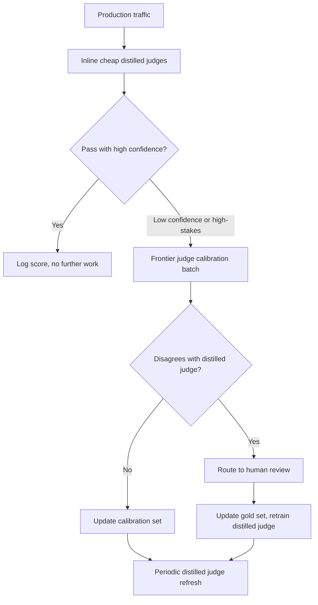

# LLM 評估

評估 LLM 系統與傳統 ML 有著本質上的不同。本章涵蓋在生產環境中衡量品質的指標、方法論與實務做法。

## 目錄

- [為何 LLM 評估如此困難](#why-llm-evaluation-is-hard)
- [評估維度](#evaluation-dimensions)
- [自動化評估方法](#automated-evaluation-methods)
- [LLM-as-Judge](#llm-as-judge)
- [人工評估](#human-evaluation)
- [RAG 專屬評估](#rag-specific-evaluation)
- [建構評估管線](#building-evaluation-pipelines)
- [生產環境監控](#production-monitoring)
- [2026 評估演進：超越 LLM-as-Judge](#2026-eval-evolution-beyond-llm-as-judge)
- [面試問題](#interview-questions)
- [參考資料](#references)

---

## 為何 LLM 評估如此困難

### 根本性的挑戰

傳統 ML 有明確的指標（accuracy、F1、AUC）。而 LLM 的輸出是開放式的文字，「正確」是主觀的。

| 傳統 ML | LLM 系統 |
|----------------|-------------|
| 單一正確答案 | 多種有效回應 |
| 客觀指標 | 主觀品質 |
| 易於自動化 | 需要判斷 |
| 靜態測試集 | 需要多樣化的情境 |

### 多重品質維度

一則回應可能是：
- 正確但寫得不好
- 寫得好但不完整
- 完整但不相關
- 相關但不安全

你需要獨立衡量多個維度。

---

## 評估維度

### 核心維度

| 維度 | 衡量什麼 | 如何評估 |
|-----------|------------------|-----------------|
| **正確性（Correctness）** | 事實是否準確？ | Ground truth、LLM judge |
| **相關性（Relevance）** | 是否回答了問題？ | LLM judge、人工 |
| **完整性（Completeness）** | 是否涵蓋所有面向？ | 檢查清單、LLM judge |
| **連貫性（Coherence）** | 結構是否良好、邏輯是否合理？ | LLM judge、人工 |
| **簡潔性（Conciseness）** | 篇幅是否適當精簡？ | Token 數量、LLM judge |
| **安全性（Safety）** | 是否無有害內容？ | Classifiers、LLM judge |
| **有用性（Helpfulness）** | 是否真的有用？ | 人工回饋 |

### 任務專屬維度

**對於 RAG：**
- Faithfulness：是否立基於檢索到的 context？
- Attribution：是否正確引用？
- 無 hallucination：是否沒有任何捏造內容？

**對於程式碼生成：**
- Executability：是否能執行？
- Correctness：是否通過測試？
- Style：是否遵循慣例？

**對於摘要：**
- Coverage：是否納入關鍵重點？
- Factual consistency：是否未引入錯誤？
- Compression：篇幅縮減是否適當？

---

## 自動化評估方法

### Exact Match（完全比對）

最簡單的做法，但單獨使用時鮮少足夠：

```python
def exact_match(prediction: str, reference: str) -> float:
    return float(prediction.strip().lower() == reference.strip().lower())
```

**適用於：** 選擇題、分類、實體擷取

### Contains Keywords（包含關鍵字）

```python
def keyword_match(prediction: str, required_keywords: list[str]) -> float:
    prediction_lower = prediction.lower()
    matches = sum(1 for kw in required_keywords if kw.lower() in prediction_lower)
    return matches / len(required_keywords)
```

**適用於：** 檢查是否提及特定事實

### Semantic Similarity（語意相似度）

```python
def semantic_similarity(prediction: str, reference: str) -> float:
    pred_embedding = embed(prediction)
    ref_embedding = embed(reference)
    return cosine_similarity(pred_embedding, ref_embedding)
```

**適用於：** 改寫偵測、一般相似度比對
**限制：** 高相似度並不代表正確

### ROUGE（摘要）

衡量 n-gram 重疊程度：

```python
from rouge_score import rouge_scorer

scorer = rouge_scorer.RougeScorer(['rouge1', 'rouge2', 'rougeL'])

def evaluate_summary(prediction: str, reference: str) -> dict:
    scores = scorer.score(reference, prediction)
    return {
        "rouge1": scores["rouge1"].fmeasure,
        "rouge2": scores["rouge2"].fmeasure,
        "rougeL": scores["rougeL"].fmeasure
    }
```

**限制：** 衡量的是重疊程度，而非品質

### Code Execution（程式碼執行）

對於程式碼生成而言，執行結果即是 ground truth：

```python
def evaluate_code(prediction: str, test_cases: list[dict]) -> dict:
    try:
        exec(prediction, globals())
    except SyntaxError as e:
        return {"syntax_valid": False, "error": str(e)}
    
    passed = 0
    for test in test_cases:
        try:
            result = eval(test["call"])
            if result == test["expected"]:
                passed += 1
        except Exception:
            pass
    
    return {
        "syntax_valid": True,
        "tests_passed": passed,
        "tests_total": len(test_cases),
        "pass_rate": passed / len(test_cases)
    }
```

---

## LLM-as-Judge

使用一個 LLM 來評估另一個 LLM 的輸出。

### 基本的 Judge Prompt

```python
JUDGE_PROMPT = """
Evaluate the following response to the user's question.

Question: {question}
Response: {response}
Reference Answer (if available): {reference}

Rate the response on these criteria (1-5 scale):

1. Correctness: Is the information accurate?
2. Relevance: Does it address the question?
3. Completeness: Are all aspects covered?
4. Clarity: Is it well-written and clear?

For each criterion, provide:
- Score (1-5)
- Brief justification

Output as JSON:
{
    "correctness": {"score": X, "reason": "..."},
    "relevance": {"score": X, "reason": "..."},
    "completeness": {"score": X, "reason": "..."},
    "clarity": {"score": X, "reason": "..."},
    "overall": X
}
"""

def llm_judge(question: str, response: str, reference: str = None) -> dict:
    prompt = JUDGE_PROMPT.format(
        question=question,
        response=response,
        reference=reference or "Not provided"
    )
    
    result = judge_model.generate(prompt)
    return json.loads(result)
```

### Pairwise Comparison（成對比較）

直接比較兩則回應：

```python
PAIRWISE_PROMPT = """
Compare these two responses to the question and determine which is better.

Question: {question}

Response A:
{response_a}

Response B:
{response_b}

Which response is better? Consider:
- Correctness
- Helpfulness
- Clarity
- Completeness

Output your choice (A or B) and explain why.

Choice:
"""

def pairwise_judge(question: str, response_a: str, response_b: str) -> dict:
    prompt = PAIRWISE_PROMPT.format(
        question=question,
        response_a=response_a,
        response_b=response_b
    )
    
    result = judge_model.generate(prompt)
    choice = "A" if "A" in result[:10] else "B"
    
    return {"winner": choice, "explanation": result}
```

### Judge Calibration（評審校準）

LLM judge 帶有偏誤：

| 偏誤 | 說明 | 緩解方式 |
|------|-------------|------------|
| Position bias | 偏好第一個或最後一個選項 | 隨機化順序 |
| Length bias | 偏好較長的回應 | 指示其忽略長度 |
| Self-preference | 偏好自家模型的輸出 | 使用不同的 judge model |
| Format bias | 偏好特定格式 | 多樣化的訓練範例 |

```python
def calibrated_pairwise_judge(question: str, response_a: str, response_b: str) -> dict:
    # Run twice with swapped positions
    result1 = pairwise_judge(question, response_a, response_b)
    result2 = pairwise_judge(question, response_b, response_a)
    
    # Check consistency
    result2_adjusted = "A" if result2["winner"] == "B" else "B"
    
    if result1["winner"] == result2_adjusted:
        return {"winner": result1["winner"], "confidence": "high"}
    else:
        return {"winner": "tie", "confidence": "low"}
```

---

## 人工評估

### 何時使用人工評估

| 使用情境 | 自動化？ | 人工？ |
|----------|-----------|--------|
| 快速迭代 | 是 | 抽查 |
| 最終品質評估 | 輔助 | 是 |
| 主觀品質 | 否 | 是 |
| 安全性評估 | Classifier | 審查 |
| 邊界案例 | 否 | 是 |

### 標註指引

```markdown
# Response Quality Annotation Guide

## Task
Rate the AI response quality on a 1-5 scale.

## Scale
5 - Excellent: Fully correct, helpful, well-written
4 - Good: Mostly correct, helpful, minor issues
3 - Acceptable: Correct but could be better
2 - Poor: Significant issues, partially helpful
1 - Unacceptable: Wrong, unhelpful, or harmful

## Instructions
1. Read the user question carefully
2. Read the AI response
3. Check for factual accuracy (if verifiable)
4. Assess helpfulness for the user's goal
5. Note any issues (inaccuracies, missing info, unclear)
6. Assign a score

## Examples
[Include 3-5 annotated examples at each score level]
```

### Inter-Annotator Agreement（標註者間一致性）

```python
from sklearn.metrics import cohen_kappa_score

def calculate_agreement(annotator1: list, annotator2: list) -> dict:
    kappa = cohen_kappa_score(annotator1, annotator2)
    
    exact_agreement = sum(a == b for a, b in zip(annotator1, annotator2))
    exact_pct = exact_agreement / len(annotator1)
    
    return {
        "cohens_kappa": kappa,
        "exact_agreement": exact_pct,
        "interpretation": interpret_kappa(kappa)
    }

def interpret_kappa(kappa: float) -> str:
    if kappa < 0.2: return "Poor"
    if kappa < 0.4: return "Fair"
    if kappa < 0.6: return "Moderate"
    if kappa < 0.8: return "Substantial"
    return "Almost perfect"
```

---

## RAG 專屬評估

### RAGAS 指標

RAGAS 提供標準的 RAG 評估指標：

```python
from ragas import evaluate
from ragas.metrics import (
    faithfulness,
    answer_relevancy,
    context_precision,
    context_recall
)

def evaluate_rag(
    questions: list[str],
    contexts: list[list[str]],
    answers: list[str],
    ground_truths: list[str]
) -> dict:
    dataset = Dataset.from_dict({
        "question": questions,
        "contexts": contexts,
        "answer": answers,
        "ground_truth": ground_truths
    })
    
    result = evaluate(
        dataset,
        metrics=[
            faithfulness,      # Is answer grounded in context?
            answer_relevancy,  # Does answer address question?
            context_precision, # Are retrieved contexts relevant?
            context_recall     # Did we retrieve all needed context?
        ]
    )
    
    return result
```

### Faithfulness Evaluation（忠實度評估）

檢查回應是否立基於 context：

```python
FAITHFULNESS_PROMPT = """
Given the context and the response, determine if every claim in the 
response is supported by the context.

Context:
{context}

Response:
{response}

For each sentence in the response:
1. Extract the factual claims
2. Check if each claim is supported by the context
3. Mark as SUPPORTED or UNSUPPORTED

Output:
- Total claims: X
- Supported claims: Y
- Faithfulness score: Y/X
- Unsupported claims: [list]
"""

def evaluate_faithfulness(context: str, response: str) -> dict:
    prompt = FAITHFULNESS_PROMPT.format(context=context, response=response)
    result = judge_model.generate(prompt)
    return parse_faithfulness_result(result)
```

### Context Relevance（Context 相關性）

評估檢索到的 context 品質：

```python
def evaluate_context_relevance(query: str, contexts: list[str]) -> dict:
    scores = []
    
    for context in contexts:
        prompt = f"""
        Query: {query}
        Context: {context}
        
        Is this context relevant to answering the query?
        Rate from 1-5 and explain.
        """
        
        result = judge_model.generate(prompt)
        score = extract_score(result)
        scores.append(score)
    
    return {
        "individual_scores": scores,
        "mean_relevance": sum(scores) / len(scores),
        "contexts_above_threshold": sum(1 for s in scores if s >= 3)
    }
```

---

## 建構評估管線

### 評估資料集結構

```python
@dataclass
class EvalSample:
    id: str
    input: str
    expected_output: str  # Optional ground truth
    context: list[str]    # For RAG
    metadata: dict        # Category, difficulty, etc.

eval_dataset = [
    EvalSample(
        id="q001",
        input="What is the capital of France?",
        expected_output="Paris",
        context=[],
        metadata={"category": "factual", "difficulty": "easy"}
    ),
    # ... more samples
]
```

### 自動化評估管線

```python
class EvaluationPipeline:
    def __init__(
        self,
        system_under_test,
        evaluators: list[Evaluator],
        dataset: list[EvalSample]
    ):
        self.sut = system_under_test
        self.evaluators = evaluators
        self.dataset = dataset
    
    def run(self) -> EvalReport:
        results = []
        
        for sample in self.dataset:
            # Get prediction
            prediction = self.sut.generate(sample.input)
            
            # Run all evaluators
            scores = {}
            for evaluator in self.evaluators:
                score = evaluator.evaluate(
                    input=sample.input,
                    prediction=prediction,
                    reference=sample.expected_output,
                    context=sample.context
                )
                scores[evaluator.name] = score
            
            results.append({
                "id": sample.id,
                "input": sample.input,
                "prediction": prediction,
                "scores": scores,
                "metadata": sample.metadata
            })
        
        return self.compile_report(results)
    
    def compile_report(self, results: list) -> EvalReport:
        # Aggregate by category, compute statistics
        report = EvalReport()
        
        for metric in self.evaluators:
            scores = [r["scores"][metric.name] for r in results]
            report.add_metric(metric.name, {
                "mean": statistics.mean(scores),
                "std": statistics.stdev(scores),
                "min": min(scores),
                "max": max(scores)
            })
        
        # Breakdown by category
        for category in set(r["metadata"]["category"] for r in results):
            category_results = [r for r in results if r["metadata"]["category"] == category]
            report.add_breakdown(category, self.aggregate(category_results))
        
        return report
```

---

## 生產環境監控

### 需追蹤的關鍵指標

```python
PRODUCTION_METRICS = {
    # Quality metrics (sample-based)
    "llm_judge_score": "Mean LLM judge score on sampled responses",
    "faithfulness": "RAG faithfulness on sampled responses",
    
    # User signals
    "thumbs_up_rate": "Positive feedback / total feedback",
    "regeneration_rate": "How often users regenerate",
    "copy_rate": "How often users copy responses",
    
    # Operational
    "error_rate": "Failed generations / total",
    "latency_p50": "Median response time",
    "latency_p99": "99th percentile response time",
    "tokens_per_response": "Average output length",
    
    # Cost
    "cost_per_request": "Average cost per request",
    "daily_cost": "Total daily API spend"
}
```

### Online Evaluation（線上評估）

```python
class OnlineEvaluator:
    def __init__(self, sample_rate: float = 0.1):
        self.sample_rate = sample_rate
    
    def maybe_evaluate(self, request: dict, response: str) -> None:
        if random.random() > self.sample_rate:
            return
        
        # Async evaluation
        asyncio.create_task(self.evaluate_async(request, response))
    
    async def evaluate_async(self, request: dict, response: str):
        scores = await self.llm_judge(request["query"], response)
        
        # Log to monitoring system
        self.log_metrics({
            "correctness": scores["correctness"],
            "relevance": scores["relevance"],
            "timestamp": datetime.now()
        })
        
        # Alert on low scores
        if scores["overall"] < 3:
            self.alert_low_quality(request, response, scores)
```

### Drift Detection（漂移偵測）

```python
def detect_quality_drift(
    current_scores: list[float],
    baseline_scores: list[float],
    threshold: float = 0.1
) -> dict:
    current_mean = statistics.mean(current_scores)
    baseline_mean = statistics.mean(baseline_scores)
    
    drift = abs(current_mean - baseline_mean)
    is_significant = drift > threshold
    
    # Statistical test
    stat, p_value = stats.ttest_ind(current_scores, baseline_scores)
    
    return {
        "current_mean": current_mean,
        "baseline_mean": baseline_mean,
        "drift": drift,
        "is_significant": is_significant,
        "p_value": p_value
    }
```

---

## 2026 評估演進：超越 LLM-as-Judge

2023 至 2024 年的做法（「用 GPT-4 當評審」）對於 v1 系統已經夠用，但在三股壓力下開始失效：規模化下的成本、字串評分器無法檢視的 agent 軌跡，以及將檢索、記憶與推理混為一談的 benchmark。到了 2026 年 5 月，生產環境的評估技術堆疊已分裂為四個協同運作的層次。

### 分層評審架構



成本的數學運算迫使出這樣的形態：對每一條生產軌跡都動用 frontier judge（Claude Opus 4.7、GPT-5、Gemini Ultra 3）在每天約 100K 次請求以上時是負擔不起的。Distilled judge 高頻運行，frontier judge 負責校準，人工負責設定 ground truth。

### Galileo Luna-2：規模化的 Distilled Judge

[Galileo 的 Luna-2 系列](https://www.galileo.ai/luna-2)（2026 年 2 月發布）是一組小型、任務專屬的 judge model，以數百萬筆 frontier-judge 標籤加上人工標註訓練而成。Galileo 公布的數據：

| 指標 | Luna-2 對比 Frontier Judge |
|--------|--------------------------|
| 每次評估的成本 | 降低約 97% |
| Latency P50 | 降低約 10 倍（短回應低於 100ms） |
| 與 frontier judge 的一致性 | 在已發布的 benchmark 上達 88-92% |
| 與人工 gold 標籤的一致性 | 與 frontier judge 相差 2-3 分以內 |

問題在於其分歧的**形態**。Luna-2 是在固定的失效模式分類法（groundedness、instruction-following、toxicity、PII、off-topic、refusal）上訓練的。任何超出該分類法的情況都會退化為預設分數。因此在生產環境中站得住腳的模式是：

- **以 Luna-2（或同等 Luna 模型）inline 使用**於每一條軌跡，針對它所涵蓋的分類法。
- **以 frontier judge** 對抽樣的 1-5% 軌跡進行評估，以偵測 distilled judge 與較大模型之間的漂移。
- 當 distilled judge 回傳低信心度時，**自動回退至 frontier**（Luna-2 會發出信心分數，而不只是標籤）。
- **絕不可在訓練分布以外的全新失效模式上單獨信任 distilled judge**：剛發布的攻擊向量、新類別的使用者意圖，或領域專屬的事實性檢查。

Galileo 的[公開技術報告](https://www.galileo.ai/research/luna-2)詳述了蒸餾配方，以及 Luna-2 在哪些方面仍不如 frontier judge（長程多步驟推理、低資源語言）。

其他可供比較的已發布 distilled judge：

- [Patronus AI Lynx](https://www.patronus.ai/lynx)，用於 groundedness，成本結構相近。
- [Vectara HHEM-2](https://www.vectara.com/blog/hhem)，用於 hallucination 偵測。
- [Arize Phoenix Evals](https://arize.com/docs/phoenix/)，提供開源 distilled judge 加上校準工具。

### Sierra tau2-bench 及其變體

[Sierra 的 tau-bench](https://github.com/sierra-research/tau-bench)（2024 年）是第一個在模擬商業環境中衡量工具使用成功率的擬真 agent benchmark。2026 年的後繼者將此構想加以推廣。

[tau2-bench](https://github.com/sierra-research/tau-bench)（2026 年第一季發布）是一次重大更新：

- **更多領域**：零售、航空、金融、醫療、電信。
- **Pass^k 指標**：衡量 agent 在同一任務的 k 次重複試驗中**全部**成功的機率。Pass^1 即傳統的成功率。Pass^4 才是真正告訴你 agent 是否可靠的指標。
- **以驗證器為基礎的評分**：採用確定性的後置條件（訂單已取消、退款確實存在、座位已更改），而非由 LLM 評分逐字稿。

姊妹 benchmark：

- **[tau-Voice](https://sierra.ai/blog/tau-voice)**：speech-to-speech 變體，agent 透過語音通道運作。能捕捉一類純文字 benchmark 完全錯失的失效（時機掌握、插話處理、從 ASR 錯誤中復原）。
- **[tau-Knowledge](https://sierra.ai/blog/tau-knowledge)**：以一個 agent 必須從中檢索的內部知識庫擴充模擬環境。將「agent 是否檢索得到」與「agent 是否採取行動」解耦。

實務上，pass^k 指標是最具可操作性的。Pass^1 為 70%、Pass^4 為 12% 代表「agent 在順遂路徑上能運作，但無法從任何微小擾動中復原」。這正是生產團隊在大規模推出 agent 之前所需要的訊號。

### Agent-as-Judge：軌跡評分

LLM-as-judge 評分的是最終答案。Agent-as-judge 評分的是**軌跡**：agent 所經歷的一系列工具呼叫、中間狀態、重試與推理步驟。

這是必要的，因為長程 agent 會以最終答案無法揭露的方式失效：

- **答案對、推理錯**：agent 在一次失敗的計算之後猜中了正確的數字。
- **答案對、路徑危險**：agent 嘗試了四次破壞性的工具呼叫，第五次（安全的）才碰巧成功。
- **答案對、成本失控**：agent 進行了 47 次檢索呼叫，而其實 2 次就夠了。

生產環境中的模式：

- **Process Reward Models（PRMs）** 獨立評分軌跡中的每一步。PRM 最初是為數學而訓練的（OpenAI 的 [Let's Verify Step by Step](https://arxiv.org/abs/2305.20050)），如今已加以推廣：到 2026 年已有用於程式碼、工具使用軌跡與多輪對話的 PRM。
- **一個輔助的「稽核者」agent**（通常是與受評者不同的模型）重播軌跡，在每個節點詢問「這一步是否合理？」，並發出一份經評分的逐字稿。這正是 [DeepMind agent-as-judge 論文](https://arxiv.org/abs/2410.10934)（2024 年 10 月，並歷經 2026 年的改良）所形式化的內容。
- 在這類評分中會浮現的**軌跡失效模式**：
  - **Reasoning-action mismatch（推理與行動不一致）**：agent 的 chain-of-thought 說的是一回事，工具呼叫做的卻是另一回事。
  - **Over-retrieval（過度檢索）**：檢索呼叫多於所需。
  - **Tool flailing（工具亂試）**：以略微變化的方式反覆嘗試同一個工具，直到有某次成功。
  - **Premature commitment（過早定案）**：在所有證據到齊前就寫出答案。
  - **Self-jailbreaking（自我越獄）**：agent 自身的中間推理繞過了它自己的安全政策。

[Anthropic Constitutional Classifiers 論文](https://www.anthropic.com/research/constitutional-classifiers)（2025 年 1 月）及後續研究顯示，以 constitutional classifier 評判軌跡，能捕捉到相當比例、且最終答案評分完全錯失的安全失效。

### HaluMem：操作層級的 Hallucination Benchmark

[HaluMem](https://arxiv.org/abs/2511.03506)（2025 年 11 月）是第一個將 hallucination 評估拆解為產生或使用記憶的各**操作**、而非僅看最終答案的 benchmark：

| 階段 | 衡量什麼 | 典型失效 |
|-------|------------------|-----------------|
| Extraction（擷取） | 寫入記憶的事實與來源相符 | 來源說「使用者不喜歡花生」，agent 卻儲存了「使用者對花生過敏」 |
| Update（更新） | 相對於先前狀態，記憶更新是正確的 | 新記憶與較舊的記憶相互矛盾且未獲解決 |
| QA | 答案立基於已儲存的記憶 | agent 用 parametric knowledge 回答，卻佯裝引用記憶 |

HaluMem 論文的重大洞見：一個系統可以在標準 hallucination benchmark 上達到極高的 QA 準確率，同時卻犯下災難性的擷取錯誤。聚合指標會掩蓋錯誤的源頭階段，而那卻是你唯一真正能修正的階段。

實務配方：

- 為記憶層裝設**逐操作評估**：每一次寫入、更新與讀取都有各自獨立的評估。
- 針對每種操作類型使用 distilled judge（Luna-2 或類似工具）。
- 隨時間追蹤各階段的錯誤率；5% 的擷取錯誤在數千次操作中累積後，會使 agent 變得徹底不可靠。

### 2026 年 5 月的生產環境評估技術堆疊

對於面向客戶的 agent 產品，一套站得住腳的技術堆疊大致如下：

```mermaid
flowchart LR
    A[User turn] --> B[Agent runs]
    B --> C[Trajectory logged]
    C --> D[Distilled judges run inline on each tool call and the final answer]
    D --> E[Per-step PRM trajectory score]
    E --> F[Auditor agent on 1-5 percent sample]
    F --> G[Frontier judge on flagged or high-stakes traces]
    G --> H[Human review on disagreements]
    H --> I[Gold set update]
    I --> J[Distilled judge retraining quarterly]
```



這並非免費，但比起對每一條軌跡都運行 frontier judge 要便宜得多，而且能捕捉到純最終答案評分看不見的失效類別（流程錯誤、記憶錯誤、軌跡錯誤）。

### 面試重點

- 「LLM-as-judge」如今是最壞情況下的退路，而非預設。
- 認真的團隊會堆疊起**inline 的 distilled judge + 用於校準的 frontier judge + 用於 ground truth 的人工審查**。
- 對於 agent，**評判軌跡，而非只看答案**。Pass^k、PRM 與 agent 稽核者正是達成此目的的手段。
- 對於配備記憶的系統，**分別衡量 extraction、update 與 QA**；聚合準確率會掩蓋失效的所在。

---

## 面試問題

### Q：你會如何評估一個 RAG 系統？

**理想答案：**
我會在多個層級進行評估：

**1. 檢索品質：**
- Precision@K：檢索到的文件是否相關？
- Recall@K：我們是否找到了所有相關文件？
- MRR：最佳文件是否排名靠前？

**2. 生成品質：**
- Faithfulness：回應是否立基於 context？
- Relevance：是否回答了問題？
- Completeness：是否處理了所有面向？

**3. 端到端：**
- 答案正確性對比 ground truth
- 使用者滿意度（thumbs up/down）

**工具：**
- RAGAS 用於自動化指標
- LLM-as-judge 用於主觀品質
- 人工評估作為黃金標準

**流程：**
1. 建立評估資料集（100+ 個範例）
2. 在每次變更時運行自動化指標
3. 以 LLM judge 進行更深入的分析
4. 以人工審查做最終驗證
5. 在生產環境中持續監控

### Q：LLM-as-judge 有哪些限制？

**理想答案：**
數個已知的偏誤與限制：

**偏誤：**
- Position bias：在比較中偏好第一個選項
- Length bias：偏好較長的回應
- Self-preference：可能偏好自家模型的風格
- Format bias：受格式影響

**緩解方式：**
- 對調位置並檢查一致性
- 使用不同的模型作為評審
- 以人工標註進行校準
- 多個 judge prompt

**何時不可靠：**
- 高度領域專屬的內容
- 細微的事實錯誤
- 文化／脈絡上的細微差別
- 安全性的邊界案例

**最佳實務：**
- 用於快速迭代
- 對照人工判斷進行校準
- 不要單獨依賴 LLM judge
- 高風險決策仰賴人工審查

---

## 參考資料

- Es et al. "RAGAS: Automated Evaluation of Retrieval Augmented Generation" (2023)
- Zheng et al. "Judging LLM-as-a-Judge with MT-Bench and Chatbot Arena" (2023)
- RAGAS: https://docs.ragas.io/
- OpenAI Evals: https://github.com/openai/evals

---

*下一篇：[Observability](02-observability.md)*
