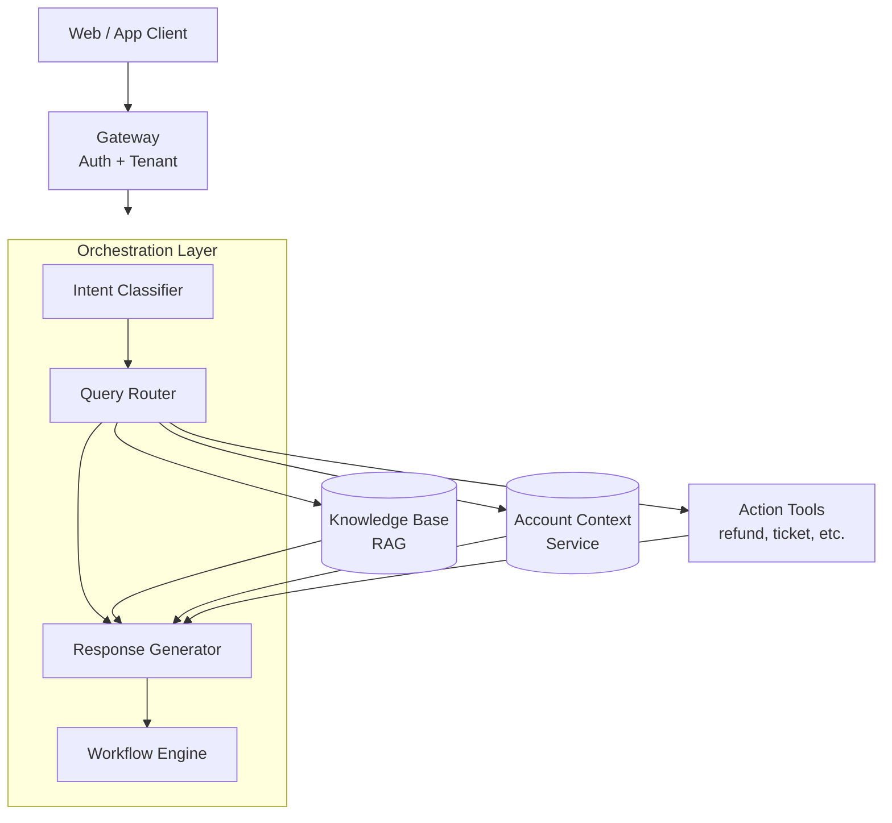
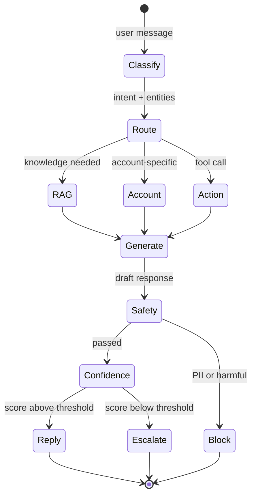
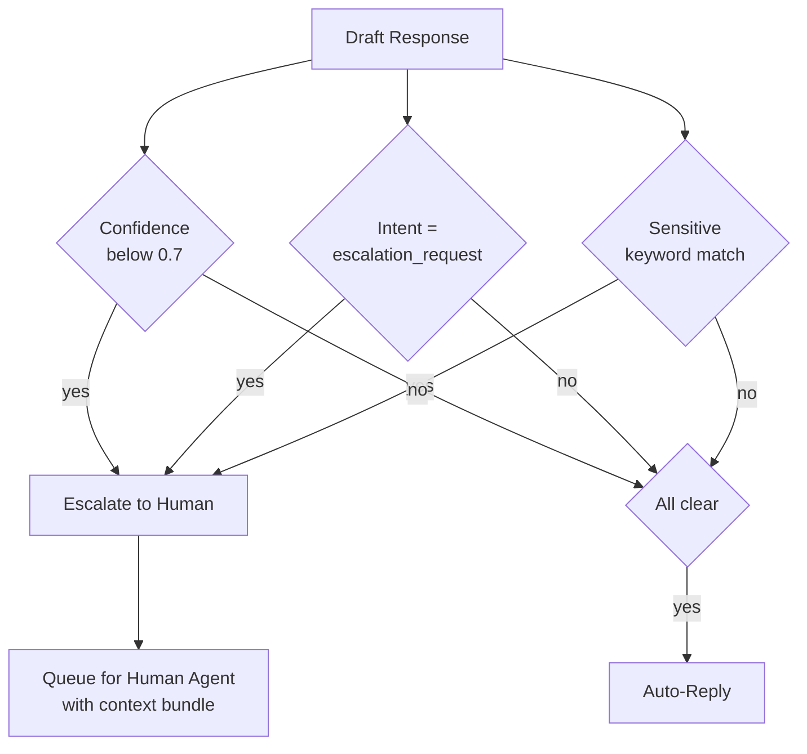

# 案例研究：客戶支援對話式代理

本案例研究將完整走過如何為一家 B2B SaaS 公司設計一個正式上線的客戶支援代理。

## 目錄

- [問題陳述](#problem-statement)
- [需求分析](#requirements-analysis)
- [架構設計](#architecture-design)
- [元件深入剖析](#component-deep-dives)
- [可靠性模式](#reliability-patterns)
- [評估與監控](#evaluation-and-monitoring)
- [成本分析](#cost-analysis)
- [經驗教訓](#lessons-learned)
- [面試演練](#interview-walkthrough)

---

## 問題陳述

**公司：** 擁有 50K 家企業客戶的 B2B SaaS 平台

**現況：**
- 每月 500K 張支援工單
- 平均回應時間：4 小時
- 客戶滿意度（CSAT）：72%
- 支援團隊：100 名專員

**目標：**
- 將常見查詢的回應時間縮短至 < 5 分鐘
- 將 CSAT 提升至 > 85%
- 在無需人工介入的情況下處理 60% 的工單
- 為升級處理的工單維持品質

---

## 需求分析

### 功能需求

| 需求 | 說明 | 優先級 |
|-------------|-------------|----------|
| 查詢理解 | 分類意圖、擷取實體 | P0 |
| 知識檢索 | 搜尋產品文件、FAQ、過往工單 | P0 |
| 帳戶情境 | 存取使用者的訂閱與歷史紀錄 | P0 |
| 回應生成 | 自然、準確、有幫助的回應 | P0 |
| 對話記憶 | 多輪對話情境 | P0 |
| 動作執行 | 建立工單、觸發工作流程 | P1 |
| 人工升級 | 必要時無縫交接 | P0 |
| 帳務查詢 | 處理敏感的財務資料 | P1 |

### 非功能需求

| 需求 | 目標 | 理由 |
|-------------|--------|-----------|
| 延遲（TTFT） | < 1s | 聊天的使用者期待 |
| 延遲（完整） | < 5s | 維持互動參與度 |
| 可用性 | 99.9% | 業務關鍵 |
| 準確率 | > 95% | 客戶信任 |
| 升級率 | < 40% | 成本效率 |
| CSAT | > 85% | 業務目標 |

### 安全需求

- 日誌中不得含有 PII
- 租戶隔離（客戶只能看到自己的資料）
- 所有動作皆有稽核軌跡
- 符合 SOC 2 規範

---

## 架構設計

### 高階架構

```
┌─────────────────────────────────────────────────────────────────┐
│                      CUSTOMER SUPPORT AGENT                      │
├─────────────────────────────────────────────────────────────────┤
│                                                                  │
│  ┌─────────────┐     ┌─────────────┐     ┌─────────────┐        │
│  │   Web/App   │────▶│   Gateway   │────▶│    Auth     │        │
│  │   Client    │     │             │     │  + Tenant   │        │
│  └─────────────┘     └──────┬──────┘     └─────────────┘        │
│                             │                                    │
│                             ▼                                    │
│  ┌──────────────────────────────────────────────────────────┐   │
│  │                   ORCHESTRATION LAYER                     │   │
│  │  ┌────────────────────────────────────────────────────┐  │   │
│  │  │  Intent        Query          Response    Workflow │  │   │
│  │  │  Classifier → Router →        Generator → Engine   │  │   │
│  │  └────────────────────────────────────────────────────┘  │   │
│  └──────────────────────────────────────────────────────────┘   │
│                             │                                    │
│         ┌───────────────────┼───────────────────┐               │
│         ▼                   ▼                   ▼               │
│  ┌─────────────┐     ┌─────────────┐     ┌─────────────┐        │
│  │  Knowledge  │     │   Account   │     │   Action    │        │
│  │    Base     │     │   Context   │     │   Tools     │        │
│  │   (RAG)     │     │   Service   │     │             │        │
│  └─────────────┘     └─────────────┘     └─────────────┘        │
│                                                                  │
└─────────────────────────────────────────────────────────────────┘
```

以分層流程呈現。orchestration layer 會分派到三個並行的情境來源，接著在 response generator 中將它們組合起來：



### 對話流程

```
User Message
    │
    ▼
┌─────────────────┐
│ Intent Classify │─── billing, technical, account, general, escalation
└────────┬────────┘
         │
         ▼
┌─────────────────┐
│ Query Routing   │─── Which knowledge sources? Which tools?
└────────┬────────┘
         │
    ┌────┴────┬────────────┐
    ▼         ▼            ▼
┌───────┐ ┌───────┐ ┌──────────┐
│  RAG  │ │Account│ │ Actions  │
│ Query │ │Context│ │ (if any) │
└───┬───┘ └───┬───┘ └────┬─────┘
    │         │          │
    └────┬────┴──────────┘
         │
         ▼
┌─────────────────┐
│    Generate     │
│    Response     │
└────────┬────────┘
         │
         ▼
┌─────────────────┐
│  Safety Check   │─── PII, harmful, off-topic
└────────┬────────┘
         │
         ▼
┌─────────────────┐
│  Confidence     │─── Low confidence? Escalate
│    Check        │
└────────┬────────┘
         │
         ▼
    Response / Escalation
```

一個回合就是一台狀態機。對成本與信任最關鍵的兩道閘門是 *safety*（在離開系統前必須通過）與 *confidence*（決定要升級還是自動回覆）：



---

## 元件深入剖析

### 意圖分類（Dec 2025）

```python
class IntentClassifier:
    async def classify(self, message: str, history: list[dict]) -> dict:
        # Using GPT-5.5-mini for <100ms classification latency
        result = await client.chat.completions.create(
            model="gpt-5.2-mini",
            messages=[{"role": "user", "content": message}],
            response_format={"type": "json_object"}
        )
        return json.loads(result.choices[0].message.content)
```

### 知識庫（Gemini 3 Flash RAG）

```python
class SupportKnowledgeBase:
    async def retrieve(self, query: str, context_window: int = 1_000_000) -> list[dict]:
        # Using Gemini 3 Flash for massive context retrieval
        # No more 'reranking' needed for many standard support tasks
        results = await self.sources.search(query, limit=50) 
        return results
```

### 回應生成（Claude Sonnet 4.6）

```python
class ResponseGenerator:
    async def generate(self, query: str, context: list[dict]) -> dict:
        # Claude Sonnet 4.6 for 'Hybrid Reasoning'
        # Toggle 'Thinking' mode for complex billing issues
        is_complex = self.detect_complexity(query)
        
        response = await self.anthropic.messages.create(
            model="claude-3-7-sonnet-20250219",
            thinking={"enabled": is_complex, "budget_tokens": 2048},
            messages=[{"role": "user", "content": f"Context: {context}\nQuery: {query}"}]
        )
        return {"response": response.content[0].text}
```

> [!NOTE]
> **正式上線的智慧：** 雖然 Gemini 3 Flash 非常適合高流量檢索，但對許多花了數個月時間圍繞其特定個性與拒絕回應模式微調防護機制的支援團隊來說，**Claude 3.5 Sonnet** 仍是最「穩定」的生成器。

---

## 可靠性模式

### 基於信心度的升級

```python
class EscalationHandler:
    def __init__(self, confidence_threshold: float = 0.7):
        self.threshold = confidence_threshold
    
    async def check_escalation(
        self,
        response: dict,
        intent: str,
        user_request: str
    ) -> dict:
        should_escalate = False
        reason = None
        
        # Low confidence
        if response["confidence"] < self.threshold:
            should_escalate = True
            reason = "low_confidence"
        
        # Explicit escalation request
        if intent == "escalation_request":
            should_escalate = True
            reason = "user_requested"
        
        # Sensitive topics
        if await self.is_sensitive(user_request):
            should_escalate = True
            reason = "sensitive_topic"
        
        if should_escalate:
            return await self.create_escalation(response, reason)
        
        return {"escalate": False, "response": response}
    
    async def is_sensitive(self, message: str) -> bool:
        sensitive_keywords = [
            "legal", "lawsuit", "lawyer",
            "refund", "cancel subscription",
            "competitor", "data breach"
        ]
        return any(kw in message.lower() for kw in sensitive_keywords)
```

升級決策結合了三個獨立的訊號。其中任一個觸發即會交接。將它視覺化為決策樹後，OR 的語意一目了然，也很容易再擴充第四個訊號：



### 多輪記憶

```python
class ConversationMemory:
    def __init__(self, max_turns: int = 10):
        self.max_turns = max_turns
        self.redis = Redis()
    
    async def get_history(self, session_id: str) -> list[dict]:
        key = f"conversation:{session_id}"
        history = await self.redis.get(key)
        if history:
            return json.loads(history)
        return []
    
    async def add_turn(
        self,
        session_id: str,
        user_message: str,
        assistant_message: str
    ):
        history = await self.get_history(session_id)
        
        history.append({"role": "user", "content": user_message})
        history.append({"role": "assistant", "content": assistant_message})
        
        # Trim to max turns
        if len(history) > self.max_turns * 2:
            history = history[-(self.max_turns * 2):]
        
        await self.redis.setex(
            f"conversation:{session_id}",
            3600,  # 1 hour TTL
            json.dumps(history)
        )
```

---

## 評估與監控

### 品質指標

```python
class QualityMonitor:
    def __init__(self, sample_rate: float = 0.05):
        self.sample_rate = sample_rate
        self.judge = LLMJudge()
    
    async def evaluate(self, conversation: dict):
        if random.random() > self.sample_rate:
            return
        
        scores = await self.judge.evaluate(
            query=conversation["user_message"],
            response=conversation["assistant_message"],
            context=conversation["context"],
            criteria={
                "relevance": "Does the response address the user's question?",
                "accuracy": "Is the information correct based on the context?",
                "helpfulness": "Would this response help the user?",
                "tone": "Is the tone professional and empathetic?"
            }
        )
        
        # Record metrics
        for criterion, score in scores.items():
            metrics.record(f"quality_{criterion}", score)
```

### 儀表板指標

| 指標 | 目標 | 實際 |
|--------|--------|--------|
| 延遲（TTFT） | < 1s | 0.8s |
| 延遲（完整） | < 5s | 3.2s |
| 準確率 | > 95% | 94.3% |
| 升級率 | < 40% | 38% |
| CSAT | > 85% | 87% |
| 解決率 | > 60% | 62% |

---

## 成本分析

### 單次對話成本拆解（Dec 2025）

| 元件 | 成本 | 備註 |
|-----------|------|-------|
| 意圖分類 | $0.0001 | GPT-5.5-mini（$0.10/1M） |
| RAG 檢索 | $0.0001 | Gemini 3 Flash（$0.05/1M） |
| Thinking mode | $0.0050 | Claude Sonnet 4.6 Thinking（平均 250 tokens） |
| 回應生成 | $0.0030 | Claude Sonnet 4.6（$3/1M in） |
| 品質抽樣 | $0.0001 | 在 GPT-5.5 上採 5% 抽樣率 |
| **總計** | **~$0.0083** | **每次對話（較 2024 年降低 62%）** |

### 每月成本預估

| 項目 | 計算方式 | 成本 |
|------|-------------|------|
| 對話 | 500K × $0.022 | $11,000 |
| 基礎設施 | 固定 | $2,000 |
| 人工升級 | 190K × $5（人力成本） | $950,000 |
| **總計** | | $963,000 |
| **相較全人工的節省** | 500K × $5 - $963K | $1.5M/年 |

---

## 經驗教訓

### 哪些做法奏效

1. **基於意圖的路由** 透過將檢索聚焦於相關來源而降低了延遲
2. **基於信心度的升級** 在降低人力負擔的同時維持了品質
3. **帳戶情境** 讓回應更個人化且更準確
4. **較低的 temperature（0.3）** 提升了支援回應的一致性

### 哪些做法一開始行不通

1. **所有事情都用單一模型** —— 針對不同任務路由到不同模型提升了品質
2. **升級門檻過高** —— 一開始設在 0.9 信心度，導致升級次數過多
3. **完整的對話歷史** —— 超出了情境限制，改為使用摘要

### 建議

1. 一開始採用較高的升級率，隨著信心度提升再逐步調降
2. 依升級原因監控 CSAT，以找出薄弱環節
3. 針對支援專屬詞彙重新訓練 embeddings
4. 建立回饋迴圈：讓專員為升級的對話加上標記，作為訓練資料

---

## 面試演練

**面試官：** 「為一家 SaaS 公司設計一套 AI 客戶支援系統。」

**強而有力的回答模式：**

1. **釐清需求**（2 分鐘）
   - 「工單量有多少？有哪些管道？目前的 CSAT 是多少？」

2. **明確陳述限制**
   - 「關鍵限制：準確性優先於速度、無縫升級、租戶隔離」

3. **高階架構**（3 分鐘）
   - 畫出流程：intent → routing → RAG → generation → safety → response/escalation

4. **深入剖析關鍵元件**（5 分鐘）
   - 「讓我詳細說明基於信心度的升級……」

5. **處理可靠性**（3 分鐘）
   - 「為了可靠性，我會對帳務查詢使用 self-consistency，並採用多供應商備援」

6. **指標與監控**（2 分鐘）
   - 「關鍵指標：CSAT、解決率、升級率、準確率抽樣」

7. **成本考量**（1 分鐘）
   - 「在每月 500K 次對話的規模下，單次對話成本至關重要。模型路由能有所幫助。」

---

## 參考資料

- Anthropic 客戶支援最佳實務：https://docs.anthropic.com/claude/docs/customer-service
- LangChain 對話式代理：https://python.langchain.com/docs/use_cases/chatbots

---

*下一篇：[程式碼助理案例研究](03-code-assistant.md)*
