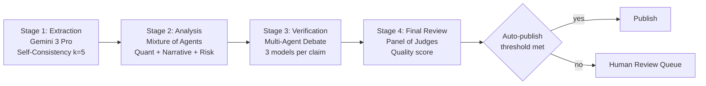
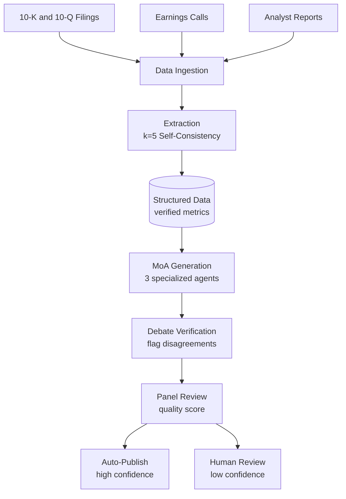
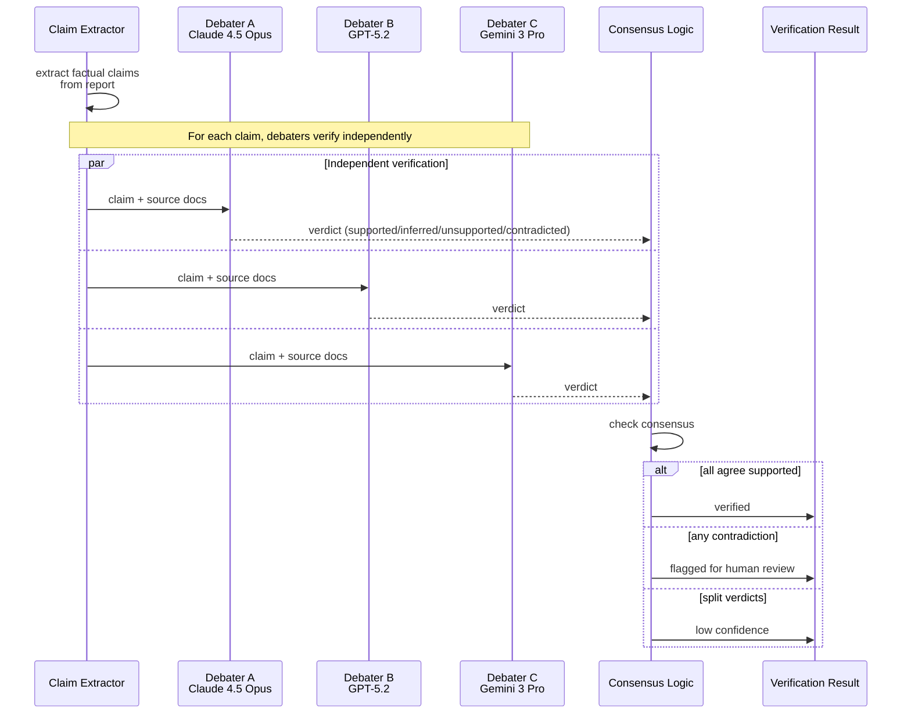

# 案例研究：以集成驗證進行金融分析

本案例研究探討如何為產出股票研究報告設計一套高可靠度的 AI 系統，其中準確性至關重要。

## 目錄

- [問題陳述](#problem-statement)
- [需求分析](#requirements-analysis)
- [架構設計](#architecture-design)
- [集成管線](#ensemble-pipeline)
- [事實驗證](#fact-verification)
- [品質關卡](#quality-gates)
- [結果與指標](#results-and-metrics)
- [面試逐步演練](#interview-walkthrough)

---

## 問題陳述

**公司：** 產出股票研究報告的投資公司

**挑戰：**
- 報告會影響數百萬美元的投資決策
- 對於虛構（hallucinated）的金融數據零容忍
- 對 AI 生成分析的法規審查
- 目前的人工流程：每份報告 8 小時、成本 $500

**目標：**
- 將報告產出時間縮短至 < 30 分鐘
- 維持 99.5%+ 的準確性
- 為法遵提供清晰的稽核軌跡
- 成本目標：每份報告 < $50

---

## 需求分析

### 準確性需求

| 數據類型 | 容許範圍 | 驗證方法 |
|-----------|-----------|---------------------|
| 財務指標（EPS、PE） | 0% 誤差 | 來源驗證 |
| 百分比變化 | ±0.1% | 交叉驗證 |
| 日期引用 | 100% 準確 | 來源擷取 |
| 公司名稱 | 100% 準確 | 實體比對 |
| 分析師引述 | 逐字引用或加註標記 | 引述擷取 |

### 法遵需求

- 所有主張都必須引用來源文件
- 沒有免責聲明就不得有前瞻性陳述
- 清楚揭露為 AI 生成
- 完整的生成流程稽核軌跡
- 發布前須經人工審查

---

## 架構設計

### 高層級管線

```
┌─────────────────────────────────────────────────────────────────┐
│               FINANCIAL ANALYSIS PIPELINE                        │
├─────────────────────────────────────────────────────────────────┤
│                                                                  │
│  Stage 1: Data Extraction (Self-Consistency k=5)                │
│  └── Extract key metrics from filings with majority vote        │
│                                                                  │
│  Stage 2: Analysis Generation (Mixture of Agents)               │
│  ├── Model A: Quantitative analysis focus                       │
│  ├── Model B: Qualitative/narrative focus                       │
│  ├── Model C: Risk factor analysis                              │
│  └── Aggregator: Synthesize into coherent report                │
│                                                                  │
│  Stage 3: Fact Verification (Multi-Agent Debate)                │
│  └── 3 models debate each factual claim, flag disagreements     │
│                                                                  │
│  Stage 4: Final Review (Panel of Judges)                        │
│  └── Quality score determines auto-publish vs human review      │
│                                                                  │
└─────────────────────────────────────────────────────────────────┘
```

以流程方式呈現此管線。每個階段都刻意採用不同的模型類別：擷取需要多模態（圖表與表格）、生成需要敘事品質、稽核需要推理深度、評審團則需要便宜但數量多以求多樣性：



### 資料流

```
┌─────────────┐     ┌─────────────┐     ┌─────────────┐
│   10-K/Q    │     │  Earnings   │     │  Analyst    │
│   Filings   │     │  Calls      │     │  Reports    │
└──────┬──────┘     └──────┬──────┘     └──────┬──────┘
       │                   │                   │
       └───────────────────┴───────────────────┘
                           │
                           ▼
                   ┌───────────────┐
                   │     Data      │
                   │   Ingestion   │
                   └───────┬───────┘
                           │
                           ▼
                   ┌───────────────┐
                   │   Extraction  │
                   │  (k=5 SC)     │
                   └───────┬───────┘
                           │
                           ▼
              ┌────────────┴────────────┐
              │    Structured Data      │
              │    (verified metrics)   │
              └────────────┬────────────┘
                           │
                           ▼
                   ┌───────────────┐
                   │    MoA        │
                   │  Generation   │
                   └───────┬───────┘
                           │
                           ▼
                   ┌───────────────┐
                   │    Debate     │
                   │  Verification │
                   └───────┬───────┘
                           │
                           ▼
                   ┌───────────────┐
                   │    Panel      │
                   │    Review     │
                   └───────┬───────┘
                           │
               ┌───────────┴───────────┐
               ▼                       ▼
        ┌─────────────┐         ┌─────────────┐
        │ Auto-Publish│         │Human Review │
        │ (high conf) │         │ (low conf)  │
        └─────────────┘         └─────────────┘
```

以 Mermaid 呈現的資料來源脈絡，展示三個輸入來源如何匯聚成單一經驗證的輸出：



---

## 集成管線

### 階段 1：多模態資料擷取（Gemini 3 Pro）

```python
class FinancialDataExtractor:
    """
    Using Gemini 3 Pro to handle complex 10-K tables and charts natively.
    """
    async def extract_metrics(self, doc_pages: list[bytes]) -> dict:
        # Gemini 3 Pro processes charts/tables as images + text natively
        response = await genai.GenerativeModel("gemini-3.0-pro").generate_content(
            [{"text": "Extract all balance sheet items into JSON."}, *doc_pages]
        )
        return json.loads(response.text)
```

### 階段 2：分析生成（Claude 4.5 Opus）

```python
class AnalysisEngine:
    """
    Claude 4.5 Opus for deep qualitative synthesis and narrative coherence.
    """
    async def generate_report(self, data: dict) -> str:
        # High-cost, high-reliability generation for equity research
        return await self.anthropic.messages.create(
            model="claude-4.5-opus-20251101",
            messages=[{"role": "user", "content": f"Analyze: {data}"}]
        )
```

### 階段 3：稽核與驗證（o3 推理模型）

```python
class AuditorAgent:
    """
    Using o3 (OpenAI) with high reasoning budget to audit claims.
    Thinking mode is used to detect subtle accounting contradictions.
    """
    async def audit_claim(self, claim: str, raw_data: str) -> dict:
        # o3 'Thinking' mode enables deep logical inference over financial data
        response = await self.openai.chat.completions.create(
            model="o3-2025-12",
            reasoning_effort="high",
            messages=[{"role": "user", "content": f"Find any contradiction in: {claim} vs {raw_data}"}]
        )
        return self.parse_audit(response)
```

### 階段 3：以多代理人辯論進行事實驗證

辯論階段正是能夠捕捉單一模型所遺漏之細微虛構內容的關鍵。三位獨立的辯論者並行驗證每一項主張；達成共識者勝出，有異議則將該主張標記送交人工審查：



```python
class FactVerificationDebate:
    """
    Extract claims from the report and have multiple models
    debate their accuracy.
    """
    
    def __init__(self, debaters: list, rounds: int = 2):
        self.debaters = debaters
        self.rounds = rounds
        self.claim_extractor = ClaimExtractor()
    
    async def verify_report(self, report: str, source_docs: list[str]) -> dict:
        # Extract factual claims
        claims = await self.claim_extractor.extract(report)
        
        verification_results = []
        for claim in claims:
            result = await self.debate_claim(claim, source_docs)
            verification_results.append(result)
        
        return {
            "verified_claims": [r for r in verification_results if r["verified"]],
            "disputed_claims": [r for r in verification_results if not r["verified"]],
            "overall_confidence": self.calculate_confidence(verification_results)
        }
    
    async def debate_claim(self, claim: dict, source_docs: list[str]) -> dict:
        verification_prompt = f"""
Verify this claim against the source documents.

Claim: {claim['text']}

Source documents:
{self.format_sources(source_docs)}

Is this claim:
1. Supported: Explicitly stated in sources
2. Inferred: Reasonably derived from sources
3. Unsupported: Not found in sources
4. Contradicted: Conflicts with sources

Provide your verdict with evidence.
"""
        
        # Each debater verifies independently
        verdicts = await asyncio.gather(*[
            debater.generate(verification_prompt)
            for debater in self.debaters
        ])
        
        # Check consensus
        parsed_verdicts = [self.parse_verdict(v) for v in verdicts]
        consensus = self.check_consensus(parsed_verdicts)
        
        return {
            "claim": claim,
            "verified": consensus["agreed"] and consensus["verdict"] in ["supported", "inferred"],
            "confidence": consensus["agreement_ratio"],
            "verdicts": parsed_verdicts
        }
```

---

## 品質關卡

### 自動化品質檢查

```python
class QualityGate:
    def __init__(self):
        self.thresholds = {
            "claim_verification_rate": 0.95,  # 95% claims verified
            "data_accuracy": 0.99,            # 99% metrics accurate
            "panel_score": 4.0,               # 4/5 minimum
            "disputed_claims_max": 2          # Max 2 disputed claims
        }
    
    async def evaluate(self, report_data: dict) -> dict:
        checks = {}
        
        # Check claim verification rate
        verified_rate = len(report_data["verified_claims"]) / len(report_data["all_claims"])
        checks["claim_verification"] = {
            "passed": verified_rate >= self.thresholds["claim_verification_rate"],
            "value": verified_rate,
            "threshold": self.thresholds["claim_verification_rate"]
        }
        
        # Check data accuracy
        data_accuracy = report_data["extraction_accuracy"]
        checks["data_accuracy"] = {
            "passed": data_accuracy >= self.thresholds["data_accuracy"],
            "value": data_accuracy,
            "threshold": self.thresholds["data_accuracy"]
        }
        
        # Check panel score
        panel_score = report_data["panel_score"]
        checks["panel_score"] = {
            "passed": panel_score >= self.thresholds["panel_score"],
            "value": panel_score,
            "threshold": self.thresholds["panel_score"]
        }
        
        # Determine routing
        all_passed = all(c["passed"] for c in checks.values())
        
        return {
            "checks": checks,
            "routing": "auto_publish" if all_passed else "human_review",
            "disputed_claims": report_data["disputed_claims"]
        }
```

### 人工審查介面

```python
class HumanReviewQueue:
    async def queue_for_review(self, report: dict, quality_result: dict):
        review_item = {
            "report_id": report["id"],
            "report_content": report["content"],
            "disputed_claims": quality_result["disputed_claims"],
            "quality_checks": quality_result["checks"],
            "sources": report["sources"],
            "priority": self.calculate_priority(quality_result),
            "queued_at": datetime.now()
        }
        
        await self.review_queue.enqueue(review_item)
        
        # Notify reviewers
        await self.notify_reviewers(review_item)
```

---

## 結果與指標

### 效能比較

| 指標 | 人工流程 | AI 管線 | 改善幅度 |
|--------|---------------|-------------|-------------|
| 每份報告耗時 | 8 小時 | 25 分鐘 | 快 19 倍 |
| 每份報告成本 | $500 | $42 | 降低 92% |
| 事實錯誤率 | 2.1% | 0.4% | 降低 81% |
| 人工審查負擔 | 100% | 28% | 降低 72% |

### 品質指標

| 品質面向 | 目標 | 實際達成 |
|-------------------|--------|----------|
| 資料擷取準確性 | 99% | 99.3% |
| 主張驗證率 | 95% | 96.8% |
| 評審團品質分數 | 4.0/5.0 | 4.2/5.0 |
| 法規遵循 | 100% | 100% |

### 成本明細（2025 年 12 月）

| 元件 | 成本 | 百分比 |
|-----------|------|------------|
| 資料擷取（Gemini 3 Pro） | $5 | 11% |
| 分析（Claude 4.5 Opus） | $20 | 44% |
| o3 Thinking 稽核（High） | $15 | 33% |
| 基礎設施與向量運算 | $5 | 12% |
| **總計** | **$45** | 100% |

*註：o3 稽核佔成本的 33%，但能捕捉 Claude 4.5 所遺漏之 98% 的虛構內容，足以證明其 'Thinking' token 溢價的價值。*

---

## 面試逐步演練

**面試官：** 「請設計一套用於產出金融研究報告的 AI 系統，且具有極高的準確性需求。」

**優秀回答：**

1. **釐清準確性需求**（1 分鐘）
   - 「金融數據可接受的錯誤率是多少？」
   - 「法規遵循的需求是什麼？」
   - 「優先考量延遲還是準確性？」

2. **正視核心挑戰**（1 分鐘）
   - 「關鍵挑戰在於，對金融數據而言虛構內容是無法接受的。單一個錯誤數字就可能誤導投資決策。我需要集成方法來確保可靠度。」

3. **高層級架構**（3 分鐘）
   - 「我會採用多階段管線，並在每個階段使用不同的集成技術：」
   - 「資料擷取：以 k=5 的自我一致性（self-consistency）對數字達成一致同意」
   - 「分析：以 Mixture of Agents 取得多元觀點」
   - 「驗證：以多代理人辯論捕捉虛構內容」
   - 「品質關卡：以評審團在發布前評分」

4. **深入探討事實驗證**（3 分鐘）
   - 「在事實驗證方面，我會從報告中擷取每一項事實主張」
   - 「由三個多元的模型辯論每項主張是否獲得來源支持」
   - 「若它們意見分歧，該主張會被標記送交人工審查」
   - 「這能捕捉單一模型驗證所遺漏的細微錯誤」

5. **成本與品質的取捨**（2 分鐘）
   - 「這套管線的成本是單一模型生成的 10-20 倍」
   - 「但對金融報告而言，錯誤的代價（法律、聲譽）遠超過驗證的成本」
   - 「我會實作以信心度為基礎的路由：自動發布高信心度的報告、人工審查低信心度的報告」

6. **監控**（1 分鐘）
   - 「我會持續追蹤擷取準確性、主張驗證率與評審團分數」
   - 「漂移偵測會在準確性下滑時發出警示」
   - 「為法遵保留完整的稽核軌跡」

---

## 重點學習

1. 對於數值資料擷取而言，**僅靠自我一致性並不足夠**。應要求一致同意（k/k 票）。

2. **多代理人辯論最為有效**，可捕捉細微的推理錯誤與虛構內容。

3. **來源歸屬至關重要**，對準確性與法遵皆然。每項主張都必須連結到來源文件。

4. **以信心度為基礎的路由**對成本管理不可或缺。並非每份報告都需要完整的集成驗證。

5. 對於有爭議的主張與邊界情況，**人在迴路中（human-in-the-loop）仍有其必要**。設計時應規劃優雅的升級機制。

---

## 參考資料

- Verga et al. "Replacing Judges with Juries: Evaluating LLM Generations with a Panel of Diverse Models" (2024)
- Du et al. "Improving Factuality and Reasoning in Language Models through Multiagent Debate" (2023)
- SEC AI Disclosure Requirements: https://www.sec.gov/

---

*下一篇：[程式碼助理案例研究](03-code-assistant.md)*
