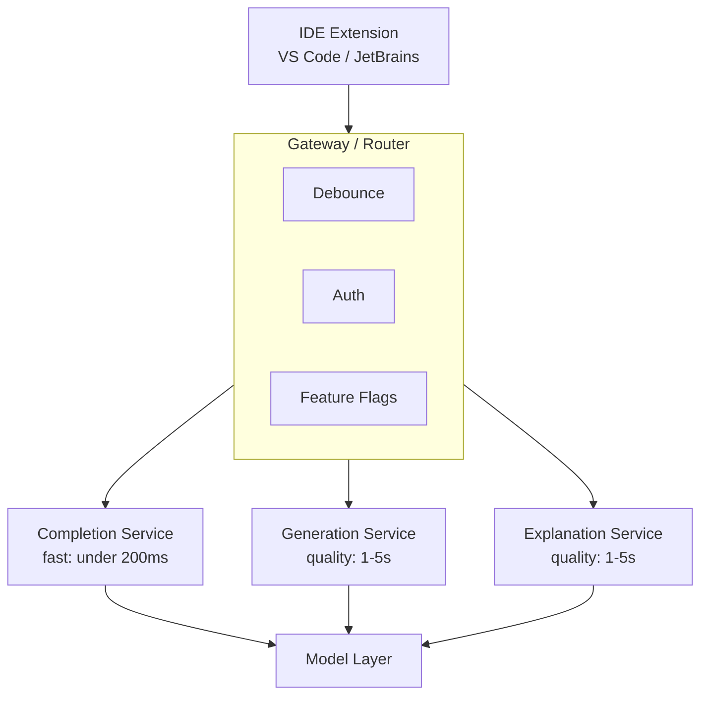
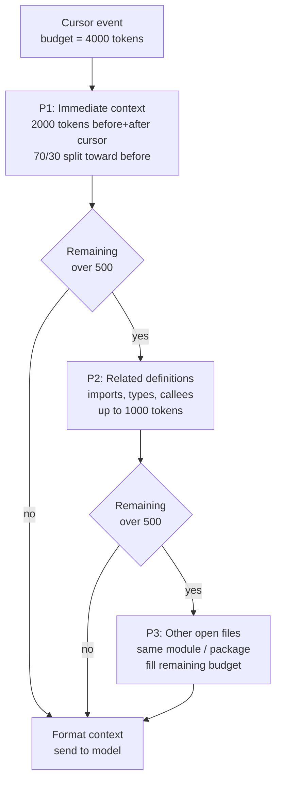
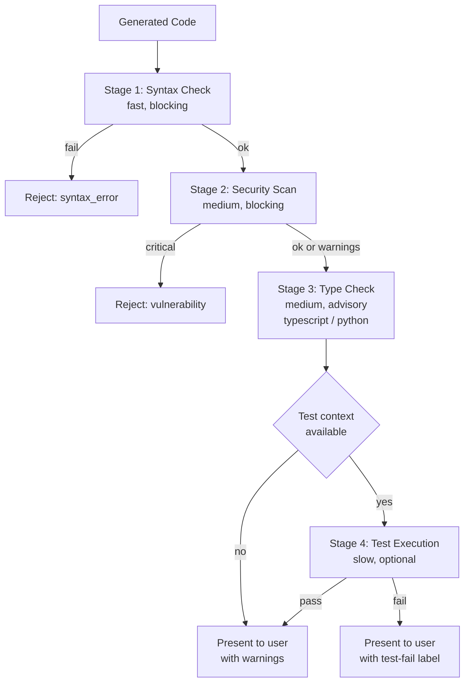

# 案例研究：AI 程式碼助理

本案例研究探討如何設計一個正式環境（production）的程式碼助理，提供即時建議、程式碼生成與除錯協助。

## 目錄

- [問題陳述](#problem-statement)
- [需求分析](#requirements-analysis)
- [架構設計](#architecture-design)
- [程式碼生成管線](#code-generation-pipeline)
- [品質保證](#quality-assurance)
- [效能最佳化](#performance-optimization)
- [結果與指標](#results-and-metrics)
- [面試演練](#interview-walkthrough)

---

## 問題陳述

**公司：** 開發者工具公司，正在打造 IDE 擴充套件

**目標：**
- 開發者輸入時的即時程式碼補全
- 從自然語言生成多行程式碼
- 程式碼解釋與除錯協助
- 支援 20+ 種程式語言

**限制條件：**
- 補全延遲 < 200ms（維持輸入流暢度）
- 生成延遲 < 3s（可接受的停頓）
- 安全性：程式碼不離開客戶基礎設施（企業版選項）
- 成本：在規模化下可持續（數百萬名開發者）

---

## 需求分析

### 功能需求

| 功能 | 描述 | 延遲目標 |
|---------|-------------|----------------|
| 行內補全 | 補全目前的行/區塊 | < 200ms |
| 多行生成 | 從註解生成函式/類別 | < 3s |
| 程式碼解釋 | 解釋選取的程式碼 | < 5s |
| 錯誤修正 | 針對錯誤提出修正建議 | < 2s |
| 重構 | 提出改善建議 | < 5s |
| 文件 | 生成 docstring | < 2s |

### 品質需求

| 維度 | 目標 | 衡量方式 |
|-----------|--------|-------------|
| 接受率 | > 30% | 被接受的建議 / 顯示的建議 |
| 語法正確性 | > 99% | 成功編譯/解析 |
| 安全性 | 0 個漏洞 | SAST 掃描通過率 |
| 相關性 | > 85% | 使用者評分 |

---

## 架構設計

### 高階架構

```
┌─────────────────────────────────────────────────────────────────┐
│                    CODE ASSISTANT ARCHITECTURE                   │
├─────────────────────────────────────────────────────────────────┤
│                                                                  │
│  ┌─────────────┐                                                │
│  │     IDE     │                                                │
│  │  Extension  │                                                │
│  └──────┬──────┘                                                │
│         │                                                        │
│         ▼                                                        │
│  ┌─────────────────────────────────────────────────────────┐    │
│  │                    GATEWAY / ROUTER                      │    │
│  │  ┌──────────┐  ┌──────────┐  ┌──────────┐              │    │
│  │  │ Debounce │  │  Auth    │  │ Feature  │              │    │
│  │  │          │  │          │  │  Flags   │              │    │
│  │  └──────────┘  └──────────┘  └──────────┘              │    │
│  └─────────────────────────┬───────────────────────────────┘    │
│                            │                                     │
│         ┌──────────────────┼──────────────────┐                 │
│         ▼                  ▼                  ▼                 │
│  ┌─────────────┐    ┌─────────────┐    ┌─────────────┐         │
│  │  Completion │    │ Generation  │    │ Explanation │         │
│  │   Service   │    │  Service    │    │  Service    │         │
│  │  (fast)     │    │ (quality)   │    │ (quality)   │         │
│  └──────┬──────┘    └──────┬──────┘    └──────┬──────┘         │
│         │                  │                  │                  │
│         └──────────────────┼──────────────────┘                 │
│                            ▼                                     │
│                    ┌─────────────┐                              │
│                    │   Model     │                              │
│                    │   Layer     │                              │
│                    └─────────────┘                              │
│                                                                  │
└─────────────────────────────────────────────────────────────────┘
```

以流程的形式呈現此架構。三個服務層級依據延遲與品質的權衡而拆分（補全為次 200ms，生成與解釋以品質為優先），並共用同一個 model layer：



### Context 組裝

```python
class CodeContextAssembler:
    """
    Assemble context for code completion.
    Challenge: Balance context richness with latency.
    """
    
    def __init__(self, max_tokens: int = 4000):
        self.max_tokens = max_tokens
    
    def assemble(
        self,
        cursor_position: dict,
        file_content: str,
        open_files: list[dict],
        project_context: dict
    ) -> str:
        context_parts = []
        remaining_tokens = self.max_tokens
        
        # Priority 1: Immediate context (before and after cursor)
        immediate = self.get_immediate_context(
            file_content, cursor_position, tokens=2000
        )
        context_parts.append(immediate)
        remaining_tokens -= count_tokens(immediate)
        
        # Priority 2: Related imports and definitions
        if remaining_tokens > 500:
            related = self.get_related_definitions(
                file_content, cursor_position, tokens=min(1000, remaining_tokens)
            )
            context_parts.append(related)
            remaining_tokens -= count_tokens(related)
        
        # Priority 3: Other open files (same module/package)
        if remaining_tokens > 500:
            other_files = self.get_relevant_open_files(
                open_files, cursor_position, tokens=remaining_tokens
            )
            context_parts.append(other_files)
        
        return self.format_context(context_parts)
    
    def get_immediate_context(
        self,
        content: str,
        cursor: dict,
        tokens: int
    ) -> str:
        lines = content.split("\n")
        cursor_line = cursor["line"]
        
        # Get lines before cursor (more important)
        before_ratio = 0.7
        before_tokens = int(tokens * before_ratio)
        after_tokens = tokens - before_tokens
        
        # Expand outward from cursor
        before_lines = lines[:cursor_line]
        after_lines = lines[cursor_line:]
        
        # Truncate to fit
        before_text = self.truncate_to_tokens(
            "\n".join(before_lines), before_tokens, from_end=True
        )
        after_text = self.truncate_to_tokens(
            "\n".join(after_lines), after_tokens, from_end=False
        )
        
        return f"{before_text}\n<CURSOR>\n{after_text}"
```

Context 組裝是一種以優先順序驅動的預算分配。模型只會看到在 4000-token 上限下存活下來的內容，因此順序很重要：先放即時程式碼（一定塞得下），接著是相關定義，最後只有在還有預算時才放其他開啟中的檔案：



---

## 程式碼生成管線

### 補全服務（2025 年 12 月）

```python
class DeepCompletion:
    """
    Sub-150ms latency using o4-mini with speculative decoding.
    """
    def __init__(self):
        self.model = "o4-mini"  # Native code-optimized mini
        self.draft_model = "nano-code-1b" # Local on-device model
    
    async def complete(self, context: str) -> str:
        # Speculative decoding: 1B model drafts, o4-mini verifies
        return await self.openai.generate(
            model=self.model,
            draft_model=self.draft_model,
            prompt=context,
            max_tokens=64
        )
```

### 生成服務（「Claude Code」時代）

```python
class AgenticGeneration:
    """
    Using Claude Sonnet 4.6 (Hybrid) for autonomous refactoring.
    """
    async def refactor_module(self, folder_path: str):
        # Claude Sonnet 4.6 with 'Thinking' enabled for architecture consistency
        agent = ClaudeCodeAgent(
            model="claude-3-7-sonnet",
            tools=["ls", "read_file", "write_file", "test_runner"]
        )
        
        # Agent explores codebase, understands dependencies, and applies fix
        return await agent.run(f"Refactor {folder_path} to use async/await.")
```

> [!TIP]
> **正式環境選擇：** 雖然 Claude Opus 4.7 是寫程式的猛獸，但在 2025 年 12 月，IDE 的首選正式環境選擇是 **Claude Sonnet 4.6**，原因在於其 **Hybrid Reasoning（混合推理）**：開發者可以針對棘手的 bug 切換成「Thinking」、針對樣板程式碼切換成「Fast」。

---

## 品質保證

### 多階段驗證

驗證器（verifier）是一套快速失敗（fail-fast）的關卡。便宜的檢查（語法）先執行且為硬性阻擋；昂貴的檢查（測試執行）最後執行，且只在情境允許時才進行。任何阻擋型失敗都會直接短路掉其餘步驟：



```python
class CodeVerifier:
    """
    Verify generated code before presenting to user.
    """
    
    async def verify(self, code: str, language: str, context: str) -> VerificationResult:
        results = {}
        
        # Stage 1: Syntax check (fast, blocking)
        syntax_ok = self.check_syntax(code, language)
        if not syntax_ok:
            return VerificationResult(passed=False, reason="syntax_error")
        
        # Stage 2: Security scan (medium, blocking)
        security = await self.security_scan(code, language)
        if security.has_critical:
            return VerificationResult(passed=False, reason="security_vulnerability")
        results["security"] = security
        
        # Stage 3: Type check if applicable (medium)
        if language in ["typescript", "python"]:
            type_result = await self.type_check(code, context, language)
            results["types"] = type_result
        
        # Stage 4: Test execution if available (slow, optional)
        if self.has_test_context(context):
            test_result = await self.run_tests(code, context)
            results["tests"] = test_result
        
        return VerificationResult(
            passed=True,
            details=results,
            warnings=security.warnings if security else []
        )
    
    def check_syntax(self, code: str, language: str) -> bool:
        parsers = {
            "python": self.parse_python,
            "javascript": self.parse_javascript,
            "typescript": self.parse_typescript,
            # ... other languages
        }
        
        parser = parsers.get(language)
        if not parser:
            return True  # Cannot verify, assume OK
        
        try:
            parser(code)
            return True
        except SyntaxError:
            return False
    
    async def security_scan(self, code: str, language: str) -> SecurityResult:
        # Run static analysis
        if language == "python":
            result = await self.run_bandit(code)
        elif language in ["javascript", "typescript"]:
            result = await self.run_eslint_security(code)
        else:
            result = await self.run_semgrep(code, language)
        
        return result
```

### 接受率最佳化

```python
class AcceptanceOptimizer:
    """
    Learn from user acceptance patterns to improve suggestions.
    """
    
    def __init__(self):
        self.feedback_store = FeedbackStore()
    
    async def record_feedback(
        self,
        suggestion_id: str,
        accepted: bool,
        edited: bool,
        context_hash: str
    ):
        await self.feedback_store.record({
            "suggestion_id": suggestion_id,
            "accepted": accepted,
            "edited": edited,
            "context_hash": context_hash,
            "timestamp": datetime.now()
        })
    
    async def should_show_suggestion(
        self,
        suggestion: str,
        confidence: float,
        user_context: dict
    ) -> bool:
        # Historical acceptance rate for similar suggestions
        historical_rate = await self.get_historical_rate(
            user_context["user_id"],
            user_context["language"],
            confidence
        )
        
        # Threshold based on user preferences
        threshold = user_context.get("suggestion_threshold", 0.3)
        
        # Only show if likely to be accepted
        return (confidence * historical_rate) > threshold
```

---

## 效能最佳化

### 延遲最佳化

| 技術 | 影響 | 實作方式 |
|-----------|--------|----------------|
| 請求去抖動（debouncing） | -50ms | IDE 中 150ms 去抖動 |
| 連線池（connection pooling） | -30ms | 持久性 HTTP/2 |
| 模型暖機（warm-up） | -100ms | 預先載入模型 |
| Speculative decoding | -40% | Draft model + 驗證 |
| 邊緣快取（edge caching） | -80ms | 針對常見模式使用 CDN |

### 快取策略

```python
class CompletionCache:
    """
    Multi-level cache for completions.
    """
    
    def __init__(self):
        self.local_cache = LRUCache(max_size=10000)  # In-memory
        self.redis_cache = Redis()  # Distributed
    
    def get_cache_key(self, context: str) -> str:
        # Hash context for cache key
        # Include language and cursor position
        return hashlib.sha256(context.encode()).hexdigest()[:16]
    
    async def get(self, context: str) -> str | None:
        key = self.get_cache_key(context)
        
        # Check local first
        local = self.local_cache.get(key)
        if local:
            return local
        
        # Check distributed
        remote = await self.redis_cache.get(f"completion:{key}")
        if remote:
            self.local_cache.set(key, remote)
            return remote
        
        return None
    
    async def set(self, context: str, completion: str):
        key = self.get_cache_key(context)
        
        # Set in both caches
        self.local_cache.set(key, completion)
        await self.redis_cache.setex(
            f"completion:{key}",
            3600,  # 1 hour TTL
            completion
        )
```

---

## 結果與指標

### 效能結果

| 指標 | 目標 | 達成值 |
|--------|--------|----------|
| 補全延遲（p50） | < 200ms | 145ms |
| 補全延遲（p99） | < 500ms | 380ms |
| 生成延遲（p50） | < 3s | 2.1s |
| 語法正確性 | > 99% | 99.5% |
| 安全性（0 個高嚴重度） | 100% | 99.8% |
| 接受率 | > 30% | 34% |

### 成本分析（2025 年 12 月）

| 元件 | 每 100 萬次建議的成本 | 備註 |
|-----------|------------------------|-------|
| **補全（o4-mini）** | $0.20 | 針對大量請求做了極致最佳化 |
| **Agentic 任務（Claude Sonnet 4.6）** | $45.00 | 假設 10k tokens + Thinking |
| **驗證（本機）** | $0.00 | 已移轉到裝置端的 Nano |
| **基礎設施** | $15.00 | 託管 GPU 服務 |
| **總計（混合）** | **~$12.00** | **相較 2024 年降低 90%** |

*混合成本假設 98% 為補全、2% 為高價值的 agentic 重構。*

---

## 面試演練

**面試官：** 「設計一個用於 IDE 的 AI 程式碼助理。」

**優秀的回答：**

1. **釐清需求**（1 分鐘）
   - 「補全相對於生成的目標延遲各是多少？」
   - 「企業部署是否需要地端（on-prem）選項？」
   - 「需要支援哪些語言？」

2. **找出關鍵挑戰**（1 分鐘）
   - 「核心張力在於延遲與品質的取捨。補全需要 < 200ms 以維持輸入流暢度，但好的程式碼需要豐富的 context 與驗證。」

3. **雙層架構**（3 分鐘）
   - 「我會把補全（快速）與生成（高品質）分開：」
   - 「補全：較小的模型、最少的 context、speculative decoding」
   - 「生成：前沿模型、best-of-N、語法與安全性驗證」

4. **Context 組裝**（2 分鐘）
   - 「Context 至關重要。我的優先順序是：即時程式碼 > imports/定義 > 開啟中的檔案」
   - 「對補全而言，為了速度我把上限設在 2K tokens」
   - 「對生成而言，我可以使用 8K+ tokens 以獲得更好的理解」

5. **品質保證**（2 分鐘）
   - 「每一則建議都會經過：語法檢查、安全性掃描，並選擇性地進行型別檢查」
   - 「對生成而言，我會使用 best-of-N，產生 8 個候選，過濾掉無效的，再評分並挑選」
   - 「這能在安全性漏洞抵達開發者之前就攔截下來」

6. **延遲最佳化**（2 分鐘）
   - 「IDE 中的請求去抖動、連線池、模型暖機」
   - 「Speculative decoding 帶來 40% 的延遲降低」
   - 「快取常見模式（imports、樣板程式碼）」

---

## 參考資料

- GitHub Copilot Architecture: https://github.blog/
- Codestral: https://mistral.ai/news/codestral/
- CodeLlama: https://ai.meta.com/blog/code-llama/

---

*下一篇：[內容審核案例研究](04-content-moderation.md)*
