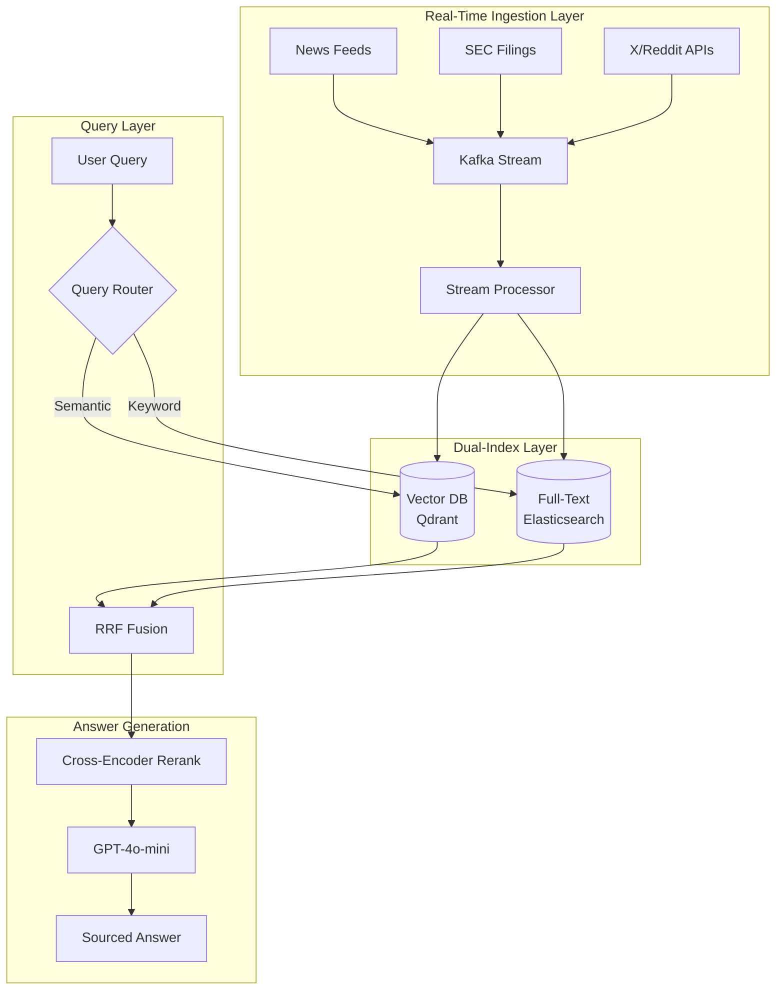

# 案例研究：即時 AI 搜尋引擎

## 問題

一家金融科技新創公司需要打造一個**即時市場情報平台**，讓分析師能夠以自然語言對即時市場數據、新聞與公司申報文件提出問題。

**面試中給定的限制條件：**
- 資料新鮮度：查詢必須反映最近 5 分鐘內的資訊
- 規模：10,000 名同時在線使用者、50,000 次查詢/小時
- 準確性：金融數據不得出現幻覺（hallucination）
- 延遲：p95 回應時間需低於 3 秒

---

## 面試題目

> 「設計一個系統，讓使用者可以詢問『過去一小時內關於 Tesla 的市場情緒如何？』並在 3 秒內取得準確、有來源依據的答案。」

---

## 解決方案架構



---

## 關鍵設計決策

### 1. 為什麼用 Kafka 做資料攝取（Ingestion）？

面試官想知道你是否理解**串流（streaming）與批次（batch）的差異**。

**回答：** Kafka 提供 exactly-once 的傳遞保證，並允許多個 consumer。我們有一個 consumer 負責寫入 vector DB，另一個負責寫入 Elasticsearch。如果 vector 索引建立落後，全文索引仍可持續服務查詢。這就是用於提升韌性的**雙寫入模式（dual-write pattern）**。

### 2. 為什麼採用混合搜尋（Vector + Full-Text）？

**回答：** 金融類查詢混合了語意性查詢（「關於 Tesla 的市場情緒」）與關鍵字查詢（「TSLA 10-K filing」）。純 vector 搜尋會漏掉精確的股票代號（ticker）比對。我們使用 **Reciprocal Rank Fusion（RRF）** 來合併結果。

### 3. 為什麼用 GPT-4o-mini 而非 GPT-4o？

**回答：** 在 50K 查詢/小時的條件下要達成 3 秒的 p95 延遲目標，我們需要快速的生成。GPT-4o-mini 提供每秒 100+ tokens，而 GPT-4o 僅約每秒 40 tokens。reranker 負責確保準確性；LLM 只需綜整已經過驗證的內容。

---

## 處理新鮮度需求

這個問題最困難的部分，在於確保索引能反映最近 5 分鐘內的資料。

**解決方案：以 TTL 為基礎的索引（TTL-Based Indexing）**

```python
# Each document gets a timestamp field
doc = {
    "content": "Tesla announces new factory...",
    "timestamp": datetime.now(UTC),
    "source": "Reuters",
    "ttl_hours": 24  # Auto-delete after 24 hours
}

# Query filters to last N minutes
def search_recent(query: str, minutes: int = 60):
    cutoff = datetime.now(UTC) - timedelta(minutes=minutes)
    return vector_db.search(
        query=query,
        filter={"timestamp": {"$gte": cutoff}}
    )
```

---

## 成本分析

| 元件 | 每月成本（以 50K 查詢/小時計） |
|-----------|-----------------------------------|
| Kafka (MSK) | $2,500 |
| Qdrant（託管服務） | $1,800 |
| Elasticsearch | $2,000 |
| GPT-4o-mini（生成） | $3,500 |
| Cross-encoder 重排序 | $800 |
| **總計** | **$10,600/month** |

---

## 面試延伸問題

**Q：你如何防止產生幻覺的金融數據？**

A：分三層：(1) LLM 只負責摘要檢索到的內容，絕不自行生成事實。(2) 每一個論述都必須引用一份來源文件。(3) 一個生成後的驗證器（validator）會檢查回應中的任何數字是否都逐字出現在某份來源文件中。

**Q：如果在新聞高峰期 Kafka 落後了怎麼辦？**

A：我們透過監控 consumer lag 來實作反壓（backpressure）。如果 lag 超過 2 分鐘，我們會在攝取端使用抽樣（sampling）來卸載負載。即時查詢會打向只包含最近一小時資料的「recent」索引；批次作業則負責回填（backfill）完整索引。

---

## 面試重點整理

1. **即時 AI 搜尋需要串流基礎設施**，而非批次 ETL
2. 在結構化領域中，**混合搜尋（語意 + 關鍵字）的表現優於純 vector 搜尋**
3. **延遲預算決定模型選擇**：用快速模型做綜整，把昂貴的模型留給推理任務
4. **新鮮度是一種篩選條件，而非功能**：應在索引層實作，而非在 prompt 層

---

*相關章節：[混合搜尋](../06-retrieval-systems/05-hybrid-search.md)、[服務基礎設施](../04-inference-optimization/06-serving-infrastructure.md)*
