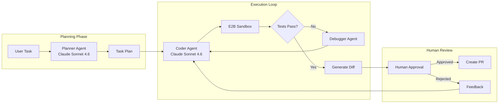
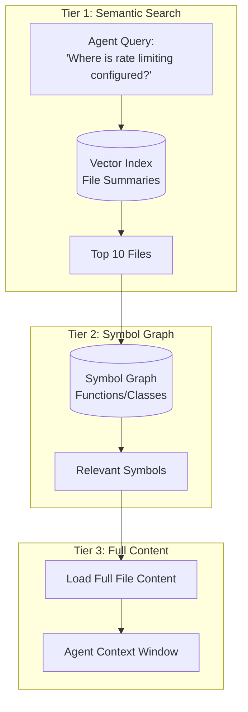

# 案例研究：自主編碼代理人

## 問題

一家開發者工具公司想要打造一個 **AI 編碼助理**，能夠自主完成跨多檔案的任務：「為這個 Express API 加上身份驗證」或「重構這個模組以使用依賴注入」。

**面試中給定的限制條件：**
- 必須能在 1,000+ 檔案的程式碼庫上運作
- 不能破壞現有功能（測試必須通過）
- 提交前必須經過人工核准變更
- 預算：每次任務完成成本低於 $0.50

---

## 面試題目

> 「設計一個編碼代理人，能夠接收像是『為所有 API 端點加上速率限制』這樣的任務，並產出一個可運作、已測試的 pull request。」

---

## 解決方案架構



---

## 關鍵設計決策

### 1. 為什麼要分開 Planner 與 Coder 代理人？

**解答：** 規劃任務需要**對整個程式碼庫進行推理**（要修改哪些檔案、存在哪些依賴關係）。編碼任務則需要**精確的語法生成**。透過將兩者分開，我們可以對規劃使用 extended thinking 模式，對編碼使用快速生成。這也讓我們能在規劃後設定檢查點，於執行前先讓人工審查整體做法。

### 2. 為什麼使用 E2B Sandbox 而非本機執行？

**解答：** 安全性考量。代理人會生成並執行程式碼。在本機執行會使主機系統暴露於風險中。E2B 提供一個隔離的容器，並在每個 session 結束後重置。如果代理人生成了 `rm -rf /`，它也只會摧毀該 sandbox。

### 3. 為什麼兩者都使用 Claude Sonnet 4.6？

**解答：** Claude Opus 4.7 以 64.3% 領先 SWE-bench Pro，而 Claude Sonnet 4.6 以約 40% 的價格提供了大約 90% 的品質，對於每個任務需要執行多個回合的代理人來說，這正是最佳平衡點。我們僅在 debugging 迴圈上啟用「Extended Thinking」，而非在初始生成時啟用，以控制成本。

---

## 程式碼庫理解問題

代理人無法將 1,000 個檔案全部塞進 context 中。我們以**分層檢索（Tiered Retrieval）**來解決這個問題：



**實作方式：**
1. **索引檔案摘要**（在 onboarding 期間由較小的模型生成）
2. **建立 symbol graph**，使用 tree-sitter 進行 AST 解析
3. **分階段檢索**：摘要 → symbols → 完整內容

---

## 自我修正迴圈

代理人會失敗。可靠性的關鍵在於**結構化的自我修正**：

```python
async def execute_with_retry(task: str, max_attempts: int = 3):
    for attempt in range(max_attempts):
        # Generate code
        code_changes = await coder_agent.generate(task)
        
        # Apply to sandbox
        sandbox.apply_changes(code_changes)
        
        # Run tests
        test_result = await sandbox.run_tests()
        
        if test_result.passed:
            return code_changes
        
        # Feed failure back to agent
        task = f"""
        Previous attempt failed. Error:
        {test_result.error}
        
        Original task: {task}
        
        Fix the issue.
        """
    
    raise MaxRetriesExceeded()
```

---

## 成本拆解

| 階段 | 模型 | Tokens（平均） | 成本 |
|-------|-------|--------------|------|
| 規劃 | Claude Sonnet 4.6（Extended） | 8,000 in / 2,000 out | $0.06 |
| 檔案檢索 | Embeddings | 50,000 | $0.01 |
| 編碼（每次嘗試） | Claude Sonnet 4.6 | 15,000 in / 3,000 out | $0.09 |
| 測試（平均 3 次執行） | - | - | $0.00 |
| **總計（平均 1.5 次嘗試）** | | | **$0.21** |

以每次任務 $0.21 的成本，在預算內。

---

## 面試延伸問題

**Q：你如何處理需要跨 20+ 檔案進行變更的任務？**

A：我們在規劃階段將它們拆解成子任務。Planner 會輸出一個帶有依賴關係的變更 DAG。Executor 以拓樸排序的順序處理這些變更，並逐步執行測試。如果第 5 步出錯，我們只需重新執行第 5 步以後的步驟，而不必重跑整個任務。

**Q：如果代理人陷入無限重試迴圈怎麼辦？**

A：有三道防護措施：(1) 最大嘗試次數限制（3 次）。(2) 如果同一個測試以相同的錯誤連續失敗兩次，則升級交由人工處理。(3) 每個任務的總 token 預算（$0.50）會觸發終止。

**Q：你如何防止代理人引入安全性漏洞？**

A：我們在 sandbox 中將靜態分析工具（Semgrep）作為測試套件的一部分執行。違反安全規則會被視為測試失敗，並回饋給代理人進行修正。

---

## 面試重點整理

1. **將規劃與執行分開**，以利設定檢查點與控制成本
2. **將所有生成的程式碼放入 sandbox** 以確保安全性（E2B、Docker 等）
3. **分層檢索解決大型程式碼庫的規模問題**：摘要 → symbols → 內容
4. **自我修正迴圈需要硬性限制**：嘗試次數、tokens、時間

---

*相關章節：[工具使用與 MCP](../07-agentic-systems/03-tool-use-and-mcp.md)、[錯誤處理](../07-agentic-systems/07-error-handling-and-recovery.md)*
