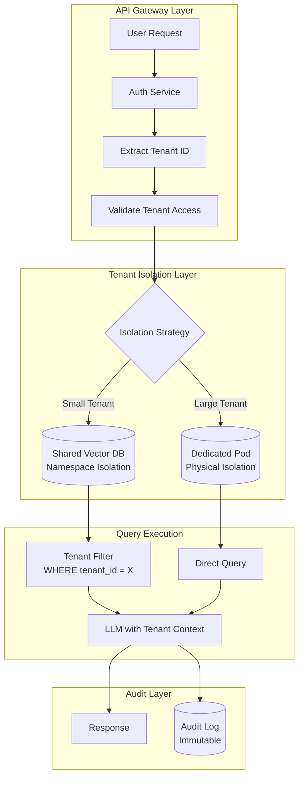
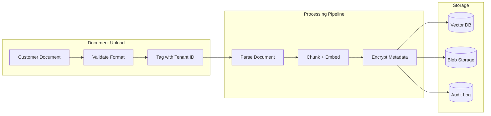

# 案例研究：多租戶 AI SaaS 平台

## 問題

一家 B2B 新創公司正在打造一個 **AI 驅動的文件分析平台**，每個客戶上傳自己的合約，由 AI 回答關於這些合約的問題。客戶之中包含彼此競爭的對手，他們絕對不能看到彼此的資料。

**面試中給定的限制條件：**
- 500 個企業客戶，每個擁有 10,000 至 100,000 份文件
- 絕對的資料隔離：客戶 A 的資料不能洩漏給客戶 B
- 為了成本效益而共用基礎設施
- 合規：SOC 2 Type II、GDPR
- 查詢延遲低於 2 秒

---

## 面試問題

> 「設計一個多租戶 RAG 系統，讓 Coca-Cola 與 Pepsi 都能成為客戶，而且跨租戶資料洩漏的風險為零。」

---

## 解決方案架構



---

## 關鍵設計決策

### 1. 混合式隔離：Namespace 對比 Physical

**解答：** 純粹的實體隔離（每個租戶一個資料庫）成本高昂。純粹的 namespace 隔離（共用資料庫搭配 tenant_id 過濾）一旦發生過濾器的 bug 就有洩漏風險。我們採用**分層做法**：

| 層級 | 租戶規模 | 隔離方式 | 原因 |
|------|-------------|------------------|-----|
| Standard | <50K 份文件 | 共用 Qdrant 中的 namespace | 成本效益佳 |
| Premium | 50K-500K 份文件 | 專屬 Qdrant collection | 效能隔離 |
| Enterprise | >500K 份文件 | 專屬 Qdrant pod | 實體隔離 + 法規要求 |

### 2. 資料隔離的縱深防禦

**解答：** 我們絕不信任單一層。我們的隔離堆疊：

1. **API Gateway**：從 JWT 驗證 tenant_id，拒絕跨租戶請求
2. **Database Layer**：以 row-level security（RLS）在資料庫層強制執行 tenant_id 過濾
3. **Application Layer**：ORM wrapper 自動注入租戶過濾器
4. **LLM Layer**：system prompt 明確聲明「你只為 Tenant X 作答」
5. **Output Layer**：生成後的過濾器掃描是否有任何不屬於該租戶的文件 ID

### 3. 為什麼不為每個租戶各配一個 Vector DB？

**解答：** 500 個租戶 × 每個受管實例 $100/month = 光是資料庫就要 $50K/month。透過為 80% 的租戶採用 namespace 隔離，我們將其降低至 $8K/month。其餘 20% 採用專屬基礎設施，支付高階層級的價格。

---

## 資料攝取管線



**關鍵：** tenant_id 在**最早可能的時間點**（上傳驗證時）就附加上去，並隨著文件貫穿每一個階段。它不會在之後才被推導或查找出來。

---

## 處理合規要求

### SOC 2 Type II

| 控制項 | 實作方式 |
|---------|----------------|
| 存取記錄 | 每次查詢皆記錄 tenant_id、user_id、timestamp |
| 靜態加密 | blob storage 使用 AES-256，vector DB 使用資料庫原生加密 |
| 傳輸加密 | 全程使用 TLS 1.3 |
| 存取審查 | 從稽核日誌自動產生每季報告 |

### GDPR 刪除權

```python
async def delete_tenant_data(tenant_id: str):
    # 1. Delete from vector DB
    await vector_db.delete(filter={"tenant_id": tenant_id})
    
    # 2. Delete from blob storage
    await blob_storage.delete_prefix(f"tenants/{tenant_id}/")
    
    # 3. Anonymize audit logs (cannot delete for compliance)
    await audit_log.anonymize(tenant_id=tenant_id)
    
    # 4. Generate deletion certificate
    return generate_deletion_certificate(tenant_id)
```

---

## 成本分析（500 個租戶）

| 元件 | 每月成本 |
|-----------|--------------|
| 共用 Vector DB（Qdrant Cloud） | $2,500 |
| 專屬 pods（20 個 enterprise 租戶） | $4,000 |
| LLM 成本（共用池，GPT-4o-mini） | $8,000 |
| Blob storage（S3） | $1,500 |
| 稽核記錄（CloudWatch） | $500 |
| **總計** | **$16,500/month** |
| **每租戶平均** | **$33/month** |

---

## 面試追問

**Q：如果你 ORM 裡的某個 bug 繞過了租戶過濾器怎麼辦？**

A：縱深防禦。即使 ORM 失效，資料庫仍會強制執行 RLS（Row-Level Security）。查詢 `SELECT * FROM documents` 在內部會變成 `SELECT * FROM documents WHERE tenant_id = current_tenant()`。這是在 Postgres 層強制執行，而非在應用層。

**Q：你如何處理想要匯出自己全部資料的租戶？**

A：我們提供一個資料可攜性 API，串流所有文件連同其 embedding 與 metadata。匯出由管理員觸發、記錄於稽核軌跡中，並交付至客戶自行控管的 S3 bucket（而非我們的基礎設施）。

**Q：如果 LLM 從其訓練資料中產生幻覺，而這些資訊恰好與某競爭對手的機密資訊相符，怎麼辦？**

A：這是真實存在的風險。我們的緩解方式為：(1) 只使用以檢索為依據的生成（LLM 在沒有檢索到文件時無法作答）。(2) 過濾輸出中任何無法追溯回該租戶上傳文件的內容。(3) 提供「private model」層級，我們僅以租戶自身的資料來 fine-tune 一個租戶專屬模型。

---

## 面試重點整理

1. **多租戶的核心在於分層**：絕不依賴單一隔離機制
2. **分層隔離在成本與安全之間取得平衡**：並非所有租戶都需要專屬基礎設施
3. **Tenant ID 必須不可變且在早期就附加**：在上傳時標記，而非在查詢時
4. **合規是一個架構議題**：從第一天起就為稽核、刪除與可攜性進行設計

---

*相關章節：[Multi-Tenant RAG Isolation](../12-security-and-access/04-multi-tenant-rag-isolation.md)、[RBAC for AI Systems](../12-security-and-access/02-rbac-for-ai-systems.md)*
