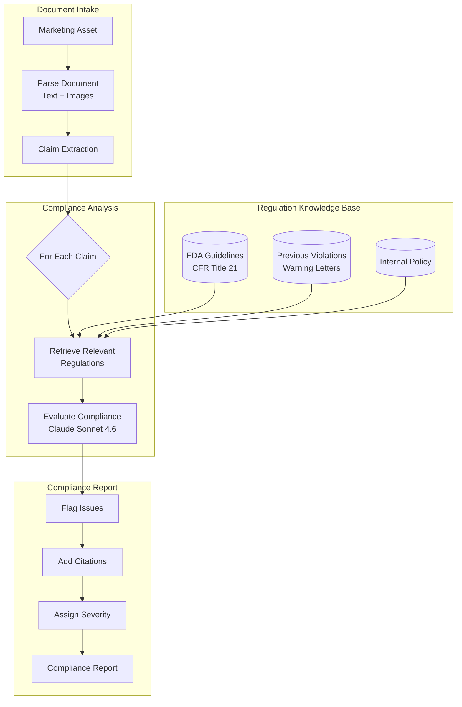
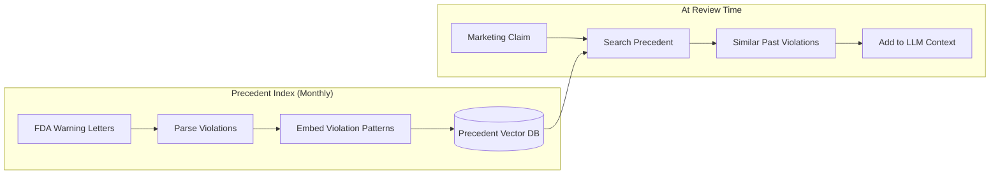
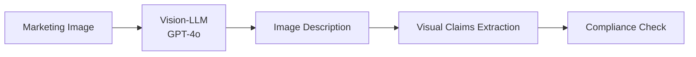

# 案例研究：法規合規自動化

## 問題描述

一家製藥公司必須確保所有行銷素材都符合 **FDA 法規**。目前，每件素材的法務審查需要 2 週。他們希望透過 AI 預先篩查素材並標記問題，將法務審查縮短至 2 天。

**面試中給定的限制條件：**
- 必須引用特定的法規章節，而不只是「這看起來不對」
- 不可接受偽陰性（漏掉違規項目）
- 偽陽性（過度標記）應低於 20%
- 每月 500 件行銷素材
- 需要稽核軌跡以供法規檢查

---

## 面試問題

> 「設計一個系統，審查製藥行銷素材，並透過引用來指出特定的法規違規項目。」

---

## 解決方案架構



---

## 關鍵設計決策

### 1. 在合規檢查之前先做主張擷取（Claim Extraction）

**解答：** 行銷素材內容密集。針對整份文件逐一比對法規效率不彰。我們會先擷取出個別的**主張（claims）**：

```python
claims = extract_claims(document)
# Example output:
# [
#   {"text": "Reduces symptoms by 80%", "type": "efficacy", "location": "page 2, para 3"},
#   {"text": "No side effects reported", "type": "safety", "location": "page 3, header"},
#   {"text": "Recommended by doctors", "type": "endorsement", "location": "page 1, image"}
# ]
```

接著針對每一項主張獨立比對相關法規進行檢查。

### 2. 法規為何採用 RAG 而非 fine-tuning？

**解答：** 法規會變動。FDA 每月都會更新指引文件。Fine-tuning 在每次更新後都需要重新訓練。RAG 讓我們能夠：
- 在新指引發布時立即更新法規索引
- 追蹤每次審查所使用的法規版本（稽核軌跡）
- 向法務審查人員呈現確切的來源段落

### 3. 保守的標記策略

**解答：** 偽陰性（漏掉的違規項目）會造成災難性後果；偽陽性（額外審查）只是耗費時間。我們採用**門檻階層（threshold hierarchy）**：

| 信心度 | 處置 |
|------------|--------|
| >90% 違規 | 標記為 HIGH 嚴重度 |
| 70-90% 可能違規 | 標記為 MEDIUM，註明疑慮 |
| 50-70% 不明確 | 標記為 LOW，註記模稜兩可之處 |
| <50% 可能合規 | 不標記，但記錄以供稽核 |

我們絕不會在未記錄推理過程的情況下直接輸出「合規」。

---

## 判例資料庫

法規往往語意模糊。過往的 FDA 警告信（warning letters）能釐清規則實際上是如何被執行的：



**為什麼這很重要：** 像「臨床證實（clinically proven）」這樣的主張，單就法規來看可能沒問題。但如果我們找到 5 封 FDA 警告信，當中都因企業在沒有特定試驗數據的情況下使用「clinically proven」而被點名，那就是一個警訊。

---

## 稽核軌跡需求

每一項決策都必須可追溯：

```python
compliance_decision = {
    "claim_id": "claim_003",
    "claim_text": "No side effects reported",
    "decision": "VIOLATION",
    "severity": "HIGH",
    "regulation_cited": "21 CFR 202.1(e)(5)",
    "regulation_text": "Advertisements shall not contain claims that...",
    "precedent_cited": "Warning Letter 2023-FDA-04521",
    "reasoning": "Claim implies absolute safety, which contradicts...",
    "model_used": "claude-3-7-sonnet-20251022",
    "timestamp": "2025-12-21T10:30:00Z",
    "reviewer_id": null,  # Filled when human reviews
    "final_decision": null  # Filled after legal review
}
```

---

## 處理圖片與影片

製藥行銷包含視覺性主張（開心的病患、使用前後對比圖）：



**範例：** 一張顯示病患在跑步的圖片，暗示了療效。如果該藥物用於治療關節炎，我們會檢查臨床試驗是否支持「改善行動能力（improved mobility）」這類主張。

---

## 成本分析

| 階段 | 每件素材成本 |
|-------|----------------|
| 文件解析 | $0.05 |
| 主張擷取 | $0.15 |
| 法規檢索 | $0.02 |
| 合規評估（每項主張，平均 12 項主張） | $1.80 |
| 圖片分析（平均 5 張圖片） | $0.75 |
| 報告產生 | $0.10 |
| **總計** | **$2.87** |

以每月 500 件素材計算：**$1,435/月**（相較於等量法務工時所需的 $50K+/月）

---

## 面試延伸問題

**Q：你如何處理需要人為判斷的法規？**

A：我們不取代人類，而是進行分流（triage）。系統會標記問題並附上信心分數。低信心的標記交由資深法務顧問處理。高信心的明確項目則跳過詳細審查。這透過將人力專注於邊緣案例，將原本 2 週的審查縮短至 2 天。

**Q：如果 FDA 在月中更新了某項法規怎麼辦？**

A：我們有一套「法規監看（Regulation Watch）」服務，會監控 FDA 的 RSS feed 與聯邦公報（Federal Register）更新。當偵測到相關更新時，我們會重新建立索引，並標記出任何可能受該變更影響的近期審查。

**Q：在稽核期間，你如何向監管機構解釋 AI 的推理過程？**

A：每一項決策都包含完整的推理鏈：擷取出的主張、檢索到的法規、引用的判例，以及模型的評估。我們可以向監管機構確切展示某項決策的成因，並附上所有元件的版本編號。

---

## 面試重點整理

1. **先做主張擷取**：將複雜文件拆解為可審查的單元
2. **判例資料庫勝過純法規文字**：規則實際上如何被執行才是關鍵
3. **高風險領域採用保守門檻**：以召回率（recall）為優化目標，而非精確率（precision）
4. **稽核軌跡即架構**：從第一天起就為可解釋性而設計

---

*相關章節：[RAG 基礎](../06-retrieval-systems/01-rag-fundamentals.md)、[Guardrails 實作](../13-reliability-and-safety/01-guardrails-implementation.md)*
