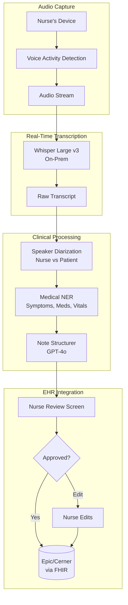
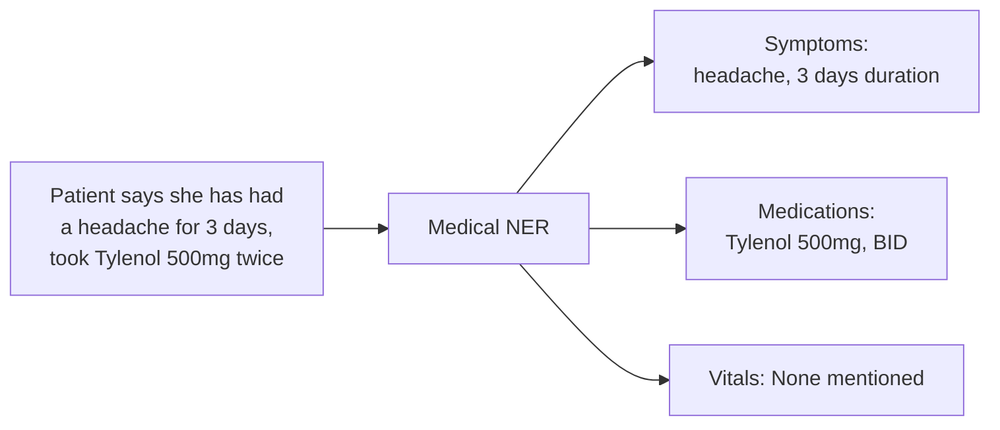

# 案例研究：醫療照護領域的語音 AI 助理

## 問題

某醫院體系想要一套**語音式 AI 助理**，協助護理師記錄病患就診過程。護理師自然地說話，AI 即時產生結構化的臨床記錄。

**面試中給定的限制條件：**
- HIPAA 法規遵循（PHI 處理）
- 能在嘈雜的醫院環境中運作
- 即時轉錄（延遲低於 500ms）
- 必須正確使用醫療術語
- 與既有 EHR（Epic/Cerner）整合

---

## 面試題目

> 「設計一套語音助理，讓護理師在病患就診期間能對它說話，並在 EHR 中產生一份結構化的臨床記錄。」

---

## 解決方案架構



---

## 關鍵設計決策

### 1. 採用地端 ASR 以符合 HIPAA

**答案：** PHI 在未經加密與簽訂 BAA 的情況下不能離開醫院網路。我們在本地 GPU 伺服器上部署 Whisper Large v3，而不是使用雲端 API：

| 選項 | 延遲 | HIPAA | 成本 |
|--------|---------|-------|------|
| 雲端 ASR（OpenAI） | 200ms | 需要 BAA，資料離開網路 | $0.006/min |
| 地端 Whisper | 150ms | 完全掌控，無資料外流 | $0.002/min（GPU 攤提後） |

地端方案在延遲與法規遵循兩方面都勝出。

### 2. 語者分離：誰說了什麼

**答案：** 記錄必須區分「病患主訴頭痛」與「護理師觀察到病患皺眉」。我們採用：

```python
# Pyannote for speaker diarization
diarization = pipeline("audio.wav")
# Output: [(0.0, 1.5, "SPEAKER_0"), (1.5, 4.2, "SPEAKER_1"), ...]

# Map speakers based on voice profile
roles = identify_roles(diarization, known_nurse_voiceprint)
# Output: {"SPEAKER_0": "nurse", "SPEAKER_1": "patient"}
```

護理師的裝置會在設定階段擷取其聲紋，以進行角色辨識。

### 3. 以醫療 NER 進行結構化擷取

**答案：** 我們需要的是結構化資料，而不只是文字敘述。醫療 NER 會擷取：



我們使用經過 fine-tuning 的 BioBERT 模型來做 NER，而非使用 LLM，因為 NER 需要快速且具確定性。

---

## 處理嘈雜環境

醫院很吵。我們採用多種策略：

1. **指向性麥克風**：護理師裝置上的麥克風聚焦於鄰近的語音
2. **抗噪 ASR 模型**（Whisper 是以含噪資料訓練而成）
3. **信心度門檻**：若 ASR 信心度低於 0.7，我們會標記交由護理師審查，而非貿然猜測
4. **關鍵字偵測**：醫療術語擁有自訂的發音模型

---

## 結構化記錄格式

LLM 會產生 SOAP 格式的記錄：

```python
note_prompt = f"""
Generate a clinical SOAP note from this encounter transcript.

Transcript:
{transcript_with_speakers}

Extracted entities:
- Symptoms: {symptoms}
- Medications: {medications}
- Vitals: {vitals}

Output format:
S (Subjective): Patient's reported symptoms
O (Objective): Nurse's observations and measurements
A (Assessment): Clinical impression
P (Plan): Next steps, orders
"""
```

---

## EHR 整合（FHIR）

輸出必須是 EHR 可機讀的格式：

```json
{
  "resourceType": "DocumentReference",
  "status": "current",
  "type": {
    "coding": [{"system": "http://loinc.org", "code": "34117-2", "display": "History and physical note"}]
  },
  "subject": {"reference": "Patient/12345"},
  "author": [{"reference": "Practitioner/nurse789"}],
  "content": [{
    "attachment": {
      "contentType": "text/plain",
      "data": "base64-encoded-soap-note"
    }
  }],
  "context": {
    "encounter": {"reference": "Encounter/visit456"}
  }
}
```

---

## 延遲預算

| 階段 | 目標 | 實際 |
|-------|--------|--------|
| 音訊擷取至 VAD | 50ms | 30ms |
| ASR 轉錄 | 200ms | 150ms |
| 語者分離 | 100ms | 80ms |
| NER 擷取 | 50ms | 40ms |
| LLM 結構化 | 500ms | 450ms |
| **總計（端到端）** | **900ms** | **750ms** |

為了營造即時感，我們會串流部分轉錄結果，同時讓 NER 與 LLM 對已完成的句子進行處理。

---

## 面試延伸問題

**Q：你如何處理醫療縮寫與行話？**

A：我們維護一份自訂詞彙清單，將縮寫（PRN、BID、SOB）對應到完整術語。這份清單會同時注入 ASR 模型（以提升辨識率）與 LLM prompt（讓記錄中能正確展開縮寫）。

**Q：如果護理師在句子中途做了更正怎麼辦？**

A：我們會偵測更正模式（「其實，我的意思是……」、「不，等等，應該是……」），並只採用更正後的版本。當出現衝突時，LLM 會被指示優先採用較晚的陳述。

**Q：你如何確保 AI 不會遺漏關鍵資訊？**

A：我們有一項「完整性檢查」，會驗證記錄是否包含所有被擷取的實體。若 NER 找到「胸痛」，但 SOAP 記錄中未提及，我們就會標記交由護理師審查。我們也會執行一項「安全關鍵」偵測器，當出現自殺意念、虐待或其他強制通報觸發事項時加以升級處理。

---

## 面試重點整理

1. **醫療照護採地端方案**：HIPAA 往往要求在本地處理
2. **語者分離不可或缺**：誰說了什麼在臨床上至關重要
3. **混合式擷取**：用快速的 NER 做結構化，用 LLM 做文字敘述生成
4. **永遠保留人工審查**：尤其是臨床文件記錄

---

*相關章節：[Multimodal Models](../02-model-landscape/04-multimodal-models.md)、[Reliability Patterns](../15-ai-design-patterns/05-reliability-patterns.md)*
