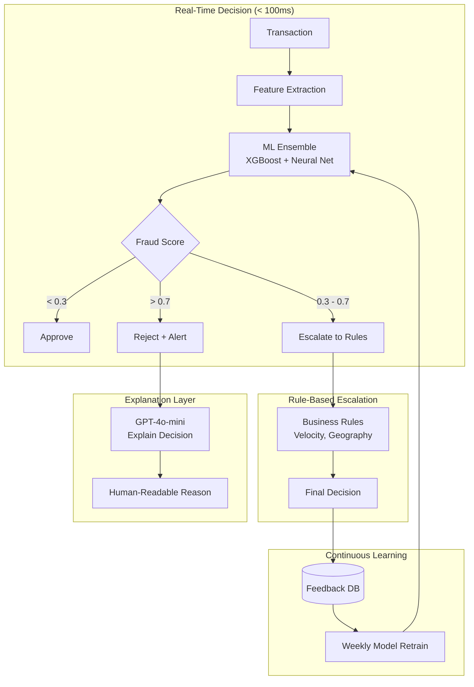
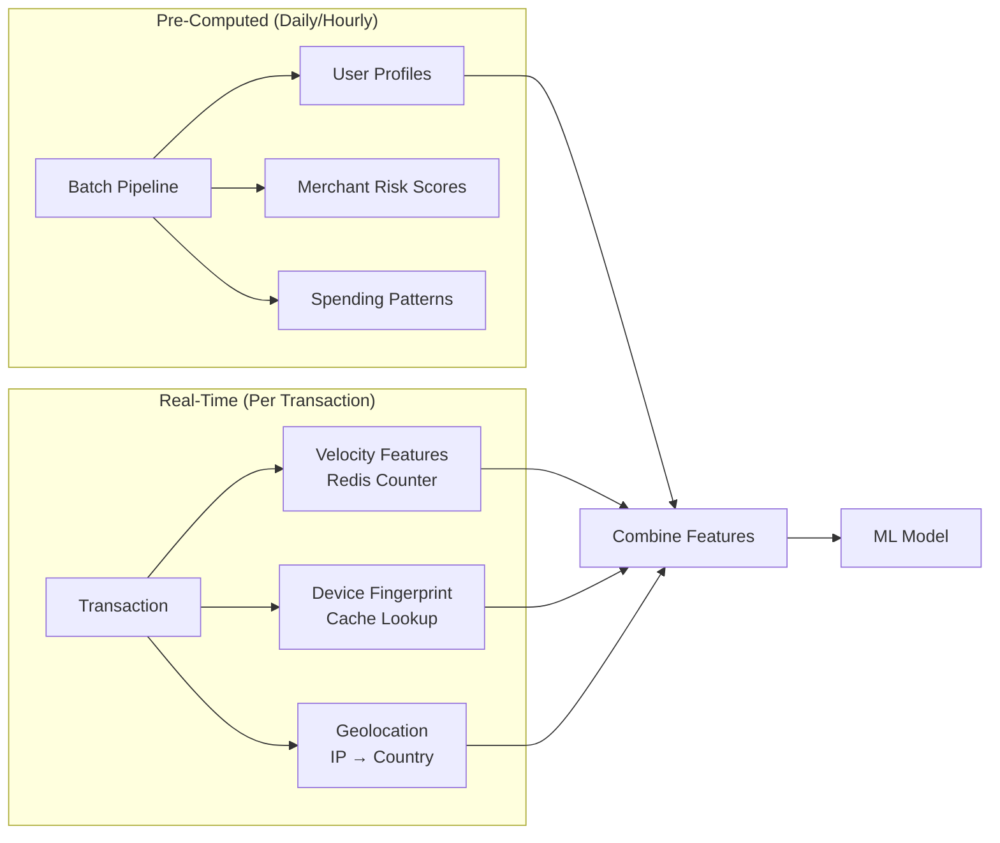
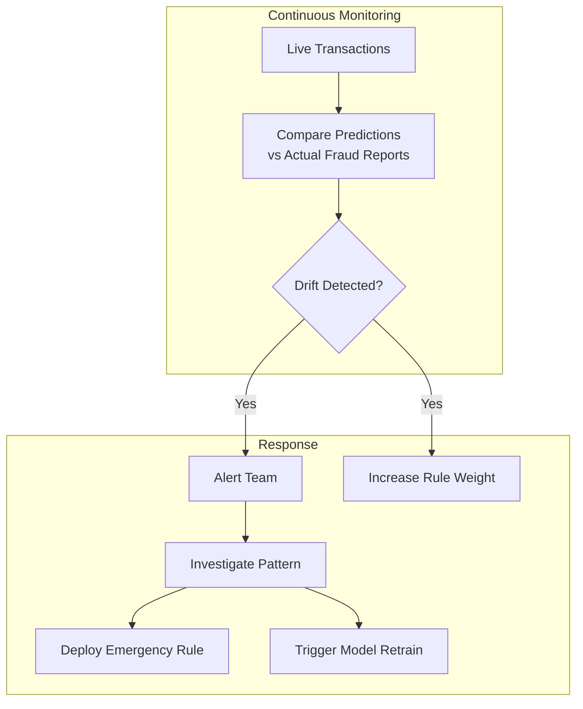

# 案例研究：即時詐欺偵測

## 問題

某支付處理商每天處理 **1,000 萬筆交易**。他們需要即時偵測詐欺交易，在交易完成前加以攔截，同時將會惹惱合法客戶的誤判降到最低。

**面試中給定的限制條件：**
- 決策延遲：低於 100ms
- 誤判率：低於 0.1%（千分之一）
- 必須能解釋為何某筆交易被標記
- 法規要求保留 7 年的稽核軌跡
- 詐欺模式持續演變

---

## 面試題目

> 「設計一套系統，在 100ms 內決定要核准、拒絕或升級處理一筆信用卡交易，並且能夠解釋該決策。」

---

## 解決方案架構



---

## 關鍵設計決策

### 1. 為何採用 ML + 規則，而非只用 ML？

**回答：** 純 ML 模型是黑盒子。法規要求對於爭議交易必須提供可解釋的決策。我們使用 ML 進行評分，再套用透明的規則來做出最終決策：

| 層級 | 角色 | 速度 | 可解釋性 |
|-------|------|-------|----------------|
| ML Ensemble | 捕捉複雜模式 | 10ms | 低 |
| Business Rules | 編碼已知的詐欺類型 | 5ms | 高 |
| Combined | 兼具兩者優點 | 15ms | 中高 |

規則範例：「若在 1 小時內出現 5 筆以上來自不同國家的交易則攔截」對法規單位而言是可解釋的。

### 2. 三向決策：核准 / 升級 / 拒絕

**回答：** 二元的核准/拒絕過於粗略。「灰色地帶」（分數 0.3-0.7）會交由規則式升級處理，或針對高金額交易進行人工審查：

```python
def decide(transaction, fraud_score):
    if fraud_score < 0.3:
        return "APPROVE", None
    elif fraud_score > 0.7:
        reason = explain_rejection(transaction, fraud_score)
        return "REJECT", reason
    else:
        # Gray zone: apply business rules
        if check_velocity_rules(transaction):
            return "REJECT", "Velocity limit exceeded"
        if check_geography_rules(transaction):
            return "ESCALATE", "Unusual location"
        return "APPROVE", None
```

### 3. 為何用 LLM 做解釋，而非 SHAP/LIME？

**回答：** SHAP 值告訴你「特徵 X 對分數貢獻了 0.3」。客戶與法規單位想要的是「這筆交易被標記，是因為它來自一台從未在你造訪過的國家使用過的新裝置，且金額是你平常消費的 10 倍。」

我們以特徵重要性作為輸入，生成自然語言的解釋：

```python
prompt = f"""
Explain why this transaction was flagged as potentially fraudulent.

Transaction details:
- Amount: ${amount}
- Merchant: {merchant}
- Location: {location}
- Device: {device}

Top contributing factors:
1. {factors[0]['feature']}: {factors[0]['contribution']}
2. {factors[1]['feature']}: {factors[1]['contribution']}
3. {factors[2]['feature']}: {factors[2]['contribution']}

Write a 2-sentence explanation for the cardholder.
"""
```

---

## 為速度而設計的特徵工程

100ms 的預算意味著特徵必須事先預先計算：



**關鍵洞見：** 使用者輪廓（平均消費、常往來的商家、居住地理位置）是離線計算的。即時階段只需加上交易專屬的特徵。

---

## 因應演變中的詐欺模式

詐欺者會適應。上個月的模型會漏掉這個月的攻擊。



**緊急規則**可在數分鐘內部署（僅需更新設定）。模型重新訓練需要數天，但能捕捉更細微的模式。

---

## 面試追問問題

**問：你們如何處理模型延遲尖峰？**

答：我們有一套 **fallback stack（後援堆疊）**。若 ML 模型未在 50ms 內回應，我們就退回到只使用規則式評分。這些規則涵蓋了最常見的詐欺模式。針對金額低於 $10 的交易，當所有系統都變慢時，我們還有一個「預設核准」機制。

**問：那協同式的詐欺攻擊呢？**

答：我們維護全域的 velocity counter（速率計數器）（不只是每位使用者的）。如果我們看到在 1 分鐘內，有 100 筆來自不同卡片的交易流向同一個冷門商家，即使個別交易看起來都很乾淨，這也會觸發商家層級的攔截。

**問：你們如何在防詐與客戶體驗之間取得平衡？**

答：我們追蹤「insult rate（冒犯率）」：被攔截的合法客戶所佔的百分比。每個產品團隊都有一個冒犯預算。如果詐欺模型的冒犯率超過預算，我們會自動放寬門檻並通知團隊。寧可接受稍微多一點的詐欺，也不要激怒忠實的客戶。

---

## 面試重點整理

1. **ML 負責評分，規則負責可解釋性**：在受監管的領域中結合兩者
2. **三向決策可降低誤判**：灰色地帶會接受額外審查
3. **盡可能預先計算所有東西**：即時預算只用於組合特徵
4. **持續重新訓練至關重要**：詐欺模式每週都在演變

---

*相關章節：[Evaluation and Observability](../14-evaluation-and-observability/)、[Reliability Patterns](../15-ai-design-patterns/05-reliability-patterns.md)*
