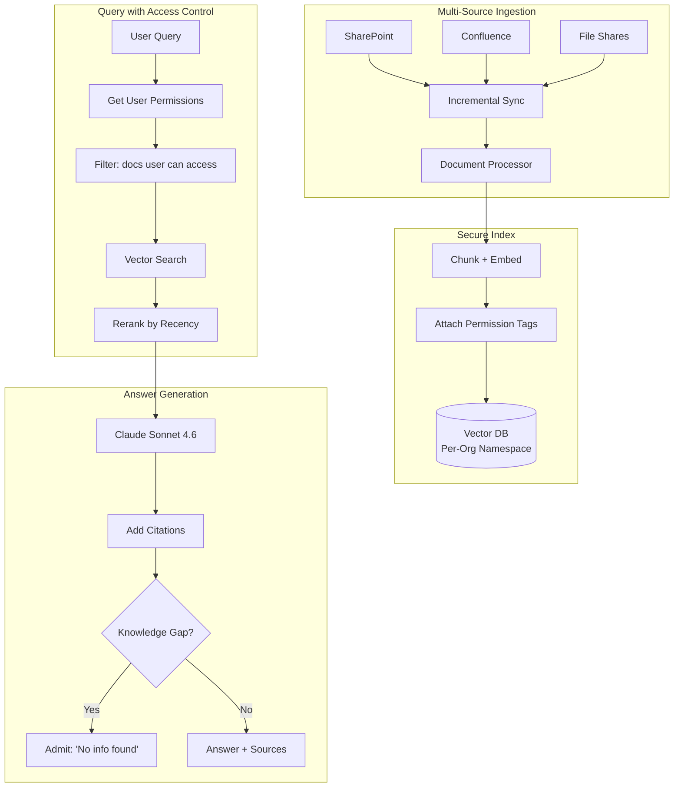
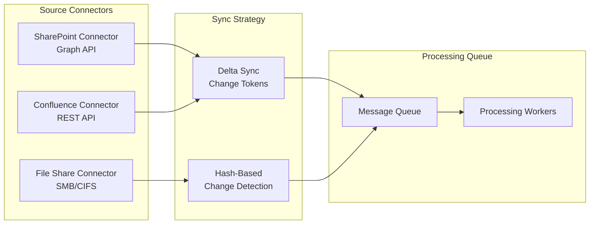

# 案例研究：企業知識管理

## 問題

一間擁有 **10,000 名員工** 的顧問公司，數十年來累積的專案報告、方法論文件與專業知識，分散在 SharePoint、Confluence 與檔案共享之中。他們希望打造一套 AI 系統，讓顧問可以詢問「我們過去是如何為汽車產業客戶處理供應鏈優化的？」並得到從內部知識綜整而成的答案。

**面試中給定的限制條件：**
- 橫跨 15 個資料來源的 2 百萬份文件
- 存取控制：associate 不可看到 partner 等級的內容
- 每一項主張都必須引用來源
- 過時資料的處理：舊的方法論不應覆蓋新的方法論
- 知識缺口應被辨識出來，而非被幻覺捏造

---

## 面試題目

> 「設計一套內部知識助理，讓資淺顧問可以提問，並且只根據他們有權限檢視的文件取得答案。」

---

## 解決方案架構



---

## 關鍵設計決策

### 1. 權限感知檢索（Permission-Aware Retrieval）

**答案：** 每一個 chunk 都會帶有來自來源系統的權限 metadata：

```python
chunk = {
    "content": "Our approach to automotive supply chain...",
    "source": "sharepoint://projects/acme-motors/final-report.docx",
    "permissions": {
        "read_groups": ["partners", "managers", "automotive-team"],
        "classification": "confidential"
    },
    "last_modified": "2024-03-15",
    "author": "jane.doe@firm.com"
}
```

在查詢時，我們在檢索之前先做過濾：

```python
def search(query: str, user: User):
    user_groups = get_user_groups(user.id)
    
    return vector_db.search(
        query=query,
        filter={
            "permissions.read_groups": {"$in": user_groups}
        }
    )
```

### 2. 時近性加權排序（Recency-Weighted Ranking）

**答案：** 對於同一個主題，一份 2024 年的方法論文件應該排在 2019 年的文件之前。我們使用一個 **衰減函數（decay function）**：

```python
def recency_boost(doc_date):
    age_days = (today - doc_date).days
    # Half-life of 365 days
    return 0.5 ** (age_days / 365)

final_score = semantic_score * 0.7 + recency_boost(doc.date) * 0.3
```

這可以避免過時的做法淹沒掉現行的指引。

### 3. 知識缺口偵測（Knowledge Gap Detection）

**答案：** 我們必須區分「我什麼都沒找到」與「我在憑空捏造」：

```python
def generate_answer(query: str, retrieved_docs: list):
    if len(retrieved_docs) == 0 or max_relevance_score < 0.5:
        return {
            "answer": "I could not find relevant information in our knowledge base for this query.",
            "confidence": "low",
            "suggestion": "Try contacting the Automotive Practice lead directly."
        }
    
    # Generate from retrieved content
    answer = llm.generate(query, context=retrieved_docs)
    return {"answer": answer, "confidence": "high", "sources": [d.source for d in retrieved_docs]}
```

---

## 多來源同步（Multi-Source Synchronization）



**關鍵洞見：** SharePoint 與 Confluence 支援 change token（delta sync），檔案共享則需要雜湊比對。兩者都會匯入一個統一的處理佇列。

---

## 處理相互衝突的資訊

不同的文件之間可能存在相互矛盾的指引。我們會將這種情況顯露出來：

```python
def detect_conflicts(retrieved_docs):
    # Group by topic
    topics = cluster_by_topic(retrieved_docs)
    
    for topic, docs in topics.items():
        if has_contradictions(docs):
            return {
                "warning": "Found conflicting guidance",
                "perspectives": [
                    {"source": d.source, "date": d.date, "view": summarize(d)}
                    for d in docs
                ],
                "recommendation": "Defer to most recent document or consult practice lead."
            }
```

---

## 成本分析

| 元件 | 每月成本 |
|-----------|--------------|
| Embedding（2M 份文件 × 更新） | $500 |
| Vector DB（Pinecone Enterprise） | $2,000 |
| LLM 生成（50K 次查詢） | $3,000 |
| 同步基礎設施（connector） | $500 |
| **總計** | **$6,000/month** |

ROI：顧問平均每週可省下 2 小時的資訊搜尋時間。以 10,000 名顧問 × $100/小時 × 2 小時 × 4 週計算，每月可帶來 $8M 的生產力。此系統的效益是其成本的 1,300 倍。

---

## 面試延伸問題

**Q：你如何處理權限混雜的文件？**

A：我們在章節（section）層級進行 chunk，每個章節會繼承其所有上層中最嚴格的權限。一份整體為「internal」的文件中，若某個「confidential」章節內含一段文字，該段文字會被標記為「confidential」。

**Q：那即時協作文件（Google Docs、即時的 Confluence 頁面）該怎麼辦？**

A：我們有一條獨立的「live document」管線，同步頻率更高（每 5 分鐘一次，相較於靜態檔案的每日一次）。這些文件在被定稿之前，會在搜尋結果中被標記為「draft」。

**Q：你如何防止這套系統變成洩漏未授權資料的漏洞抽象層（leaky abstraction）？**

A：我們絕不會將未授權內容放進 LLM 的 context，即使只是為了說「我無法向你顯示這個」也不行。這套系統的行為表現得彷彿那些未授權文件根本不存在。這可以防止推論攻擊（inference attack）——也就是使用者藉由探問「你有沒有關於 X 的資訊？」來推斷出某些機密專案是否存在。

---

## 面試重點整理

1. **權限必須在檢索階段強制執行，而非在生成階段**：在 LLM 看到內容之前就先過濾
2. **時近性加權可避免過時知識**：舊文件的相關性會隨時間衰減
3. **承認缺口，而非產生幻覺**：信心門檻與備援訊息機制
4. **多來源同步很複雜**：不同的 API 需要不同的策略

---

*相關章節：[RAG 基礎](../06-retrieval-systems/01-rag-fundamentals.md)、[多租戶隔離](../12-security-and-access/04-multi-tenant-rag-isolation.md)*
