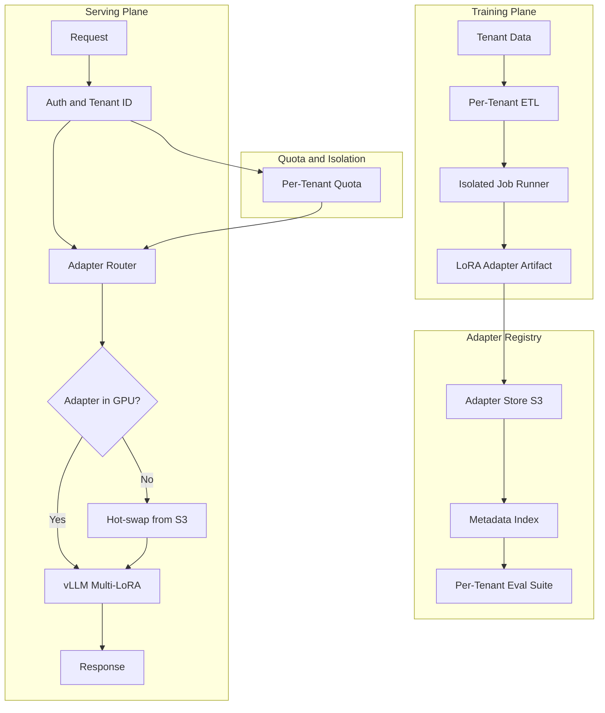
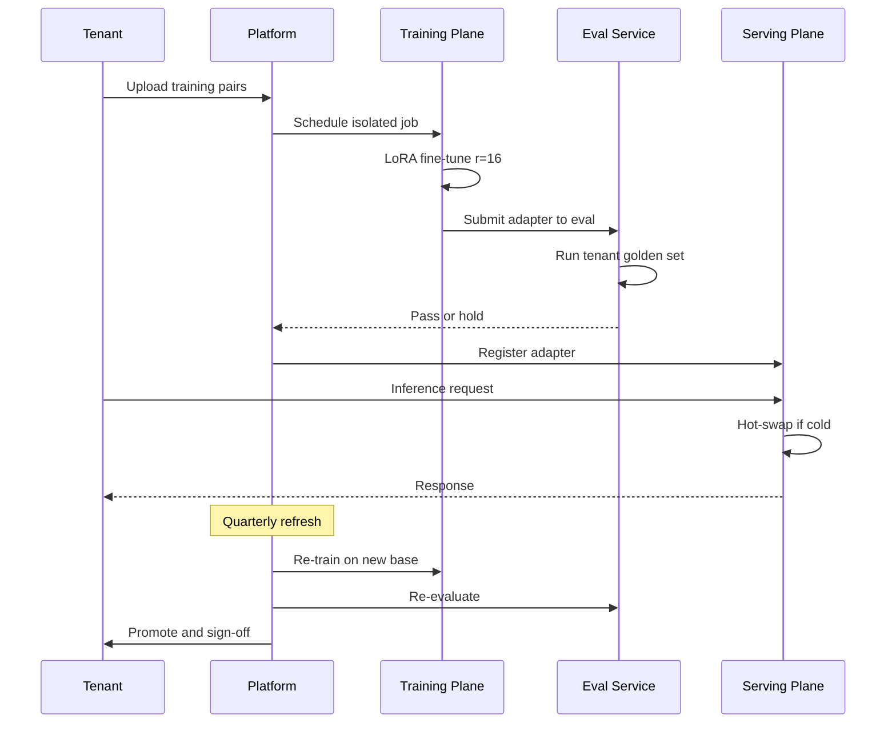

# 案例研究：多租戶微調平台

一家垂直 AI 廠商以單一 base model 加上每租戶各自的 LoRA adapter，服務 280 家客戶，並具備隔離的訓練流程、每租戶各自的 eval-as-PRD，以及讓 p99 latency 維持在 1.2 秒以內的吵雜鄰居（noisy-neighbor）緩解機制。

## 商業問題

一家法律科技領域的垂直 SaaS 廠商經營一款合約分析產品。其 280 家企業客戶每一家都期望模型能尊重他們自己的範本、判例語料庫，以及偏好的撰寫風格。現成的 prompting 並不夠用：客戶會對通用模型進行盲測 A/B test，一旦輸出偏離自家風格就會拒用這套產品。為每個租戶各訓練一個獨立的 fine-tuned model 同樣不可行：在 70B parameters 規模下，每個模型在磁碟上佔 140 GB，且需要一張專屬 H100 來提供服務，這會徹底破壞單位經濟效益。

2026 年 5 月現實面的限制條件：

- 280 個付費租戶，每年翻倍
- 每個租戶擁有 1,000 到 250,000 筆歷史合約配對（輸入加上偏好的修訂）
- 租戶要求提供 eval 報告，證明在他們自己的測試集上表現合適
- 每次查詢的 latency 預算：p99 低於 1.2 秒
- 各租戶適用不同的合規制度：SOC 2、ISO 27001、HIPAA、FedRAMP Moderate

團隊選擇在共享的 base model 上採用每租戶的 LoRA adapter。LoRA（[Hu et al., 2021](https://arxiv.org/abs/2106.09685)）與 QLoRA（[Dettmers et al., 2023](https://arxiv.org/abs/2305.14314)）都已相當成熟；vLLM 的 multi-LoRA serving（[文件](https://docs.vllm.ai/en/latest/models/lora.html)）與 SGLang 的 adapter 抽換機制，讓許多 adapter 能在 GPU memory 中共享同一個 base model。Anyscale 與 Together AI 都已發表過關於這種模式的生產環境案例研究（[Anyscale 2024 文章](https://www.anyscale.com/blog/fine-tuning-llms-lora-or-full-parameter-an-in-depth-analysis)、[Together AI multi-LoRA serving](https://www.together.ai/blog/multi-lora-inference)）。

## 架構

### 元件

| 層級 | 技術 | 用途 |
|-------|------|---------|
| Base model | Llama 4 70B int8 | 所有租戶共享 |
| Adapter | 在 attention layers 上採用 LoRA r=16，每租戶約 120 MB | 每租戶的適應化 |
| 訓練 | 在 8x H100 節點上採用 DeepSpeed ZeRO-3 | 租戶隔離的工作 |
| Serving | vLLM 0.7+ 搭配 PagedAttention 與 multi-LoRA | 一個 base、多個 adapter |
| Adapter 儲存 | S3，搭配每租戶的 KMS keys | 靜態加密 |
| Eval 儲存 | 每租戶的 golden set，每次重新訓練都會執行 | 每租戶的 eval-as-PRD |

### 訓練時的資料流

1. 客戶透過一個搭配專屬 IAM role 的每租戶 S3 bucket 上傳訓練配對；KMS keys 為每租戶各自一組。
2. ETL 工作在範圍限定於該租戶的 Kubernetes namespace 中執行；node selector 確保它不會與另一個租戶的工作共同排程。
3. 訓練在一個 8x H100 pod 上執行，每個租戶通常需要 4 到 10 小時；r=16 的 LoRA 可裝進每張 H100 的 80 GB，並留有 activation memory 的空間。
4. Eval 會自動針對該租戶的 golden set 執行；若指標退步超過某個門檻，該 artifact 會被留置於 staging。
5. Adapter artifact（在 70B base 搭配 r=16 attention adapter 的情況下約 120 MB）會被上傳到 registry，並更新 metadata index。

### 服務時的資料流

1. Request 帶著租戶的 JWT 抵達 gateway。
2. Router 解析出該租戶對應的 adapter 版本。
3. 若該 adapter 正熱駐於 GPU memory 中（每節點為 200 個 adapter 的 LRU cache），便直接進行推論。
4. 若為冷狀態，則在 200 到 600 ms 內從 S3 進行 hot-swap。我們會根據租戶的流量模式進行預熱，藉此隱藏這段 latency。
5. vLLM 套用該 adapter 執行 request；PagedAttention 能安全地讓 KV cache 跨租戶共享，因為 KV 是以 request 為範圍、而非以 adapter 為範圍。

## 關鍵設計決策

### 1. 採用 LoRA r=16 而非完整 fine-tuning

為每個租戶做一次完整的 70B fine-tune 約需 4,500 美元的運算成本，會產生 140 GB 的 artifact，並佔住一張 H100。r=16 的 LoRA 每個租戶每次重新訓練只需 80 到 400 美元，產生 120 MB 的 artifact，且共享 GPU。在我們內部的合約分析 eval 上，準確度差距為 100 分制綜合分數中的 1.6 分。我們接受這個差距，因為成本差距達 50 倍，而且營運面的故事（hot-swap、短暫存在的 artifact）大幅簡化。上方連結的 Anyscale 文章做了類似的比較，並得到相同的結論。

### 2. Adapter 抽換預算與吵雜鄰居問題

vLLM 的 multi-LoRA 支援會把 adapter 保留在 GPU memory 中，但每個 adapter 會消耗數百 MB。在一張 80 GB 的 H100 上執行 int8 的 70B base（約 40 GB），我們大約有 30 GB 留給 adapter 與 KV cache。這預算下大約可同時常駐 200 個 adapter。我們採用 LRU 搭配流量感知預熱與尾端租戶釘選（tail-tenant pinning）：有嚴格 latency SLA 的 30 個租戶會被釘選且永不淘汰；其餘的則輪替。adapter 處於冷狀態的租戶會付出 200 到 600 ms 的尾端代價。我們在租戶 SLA 中以 cold-start 預算的形式明確揭露這點。

吵雜鄰居的失效情境：某個租戶突然爆量到正常流量的 10 倍，將其他 adapter 擠出 cache。緩解方式：在 gateway 對每租戶採用 token-bucket 速率限制，再加上對任何在過去 60 秒內服務過流量的 adapter 提供動態淘汰保護。

### 3. 以每租戶的 eval suite 作為閘門

我們把租戶的 golden set 視為產品需求文件。訓練流程在每次重新訓練後，都會以該集合來執行新的 adapter；若指標在綜合分數上退步超過 2 分，該 artifact 會被留置，並向該租戶的 CSM 發出 Slack 通知。這就是 Hamel Husain 撰文談過的「eval-as-PRD」模式（[如何建構領域專屬的 eval](https://hamel.dev/blog/posts/evals/)），而我們將其延伸為每租戶各自一套。每個租戶的 golden set 是在導入期間與其法務團隊共同策劃（一場 60 到 90 分鐘的工作坊），並每季更新一次。

### 4. 透過 Kubernetes namespaces 加上 network policy 達成訓練時隔離

多租戶是一個縱深防禦（defense-in-depth）的問題。訓練工作在每租戶的 namespace 中執行；network policy 阻止其對外連線到該租戶 S3 prefix 與中央 metric 服務以外的任何目標；node selector 防止共同排程。我們也為每個租戶使用一把專屬的 KMS key，同時用於 bucket 加密與模型 artifact 加密。一把外洩的 artifact 解密金鑰只會暴露一個租戶，而不會是全部。

### 5. 服務時隔離：共享 GPU 沒問題，KV cache 不行

Base model 是共享的。Adapter 是每租戶各自的。KV cache 是每 request 各自的。PagedAttention（[vLLM 論文](https://arxiv.org/abs/2309.06180)）確保 KV blocks 在每個 request 之間是隔離的，因此即使租戶 A 與租戶 B 在同一個推論批次中共享一張 GPU，他們的 attention 運算與 KV 狀態也不會混在一起。我們用 red-team prompts 稽核過這點：在 50K 組對抗性配對中沒有任何跨租戶外洩。

### 6. 模型生命週期與 base-model 更新

Base model 每 6 到 9 個月升級一次。升級發生時，所有 adapter 都必須針對新的 base 重新訓練。我們使用每個租戶儲存的訓練資料自動執行重新訓練；執行他們的 eval suite；並在推上線之前請租戶簽核。針對 280 個租戶、在 4 個專屬訓練節點上，完整的 base 更新週期約需 3 週；我們會公開分享這份排程。未通過 eval 的 adapter 會被標記供人工審查，且先前的 base+adapter 配對會持續在線服務直到問題解決。

### 7. 為何特別選 r=16

草率地讀 LoRA 論文會讓人以為 r=4 或 r=8 是標準選擇。我們在自己的領域上做了掃描：r=4 在訓練配對達 50K 以上的租戶身上欠擬合（underfit）；r=8 可接受；r=16 捕捉到了往 r=32 提升所能獲得效益的 95%。r=32 會讓 artifact 大小與訓練成本翻倍，換來的指標提升卻不到 1 分。我們在 attention layers（Q、K、V、O）上統一採用 r=16，並跳過 MLP layers。這正是 [Anyscale 文章](https://www.anyscale.com/blog/fine-tuning-llms-lora-or-full-parameter-an-in-depth-analysis)針對類似工作負載所建議的相同設定。

### 8. Cold start 工程

從 S3 進行 hot-swap 在冷狀態下需要 200 到 600 ms。我們以流量感知預熱來隱藏這段時間：一個 sidecar process 讀取租戶過去 60 分鐘的流量，並在每分鐘的時間邊界預先載入前 50 個冷 adapter。以尾端 latency 衡量，預熱命中率為 78%；剩下的冷未命中通常是新租戶，或從閒置狀態返回的租戶，這兩者被懲罰都在可接受範圍內。

## 租戶生命週期序列

## 失效模式與緩解措施

### F1：重新訓練後 adapter 品質退步

一次重新訓練在租戶的 golden set 上產出了比前一版更差的模型。緩解方式：eval-gate 阻擋推上線；前一版 adapter 持續在線；向團隊與該租戶發出警示。我們為每個租戶保留前 3 個 adapter 版本以供 rollback。rollback 的中位時間：6 分鐘。

### F2：訓練時的跨租戶資料外洩

ETL pipeline 中的一個 bug 從錯誤租戶的 S3 bucket 讀取資料。緩解方式：IAM role 以每租戶為範圍；訓練工作在啟動時承接該租戶的 role，且對其他 bucket 沒有任何憑證。一項回歸測試會驗證以租戶 A 的 role 執行的工作無法列出租戶 B 的 bucket；它會在每次 CI build 時執行。

### F3：流量尖峰下的 adapter cache 抖動

一場商展讓 30 個租戶同時爆量，把大多數其他 adapter 都淘汰掉。p99 latency 從 1.1 秒飆到 4.8 秒。緩解方式：gateway 對每個租戶做速率限制；cache 為頂級租戶使用釘選的槽位；我們保留 20% 的 cache 容量作為預備。當行事曆上有已知活動時，我們會在離峰時段預熱。

### F4：不良訓練資料毒化 adapter

某個租戶不慎上傳了含有客戶 PII，或來自錯誤管轄區域的合約。adapter 過度擬合到不良模式。緩解方式：在訓練前對輸入執行自動化的 PII 偵測器；eval suite 會抓出在管轄區域專屬案例上的漂移；租戶在啟動重新訓練前，可在 dashboard 中抽樣檢查自己的訓練集。

### F5：Base-model 升級破壞舊版 adapter

新的 base model 採用了不同的 tokenizer 或 layer 命名，導致 adapter 的矩陣形狀不再適用。緩解方式：每次 base 升級都被視為強制性的重新訓練。我們絕不會讓 adapter 對著它不是在其上訓練的 base 提供服務。serving plane 中的一道防護會拒絕載入沒有相符 base 版本的 adapter。

### F6：訓練平面的成本失控

一個設定錯誤的工作在某個訓練步驟中陷入迴圈，消耗了 80 個 H100 小時卻沒產出任何 checkpoint。緩解方式：每租戶的每月訓練預算；每個工作的逾時限制（24 小時硬上限）；一個 watchdog 會在偵測到 loss 停滯超過 2 小時時呼叫 SRE。過去 6 個月內我們已中止了 14 個這類工作。

### F7：訓練途中 GPU 節點故障

8 張 H100 其中之一在訓練途中發生硬體故障，使工作當機。緩解方式：DeepSpeed 每 30 分鐘做一次 checkpoint；在全新節點上自動續跑；我們維持一個小型的熱備援節點預備池。平均復原時間：18 分鐘。工作層級的重試預算：在通知人類介入之前嘗試 3 次。

### F8：Adapter 簽章金鑰輪替破壞舊版用戶端

我們對 adapter manifest 進行簽章以偵測竄改。在未協調的情況下輪替簽章金鑰會破壞 serving plane 的驗證步驟。緩解方式：在輪替期間進行雙重簽章；用戶端在 7 天內接受舊金鑰或新金鑰；唯有在所有用戶端都以新金鑰驗證之後，我們才會退役舊金鑰。

### F9：透過共享 eval 基礎設施造成的租戶交叉汙染

eval runner 不慎把 eval 結果寫到錯誤租戶的 metric bucket。緩解方式：為 eval 結果發布使用每租戶的憑證；一項寫入時的 tenant-id 檢查會驗證目的地與執行中工作的租戶相符；不相符時拒絕寫入並發出警示。

### F10：Adapter 版本氾濫

在 3 年與 280 個租戶之後，我們在 registry 中擁有超過 10,000 個 adapter 版本。儲存很便宜，但 metadata 服務開始吃力。緩解方式：採用分層儲存，舊版本在 90 天後自動歸檔到冷儲存；metadata 服務只索引每租戶的當前版本加上前 3 個版本；冷歸檔的取回在 rollback 情境下有 1 分鐘的 SLA。

### F11：服務載入時的 adapter checksum 不符

S3 hot-swap 期間的一次網路抖動讓 adapter 的位元組毀損；vLLM 載入了它，但推論產出無意義的內容。緩解方式：每個 adapter 在 metadata 中都有一個 SHA-256 checksum；serving plane 在載入時驗證 checksum，並拒絕服務不相符的 adapter；發出警示呼叫 SRE，並重試載入。

## 營運考量

### 監控與 SLO

| SLO | 目標 | 我們衡量的內容 |
|-----|--------|-----------------|
| Serving p99 latency | 低於 1.2 秒（warm） | 任何時刻 95% 的租戶都已 warm-cached |
| Cold-start p99 | 額外低於 1.0 秒 | adapter 的 S3 載入時間 |
| 訓練工作成功率 | 超過 98% | 達到 adapter 推上線的工作 |
| Eval gate 通過率 | 超過 90% | 通過租戶 golden set 的 adapter |
| 跨租戶稽核發現項 | 0 | 自動化的每季 red-team |

### 成本模型

在我們的混合流量下，每租戶的經濟效益：

- 訓練：每次重新訓練 80 到 400 美元；每季更新
- Serving：共享 GPU；每 token 成本為每百萬輸入 0.18 美元、每百萬輸出 0.36 美元（在 Llama 4 上接近廠商對等水準）
- Adapter 儲存：在 120 MB 下，每租戶每月 0.04 美元
- Eval：每次重新訓練 5 美元
- 每租戶總計：每季 80 到 800 美元，視流量而定

在 280 個租戶下，每月運算成本約為 18 萬美元，相對於 72 萬美元的毛收入，符合 75% 毛利率的規劃。

### On-call 操作手冊

- 多個租戶同時 p99 飆高：檢查 adapter cache 命中率；若偏低，限制爆量的租戶並預熱熱門集合。
- 單一租戶退步警示：檢查 eval delta；若屬實，rollback 到前一版 adapter；通知 CSM。
- 訓練佇列積壓：擴增訓練節點（我們保留 2 個待命）；若持續，呼叫平台團隊進行容量規劃。
- 訓練工作卡住：檢查 checkpoint 時間戳；若 2 小時內無進展，終止並從上一個 checkpoint 續跑；loss 曲線異常可能意味著不良資料。
- 租戶導入瓶頸：eval 工作坊是最長的環節（long pole）；我們以 3 週的前置時間排程，並備有一批預先建好的 golden-set 範本。

### 導入儀式

新租戶導入需要 4 到 6 週：1 週用於法務與 DPA 審查、1 週用於 eval-set 工作坊、2 週用於首次訓練、1 週用於 canary 推上線。我們把每個租戶的導入過程記錄在 runbook 中，並由 CSM 負責掌管行事曆。eval 工作坊是槓桿最高的一小時：那是客戶的領域專家把他們的判斷編寫進我們測試集的時刻。

### 租戶下線

下線是一個乾淨俐落的操作：我們刪除該租戶的訓練資料、將所有 adapter 版本退役到 90 天冷歸檔（以備爭議之用）、在 90 天後撤銷他們的 KMS keys，並提供一份刪除證明。整套 pipeline 已自動化；由 CSM 簽核。

### 合規態勢

我們持有 SOC 2 Type II，並通過 ISO 27001 認證。客戶稽核包包含：每租戶的資料落地（data residency）證明、附帶 KMS key ID 的靜態加密證據、訓練工作日誌，以及 eval 報告。我們每月從平台自動產生這份稽核包。

## 優秀面試者會涵蓋哪些重點

- 他們會具體點名 vLLM 的 multi-LoRA serving 與 PagedAttention，並解釋為何 KV cache 隔離是共享 GPU 多租戶的關鍵樞紐。
- 他們會把每租戶的 eval-as-PRD 與單一的全域 eval 區分開來；前者對垂直 AI 而言是必備。
- 他們會用具體數字（成本比、準確度差距、artifact 大小）來衡量 LoRA 對比完整 FT 的取捨。
- 他們會點出吵雜鄰居問題，以及至少三項緩解措施（速率限制、釘選、淘汰保護）。
- 他們會走過一遍 base-model 更新儀式；這是區分「已上線的平台」與「原型」的那種不起眼的營運現實。
- 他們會用實證數字、而非道聽塗說，明確處理 rank 選擇的問題（為何是 r=16 而不是 r=4 或 r=32）。

## 參考資料

- Hu et al., [LoRA: Low-Rank Adaptation of Large Language Models](https://arxiv.org/abs/2106.09685)
- Dettmers et al., [QLoRA: Efficient Finetuning of Quantized LLMs](https://arxiv.org/abs/2305.14314)
- [vLLM Multi-LoRA serving 文件](https://docs.vllm.ai/en/latest/models/lora.html)
- Kwon et al., [Efficient Memory Management for LLM Serving with PagedAttention](https://arxiv.org/abs/2309.06180)
- Anyscale, [Fine-tuning LLMs: LoRA or full-parameter](https://www.anyscale.com/blog/fine-tuning-llms-lora-or-full-parameter-an-in-depth-analysis)
- Together AI, [Multi-LoRA inference at scale](https://www.together.ai/blog/multi-lora-inference)
- Hamel Husain, [How to construct domain-specific evals](https://hamel.dev/blog/posts/evals/)
- Eugene Yan, [Evals: Constructed for LLM Apps](https://eugeneyan.com/writing/evals/)
- Microsoft, [DeepSpeed ZeRO-3](https://www.deepspeed.ai/training/)
- [SGLang adapter swapping](https://github.com/sgl-project/sglang)
- [Kubernetes Multi-Tenancy WG patterns](https://github.com/kubernetes-sigs/multi-tenancy)

相關章節：[LoRA and Fine-Tuning](../03-training-and-adaptation/02-lora-and-peft.md)、[Multi-Tenant Isolation](../12-security-and-access/04-multi-tenant-rag-isolation.md)、[Inference Optimization](../04-inference-optimization/01-inference-fundamentals.md)。
