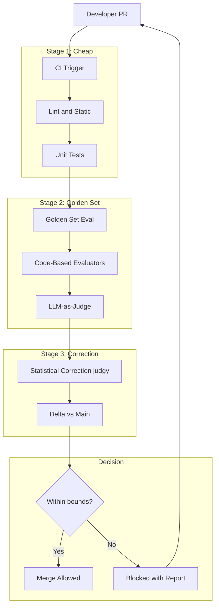
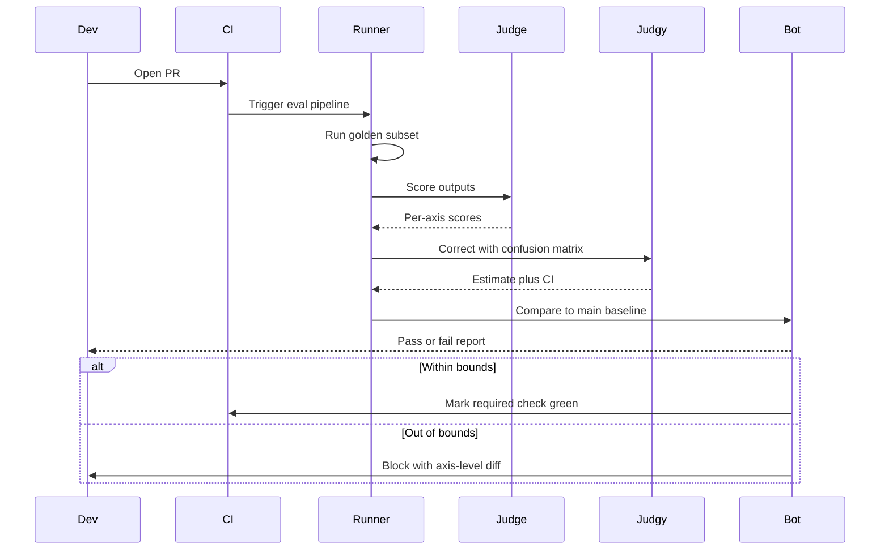

# 案例研究：AI 產品的 Eval-Gated CI/CD

一個 28 人的 AI 產品工程團隊，將合併後（post-merge）的回歸問題追查，改為以 eval 為閘門（eval-gated）的 CI：每個 PR 在出現合併按鈕之前，都要先跑過 golden set、帶有統計校正的 LLM-as-judge，以及失效模式分類法（failure-mode taxonomy）。

## 商業問題

一家 AI-first 的 SaaS 公司推出了一個面向客戶的問答機器人（answer-bot），底層建構在一條 RAG pipeline 加上一個 agent loop 之上。六個月前，團隊推出了一個「小小的」prompt 變更，結果在某種特定合約類型的問題上造成了答案品質的回歸，等到客戶察覺時，公司已經失去了一筆 $4M 的續約。事後檢討（post-incident review）發現了三件事：這項變更從未針對該合約專屬的測試集做過評估；spot check 中使用的 LLM-as-judge 指標已經漂移（drift）了 11 個百分點卻沒人注意到；而一個原本只需要 2 天就能 rollback 的修復，因為沒有人手上握有一個安全可回退（safe-to-revert）的 baseline，最後拖了 9 天。

來自 2026 年 5 月現實的種種限制：

- 4 個團隊共 28 位工程師；每週大約有 50 個 PR 觸及 AI 表面（AI surface）
- 處於受監管產業的客戶拒絕接受其領域專屬查詢上的任何回歸
- 每個 PR 的 eval 預算：model spend 在 $40 以內；完整跑一輪的預算：$1,200 以內
- p95 的 PR-to-merge 時間目標：含 eval 在內 90 分鐘以內
- eval 方法論需通過每季稽核員（auditor）簽核

2026 年 5 月的現實是，eval-gated CI 已經不再是可有可無的東西。Hamel Husain 的 [eval 部落格系列](https://hamel.dev/blog/posts/evals/)、Eugene Yan 的著作（[evals](https://eugeneyan.com/writing/evals/)），以及用於統計校正的 [judgy library](https://github.com/ai-evaluation/judgy)，全都收斂到了同一套 playbook 上。Phoenix、Langfuse、Braintrust 與 Galileo 也都推出了 CI 整合。現在的問題已經不再是「我們該不該做這件事」，而是「我們要怎麼在不讓 cycle time 翻倍的前提下把它做好」。

## 架構

### 元件

| 層級 | 技術 | 用途 |
|-------|------|---------|
| Golden sets | 放在 repo 中的 YAML，每個表面 1,200 到 4,000 個案例 | 穩定的測試基底 |
| Code evaluators | 搭配自訂斷言（assertions）的 Pytest | 便宜、確定性的檢查 |
| LLM judges | 用 Claude Sonnet 4.7 進行判斷 | 主觀品質 |
| 統計校正 | [judgy](https://github.com/ai-evaluation/judgy) | 將 judge 分數轉換為帶有信賴區間（CI）的估計值 |
| Pipeline | GitHub Actions 加上自訂 runner | CI 編排 |
| Trace store | Langfuse | 每個 PR 的可觀測性 |
| 標註（Annotation） | 自架的 Argilla | 用於 judge 校準的人工重新標註 |

### 資料流

1. PR 開啟；GitHub Actions 觸發；Stage 1（lint、unit、type check）在 2 分鐘內跑完。
2. Stage 2 啟動 golden-set eval，針對一個具代表性的子集（預設為完整集合的 10 到 25 個百分點；在受保護分支上或當標籤標示為 `full-eval` 時則跑 100 個百分點）。
3. 每個 golden-set 案例都會跑過新的 build、產生一份 output，並由 (a) 在適用確定性檢查之處的 code-based evaluator（JSON schema、regex、事實查找）以及 (b) 針對品質維度的 LLM judge 來評分。
4. Stage 3 使用 `judgy`，以針對 judge prompt 的 train/dev/test 切分來校正 judge 分數。
5. 將校正後的估計值（含信賴區間）與 `main` 上最後一次綠燈（green build）相比較；若信賴區間的下界落在容忍範圍（tolerance）之內，PR 即可合併；否則就會被擋下，並附上一份詳盡的報告。

## 關鍵設計決策

### 1. Golden-set 的建構與輪替

每個 golden set 都建構自三個來源：過去 90 天的生產 trace 取樣（依錯誤分析得出的失效模式做分層抽樣）、由一個獨立的 red-team LLM 生成的合成對抗案例（synthetic adversarial cases），以及從客戶支援工單中精選出的邊界案例（edge case）。我們每季輪替 10 到 15 個百分點的案例；我們從不刪除案例（案例會被歸檔到一個凍結的「歷史回歸」集合，該集合只在每晚跑）。這可以避免一種 over-fitting 陷阱：eval 集合隨著產品一起漂移。

規模設定：每個表面 1,200 個案例是下限；低於此數字，校正後分數的信賴區間就會太寬，無法在 95 個百分點的信心水準下偵測到 2 個百分點的回歸。Eugene Yan 涵蓋了這套規模設定的數學；我們針對自己的指標重新推導了一遍。

### 2. judge 的 train/dev/test 切分

LLM judge 本身就是一個帶有 prompt 參數與 few-shot 範例的模型。我們把 judge prompt 當成一個模型來看待，並套用 train/dev/test 紀律：60 個百分點的人工標註案例用來調校 judge prompt，20 個百分點用來挑選最佳的 prompt 變體，20 個百分點則是一個 hold-out 集合，我們只在重大 judge-prompt 變更之前才動用它。這套模式正是 [judgy 方法論](https://github.com/ai-evaluation/judgy)與 Hamel 的 eval 文章的核心。

重新校準的節奏：每 30 天，會有 50 個新案例由 2 位人類重新標註（要求 Cohen's kappa 超過 0.7）；若 judge 在 dev set 上的準確率掉到 80 個百分點以下，我們就重新調校。

### 3. 用 judgy 做統計校正

在我們的領域裡，未經處理的 LLM-as-judge 在主觀類別上的準確率大約落在 75 到 88 個百分點之間。一個原始（raw）的 judge 分數是有偏誤的。`judgy` 會利用 judge 在 held-out 集合上的混淆矩陣（confusion matrix），計算出真實通過率的校正後估計值，並回傳一個信賴區間。我們以「信賴區間的下界落在容忍範圍之內」作為閘門。這意味著我們絕不會僅僅因為 judge 的雜訊就擋下一個 PR，也絕不會核准一個僅僅是 judge 沒抓到的回歸。

數學部分：若 judge 在 held-out 集合上有 85 個百分點的 precision 與 92 個百分點的 recall，而新 build 的 judge 回報通過率為 89 個百分點，則校正後的估計值約為 87 個百分點，其 95 個百分點信賴區間大致落在 83 到 91 個百分點之間。當信賴區間下界比 `main` 至多低 2 個百分點時，我們就允許合併。（[參考：judgy README 的數學](https://github.com/ai-evaluation/judgy#statistical-correction)）。

### 4. 以失效模式分類法作為斷言面（assertion surface）

我們不會把「品質」當成單一一個數字來評分。我們是沿著一組軸線來評分，這些軸線取自我們的失效模式分類法：hallucination、retrieval-miss、format violation、refusal、persona break、citation error。這套分類法是把錯誤分析（[Hamel 的 open-coding + axial-coding pipeline](https://hamel.dev/blog/posts/field-guide/)）套用在 6 個月內 800 個生產失效案例上所得出的產物。逐軸的分數讓我們即使在整體品質提升的情況下，仍能擋下一個 hallucination 回歸。

### 5. 每個 PR 的 eval 預算

完整跑一輪 eval-set 的成本，視 model spend 而定，落在 $80 到 $200 之間。在每週 50 個 PR 的情況下，最天真的算法下成本是每週 $4K 到 $10K。我們把它框住：

- 預設的 PR 會跑 golden set 的 10 到 25 個百分點，並依失效模式做分層抽樣（讓所有失效模式都被涵蓋到）。
- `full-eval` 標籤會觸發 100 個百分點的完整執行。
- 每晚的 cron 會在 `main` 上跑 100 個百分點，以抓出任何我們漏掉的漂移。
- 一項新的 judge-prompt 變更會在一個凍結的歷史集合上觸發 100 個百分點的執行。

這把每個 PR 的成本框在 $40 以內，每週的總成本框在 $1,200 以內。

### 6. judge-prompt 漂移偵測

即使有校準，judge prompt 仍會漂移：底層模型更新了、few-shot 範例變得較不具代表性、prompt 的用語對模型來說顯得過時了。我們透過以下方式監控漂移：

- 每月重跑 held-out 集合，並回報相對於上個月的準確率差值（delta）。
- 追蹤 judge 之間的一致性（我們會並行跑兩個 judge prompt；隨時間出現的分歧代表其中之一發生了漂移）。
- 將 judge prompt 在 git 中做版本控制；rollback 是一個 1-commit 的操作。

當漂移超過 3 個百分點或 kappa 掉到 0.65 以下時，我們就開一張維護工單。

### 7. 為 eval pipeline 做快取

一個典型的 golden-set 案例會產生一份 output，接著這份 output 會被評判。給定 prompt 與 model version，這份 output 是確定性的。我們將 (prompt-hash, model-version) 快取到 (output, judge-score)，如此一來重跑同一份 eval 幾乎是免費的。在那些只觸及編排程式碼（而非 prompt）的 PR 上，快取命中率（cache hit rate）大約是 70 個百分點；對這一類變更而言，這是 3 倍的成本縮減。

### 8. PR 層級的儀表化（instrumentation）

每個 PR 的 eval 報告都包含：相對於 main 的逐軸通過率、各軸線中新失敗的範例、各軸線中新通過的範例、judge 校正的信賴區間上下界、總成本，以及一個連到 trace store 的連結，讓工程師可以重播（replay）任何一個失敗的案例。這份報告會在執行完成後的 3 分鐘內，以 GitHub comment 的形式貼出。

## CI Pipeline 時序

## 失效模式與緩解措施

### F1：judge prompt 漂移未被察覺

在一次模型升級之後，judge 漸漸地對 hallucination 的偵測力不足。緩解措施：每月的 held-out 重播；judge 間一致性的追蹤；一種供受保護分支使用的「freeze judge」模式，即使有更新的模型可用，也會把 judge 的 model version 釘住（pin）。先前讓我們栽跟頭的那次漂移事故，正是由這件事所造成；我們現在能在一個週期內就抓到漂移。

### F2：eval 集合變得過擬合（overfit）

少數幾個案例被反覆除錯；prompt 被隱性地調校得貼合它們。緩解措施：每季輪替；保留一批對抗案例，在失效報告中永遠不向工程師展示（只給結果，outcomes）。一個獨立的 red-team 團隊握有 held-out 集合的所有權。

### F3：單一 PR 只跑到 eval 的一個角落，因而漏掉回歸

分層抽樣：我們確保每個 PR 的 10 個百分點樣本中，至少包含來自 12 種失效模式中每一種的 1 個案例。完整的每晚執行仍然在 `main` 上進行。每個 PR 的涵蓋率是有界的，但並非為零。

### F4：意外的完整執行造成成本超支

在每個 PR 上都掛 `full-eval` 標籤會讓成本變成三倍。緩解措施：該標籤需要來自 CODEOWNERS 檔案的核准；一個自動提醒會通知（ping）掛上它的那個人。我們也以一個 $5K 的硬性上限封頂每月 eval 花費，並拒絕啟動任何會超出此上限的工作。

### F5：擋下率（block-rate）太高；開發者學會無視它

如果有 35 個百分點的 PR 被擋下，開發者就會停止閱讀報告，並開始尋找繞過的辦法。緩解措施：我們調校閘門的容忍度，把擋下率維持在 5 到 12 個百分點之間；我們把擋下率當成一個 SLI 來看待；當它飆高時就去調查原因（往往是 judge 對某個新的失效模式太過嚴格）。目標是把真正的回歸浮現出來，而不是當一個把關用的玩具。

### F6：holdout 集合洩漏進訓練或 prompt 中

一個 held-out 案例最後變成了一個 few-shot 範例。緩解措施：held-out 集合存放在一個獨立的 repo 中，並有一份獨立的存取清單；工程師無法讀取它；只有 eval runner 擁有一把 deploy key。對於 held-out 的失敗，失效報告中包含的是雜湊（hash），而非原始案例。

### F7：judge model 被棄用（deprecation）

廠商宣布 judge model 的 end-of-life。緩解措施：我們會並行讓至少兩個 judge model 維持校準；當棄用發生時，我們有一個 60 天的窗口期可以在維持 kappa 門檻的前提下完成替換。judge prompt 的 git 歷史加上校準資料，讓這件事成為例行公事。

### F8：eval runner 佇列飽和

發布時間附近一波 PR 湧入，把 eval 佇列塞到 30 分鐘深。緩解措施：具自動擴展（autoscaling）的專屬 eval-runner GPU 池；給受保護分支的優先通道（priority lane）；若佇列深度超過 20，我們會自動將非受保護的 PR 降級為 5 個百分點的樣本，以更快清空積壓（backlog）。

## 維運考量

### 監控

| SLO | 目標 |
|-----|--------|
| PR-to-merge p95 | 90 分鐘以內 |
| 每個 PR 的 eval 成本 p95 | $40 以內 |
| 擋下率（false negatives + 真實回歸） | 5 到 12 個百分點 |
| judge 評分者間 kappa | 超過 0.7 |
| Holdout 集合重播準確率的逐月差值 | 3 個百分點以內 |
| 生產回歸逃逸（部署後） | 每季少於 1 次 |

### 成本模型

在每週 50 個 PR 的情況下：

- 預設抽樣：平均每個 PR $25；每週 $1,250
- 完整 eval 執行（每週約 8 次）：每次 $100；每週 $800
- 每晚 cron：每次 $200；每週 $1,400
- judge 重新校準：每月 $50
- 合計：每月約 $14K

只要預防一次回歸，這套機制就能回本。我們對失去那筆 $4M 續約的事後估計顯示，即使一年只救回一次，這筆花費也綽綽有餘地被框住了。

### On-call playbook

- 擋下率飆高：檢查最近是否有任何對 judge prompt 或 golden set 的變更導致此事；將逐軸分數與 baseline 比較。
- eval 成本飆高：檢查抽樣率（sample rate）設定；對 `full-eval` 標籤做速率限制（rate-limit）。
- judge 漂移告警：觸發校準週期；若漂移嚴重，將 judge 輪換到備援模型。
- holdout 洩漏（雜湊碰撞）：立即隔離（quarantine），重新生成受影響的案例。
- eval runner 中斷：PR 會以一個清楚的「eval pending」狀態進入佇列；在 runner 停機期間我們絕不自動合併；SRE 在 15 分鐘內被呼叫。

### 每季回顧

每一季，AI 團隊都會回顧：失效模式分類法（這些類別是否仍對應到真實的生產錯誤？）、golden set 輪替（哪 10 到 15 個百分點已經過時？）、judge 校準歷史（漂移是否在加速？），以及擋下率趨勢（這道閘門是不是變成了一場戲？）。這場回顧會餵入下一季的 eval 路線圖。我們採用 [Hamel field-guide](https://hamel.dev/blog/posts/field-guide/) 的儀式：對最近 50 個失效進行 open-coding 工作坊，接著做 axial coding 來更新分類法。

### 稽核員資料包（Auditor pack）

這條 eval pipeline 每季會產出一份稽核員資料包：方法論文件（在 git 中做版本控制）、golden set 摘要（每種失效模式的數量）、judge 校準結果（隨時間變化的 Cohen's kappa）、擋下率直方圖，以及一批附有理由說明的失敗 PR 樣本。這份資料包會自動產生，並由工程主管（head of engineering）簽署。

### 我們為何不使用單一綜合品質分數

誘惑在於把所有軸線揉成一個數字，然後對它設閘門。我們不這麼做。一個綜合分數會藏起回歸：一個 hallucination 回歸可能被一個 format-compliance 的改善所掩蓋。我們對逐軸分數設閘門，讓每一條軸線都有自己的信賴區間、自己的擋下機制。代價是更多的報告雜訊；好處是我們絕不會在某個關鍵維度上悄悄地發生回歸。

## 強面試候選人會涵蓋的內容

- 他們會區分 code-based evaluator（便宜、確定性）與 LLM-as-judge（昂貴、主觀），並在不同階段同時運用兩者。
- 他們會明確點名統計校正；他們理解原始的 judge 分數是一個有偏誤的估計值，而信賴區間才是用於設閘門的正確抽象。
- 他們會從錯誤分析中定義出一套失效模式分類法，並對逐軸分數設閘門，而非單一綜合分數。
- 他們會為 judge 本身指明 train/dev/test 紀律，包含用於重新校準的 kappa 門檻。
- 他們會明確地框住 eval 成本；他們知道對每個 PR 都跑完整執行的成本太高，而分層抽樣才是那根槓桿。
- 他們對 judge-prompt 漂移有一套說法：他們會監控它、會對 prompt 做版本控制、會有一套 roll-back 計畫。
- 他們會用雜湊與一份獨立的存取清單來保護 held-out 集合，以防止洩漏。

## 參考資料

- Hamel Husain，[Your AI product needs evals](https://hamel.dev/blog/posts/evals/)
- Hamel Husain，[A field guide to rapidly improving AI products](https://hamel.dev/blog/posts/field-guide/)
- Eugene Yan，[Evals: Constructed for LLM apps](https://eugeneyan.com/writing/evals/)
- Eugene Yan，[LLM-as-judge](https://eugeneyan.com/writing/llm-evaluators/)
- [judgy library](https://github.com/ai-evaluation/judgy)
- [Phoenix evals](https://docs.arize.com/phoenix/evaluation/concepts-evals)
- [Langfuse evaluations](https://langfuse.com/docs/scores/overview)
- [Braintrust](https://www.braintrust.dev/docs)
- [Galileo evaluate](https://www.rungalileo.io/blog/llm-evaluation)
- Zheng et al.，[Judging LLM-as-a-Judge](https://arxiv.org/abs/2306.05685)
- [Argilla annotation platform](https://docs.argilla.io/)
- [pytest-html report integration](https://pytest-html.readthedocs.io/)

相關章節：[Evaluation and Observability](../14-evaluation-and-observability/01-evaluation-fundamentals.md)、[Reliability and Safety](../13-reliability-and-safety/01-reliability-fundamentals.md)、[AI Evals Comprehensive Guide](../ai_evals_comprehensive_study_guide.md)。
