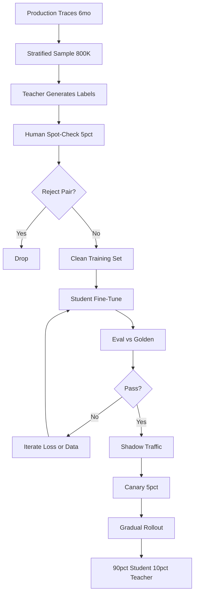

# 案例研究：客戶專屬蒸餾流水線

一家 Series-B 階段的 AI 產品，透過在 6 個月的生產流量軌跡（production traces）上蒸餾出一個 7B 的學生模型（student model），將前沿模型（frontier-model）的支出從每月 $50K 降到 $4 至 6K，回本期為 3 個月，重新蒸餾的週期為 4 至 6 個月。

## 業務問題

一個已規模化的 AI 產品（每月約 8M 次使用者請求）跑在一個前沿模型上。成本在 2026 年初突破每月 $50K，且以每季 18 percent 的速度成長，財務部門要求提出一份計畫。團隊有一個清楚的領悟：大約 90 percent 的生產流量落在少數幾種重複出現的任務模式上（意圖分類、結構化抽取、文件摘要，以及三類分流 triage）。對這些任務而言，前沿模型是大材小用；一個在前沿模型自身輸出上微調（fine-tuned）的、小很多的模型，能以前者一小部分的成本來服務它們。

來自 2026 年 5 月現實的限制條件：

- 每月 $50K 的前沿模型支出，且持續成長
- 延遲預算：高流量任務的 p95 須在 350 ms 以下
- 品質門檻：在客戶的黃金資料集（golden set）上的退步須小於 2 percent
- 合規：客戶資料不得離開特定的雲端區域（cloud region）
- 人力：1 名 ML 工程師外加兼職的平台支援

蒸餾模式已相當成熟：DistilBERT（[Sanh et al., 2019](https://arxiv.org/abs/1910.01108)）、TinyBERT、Alpaca 風格的指令蒸餾（instruction distillation，[Taori et al., 2023](https://github.com/tatsu-lab/stanford_alpaca)），以及較近期關於思維鏈蒸餾（chain-of-thought distillation，[Hsieh et al., 2023](https://arxiv.org/abs/2305.02301)）的研究，都顯示一個 7 至 13B 的學生模型在聚焦的任務上能回復 92 至 98 percent 的教師模型（teacher）效能。前沿實驗室的 FDE 團隊（Anthropic Field Engineering、OpenAI Solutions）已在研討會演講中公開講解過這套預算數學；下方的數字與這些團隊對客戶報出的數字一致。

## 架構

```mermaid
flowchart LR
    subgraph Collect["Trace Collection"]
        PROD[Production Traffic] --> TRACES[Trace Store]
        TRACES --> SAMPLER[Stratified Sampler]
        SAMPLER --> CURATE[Curation Queue]
    end

    subgraph Label["Labeling"]
        CURATE --> TEACHER[Teacher Frontier Model]
        TEACHER --> LABELS[Distillation Pairs]
        LABELS --> HUMAN[Human Spot-Check]
        HUMAN --> CLEAN[Clean Pairs]
    end

    subgraph Train["Distillation"]
        CLEAN --> FT[Student Fine-Tune 8x H100]
        FT --> EVAL[Eval Suite]
        EVAL --> CANARY[Canary Cohort]
    end

    subgraph Serve["Serving"]
        CANARY --> SHADOW[Shadow Traffic]
        SHADOW --> ROLLOUT[Gradual Rollout]
        ROLLOUT --> STUDENT[Student Model Serving]
    end
```

### 元件

| 層級 | 技術 | 用途 |
|-------|------|---------|
| Teacher | 前沿模型（Claude Opus 4.7 或同等模型） | 標籤來源 |
| Student | Llama 4 7B int4 或 Qwen 3.6 7B | 生產服務 |
| Trace store | S3 加 Langfuse | 取樣與重播（replay） |
| Trainer | 在 8x H100 上跑 DeepSpeed 加 FSDP | 為期一週的訓練 |
| Eval | 各任務的黃金資料集，退步時以 on-call 呼叫待命人員 | 品質關卡 |
| Serving | 搭配 FP8 的 vLLM | 350 ms p95 |

### 資料流

1. 6 個月的生產流量軌跡累積在 Langfuse 加 S3 中。
2. 取樣器（sampler）依任務類別拉取分層樣本（stratified samples），並進行重新平衡，以確保稀有類別有被涵蓋到。
3. 教師模型（前沿模型）為每個樣本產生目標輸出，若任務能從推理蒸餾（reasoning distillation）獲益，通常會附帶思維鏈推理軌跡。
4. 由領域專家進行 5 percent 的人工抽查（human spot-check）以捕捉教師模型的錯誤；我們套用拒絕取樣（rejection sampling），只保留人工審查者認同教師輸出的配對。
5. 學生模型在 8x H100 上微調約 1 週（約 $22K 算力），產出一個 7B 模型。
6. 該模型通過各任務的 eval，對生產流量進行 2 週的影子（shadow）測試，接著漸進式放量：在 3 週內以 5 percent、20 percent、50 percent、90 percent 推進，並接上連動即時品質指標的自動回滾（auto-rollback）。

## 關鍵設計決策

### 1. 在真實生產流量軌跡上蒸餾，而非合成資料

誘惑在於透過 LLM 生成合成 prompt 並用教師模型為其打標籤。我們試過這作法；它產出的模型在合成 prompt 上表現出色，但在真實流量上退步 4 至 7 分。生產流量軌跡捕捉到了真正重要的分佈漂移（distribution shift）、怪異案例與長尾案例。我們收集 6 個月的軌跡，依任務類別分層取樣，並以真實的 prompt 作為蒸餾來源。這與前沿實驗室 FDE 團隊建議的作法一致。

### 2. 以人工抽查進行拒絕取樣

教師模型的錯誤會傳播到學生模型。若你在每一筆教師輸出上訓練，92 percent 的教師精確度（precision）會變成 90 percent 的學生精確度。我們對隨機抽取的教師標籤樣本進行 5 percent 人工抽查，並剔除人工不認同的配對。這會捕捉到大約 4 percent 的標籤，並在我們的綜合指標（composite metric）上將最終學生模型的品質提升 2 至 4 分。成本：每次重新蒸餾約 $1,800 的人工標註費用，外加算力費用。

### 3. 在划算之處採用思維鏈蒸餾

對於推理密集的任務（在我們的案例中即分流類別），我們採用 Hsieh et al. 的[帶推理依據的蒸餾](https://arxiv.org/abs/2305.02301)（distillation with rationales）作法：教師模型同時產出答案與推理軌跡；學生模型則被訓練成同時輸出兩者。這賦予學生模型一種僅靠輸入-輸出配對無法養成的結構化思考能力。我們不會把它用在分類或抽取任務上（沒有增益，反而多出延遲）。

### 4. 以人工標註建構 eval 資料集

我們的 eval 資料集與訓練集分開策劃（curated）。它包含跨高流量任務類別的 1,800 個案例，由 3 位領域專家以多數決方式標註。我們每季重新標註 200 個案例以追蹤分佈漂移。eval 資料集是 canary 放量的把關訊號；綜合指標上 2 分的退步會擋下生產部署。在採樣訓練資料時，我們絕不查看 eval 資料集的範例。

### 5. Canary 放量與影子流量

即便通過了 eval，生產環境仍有 eval 資料集會錯失的長尾行為。我們的放量流程：

- 第 1 週：僅影子流量，對使用者無影響。我們在 100 percent 的流量上比較學生與教師的輸出，並以一個差異分類器（delta classifier）標記分歧之處供人工審查。
- 第 2 週：5 percent 的線上流量。若出現以下任一情況則自動回滾：(a) 延遲 p95 超過 500 ms，(b) 線上使用者按讚率（thumbs-up rate）下滑超過 1 分，(c) 某個領域專屬的護欄（guardrail）以更高的比率被觸發。
- 第 3 週：20 percent。相同的護欄。
- 第 4 週：50 percent。
- 第 5 週：90 percent。10 percent 永久導向教師模型，以持續收集流量軌跡並用於重新蒸餾。

這種保守的爬坡方式，在過去一年裡捕捉到了兩個 eval 資料集錯失的退步。

### 6. 重新蒸餾的週期

世界會漂移。新的產品功能會改變任務分佈；使用者會學會新的行為；教師模型本身也會隨新模型發布而進步。我們每 4 至 6 個月重新蒸餾一次。這套流水線部分自動化：流量軌跡取樣、教師標註與訓練都已腳本化；人工抽查與 eval 審查仍需要有人經手。每次重新蒸餾的全包成本約 $26K（$22K 算力、$1,800 標註，外加管理費用），耗時 4 至 6 週。

### 7. 什麼時候「不該」做蒸餾

蒸餾並非總是對的。不該做的訊號：

- 流量是低量級的（每月低於 200K 次請求）。回本永遠不會發生。
- 任務高度多變。若每筆請求都是獨一無二的，學生模型學不到有用的分佈。
- 教師模型本身不穩定或快速演進。對著一個移動中的目標重新蒸餾是白費力氣。
- 品質門檻非常嚴苛（要求超過 99 percent 的保真度 fidelity）。蒸餾的落差是真實存在的；若你無法容忍它，就堅持用教師模型。

我們採用一個快速篩選的啟發法（heuristic）：至少 60 percent 的流量落在 5 種以下的任務模式中，且這些任務的每月支出超過 $20K。若兩者都不滿足，我們就放棄蒸餾。

### 8. 量化（quantization）選擇

我們以 int4 服務這個 7B 學生模型（透過搭配 FP8 KV cache 的 vLLM 使用 GPTQ）。int4 將記憶體大致砍掉 4x，並在 H100 上相對於 FP16 把吞吐量提升約 2.3x。我們量測到綜合指標上 0.4 分的準確度損失，遠在容許範圍內。我們考慮過 int8（損失較小，加速也較小）與 FP8（生態系較不成熟）；int4 在每請求成本上勝出。

### 9. 訓練資料的隱私考量

依定義，生產流量軌跡含有使用者 PII。在訓練前我們會跑一道去識別化（redaction）流程：一個微調過的 NER 模型標記出 PII 區段，我們以類別 token（`[EMAIL]`、`[PERSON_NAME]`）取代它們。學生模型學到結構化模式，而不會記住特定的身分。去識別化模型本身在一個已標註的樣本上評估，精確度超過 98 percent，召回率（recall）超過 95 percent。

## 成本與回本

| 項目 | 金額 |
|-----------|--------|
| 流量軌跡收集（6 個月） | 已作為可觀測性（observability）支出的一部分付清 |
| 教師標註（約 800K 配對） | $42K 一次性 |
| 人工抽查 | $8K 一次性 |
| 算力（8x H100 跑 1 週，外加重試） | $32K 一次性 |
| Eval 資料集策劃 | $14K 一次性 |
| 平台工程（管理費用） | $24K 一次性 |
| **前期總計** | **$120K** |

| 每月固定支出 | 之前 | 之後 |
|------------------|--------|-------|
| 前沿模型（10 percent 流量，外加重新蒸餾的工具鏈） | $50K | $5K |
| 學生模型服務（在專屬 H100 上跑 vLLM） | $0 | $1,200 |
| **每月總計** | **$50K** | **$6.2K** |

每月節省：約 $44K。回本：120K / 44K，約 2.7 個月。對財務部門我們取整為「3 個月回本」。

重新蒸餾平均每 5 個月花費 $26K，我們將其攤提（amortize）到同一條節省線上。年度淨節省：約 $470K。

## 蒸餾流水線

## 失效模式與緩解措施

### F1：教師升級使學生模型過時

前沿模型廠商發布了新世代，教師品質躍升，於是我們的學生模型相對於市場其餘廠商所推出的水準，現在達不到使用者的期望。緩解措施：我們每月監控一次教師對學生的對比 eval；當落差超過 4 分時，我們加快重新蒸餾的時程。對著一個更強的教師模型重新蒸餾很直接；流水線是一樣的。

### F2：訓練與服務之間的分佈漂移

一個新產品功能一夜之間改變了使用者行為（一波推播活動帶來不尋常的查詢，一個新的定價層級轉變了使用者類型）。學生模型的訓練分佈不再吻合生產環境。緩解措施：一個線上漂移監控器（drift monitor）會在輸入 embedding 分佈的移動超過某門檻時發出標記；若漂移是結構性的，我們觸發緊急重新蒸餾；若是暫時性的，我們把受影響的切片導向教師模型。

### F3：教師幻覺被烙進學生模型

教師模型偶爾會產生幻覺；拒絕取樣能抓到大部分但非全部。學生模型於是會更自信地產生幻覺，因為這個模式已在訓練分佈裡。緩解措施：在 eval 資料集上做忠實度（faithfulness）檢查；幻覺率相對基線出現任何成長，就觸發訓練資料的重新清理。

### F4：過度導向教師模型造成的成本回升

那 10 percent 的教師模型後備（fallback）會隨工程師為各種邊界案例新增後備而逐步攀升。緩解措施：對教師模型支出設置預算警報；每季稽核後備路由；每條後備規則都需附帶正當理由與到期時間。

### F5：Canary 放量錯失某個長尾退步

eval 資料集與影子流量看起來都沒問題，但 5 percent 的線上流量暴露出一個傷害特定客戶區隔的退步。緩解措施：對線上流量設置各區隔（per-segment）的品質指標，並按區隔自動回滾；我們依客戶層級、依語言、依任務類別進行區隔監看。

### F6：合規違規：訓練資料的資料落地（residency）

客戶的合約要求資料落地於特定區域；而我們預設的訓練算力在不同的區域。緩解措施：我們維持區域在地的訓練量能；各客戶的訓練資料綁定在該客戶的區域；我們絕不把原始流量軌跡複製到該區域之外。協調器（orchestrator）會拒絕啟動任何會違反資料落地規範的工作。

### F7：在罕見任務上的災難性遺忘（catastrophic forgetting）

學生模型遺忘了一個在訓練中只見過兩次的類別。緩解措施：分層取樣保證對稀有類別的最低涵蓋度；eval 套件明確納入稀有類別的案例；canary 放量會分別監控各類別的品質。

### F8：跨教師與學生的成本追蹤失靈

有些查詢會同時被路由到學生與教師模型（在影子測試期間）；除非明確標示，否則成本核算會重複計算。緩解措施：在每次呼叫上加上成本標籤（shadow、primary、fallback），並以每日對帳報告（reconciliation report）來捕捉標籤標錯的流量。

## 維運考量

### 監控

| SLO | 目標 |
|-----|--------|
| 學生模型 p95 延遲 | 350 ms 以下 |
| 相對教師的品質差異（已校正） | 2 分以內 |
| 教師後備率 | 目標 10 percent，超過 15 percent 時告警 |
| 每 1K 請求成本 | 蒸餾前的 30 percent 以下 |
| 重新蒸餾週期 | 每 4 至 6 個月 |

### 成本模型

每月穩態：$6.2K 服務費，加上攤提的重新蒸餾費（每月 $5.2K）。相較於僅用教師模型的 $50K，在全面攤提後每月節省約 $38K。年化：淨省約 $456K。

### On-call 操作手冊

- 品質退步告警：以手動的 eval 資料集重播確認；若屬實，將受影響區隔導向教師模型直到下一個訓練週期；開立優先工單。
- 成本超支：檢查後備路由；若流量模式已改變，安排重新蒸餾；必要時進行節流（throttle）。
- 延遲飆高：檢查 GPU 使用率；若是吵鬧鄰居（noisy neighbor），隔離該學生模型節點。
- 漂移告警：檢查輸入 embedding 的直方圖；若漂移幅度大且持續，觸發緊急重新蒸餾。
- Eval 資料集洩漏：若在訓練資料中發現某個保留（held-out）的 eval 案例，立即退役該案例並跑一道去重（deduplication）流程；在當季內刷新 eval 資料集。

### 對比 eval 週期

我們每月跑一次對比 eval：一個 500 案例的樣本，學生對教師，由 LLM-as-judge 加上一個 50 案例的人工樣本評分。產出是一個由 AI 團隊負責的單一儀表板磚（dashboard tile）。落差逐漸擴大就是需要重新蒸餾的早期預警。

### 重新蒸餾的例行儀式

當排定一次重新蒸餾時，我們遵循一套 4 週的儀式：第 1 週，取樣新鮮的流量軌跡並用當前的教師模型標註；第 2 週，訓練並評估；第 3 週，影子流量；第 4 週，漸進式放量。整套儀式都有檢查清單；由 ML 工程師獨力執行，並在漸進式放量階段獲得平台支援。

### 面向客戶的溝通

當我們把某客戶的流量切換到蒸餾出的學生模型時，我們會告知他們。面向客戶的措辭：「您的高流量查詢，現在改由一個我們在您的流量上微調過、針對延遲與成本最佳化的模型來服務。您季度報告中的 eval 證據顯示，品質在前沿基線的 2 分以內。」只要品質維持得住，大多數客戶並不在意；少數客戶（金融服務、醫療保健）要求明確簽核，除非他們選擇加入（opt in），否則我們會把那些查詢透過教師模型路由。

## 強的面試候選人會涵蓋哪些重點

- 他們會把預算數學講清楚，並把這段對話前置：前期成本、回本期、持續的重新蒸餾成本。
- 他們會逐篇點名引用蒸餾論文（DistilBERT、Alpaca、distillation with rationales），並使用「student」、「teacher」與「rejection sampling」的術語。
- 他們會解釋為何生產流量軌跡優於合成資料，以及為何對教師標籤做人工抽查很重要。
- 他們會以具體的百分比與自動回滾關卡，逐步講解 canary 放量；並點名僅靠影子流量會錯失的退步類型。
- 他們會說出蒸餾「不」管用的地方，展現他們是真正做過這件事，而不只是讀過。
- 他們會處理教師升級的情境：當前沿模型進步時，與學生模型的落差會擴大，而重新蒸餾就是解方。
- 他們會把隱私工作（訓練資料中的 PII 去識別化）納入流水線的一部分，而非事後補上的東西。

## 參考資料

- Sanh et al., [DistilBERT, a distilled version of BERT](https://arxiv.org/abs/1910.01108)
- Hinton et al., [Distilling the Knowledge in a Neural Network](https://arxiv.org/abs/1503.02531)
- Taori et al., [Stanford Alpaca: An Instruction-following LLaMA model](https://github.com/tatsu-lab/stanford_alpaca)
- Hsieh et al., [Distilling Step-by-Step](https://arxiv.org/abs/2305.02301)
- Jiao et al., [TinyBERT: Distilling BERT for Natural Language Understanding](https://arxiv.org/abs/1909.10351)
- Anthropic, [On distillation patterns](https://www.anthropic.com/research)
- OpenAI, [Distillation in the platform](https://platform.openai.com/docs/guides/distillation)
- [vLLM FP8 inference](https://docs.vllm.ai/en/latest/quantization/fp8.html)
- [Langfuse trace sampling](https://langfuse.com/docs/observability/sampling)
- Hamel Husain, [Field guide to rapidly improving AI products](https://hamel.dev/blog/posts/field-guide/)
- [DeepSpeed for training](https://www.deepspeed.ai/training/)
- [Together AI distillation case study](https://www.together.ai/blog/distillation)

相關章節：[微調與蒸餾](../03-training-and-adaptation/03-distillation.md)、[推理最佳化](../04-inference-optimization/01-inference-fundamentals.md)、[成本管理](../11-infrastructure-and-mlops/05-cost-management.md)。
