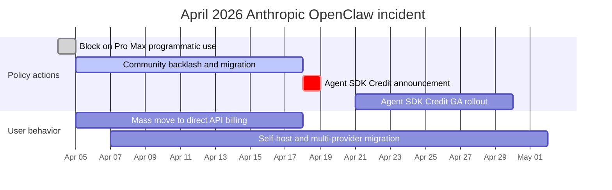

# OpenClaw 深入剖析：開源個人 AI agent

OpenClaw 是一個**開源、自架（self-hosted）的個人 AI agent**，透過 LLM 並以通訊平台作為主要介面來執行任務。你可以透過 WhatsApp、Telegram、Slack、Discord 或 Signal 與它對話，而它也會回應你 —— 執行 shell 指令、操控你的瀏覽器、管理行事曆、處理電子郵件，並協調多步驟的工作流程。

## 目錄

- [什麼是 OpenClaw](#what-is-openclaw)
- [歷史：從 Clawdbot 到 Moltbot 再到 OpenClaw](#history)
- [架構深入剖析](#architecture)
- [AgentSkills 系統](#agentskills)
- [LLM 供應商設定](#llm-providers)
- [通訊平台整合](#messaging-integrations)
- [安全模型](#security-model)
- [部署模式](#deployment-patterns)
- [效能最佳化與擴展](#performance)
- [實際應用案例](#use-cases)
- [限制以及何時「不該」使用 OpenClaw](#limitations)
- [與替代方案的比較](#comparison)
- [快速上手：安裝指南](#getting-started)
- [系統設計面試切入點](#system-design-interview)
- [參考資料](#references)

---

## 什麼是 OpenClaw

OpenClaw 是：

- **一個個人 AI agent**：不是聊天機器人 —— 而是一個能代你行動的自主 agent
- **自架**：在你的機器、VPS 或 Raspberry Pi 上執行 —— 你掌控自己的資料
- **以通訊為原生介面**：存在於你已經在用的聊天應用中（WhatsApp、Telegram、Slack、Discord、Signal、iMessage，以及其他 20 多種）
- **與 LLM 無關（LLM-agnostic）**：可搭配 Claude、GPT-4、Gemini、DeepSeek 或本地模型
- **可透過 skill 擴充**：內建 100 多種預先設定好的 skill，並提供撰寫自訂 skill 的簡單格式
- **開源**：採 MIT 授權，截至 2026 年初已有 250K 以上的 GitHub stars

```
# The simplest way to start
git clone https://github.com/openclaw/openclaw.git
cd openclaw
docker compose up -d

# Or via npm
npm install -g openclaw
openclaw start
```

**與聊天機器人的關鍵差異：**
- ChatGPT/Claude.ai：你輸入文字，它以文字回覆
- OpenClaw：你輸入文字，它會**實際去做事** —— 執行指令、編輯檔案、寄送電子郵件、操控智慧家庭裝置、管理你的行事曆

---

## 歷史

### 命名時間軸

| 日期 | 名稱 | 事件 |
|------|------|------|
| November 2025 | **Clawdbot** | Peter Steinberger 發布第一個原型，大約只花了一小時打造 |
| January 2026 | 2,000 stars | 早期採用者發現了這個專案 |
| January 27, 2026 | **Moltbot** | 因 Anthropic 提出商標申訴而改名（保留了龍蝦主題） |
| January 30, 2026 | **OpenClaw** | 再次改名 —— Steinberger 覺得「Moltbot」唸起來很彆扭 |
| February 2026 | 145,000+ stars | 爆炸性成長，超越了許多既有的開源專案 |
| February 14, 2026 | -- | Steinberger 加入 OpenAI，理由是能取得擴展規模所需的資源 |
| March 2026 | 250,000+ stars | 在 GitHub 上超越 React；成為史上成長最快的 OSS 專案之一 |

### 創作者

Peter Steinberger 是一位奧地利軟體工程師，在 2024 年出售公司之前，曾花了 13 年打造 PSPDFKit —— 一套被全球開發者使用的 PDF 工具包。他自稱是「vibe coder」，並曾說出名言：他出貨的程式碼自己根本沒讀過 —— 體現了以 AI 為先的全新開發哲學，也就是由人類提供意圖、AI 提供實作。

### 為何爆紅

OpenClaw 觸動了人們的痛點，因為它解決了一個真實的問題：LLM 雖然強大，卻是無狀態的。每次對話都從零開始。OpenClaw 賦予 LLM **持久性**（跨工作階段的記憶）、**行動力**（能採取行動，而非只是說話），以及**觸及範圍**（與你已在使用的應用整合）。再加上它是自架且開源的，這代表任何人都能執行它，而不必把自己的資料交付給第三方服務。

---

## 架構

### 高層次概觀

```
                         OPENCLAW ARCHITECTURE
 ============================================================

  Messaging Platforms              OpenClaw Gateway           LLM Providers
 ┌──────────────┐              ┌─────────────────────┐     ┌──────────────┐
 │  WhatsApp    │──┐           │                     │     │  Anthropic   │
 │  (Baileys)   │  │           │   GATEWAY            │     │  (Claude)    │
 ├──────────────┤  │  Channel  │   ┌──────────────┐  │     ├──────────────┤
 │  Telegram    │──┼──Adapters─┼──>│  Router      │  │     │  OpenAI      │
 │  (grammY)    │  │           │   │  (sessions,  │  │     │  (GPT-4)     │
 ├──────────────┤  │           │   │   bindings)  │  │     ├──────────────┤
 │  Slack       │──┤           │   └──────┬───────┘  │     │  Google      │
 │  (Bolt)      │  │           │          │          │     │  (Gemini)    │
 ├──────────────┤  │           │   ┌──────▼───────┐  │     ├──────────────┤
 │  Discord     │──┤           │   │ Agent Runtime│──┼────>│  DeepSeek    │
 │  (discord.js)│  │           │   │ (AI loop,    │  │     ├──────────────┤
 ├──────────────┤  │           │   │  tool calls, │  │     │  Local/      │
 │  Signal      │──┤           │   │  memory)     │  │     │  Ollama      │
 │  (signal-cli)│  │           │   └──────┬───────┘  │     └──────────────┘
 ├──────────────┤  │           │          │          │
 │  iMessage    │──┤           │   ┌──────▼───────┐  │     Tools & Skills
 │  (BlueBubbles│  │           │   │  Tool Layer  │  │     ┌──────────────┐
 ├──────────────┤  │           │   │  (skills,    │──┼────>│  Shell exec  │
 │  Teams       │──┘           │   │   browser,   │  │     │  Browser     │
 │  IRC, Matrix │              │   │   files,     │  │     │  File I/O    │
 │  20+ more... │              │   │   cron)      │  │     │  Calendar    │
 └──────────────┘              │   └──────────────┘  │     │  Email       │
                               │                     │     │  100+ more   │
                               │   ┌──────────────┐  │     └──────────────┘
                               │   │  Memory &    │  │
                               │   │  State       │  │     Storage
                               │   │  (sessions,  │──┼────>┌──────────────┐
                               │   │   workspace) │  │     │  ~/.openclaw/│
                               │   └──────────────┘  │     │  (state,     │
                               └─────────────────────┘     │   memory,    │
                                                           │   config)    │
                                localhost:18789             └──────────────┘
```

### 核心元件

**1. Gateway**

Gateway 是一個長期執行的 WebSocket 伺服器（預設：`localhost:18789`），作為工作階段（session）、路由與通道連線的單一事實來源（single source of truth）。它負責處理：

- 透過通道轉接器（channel adapter）接受來自所有通訊平台的連線
- 將訊息路由到正確的 agent
- 工作階段管理與狀態持久化
- 認證與存取控制
- 設定變更的熱重載（hot-reloading）

**2. 通道轉接器（Channel Adapters）**

當訊息從任一平台抵達時，通道轉接器會將其正規化為標準的內部格式。每個轉接器都包裝了一個特定平台的程式庫：

| 平台 | 轉接器程式庫 | 協定 |
|----------|----------------|----------|
| WhatsApp | Baileys | WebSocket（非官方） |
| Telegram | grammY | Bot API |
| Slack | Bolt | Events API |
| Discord | discord.js | Gateway API |
| Signal | signal-cli | D-Bus |
| iMessage | BlueBubbles | REST API |
| IRC | irc-framework | IRC protocol |
| Matrix | matrix-js-sdk | Matrix protocol |
| Microsoft Teams | Bot Framework | REST API |

**3. Agent Runtime**

Agent Runtime 就是 AI loop。對於每一則進來的訊息，它會：

1. 從工作階段歷史、工作區記憶與相關 skill 組裝出上下文
2. 將組裝好的 prompt 送給已設定的 LLM
3. 從模型接收 tool call
4. 針對系統能力執行這些 tool call
5. 將結果回傳給模型以進行下一輪迭代
6. 持久化更新後的狀態（記憶、檔案、工作階段歷史）

**4. 多 agent 路由（Multi-Agent Routing）**

OpenClaw 支援在單一 Gateway 程序中執行多個 agent。每個 agent 都有自己的工作區、agentDir、工作階段與工具設定。進入的訊息會透過 binding 路由到各個 agent：

```json
{
  "agents": {
    "list": [
      {
        "name": "work-assistant",
        "agentDir": "./agents/work",
        "channels": ["slack-work"]
      },
      {
        "name": "home-assistant",
        "agentDir": "./agents/home",
        "channels": ["whatsapp-personal", "telegram"]
      },
      {
        "name": "devops-bot",
        "agentDir": "./agents/devops",
        "channels": ["discord-infra"]
      }
    ]
  }
}
```

這代表你可以在 Slack 上放一個工作助理、在 WhatsApp 上放一個個人助理、在 Discord 上放一個 DevOps 機器人 —— 全部由同一個 Gateway 執行，且記憶與權限完全隔離。

---

## AgentSkills 系統

### Skill 如何運作

Skill 是 OpenClaw 取得基本對話以外能力的機制。每個 skill 都是一個目錄，內含一個 `SKILL.md` 檔案，包含 YAML frontmatter（中繼資料）與 markdown 指示（行為）。

```
~/.openclaw/skills/
  weather/
    SKILL.md           # Required: metadata + instructions
    scripts/
      fetch_weather.py # Optional: executable scripts
    references/
      api_docs.md      # Optional: supplementary docs

  email-manager/
    SKILL.md
    scripts/
      process_inbox.py
```

### SKILL.md 格式

```yaml
---
name: weather-lookup
description: >
  Fetch current weather and forecasts for any location.
  Responds to queries about temperature, rain, and conditions.
triggers:
  - weather
  - temperature
  - forecast
  - "is it going to rain"
tools:
  - web_search
  - bash
---

# Weather Lookup Skill

When the user asks about weather:

1. Use the web_search tool to find current conditions
2. Extract temperature, humidity, wind, and forecast
3. Present in a concise, readable format
4. Include both metric and imperial units

## Example Response Format

"Currently 72F (22C) and partly cloudy in San Francisco.
Forecast: Clear skies through Thursday, rain expected Friday."
```

### Skill 解析順序

Skill 可以存在於多個位置。當發生名稱衝突時，最在地的版本優先：

```
Priority (highest first):
  1. <workspace>/skills/        # Project-specific skills
  2. ~/.openclaw/skills/        # User-global skills
  3. <installed-packages>/      # npm-installed skills
  4. <bundled>/skills/          # Ships with OpenClaw
```

### 選擇性注入（Selective Injection）

OpenClaw **不會**把每個 skill 都注入到每個 prompt 裡。Runtime 會根據 skill 的描述與觸發關鍵字，只選擇性地注入與當前回合相關的 skill。這可避免 prompt 膨脹，並維持模型的高效能。

### 建立自訂 Skill

```bash
# Create the skill directory
mkdir -p ~/.openclaw/skills/deploy-checker
cd ~/.openclaw/skills/deploy-checker

# Create the SKILL.md
cat > SKILL.md << 'EOF'
---
name: deploy-checker
description: >
  Monitor deployment status across staging and production.
  Checks health endpoints, recent commits, and CI status.
triggers:
  - deploy
  - deployment
  - "is staging up"
  - "prod status"
tools:
  - bash
  - web_search
---

# Deploy Checker

When asked about deployment status:

1. Run `curl -s https://staging.myapp.com/health` to check staging
2. Run `curl -s https://myapp.com/health` to check production
3. Check recent git log: `git log --oneline -5`
4. Report status in a clear format

## Response Format

Staging: [UP/DOWN] - version X.Y.Z - deployed 2h ago
Production: [UP/DOWN] - version X.Y.Z - deployed 1d ago
Last 3 commits: ...
EOF
```

### 社群 Skill 生態系

OpenClaw 的 skill 生態系成長迅速，社群維護的集合涵蓋了 DevOps、家庭自動化、內容創作、資料分析等類別，包含數以千計的 skill。然而，這種開放性也帶來風險 —— 在安裝前務必審查第三方 skill，因為早期的目錄曾發生惡意指令碼的事件。

---

## LLM 供應商設定

### 設定檔

OpenClaw 從 `~/.openclaw/openclaw.json`（JSON5 格式 —— 允許註解與尾隨逗號）讀取其設定。Gateway 會監看這個檔案，並透過熱重載自動套用變更。

```json5
{
  // Model provider configuration
  "models": {
    "providers": {
      "anthropic": {
        "baseUrl": "https://api.anthropic.com",
        "apiKey": "${ANTHROPIC_API_KEY}",  // env var substitution
        "models": {
          "claude-sonnet-4": {
            "maxTokens": 8192
          }
        }
      },
      "openai": {
        "baseUrl": "https://api.openai.com/v1",
        "apiKey": "${OPENAI_API_KEY}",
        "models": {
          "gpt-4o": {
            "maxTokens": 4096
          }
        }
      },
      "custom-deepseek": {
        "api": "openai",  // OpenAI-compatible API
        "baseUrl": "https://api.deepseek.com/v1",
        "apiKey": "${DEEPSEEK_API_KEY}",
        "models": {
          "deepseek-chat": {
            "maxTokens": 4096
          }
        }
      },
      "local-ollama": {
        "api": "openai",
        "baseUrl": "http://localhost:11434/v1",
        "apiKey": "ollama",  // Ollama accepts any key
        "models": {
          "llama3.1:70b": {
            "maxTokens": 2048
          }
        }
      }
    }
  },

  // Default agent model
  "agents": {
    "defaults": {
      "model": "anthropic/claude-sonnet-4"
    }
  }
}
```

### 供應商選擇策略

| 供應商 | 最適合 | 取捨 |
|----------|----------|------------|
| Anthropic (Claude) | 複雜推理、coding 任務、長上下文 | 成本較高，品質最佳 |
| OpenAI (GPT-4o) | 通用用途、快速回應 | 速度與品質取得良好平衡 |
| Google (Gemini) | 預算敏感的測試、慷慨的免費額度 | 推理品質較低 |
| DeepSeek | 最便宜的前沿等級選項（V4 Flash 每 1M 為 $0.14/$0.28，V4 Pro 在 2026 年 5 月 22 日永久折扣後為 $0.435/$0.87）；1M 上下文；最適合大量、對快取友善的工作負載 | 可用性不穩定；開放權重亦可自架 |
| Local (Ollama) | 隱私至上、離線使用 | 需要強大硬體，品質較低 |

### OpenClaw 內的模型路由

你可以為不同的 agent 設定不同的模型，藉此進行成本最佳化：

```json5
{
  "agents": {
    "defaults": {
      "model": "openai/gpt-4o-mini"  // Cheap default
    },
    "list": [
      {
        "name": "coding-agent",
        "model": "anthropic/claude-sonnet-4"  // Premium for code
      },
      {
        "name": "reminder-bot",
        "model": "google/gemini-2.0-flash"  // Cheap for simple tasks
      }
    ]
  }
}
```

---

## 通訊平台整合

OpenClaw 透過其通道轉接器架構，支援 20 多種通訊平台：

### 支援的平台

| 平台 | 程式庫 | 狀態 | 備註 |
|----------|---------|--------|-------|
| WhatsApp | Baileys | Stable | 非官方 API；需要個人帳號 |
| Telegram | grammY | Stable | 官方 Bot API；最可靠的通道 |
| Slack | Bolt | Stable | 需要安裝 workspace app |
| Discord | discord.js | Stable | 需要 bot token |
| Signal | signal-cli | Stable | 需要已連結的裝置 |
| iMessage | BlueBubbles | Stable | 僅限 macOS；需要 BlueBubbles 伺服器 |
| Google Chat | Chat API | Stable | 需要 workspace 管理員核准 |
| Microsoft Teams | Bot Framework | Beta | 2026 年 Q2 完整發布 |
| IRC | irc-framework | Stable | 支援經典協定 |
| Matrix | matrix-js-sdk | Stable | 聯邦式、對自架友善 |
| Mattermost | API | Stable | 自架的 Slack 替代方案 |
| LINE | Messaging API | Stable | 在日本／東南亞普及 |
| Feishu (Lark) | Open API | Stable | 在中國普及 |
| Twitch | TMI.js | Stable | 僅限聊天 |
| WeChat | -- | Beta | 需要自訂橋接器 |
| Nostr | -- | Beta | 去中心化協定 |
| WebChat | Built-in | Stable | 以瀏覽器為基礎的備援方案 |

### 跨通道的統一上下文

一項關鍵的架構決策：Gateway 在所有通道之間維護**單一統一的記憶系統**。如果你在 WhatsApp 上告訴你的 agent 某件事，當你從 Slack 傳訊息時它仍會記得。這代表無論你用哪個應用來聯繫，你的 AI agent 都擁有一致的上下文。

```
          WhatsApp ──┐
          Telegram ──┤     ┌─────────────────────┐
          Slack    ──┼────>│  Shared Memory Pool  │
          Discord  ──┤     │  (per-agent, cross-  │
          Signal   ──┘     │   channel sessions)  │
                           └─────────────────────┘
```

---

## 安全模型

### 安全理念

OpenClaw 的安全模型假設一種「個人助理」的威脅模型：一位受信任的操作者，可能搭配多個 agent。優先順序為：

1. **身分優先**：誰可以與這個 bot 對話？
2. **範圍其次**：這個 bot 被允許在哪裡行動？
3. **模型最後**：假設模型可能會被操弄，限制其影響範圍（blast radius）

### 權限層級

```
 Layer 1: Channel Authentication
 ─────────────────────────────────
 Who can message the bot?
 Configured per-channel with allowlists.

 Layer 2: Agent Tool Allow/Deny
 ─────────────────────────────────
 Which tools can this agent use?
 Configured per-agent in agents.list[].tools.

 Layer 3: Sandbox Tool Policy
 ─────────────────────────────────
 Separate from agent permissions.
 Even if agent allows a tool, sandbox may block it.

 Layer 4: Elevated Access
 ─────────────────────────────────
 Some tools require host-level access.
 Gated per-channel and per-user with allowFrom lists.
```

### 沙箱隔離（Sandbox Isolation）

對於非主要工作階段（子 agent、cron 工作、隔離任務），OpenClaw 支援 Docker 沙箱隔離：

```yaml
# docker-compose.sandbox.yml
services:
  openclaw-sandbox:
    image: openclaw/sandbox:latest
    network_mode: "none"        # No network access
    read_only: true             # Read-only root filesystem
    volumes:
      - ./workspace:/workspace  # Restricted workspace only
    security_opt:
      - no-new-privileges:true
```

在 `network: "none"` 的設定下，被沙箱化的子 agent 無法發出對外請求、無法外洩資料，也無法觸及外部服務 —— 即使它正在執行惡意程式碼也一樣。

### 重要的安全警告

**預設信任 localhost**：在預設情況下，OpenClaw 會信任來自 localhost 的連線而不進行認證。如果 Gateway 位於一個設定不當的反向代理（reverse proxy）之後、而該代理把所有請求都轉發到 localhost，外部攻擊者就能取得完整存取權。對於遠端部署，請務必設定認證。

**Skill 供應鏈**：社群 skill 目錄曾發生惡意套件的事件。安裝前務必審查第三方 skill。固定 skill 版本。對於不受信任的 skill，請使用沙箱。

### 強化檢查清單

```
[x] Set state directory permissions to 700
[x] Configure channel allowlists (do not leave open)
[x] Enable sandbox for sub-agents and cron jobs
[x] Use environment variables for API keys, never hardcode
[x] Put Gateway behind authenticated reverse proxy for remote access
[x] Review all third-party skills before installation
[x] Set up monitoring for unusual tool invocations
[x] Restrict elevated tool access to specific users
[x] Run Gateway as non-root user
[x] Enable TLS for WebSocket connections
```

---

## 部署模式

### 選項 1：本地開發（最快上手）

```bash
# Clone and run
git clone https://github.com/openclaw/openclaw.git
cd openclaw
cp .env.example .env
# Edit .env: add ANTHROPIC_API_KEY or OPENAI_API_KEY

npm install
npm start
```

**需求**：Node.js 20+、512MB RAM、任何作業系統。

### 選項 2：Docker（建議用於正式環境）

```yaml
# docker-compose.yml
version: "3.8"
services:
  openclaw:
    image: openclaw/openclaw:latest
    container_name: openclaw-gateway
    restart: unless-stopped
    ports:
      - "18789:18789"
    volumes:
      - ./state:/app/state         # Persistent state
      - ./openclaw.json:/app/openclaw.json  # Configuration
    environment:
      - ANTHROPIC_API_KEY=${ANTHROPIC_API_KEY}
      - OPENAI_API_KEY=${OPENAI_API_KEY}
    mem_limit: 2g
    logging:
      driver: json-file
      options:
        max-size: "10m"
        max-file: "3"
```

```bash
docker compose up -d
docker logs -f openclaw-gateway  # Watch logs
```

### 選項 3：雲端 VPS（永遠在線）

OpenClaw 很輕量 —— 任何具備 512MB RAM 與 1 個 CPU 核心的機器就足夠了。一台每月 $4-6 的 VPS 即可運作。

**快速部署選項：**
- **DigitalOcean**：內建安全強化的 1-Click App
- **Railway**：從 GitHub README 的一鍵部署按鈕（約 5 分鐘）
- **Contabo**：VPS 方案附贈免費的 1-click OpenClaw 外掛
- **AWS Lightsail**：每月 $3.50 的執行個體就能順暢運行
- **Raspberry Pi**：在具備 4GB RAM 的 Pi 4 上運作良好

### 正式環境架構

```
                    PRODUCTION DEPLOYMENT
 ====================================================

  Internet
     │
     ▼
 ┌───────────────┐
 │  Cloudflare   │     SSL termination
 │  (CDN/WAF)    │     DDoS protection
 └───────┬───────┘
         │
         ▼
 ┌───────────────┐
 │  Nginx        │     Reverse proxy
 │  (with auth)  │     Rate limiting
 └───────┬───────┘     WebSocket upgrade
         │
         ▼
 ┌───────────────────────────────────────┐
 │  Docker                              │
 │  ┌─────────────────────────────────┐ │
 │  │  openclaw-gateway               │ │
 │  │  (main process)                 │ │
 │  └────────────┬────────────────────┘ │
 │               │                      │
 │  ┌────────────▼────────────────────┐ │
 │  │  openclaw-sandbox               │ │
 │  │  (isolated sub-agents)          │ │
 │  │  network: none                  │ │
 │  └─────────────────────────────────┘ │
 │                                      │
 │  Volume: ./state (700 permissions)   │
 └──────────────────────────────────────┘
         │
         ▼
    LLM APIs
    (Anthropic, OpenAI, etc.)
```

### 用於遠端存取的 Nginx 設定

```nginx
# /etc/nginx/sites-available/openclaw
server {
    listen 443 ssl http2;
    server_name openclaw.yourdomain.com;

    ssl_certificate /etc/letsencrypt/live/openclaw.yourdomain.com/fullchain.pem;
    ssl_certificate_key /etc/letsencrypt/live/openclaw.yourdomain.com/privkey.pem;

    location / {
        proxy_pass http://127.0.0.1:18789;
        proxy_http_version 1.1;
        proxy_set_header Upgrade $http_upgrade;
        proxy_set_header Connection "upgrade";
        proxy_set_header Host $host;
        proxy_set_header X-Real-IP $remote_addr;

        # Basic auth for web interface
        auth_basic "OpenClaw";
        auth_basic_user_file /etc/nginx/.htpasswd;
    }
}
```

---

## 效能最佳化與擴展

### 記憶體建議

| 部署情境 | 建議 RAM | 理由 |
|------------|----------------|-----------|
| 個人、輕度使用 | 512MB - 1GB | skill 數量少、對話簡短 |
| 個人、每日使用 | 4GB | skill 數量中等、瀏覽器自動化 |
| 團隊或高頻率使用 | 8GB | 多個 agent、並行工作階段 |
| 正式環境標準 | 16GB | 完整 skill 套件、大量自動化 |

### 上下文視窗管理

LLM 的注意力（attention）會隨著上下文長度呈二次方成長。當上下文從 50K 增加到 100K token 時，模型要做的工作量會變成四倍。實務上的最佳化：

- **限制上下文視窗**：對多數任務而言，100K token 已足夠
- **開啟新對話**：冗長的歷史會累積數百則訊息；請定期重啟
- **停用未使用的 skill**：每個載入的 skill 都會佔用上下文預算

### Skill 最佳化

```
 DO: Enable only skills you actively use
 DO: Write concise SKILL.md descriptions
 DO: Use specific trigger keywords

 DON'T: Enable everything "just in case"
 DON'T: Write verbose skill instructions
 DON'T: Load 50+ skills simultaneously
```

每個啟用的 skill 都會在 agent 的每一回合中增加它必須評估的上下文。如果你過去一週都沒用過某個 skill，就把它停用。

### 降低延遲

1. **停用冗長的思考**：`thinkingDefault` 設定控制內部推理。對於即時互動，跳過 chain-of-thought 可將處理時間大致砍半
2. **使用較快的模型**：將簡單任務（提醒、查詢）路由到較小的模型
3. **就近部署供應商**：使用靠近你伺服器的 LLM 供應商與區域
4. **以 Docker 監控**：`docker stats openclaw-gateway` 可即時查看資源使用情況

---

## 實際應用案例

### 1. 開發工作流程協調器

一個名為「Patch」的監督者 agent 透過 Telegram 協調 5-20 個並行的 Claude Code 執行個體。開發者從手機送出高層次的指示，監督者便會啟動 coding agent、分派任務、審查產出、執行測試並合併程式碼。

```
Developer (phone)
     │
     ▼ Telegram message: "Fix auth bug and add rate limiting"
┌─────────────┐
│  Patch      │ (OpenClaw supervisor agent)
│  Agent      │
└──────┬──────┘
       │ Spawns parallel workers
       ├──> Claude Code instance 1: Fix auth bug
       ├──> Claude Code instance 2: Add rate limiting
       └──> Claude Code instance 3: Update tests
              │
              ▼
       Results merged, tests pass
       PR created automatically
```

### 2. 大規模電子郵件分流

有一位開發者使用 himalaya CLI 整合，讓 OpenClaw 存取一個有 15,000 則訊息的電子郵件帳號。該 agent 處理了積壓的郵件 —— 取消訂閱垃圾郵件、依緊急程度分類，並草擬回覆供審閱。

### 3. 家庭自動化中樞

一個名為「Claudette」的 agent 透過 Home Assistant 控制整棟房子，使用 ha-mcp skill 來存取所有 Home Assistant 實體。它會控制 Philips Hue 燈具、Elgato 裝置，並根據天氣預報調整鍋爐設定 —— 全部透過 WhatsApp 指令完成。

### 4. 內容產製流水線

使用以 Discord 為基礎的並行 worker 的多 agent 內容工作流程：
- Agent 1：研究與大綱
- Agent 2：撰寫初稿
- Agent 3：產生縮圖與社群媒體素材
- 監督者：審查、編輯並發布

### 5. CI/CD 監控

一個永遠在線的 agent 監看 GitHub Actions、GitLab CI 或 Jenkins，並在建置失敗、測試出錯或部署完成時透過 Telegram 發出警報。它也能自動分流失敗情況並開立 issue。

### 6. 自動化客戶導入

當一位新客戶簽約時，一個 agent 會啟動完整的工作流程：建立專案資料夾、寄送歡迎信、安排啟動會議，並將後續提醒加入待辦清單。

---

## 限制以及何時「不該」使用 OpenClaw

### 已知限制

**過度自主**：OpenClaw 的自主性可能變成負擔。你要它做一件事，它卻可能在推理迴圈裡遊蕩、反覆呼叫工具，或在執行到一半時重新詮釋你的目標。其結果需要人工審查。

**設定複雜**：要把 OpenClaw 跑得好，涉及管理環境、權限、工具連接器與執行沙箱。許多使用者回報，他們花在設定上的時間比實際使用的時間還多。

**記憶脆弱**：工作階段內的聊天歷史是暫時的，會在 Gateway 重啟時遺失。工作區檔案只會保留那些被明確儲存的內容。如果一段對話從未存入記憶檔案，事後就無從擷取。

**資源消耗**：當載入大量 skill 時，容器可能會用掉 2GB 以上的 RAM。冗長的對話歷史會讓情況雪上加霜。

**非官方 API**：WhatsApp 整合使用 Baileys（非官方）。這可能會因 WhatsApp 更新而失效，並可能違反服務條款。其他非官方轉接器也存在類似的風險。

### 何時「不該」使用 OpenClaw

| 情境 | 為何不適合 | 更好的替代方案 |
|----------|---------|-------------------|
| 多租戶 SaaS | 並非為敵對的多使用者隔離而設計 | 具備適當租戶邊界的自訂 agent 框架 |
| 高風險自動化 | 執行路徑難以預測、難以稽核 | 確定性的工作流程引擎（Temporal、Prefect） |
| 即時系統 | LLM 延遲（每回合 1-5 秒）太慢 | 事件驅動架構 |
| 受監管產業 | 沒有合規認證，稽核軌跡很陽春 | 具備 SOC2/HIPAA 的企業級 AI 平台 |
| 超過 10 人的團隊 | 單一操作者的信任模型無法擴展 | 具備適當 RBAC 的共享 agent 平台 |
| 模糊的真實世界任務 | 在錯誤成本低廉、範圍嚴格界定的環境中表現最佳 | 真人操作者 |

---

## 2026 年 4 月 Anthropic 封鎖後反轉事件

OpenClaw 仰賴 Claude Pro 與 Claude Max 訂閱來驅動 agent 工作，這在 2026 年 4 月之前一直被視為一項控制成本的功能：使用者可以拿現有的個人 Claude 方案來跑 OpenClaw，而不必支付 API 費率。2026 年 4 月 4 日，Anthropic 變更了政策。一項新的執行條款禁止第三方 agent 框架充當 Pro 與 Max 訂閱的程式化中介。在數小時內，指向 Pro 與 Max 帳號的 OpenClaw 執行個體開始回傳錯誤。大約有 135,000 個活躍的 OpenClaw 部署受到影響，其中相當大一部分使用者轉而採用直接 API 計費，費率是先前實際成本的 5 倍以上。社群的不滿在 Hacker News 與 X 上延燒了將近兩週。

Anthropic 在 4 月中旬反轉了政策，推出一項名為 Agent SDK Credit 的新產品 —— 這是綑綁進 Pro 與 Max 方案的計量額度（Max 的額度更高），明確授權透過 Anthropic Agent SDK 進行程式化的 agent 使用。整合 Agent SDK 的框架（包括 OpenClaw）可以再次驅動個人訂閱，但現在必須在透明的配額之內，且只能走 Agent SDK 這條路徑。直接爬取 Claude.ai 的網頁工作階段仍被禁止。

### 事件時間軸



### 它在架構上的意涵

這起事件並非安全事件。它是一起具有安全與可靠性後果的產品政策事件。由此可得出三個教訓：

**供應商政策是你架構的一部分。** 從可用性的角度來看，供應商「可接受使用」（Acceptable Use）執行條款中的一行字，其功能上等同於一場服務中斷 —— 而這場中斷會持續到該政策不再生效為止。如果你的 agent 平台的經濟模型仰賴某個特定供應商方案，那麼該供應商的政策團隊就在你的關鍵路徑（critical path）上。請把他們的服務條款（Terms of Service）當成一項執行時期的依賴，而非法律文件。

**多供應商抽象是維運衛生，而非最佳化。** 那些同時設定了 Anthropic 與 OpenAI 供應商、並為每個 agent 設好模型路由規則的 OpenClaw 使用者，在封鎖期間仍能以降級的品質持續運作。那些在每個 agent 定義中都硬編碼單一供應商的使用者則完全動彈不得。這個抽象層建置成本低廉，而它所涵蓋的失效模式卻是真實存在的。

**自架後援對於處理個人資料的 agent 很重要。** 有相當一部分的 OpenClaw 部署在那兩週內，把預設 agent 切換到本地的 Ollama 模型（Llama 3.3 70B 是最常見的選擇），以較低的品質換取有保障的可用性。這個教訓並不是說本地模型能與前沿模型匹敵；而是說，擁有一條可運作的後援路徑 —— 即使品質降級 —— 是一個認真部署的一部分。

### 供應商風險檢查清單

- 每個 agent 定義都透過供應商抽象層進行路由；沒有任何 agent 硬編碼單一供應商的模型名稱。
- 設定中為每個 agent 包含一個有文件記載的後援供應商，並附上經過測試的切換指令碼。
- 對於處理個人資料或攸關營收的 agent，至少有一條後援路徑使用可自架的模型（Ollama、vLLM，或租戶隔離的雲端供應商）。
- 部署的維運手冊（runbook）把供應商的服務條款與可接受使用視為受監看的文件，並訂閱供應商的安全公告與政策更新郵件清單。
- agent 設定中的成本預算是依照實際的最壞情況（直接 API 費率）來設定，而非樂觀情況。
- 一個每週的金絲雀測試（canary test）透過抽象層呼叫每個供應商，並在 4xx 出現變化時發出警報，讓政策變動在衝擊到正式流量之前先浮現。

**來源：**
- [Axios：Anthropic 封鎖 OpenClaw 第三方 agent](https://www.axios.com/2026/04/06/anthropic-openclaw-subscription-openai)
- [VentureBeat：OpenClaw 隨 Agent SDK credit 反轉](https://venturebeat.com/technology/anthropic-reinstates-openclaw-and-third-party-agent-usage-on-claude-subscriptions-with-a-catch)

---

## 與替代方案的比較

| 功能 | OpenClaw | Hermes Agent | Claude Code | Open Interpreter |
|---------|----------|-------------|-------------|-----------------|
| **主要介面** | 通訊應用 | 通訊應用 | 終端機/CLI | 終端機/CLI |
| **架構** | Gateway + 通道轉接器 | 學習迴圈 + Skill 記憶 | Agentic CLI | 簡單的 REPL |
| **LLM 支援** | 任何（Claude、GPT、Gemini、本地） | 任何 | 僅限 Claude | 任何 |
| **通訊平台** | 20+（WhatsApp、Telegram、Slack 等） | 6（Telegram、Discord、Slack、WhatsApp、Signal、電子郵件） | 無（僅限終端機） | 無（僅限終端機） |
| **記憶** | 跨工作階段、依助理區分 | 多層級（工作階段、持久、skill） | 僅限工作階段（以 CLAUDE.md 提供上下文） | 僅限工作階段 |
| **Skills/Plugins** | 內建 100+、社群生態系 | 自我學習的 skill 系統 | MCP tools | 有限的 plugin |
| **自架** | 是（必要） | 是（必要） | 否（由 Anthropic 託管） | 是 |
| **GitHub stars** | 250K+ | 22K+ | 不適用（閉源） | 55K+ |
| **最適合** | 多通道的個人 AI 助理 | 會隨時間學習的個人 agent | 軟體開發 | 快速的本地自動化 |
| **最不擅長** | 可預測性、企業用途 | 平台觸及範圍 | 非 coding 任務 | 複雜的工作流程 |

### 選擇合適的工具

```
Need multi-channel messaging?          --> OpenClaw
Need an agent that learns from usage?  --> Hermes Agent
Need autonomous coding specifically?   --> Claude Code
Need quick one-off local automation?   --> Open Interpreter
Need enterprise-grade reliability?     --> Custom solution or commercial platform
```

---

## 快速上手

### 最小安裝（5 分鐘）

```bash
# 1. Clone the repository
git clone https://github.com/openclaw/openclaw.git
cd openclaw

# 2. Copy and edit environment file
cp .env.example .env
# Add your LLM API key:
# ANTHROPIC_API_KEY=sk-ant-...
# or OPENAI_API_KEY=sk-...

# 3. Start with Docker
docker compose up -d

# 4. Check logs
docker logs -f openclaw-gateway
```

### 連接你的第一個通道（Telegram）

Telegram 是最容易設定的通道：

```json5
// ~/.openclaw/openclaw.json
{
  "channels": {
    "telegram": {
      "enabled": true,
      "token": "${TELEGRAM_BOT_TOKEN}",  // From @BotFather
      "allowedUsers": ["your_telegram_id"]
    }
  },
  "models": {
    "providers": {
      "anthropic": {
        "apiKey": "${ANTHROPIC_API_KEY}"
      }
    }
  },
  "agents": {
    "defaults": {
      "model": "anthropic/claude-sonnet-4"
    }
  }
}
```

### 安裝你的第一個 Skill

```bash
# Install a community skill
cd ~/.openclaw/skills
git clone https://github.com/example/weather-skill.git weather

# Or create your own (see AgentSkills section above)
mkdir my-skill && cat > my-skill/SKILL.md << 'EOF'
---
name: my-first-skill
description: A simple greeting skill
---
When the user says hello, respond warmly and offer to help.
EOF
```

### 驗證一切運作正常

```bash
# Check Gateway health
curl http://localhost:18789/health

# Check logs for errors
docker logs openclaw-gateway --tail 50

# Send a test message via Telegram to your bot
# It should respond within 2-5 seconds
```

---

## 系統設計面試切入點

### 題目：「設計一個類似 OpenClaw 的個人 AI 助理平台」

這是一道絕佳的系統設計題目，因為它涵蓋了通訊系統、agent 協調、安全、多租戶以及即時通訊。

### 需求蒐集

**功能性：**
- 使用者透過通訊平台（WhatsApp、Slack、Telegram）互動
- agent 能執行任務：執行指令、管理檔案、寄送電子郵件、操控裝置
- 記憶跨工作階段與通道持久化
- 支援每位使用者擁有多個隔離的 agent
- 可擴充的 skill/plugin 系統

**非功能性：**
- 低延遲（含 LLM 推理的回應時間 < 5 秒）
- 可自架（使用者掌控自己的資料）
- 安全（沙箱化執行、權限控管）
- 可靠（永遠在線助理的 24/7 不中斷運作）

### 高層次設計

```
                     SYSTEM DESIGN

 ┌──────────────────────────────────────────────────────┐
 │                   API Gateway                         │
 │  ┌────────────┐  ┌────────────┐  ┌────────────┐     │
 │  │ WhatsApp   │  │ Telegram   │  │ Slack      │     │
 │  │ Webhook    │  │ Webhook    │  │ Events API │     │
 │  └─────┬──────┘  └─────┬──────┘  └─────┬──────┘     │
 │        └───────────────┼───────────────┘             │
 │                        ▼                              │
 │              ┌─────────────────┐                     │
 │              │ Message Router  │                     │
 │              │ (user lookup,   │                     │
 │              │  agent binding) │                     │
 │              └────────┬────────┘                     │
 └───────────────────────┼──────────────────────────────┘
                         │
          ┌──────────────▼──────────────┐
          │       Agent Orchestrator     │
          │  ┌───────────────────────┐  │
          │  │ Context Assembler     │  │
          │  │ (memory + skills +    │  │
          │  │  session history)     │  │
          │  └───────────┬───────────┘  │
          │              ▼              │
          │  ┌───────────────────────┐  │
          │  │ LLM Router           │  │
          │  │ (model selection,    │  │
          │  │  fallback, caching)  │  │
          │  └───────────┬───────────┘  │
          │              ▼              │
          │  ┌───────────────────────┐  │
          │  │ Tool Executor        │  │
          │  │ (sandboxed, gated,   │  │
          │  │  audited)            │  │
          │  └───────────────────────┘  │
          └─────────────────────────────┘
                         │
          ┌──────────────▼──────────────┐
          │       Storage Layer          │
          │  ┌──────┐ ┌──────┐ ┌─────┐ │
          │  │Memory│ │State │ │Audit│ │
          │  │Store │ │Store │ │ Log │ │
          │  └──────┘ └──────┘ └─────┘ │
          └─────────────────────────────┘
```

### 關鍵設計決策

**1. 為何採用單一 Gateway 程序（而非微服務）？**

OpenClaw 以單一程序執行，因為個人助理的使用情境並不需要水平擴展。一位使用者就代表一個 Gateway。這消除了分散式系統的複雜度（服務探索、跨服務認證、最終一致性），並讓部署簡單到連 Raspberry Pi 都能跑。

**2. 為何採用通道轉接器，而非統一的通訊 API？**

每個通訊平台都有獨特的限制（訊息大小限制、媒體支援、輸入指示器、已讀回條）。為每個平台設一層輕薄的轉接器，可在正規化核心訊息格式的同時，保留各平台特有的功能。這就是 Gang of Four 的轉接器模式（Adapter Pattern）。

**3. 如何處理工具執行的安全性？**

採用縱深防禦（defense-in-depth）的做法：(a) agent 層級的工具 allowlist 定義一個 agent 理論上能使用哪些工具。(b) 沙箱層級的政策另行管控哪些工具實際上能被執行。(c) 提升存取權（elevated access）需要依使用者、依通道的授權。(d) 對子 agent 採用 Docker 隔離，確保即使惡意 prompt 騙過了模型，其影響範圍也被控制住。

**4. 如何在沒有向量資料庫的情況下管理記憶？**

OpenClaw 使用一套簡單的、以檔案為基礎的記憶系統（位於 state 目錄的 markdown 檔案），而非向量資料庫。對於單一使用者的 agent，對數百個記憶檔案做全文搜尋已經夠快了。這避免了執行與維護向量 DB 的維運負擔。

**5. 如何處理多通道的工作階段連續性？**

所有通道都路由經過同一個 Router，它會把各平台特有的使用者 ID 對應到一個統一的內部使用者身分。記憶儲存是以 agent（而非通道）為索引鍵，因此在對話進行到一半時從 WhatsApp 切換到 Slack，仍能維持上下文。這在概念上類似 CRM 把電子郵件、電話與聊天連結到單一客戶紀錄的方式。

### 擴展討論

| 規模 | 架構 | 備註 |
|-------|-------------|-------|
| 1 位使用者 | VPS 上的單一程序 | OpenClaw 的預設設計 |
| 10 位使用者 | 多個 Gateway 執行個體，每位使用者一個 | 每位使用者各自自架 |
| 1,000 位使用者 | 受管理的多租戶平台 | 需要徹底重新設計：適當的隔離、共享基礎設施、計費 |
| 100K+ 位使用者 | 搭配 agent 池的分散式系統 | 需要水平擴展、以佇列為基礎的派發、共享 skill registry |

從「個人助理」躍升到「多租戶平台」是相當重大的架構轉變。OpenClaw 刻意不跨越這條界線，這既是優勢（簡潔），也是限制（若不進行大幅度的重新架構，無法擴展成 SaaS 產品）。

### 面試官可能會問的後續問題

**Q：你會如何為長期記憶加入向量資料庫？**
加入一條 RAG 流水線：當 agent 儲存一段記憶時，將其 embed 並存入向量 DB（Qdrant、Weaviate）。在每一回合中，擷取出 top-K 相關的記憶並注入上下文。這以儲存的複雜度，換取更好的長期回憶能力，同時又不會讓上下文視窗膨脹。

**Q：你會如何把它變成多租戶？**
在容器層級進行隔離：每個租戶都有自己的 Gateway 容器，搭配各自獨立的儲存磁碟區、網路命名空間與 API key 設定。使用 Kubernetes 搭配每租戶命名空間。在前端加上一層路由，把租戶網域對應到容器。

**Q：你會如何處理速率限制以控制 LLM 成本？**
三個層級：(a) 在 Gateway 進行每使用者的訊息速率限制，(b) 在協調器中追蹤每 agent 的 token 預算，(c) 採用模型路由，把簡單的查詢送到較便宜的模型。當使用者接近其預算時發出警告，並允許可設定的每日/每月上限。

---

## 參考資料

- OpenClaw 官方文件 -- https://docs.openclaw.ai
- OpenClaw GitHub Repository -- https://github.com/openclaw/openclaw
- OpenClaw Wikipedia -- https://en.wikipedia.org/wiki/OpenClaw
- OpenClaw Skills 文件 -- https://docs.openclaw.ai/tools/skills
- OpenClaw 安全架構 -- https://docs.openclaw.ai/gateway/security
- OpenClaw 設定參考 -- https://docs.openclaw.ai/gateway/configuration
- OpenClaw 多 agent 路由 -- https://docs.openclaw.ai/concepts/multi-agent
- Milvus Blog：OpenClaw 完整指南 -- https://milvus.io/blog/openclaw-formerly-clawdbot-moltbot-explained-a-complete-guide-to-the-autonomous-ai-agent.md
- DigitalOcean：什麼是 OpenClaw -- https://www.digitalocean.com/resources/articles/what-is-openclaw
- awesome-openclaw-agents（社群 Skill） -- https://github.com/mergisi/awesome-openclaw-agents

---

*下一篇：請參閱 [Claude Code 深入剖析](../09-frameworks-and-tools/09-claude-code.md)，以比較 Anthropic 以 coding 為焦點的 agent 做法。*
