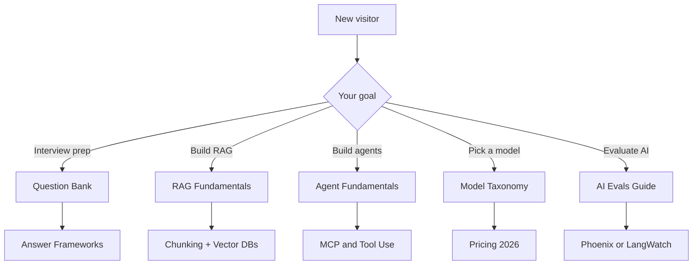
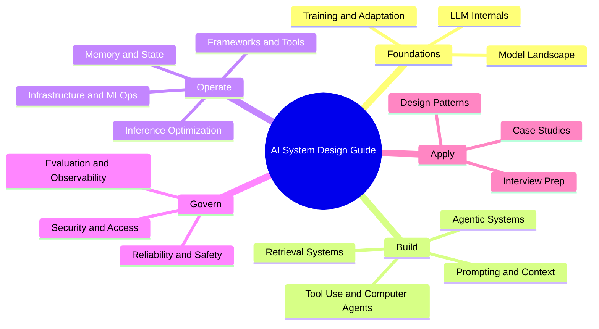

# 🧠 AI 系統設計指南
### 完整的面試與生產環境參考手冊

<p align="center">
  <a href="https://jordanplus.github.io/my-ai-system-design-guide-study/"></a>
  <a href="https://jordanplus.github.io/my-ai-system-design-guide-study/ai-system-design-guide.html"></a>
  <a href="https://github.com/Jordanplus/my-ai-system-design-guide-study/deployments/github-pages"></a>
</p>

<p align="center">
  <b>📖 線上互動學習：<a href="https://jordanplus.github.io/my-ai-system-design-guide-study/">jordanplus.github.io/my-ai-system-design-guide-study</a><br>
  本機啟動：<code>make study</code>（啟動本機伺服器並開啟 <code>index.html</code>，含即時搜尋、深色模式、頁內 Markdown 閱讀器與學習進度追蹤）</b>
</p>

---

<p align="center">
  <a href="https://github.com/ombharatiya"></a>
  <a href="https://x.com/ombharatiya"></a>
  <a href="https://linkedin.com/in/ombharatiya"></a>
</p>

<p align="center">
  <b>如果這份指南對你有幫助，歡迎在 GitHub、<a href="https://x.com/ombharatiya">X</a> 與 <a href="https://linkedin.com/in/ombharatiya">LinkedIn</a> 上追蹤 <a href="https://github.com/ombharatiya">@ombharatiya</a>，當新章節、模型更新與面試題目發布時即可收到通知。</b>
</p>

<p align="center">
  <a href="https://github.com/ombharatiya/ai-system-design-guide/commits/main"></a>
  <a href="LICENSE"></a>
  <a href="#-contributing"></a>
  <a href="https://github.com/ombharatiya/ai-system-design-guide/stargazers"></a>
  <a href="https://github.com/ombharatiya/ai-system-design-guide/graphs/contributors"></a>
  <a href="https://github.com/ombharatiya/ai-system-design-guide/issues"></a>
</p>

> **生產環境 AI 系統的活躍參考手冊。** 持續更新。具備面試所需的深度。

一份實用且持續更新的指南，涵蓋 AI 系統設計、RAG 架構、LLM 工程、agentic AI、MCP 與 A2A 協定，以及 AI 工程面試準備。內容涵蓋生產環境模式、模型選型、評估，以及來自 staff 等級面試的真實案例研究。

**第一次來嗎？** 直接前往 [110 題面試題庫](00-interview-prep/01-question-bank.md)、[RAG 基礎章節](06-retrieval-systems/01-rag-fundamentals.md)，或挑選[適合生產環境的 LLM](02-model-landscape/01-model-taxonomy.md)。

---

## 📚 快速導覽

| 我想要… | 從這裡開始 |
|--------------|------------|
| **準備面試** | [面試題庫](00-interview-prep/01-question-bank.md) → [答題框架](00-interview-prep/02-answer-frameworks.md) |
| **快速學習 AI 系統** | [LLM 內部原理](01-foundations/01-llm-internals.md) → [RAG 基礎](06-retrieval-systems/01-rag-fundamentals.md) |
| **建構生產環境 RAG** | [Chunking](06-retrieval-systems/02-chunking-strategies.md) → [向量資料庫](06-retrieval-systems/04-vector-databases.md) → [Reranking](06-retrieval-systems/06-reranking-strategies.md) → [生產環境 RAG](06-retrieval-systems/14-production-rag-at-scale.md) |
| **進階檢索** | [Contextual Retrieval](06-retrieval-systems/10-contextual-retrieval.md) → [ColBERT](06-retrieval-systems/11-late-interaction-colbert.md) → [多模態 RAG](06-retrieval-systems/12-multimodal-rag.md) |
| **設計多租戶 AI** | [隔離模式](12-security-and-access/04-multi-tenant-rag-isolation.md) → [案例研究](16-case-studies/08-multi-tenant-saas.md) |
| **建構 agent** | [Agent 基礎](07-agentic-systems/01-agent-fundamentals.md) → [MCP 與 A2A](07-agentic-systems/03-tool-use-and-mcp.md) → [LangGraph](09-frameworks-and-tools/02-langgraph-orchestration.md) |
| **工具使用與電腦操作 agent** | [全景概覽](17-tool-use-and-computer-agents/01-tool-use-landscape.md) → [OpenClaw](17-tool-use-and-computer-agents/03-openclaw-deep-dive.md) → [安全性](17-tool-use-and-computer-agents/07-safety-and-governance.md) |
| **自主程式設計 agent** | [Claude Code](09-frameworks-and-tools/09-claude-code.md) → [OpenCoder 全景概覽](09-frameworks-and-tools/10-opencoderguide.md) |
| **挑選合適的模型（2026）** | [模型分類](02-model-landscape/01-model-taxonomy.md) → [定價](02-model-landscape/03-pricing-and-costs.md) |
| **在生產環境中評估 AI** | [AI 評估指南（Phoenix/Langfuse）](ai_evals_comprehensive_study_guide.md) → [AI 評估指南（LangWatch/Langfuse）](ai_evals_complete_guide_langwatch_langfuse.md) |
| **尋找學習 AI 的最佳課程** | [推薦課程與學習路徑](COURSES.md) |
| **從現有職位轉職到 AI** | [職位轉換指南](TRANSITION_GUIDE.md) |
| **了解 2026 年 AI 就業市場** | [就業市場趨勢 - 2026 年 5 月](00-interview-prep/06-job-market-trends-2026.md) |
| **針對常見問題快速取得解答** | [FAQ](00-interview-prep/07-faq.md)（RAG、agent、模型、評估、推論、記憶體、安全性） |
| **查詢術語** | [詞彙表](GLOSSARY.md)（每個術語都有定義） |

### 挑選一條路徑



---

## 🎯 為什麼需要這份指南

**傳統書籍在出版前就已過時。** 這是一份活躍的文件：當新模型發布、當模式演進時，本指南也會隨之更新。

| 本指南 | 紙本書籍 |
|------------|---------------|
| 2026 年 5 月的模型（Claude Opus 4.7、GPT-5.5、Gemini 3.1 Pro、DeepSeek V4 Pro、Llama 4、Kimi K2.6、Qwen 3.6、Mistral Medium 3.5、Gemma 4） | 停留在 GPT-4 |
| MCP 2.0、A2A v1.0、OpenClaw、Computer Use、Agentic RAG、ColBERT、latent reasoning、MoE serving | 完全沒有 |
| 附帶 2026 年 5 月驗證日期的真實定價 | 已經錯誤 |
| Staff 等級面試問答（截至 2026 年 5 月共 110 題）+ 就業市場趨勢 | 通用題目 |

**快速模型選擇器（2026 年 5 月）：** 工具使用與長上下文推理選 Claude Opus 4.7、一般生產環境選 GPT-5.5、多模態選 Gemini 3.1 Pro、低成本的前沿級輸出選 DeepSeek V4 Flash（每 1M 為 $0.14/$0.28）或 V4 Pro（在 5 月 22 日永久折扣後為 $0.435/$0.87）、自架部署選 Llama 4。完整分析請見[模型分類](02-model-landscape/01-model-taxonomy.md)。

---

## 🎯 這份指南是什麼（與不是什麼）

**這份指南「是」：**
- 一份用於設計生產環境 AI 系統的 staff 等級參考手冊（RAG、agent、MCP、評估流程、多租戶隔離）。
- 一個面試準備夥伴，包含 110+ 道真實題目、答題框架，以及截至 2026 年 5 月的白板練習。
- 一份活躍的文件，追蹤新模型發布、協定變更，以及隨之出現的新興模式。
- 對各種權衡有明確主張：延遲 vs 成本、準確度 vs 忠實度、單一 agent vs 多 agent。
- 免費、採用 MIT 授權，並歡迎來自實務工作者的 PR。

**這份指南「不是」：**
- 一份關於 Python、PyTorch 或基礎 ML 入門的教學（請先從課程開始；參見 [COURSES.md](COURSES.md)）。
- 一份廠商中立的兩面押注；它會點名特定的模型、價格與框架，因為真實系統需要真實的選擇。
- 動手實作的替代品；請搭配一個專案一起閱讀，而非用它取代實作。
- 一份研究論文摘要；它只在論文改變實務做法時加以引用，而非為了完整性。

---

## 📖 指南結構

```
├── 00-interview-prep/           # Questions (110), frameworks, exercises, job-market trends (May 2026)
├── 01-foundations/              # Transformers, attention, embeddings
├── 02-model-landscape/          # Claude Opus 4.7, GPT-5.5, Gemini 3.1, DeepSeek V4, Llama 4, Kimi K2.6, Qwen 3.6, Mistral Medium 3.5
├── 03-training-and-adaptation/  # Fine-tuning, LoRA, DPO, distillation
├── 04-inference-optimization/   # KV cache, PagedAttention, vLLM
├── 05-prompting-and-context/    # Prompt engineering, CoT, Extended Thinking, DSPy, prompt injection
├── 06-retrieval-systems/        # RAG, chunking, GraphRAG, Agentic RAG, ColBERT, Contextual Retrieval
├── 07-agentic-systems/          # MCP 2.0, A2A protocol, multi-agent, computer-use
├── 08-memory-and-state/         # L1-L3 memory tiers, Mem0, caching
├── 09-frameworks-and-tools/     # LangGraph, DSPy, LlamaIndex, Claude Code, OpenCoder
├── 10-document-processing/      # Vision-LLM OCR, multimodal parsing
├── 11-infrastructure-and-mlops/ # GPU clusters, LLMOps, cost management
├── 12-security-and-access/      # RBAC, ABAC, multi-tenant isolation
├── 13-reliability-and-safety/   # Guardrails, red-teaming
├── 14-evaluation-and-observability/ # RAGAS, LangSmith, drift detection
├── 15-ai-design-patterns/       # Pattern catalog, anti-patterns
├── 16-case-studies/             # Real-world architectures with diagrams
├── 17-tool-use-and-computer-agents/ # OpenClaw, Computer Use, tool agents, safety
├── GLOSSARY.md                  # Every term defined
│
├── ai_evals_comprehensive_study_guide.md      # 🔬 Deep-dive: AI Evals (Phoenix + Langfuse)
└── ai_evals_complete_guide_langwatch_langfuse.md  # 🔬 Deep-dive: AI Evals (LangWatch + Langfuse)
└── COURSES.md                   # 🎓 Recommended courses & learning paths
└── TRANSITION_GUIDE.md          # 🔄 Transition from Backend/QA/PM/EM to AI roles
```

### 依 AI 系統生命週期階段劃分的章節



---

## 🔥 精選案例研究

附有完整解答與圖表的真實面試題目：

| 案例研究 | 問題 | 關鍵模式 |
|------------|---------|--------------|
| [即時搜尋](16-case-studies/06-real-time-search.md) | 在大規模下達到 5 分鐘的資料新鮮度 | 串流 + 混合搜尋 |
| [程式設計 Agent](16-case-studies/07-autonomous-coding-agent.md) | 自主進行多檔案變更 | 沙箱化 + 自我修正 |
| [多租戶 SaaS](16-case-studies/08-multi-tenant-saas.md) | 可口可樂與百事可樂共用同一套基礎設施 | 縱深防禦隔離 |
| [客戶支援](16-case-studies/09-customer-support-automation.md) | 60% 自動解決率 | 分級路由 + 升級處理 |
| [文件智能](16-case-studies/10-document-intelligence.md) | 每月擷取 5 萬份合約 | Vision-LLM + 平行擷取器 |
| [推薦引擎](16-case-studies/11-recommendation-engine.md) | 在 5,000 萬使用者規模下提供個人化說明 | ML 排序 + LLM 說明 |
| [合規自動化](16-case-studies/12-compliance-automation.md) | FDA 法規預先篩查 | Claim 擷取 + 判例資料庫 |
| [語音醫療](16-case-studies/13-voice-ai-healthcare.md) | 即時產生臨床病歷 | 地端 ASR + HIPAA |
| [詐欺偵測](16-case-studies/14-fraud-detection.md) | 100ms 內做出具可解釋性的決策 | ML + 規則混合 |
| [知識管理](16-case-studies/15-knowledge-management.md) | 200 萬份文件並具備存取控制 | 權限感知 RAG |
| [電腦操作 Agent](16-case-studies/16-computer-use-agent-production.md) | 跨 3 套老舊 UI 的差旅報銷自動化 | Firecracker VM + Action Gate + IPI 防禦 |
| [多租戶 Fine-Tuning](16-case-studies/17-multi-tenant-fine-tuning-platform.md) | 280 個租戶共用基礎模型 + 各租戶專屬 LoRA | LoRA 熱插拔 + 各租戶的 Eval-as-PRD |
| [Eval 把關的 CI/CD](16-case-studies/18-eval-gated-cicd.md) | 阻擋會使 AI 品質退步的 PR | Golden Set + LLM Judge + 統計校正 |
| [客戶蒸餾](16-case-studies/19-customer-distillation-pipeline.md) | 將每月 $50K 的前沿模型支出削減至 $6K，3 個月即回本 | 基於 trace 的蒸餾 + 金絲雀部署 |
| [MCP 知識 Agent](16-case-studies/20-mcp-knowledge-agent.md) | 跨 Snowflake/Confluence/Jira/Slack 取得整合答案 | MCP + OAuth 資源伺服器 + 能力閘控 |

---

## 🔬 額外深入指南

兩份配套指南（各超過 3,000 行），端到端涵蓋 AI 評估——適合工程師、PM 與 QA：

| 指南 | 涵蓋平台 | 內容包含 |
|-------|------------------|---------------|
| [AI 評估：完整研讀指南](ai_evals_comprehensive_study_guide.md) | Arize Phoenix + Langfuse | LLM-as-a-Judge、RAG 評估、多輪評估、生產環境安全性、使用 `judgy` 進行統計校正、30 天學習路徑 |
| [AI 評估：LangWatch + Langfuse 指南](ai_evals_complete_guide_langwatch_langfuse.md) | LangWatch + Langfuse | 相同的課程大綱，搭配 LangWatch 的 40+ 內建評估器、平台並列比較，以及平台選擇指引 |

**兩份指南共同涵蓋的主題：**
- Tracing 與 observability 的設定（Phoenix、LangWatch、Langfuse）
- 錯誤分析：open coding → axial coding → failure mode 分類法
- 以 Train/Dev/Test 切分與 ground truth 校準來建構 LLM judge
- 基於程式碼的評估器（regex、JSON schema、格式驗證器）
- RAG 專屬評估：faithfulness、context recall、answer relevance
- 多步驟流程評估與多輪對話評估
- 生產環境護欄、安全性監控、即時 drift 偵測
- 使用 `judgy` 函式庫進行統計校正
- 人工標註最佳實務與評分者間信度
- 大規模評估流程的成本／延遲最佳化

---

## 🎓 用於面試準備

AI 工程與系統設計面試會問這類問題：

> 「設計一套多租戶 RAG 系統，讓競爭對手無法看到彼此的資料。」

> 「你的 agent 為了一個 3 步驟的任務卻花了 15 步。你會如何除錯？」

這份指南提供**具體的模式**、**真實的權衡**，以及**生產環境的失效模式**：也就是面試官在資深層級所期待的深度。

➡️ 從[面試準備](00-interview-prep/)開始

---

## ❓ 常見問題

### 什麼是 AI 系統設計？
AI 系統設計是一門圍繞 LLM、檢索、agent 與評估來架構生產級系統的學科。它涵蓋模型選型、RAG 流程、agent 編排、記憶體、observability 與安全性。請參見 [LLM 內部原理](01-foundations/01-llm-internals.md) 與 [AI 設計模式](15-ai-design-patterns/) 來建立整體概念。

### 我該如何準備 AI 工程面試？
先從[面試題庫](00-interview-prep/01-question-bank.md)（截至 2026 年 5 月共 110 題）開始，接著用[答題框架](00-interview-prep/02-answer-frameworks.md)與[白板練習](00-interview-prep/04-whiteboard-exercises.md)來練習。大多數資深面試都會測試 RAG 設計、agent 除錯、多租戶隔離，以及成本／延遲的權衡，這些全都涵蓋在[案例研究](16-case-studies/)中。

### 什麼是 RAG（Retrieval-Augmented Generation，檢索增強生成）？
RAG 是一種模式，讓 LLM 在產生答案之前，先從外部知識來源（向量資料庫、搜尋索引、圖）檢索相關上下文，藉此減少幻覺並將回應紮根於你的資料。完整流程涵蓋於 [RAG 基礎](06-retrieval-systems/01-rag-fundamentals.md)，並在[大規模生產環境 RAG](06-retrieval-systems/14-production-rag-at-scale.md)中擴展。

### 什麼是 AI agent，它們與 chatbot 有何不同？
AI agent 是由 LLM 驅動的系統，會規劃、呼叫工具，並透過多個步驟採取行動以達成目標，而 chatbot 通常只在單一輪次中回應。Agent 引入了迴圈、記憶體、錯誤復原，以及透過 MCP 等協定進行的工具使用。請從 [Agent 基礎](07-agentic-systems/01-agent-fundamentals.md)開始。

### 什麼是 MCP（Model Context Protocol），它與 A2A 相比如何？
MCP 是一個開放協定，讓 LLM 能以標準化的方式探索並呼叫外部工具與資料來源。A2A（Agent-to-Agent）則是用於 agent 之間通訊的互補協定。它們解決不同的層次：MCP 是工具邊界，A2A 是 agent 邊界。請參見[工具使用與 MCP](07-agentic-systems/03-tool-use-and-mcp.md)。

### 在生產環境中我該使用哪個 LLM：Claude、GPT、Gemini 還是開源模型？
這取決於延遲預算、上下文長度、每百萬 token 的成本、工具使用品質，以及資料落地（data residency）。[模型分類](02-model-landscape/01-model-taxonomy.md)與[定價](02-model-landscape/03-pricing-and-costs.md)章節針對截至 2026 年 5 月的 Claude Opus 4.7、GPT-5.5、Gemini 3.1 Pro、DeepSeek V4、Llama 4 等模型提供逐一對比。

### 我該如何在生產環境中評估 LLM 或 RAG 系統？
結合離線評估（搭配 ground-truth 校準的 LLM-as-a-judge）、線上指標（faithfulness、context recall、answer relevance），以及持續的 tracing。配套深入指南 [AI 評估：Phoenix + Langfuse](ai_evals_comprehensive_study_guide.md) 與 [AI 評估：LangWatch + Langfuse](ai_evals_complete_guide_langwatch_langfuse.md) 會端到端逐步說明這套流程。

### 我該如何安全地建構多租戶 RAG 系統？
採用縱深防禦：各租戶專屬的索引或 namespace、查詢時的存取檢查，以及 prompt 層的防護。[多租戶 RAG 隔離](12-security-and-access/04-multi-tenant-rag-isolation.md)章節與[多租戶 SaaS 案例研究](16-case-studies/08-multi-tenant-saas.md)涵蓋了在面試與生產環境中都站得住腳的模式。

### 什麼是 agentic RAG？
Agentic RAG 將檢索與一個 agent 迴圈結合，這個迴圈能決定要搜尋什麼、何時重新查詢，以及何時升級，而不是執行單一固定的「先檢索再生成」流程。架構與權衡請見 [Agentic RAG](06-retrieval-systems/08-agentic-rag.md)。

### 這份指南免費嗎？我可以貢獻嗎？
是的，採用 MIT 授權且免費。歡迎 PR；請參見[貢獻指南](CONTRIBUTING.md)。如果你有生產環境的失效模式、新的模型基準測試，或想新增的面試題目，請提交 PR。

### 這份指南多久更新一次？
持續更新。新模型發布、協定變更（MCP、A2A），以及新興模式都會在它們推出時加入。近期新增的內容包括[工具使用與電腦操作 Agent](17-tool-use-and-computer-agents/01-tool-use-landscape.md)以及 [2026 年 5 月就業市場趨勢](00-interview-prep/06-job-market-trends-2026.md)。

### 如果我正從 backend、QA、PM 或 EM 轉職到 AI，可以使用這份指南嗎？
可以。[職位轉換指南](TRANSITION_GUIDE.md)將既有技能對應到 AI 工程、MLE 與 AI 架構師路線，並提供各職位的閱讀路徑。請搭配 [COURSES.md](COURSES.md) 取得精選的學習資源。

---

## 🔄 活躍書籍

這份指南追蹤：
- 新模型發布與真實世界的效能
- 新興模式（MCP、Agentic RAG、Flow Engineering）
- 更新後的定價與速率限制
- 棄用內容與最佳實務的變更

**⭐ 為此 repo 按 Star 並 Watch**，即可在更新推送時收到通知。

---

## 🤝 貢獻

發現過時資訊？有生產環境經驗想分享？歡迎 PR。
請參見[貢獻指南](CONTRIBUTING.md)。

---

## 👋 保持聯繫

如果這份指南對你有幫助，最簡單的支持方式就是在這些第一時間公布新章節與更新的地方持續關注：

- **GitHub：** [@ombharatiya](https://github.com/ombharatiya) - 追蹤此 repo、為專案按 Star，並關注新版本發布。
- **X / Twitter：** [@ombharatiya](https://x.com/ombharatiya) - 對模型發布、MCP、agent 與面試的簡短觀點。
- **LinkedIn：** [ombharatiya](https://linkedin.com/in/ombharatiya) - 針對資深 AI 職位的深入文章與面試準備技巧。

<p align="center">
  <a href="https://github.com/ombharatiya"></a>
  <a href="https://x.com/ombharatiya"></a>
  <a href="https://linkedin.com/in/ombharatiya"></a>
</p>

---

## 📄 授權條款

MIT 授權。請參見 [LICENSE](LICENSE)。

---

<p align="center">
  <b>由 <a href="https://github.com/ombharatiya">Om Bharatiya</a> 建構與維護 · <a href="https://github.com/ombharatiya">GitHub</a> · <a href="https://x.com/ombharatiya">Twitter</a> · <a href="https://linkedin.com/in/ombharatiya">LinkedIn</a></b>
</p>
